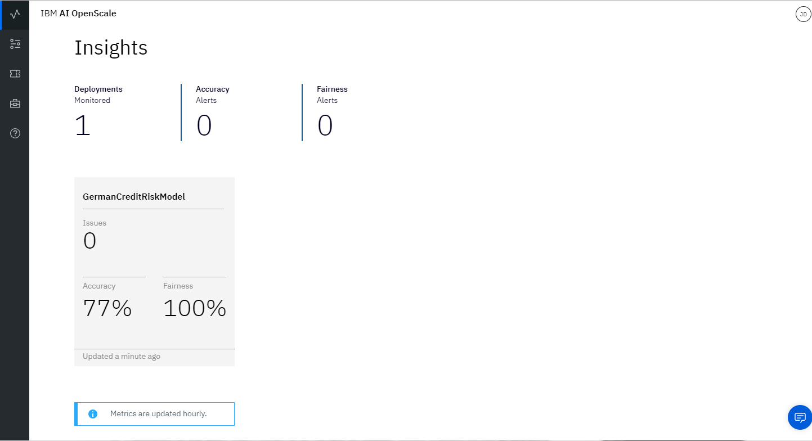
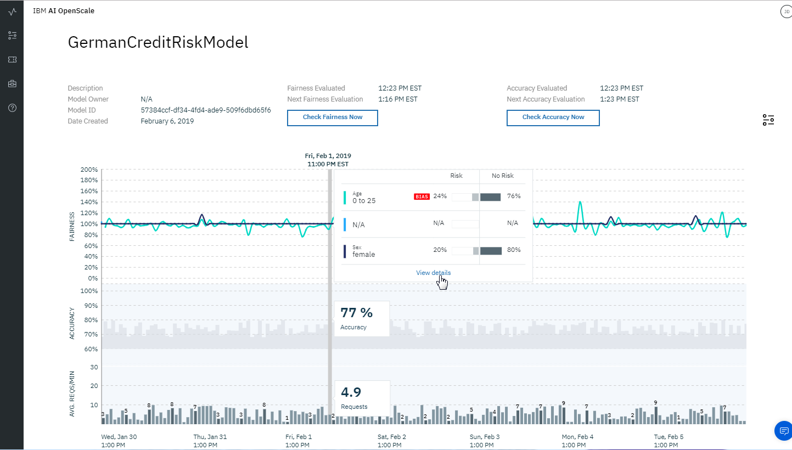
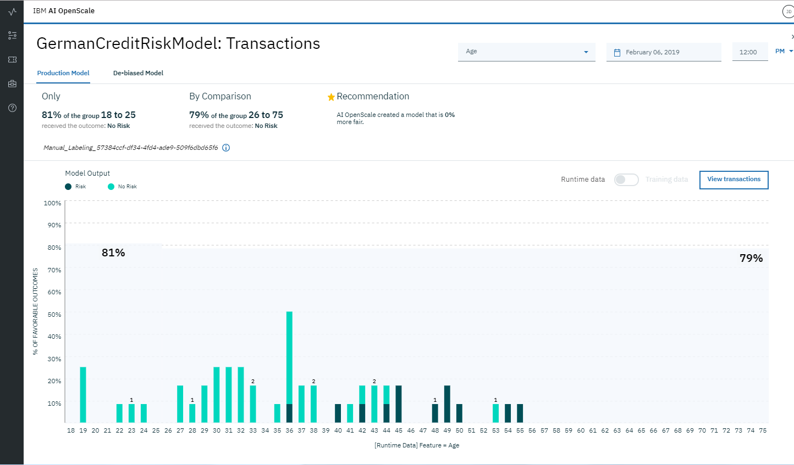
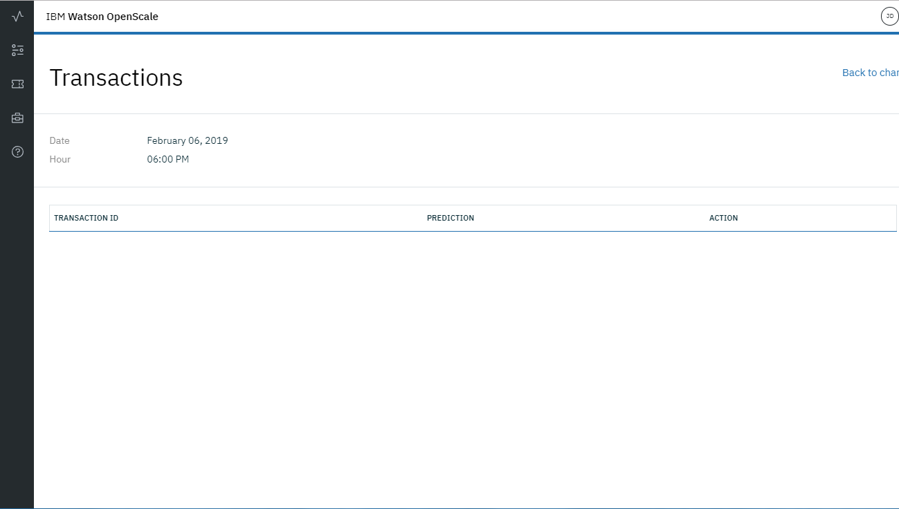

---

copyright:
  years: 2018, 2019
lastupdated: "2019-02-25"

---

{:shortdesc: .shortdesc}
{:new_window: target="_blank"}
{:tip: .tip}
{:important: .important}
{:note: .note}
{:pre: .pre}
{:codeblock: .codeblock}
{:screen: .screen}
{:javascript: .ph data-hd-programlang='javascript'}
{:java: .ph data-hd-programlang='java'}
{:python: .ph data-hd-programlang='python'}
{:swift: .ph data-hd-programlang='swift'}

# Installing a Python module to set up {{site.data.keyword.aios_short}}
{: #as-module}

To automate the provisioning and configuration of the required {{site.data.keyword.cloud_notm}} services and see an {{site.data.keyword.aios_full}} application, including sample data, you can install a Python module.
{: shortdesc}

## About this module
{: #as-about}

- The module provides an alternate way for technical users to see an instance of {{site.data.keyword.aios_short}} up and running without needing to provision and configure the services yourself, as described in the [Getting started](/docs/services/ai-openscale?topic=ai-openscale-gettingstarted) tutorial.
- The Python module runs through the process of checking the services that you have and creating the ones that are necessary, including {{site.data.keyword.aios_short}}. After the module runs successfully, from the {{site.data.keyword.cloud_notm}} dashboard you can launch {{site.data.keyword.aios_short}} to see how it monitors a model.

## Before you begin
{: #as-prereqs}

1. [Create an {{site.data.keyword.cloud_notm}} API key and download it](/docs/iam?topic=iam-userapikey#create_user_key). You will need to enter the API key in a later step.

2. [Install any release of Python 3 ](https://www.python.org/downloads/){: new_window}.

  Python 3 includes the required pip package management system.
  {: note}

3. Install the `ibm-ai-openscale-cli` package by running the following command:

    ```
    pip install -U ibm-ai-openscale-cli
    ```
    {: codeblock}

    If more than one version of pip is installed on your system, you might need to run `pip3` instead of `pip`, as in, `pip3 install -U ibm-ai-openscale-cli`.
    {: tip}

4. If you have an existing {{site.data.keyword.pm_short}} service instance, check the [{{site.data.keyword.cloud_notm}} dashboard ](https://{DomainName}){: new_window} to ensure that the service is managed by {{site.data.keyword.iamshort}} (IAM), not Cloud Foundry.

  **Important**: The module checks for an instance of {{site.data.keyword.pm_short}}. If you have an instance, the module uses it. But if your instance is managed by Cloud Foundry, you must first [migrate it to an IAM resource group before running the module](/docs/resources?topic=resources-migrate#migrate).

## Running the module
{: #as-run}

Run the following command:

```
ibm-ai-openscale-cli --apikey <Your API key>
```
{: codeblock}

## Viewing results in {{site.data.keyword.aios_short}}
{: #as-open}

To view insights into the fairness and accuracy of the model, details of data that is monitored, and explainability for an individual transaction, open the [{{site.data.keyword.aios_short}} dashboard ](https://aiopenscale.cloud.ibm.com/aiopenscale/){: new_window}.

- To understand the scenario for the sample data, read [Use case and the value of {{site.data.keyword.aios_short}}](/docs/services/ai-openscale?topic=ai-openscale-gettingstarted#gs-use).

### View insights
{: #as-insights}

From the [{{site.data.keyword.aios_short}} dashboard ](https://aiopenscale.cloud.ibm.com/aiopenscale/){: new_window}, click the **Insights** tab, which shows an overview of metrics for deployed models: 

- At a glance, the Insights page shows any issues with fairness and accuracy, as determined by the thresholds that are configured.

- Each deployment is shown as a tile. The module configured a deployment called `GermanCreditRiskModel`, as shown in the following screen capture:

  

### View monitoring data
{: #as-monitoring}

1. From the Insights page, click the `GermanCreditRiskModel` tile to view details about the monitored data.
2. Slide the marker across the chart to view a day and time period that show data and then click the **View details** link.

   - For example, the following screen shows data for a specific date and time. The dates and times vary, depending on when you run the module.

   - For information about interpreting the time series chart, see [Monitoring Fairness, Average Requests per Minute, and Accuracy](/docs/services/ai-openscale?topic=ai-openscale-it-ov).

    

3. To see details about `AGE` data monitoring, ensure that `AGE` is selected from the drop-down menu.

  - Notice that in the following screen capture, no bias exists.

  - For information about interpreting the chart of the data points at a specific hour, see [Monitoring Fairness, Average Requests per Minute, and Accuracy](/docs/services/ai-openscale?topic=ai-openscale-it-ov#it-intp).

    

### View explainability
{: #as-explain}

To understand the factors that contribute when bias is present for a given time period, from the visualization screen shown in the previous section, select the **View transactions** button.

Transaction IDs for the past hour are listed for those transactions that have bias. For the model used in this module, no bias exists for requests that are available. Therefore, no transactions are shown for the time period in the following screen capture.

  

For information about finding and explaining transactions, see [Explaining transactions](/docs/services/ai-openscale?topic=ai-openscale-ie-ov#ie-view).

## Related information
{: #as-info}

- To learn about biases, see [Fairness](/docs/services/ai-openscale?topic=ai-openscale-mf-monitor).
- To learn about how well your model predicts outcomes, see [Accuracy](/docs/services/ai-openscale?topic=ai-openscale-acc-monitor).
- To learn about interpreting charts and data, see [Monitoring Fairness, Average Requests per Minute, and Accuracy](/docs/services/ai-openscale?topic=ai-openscale-it-ov).
- To learn how underlying factors influence outcomes, see [Monitoring explainability](/docs/services/ai-openscale?topic=ai-openscale-ie-ov).
