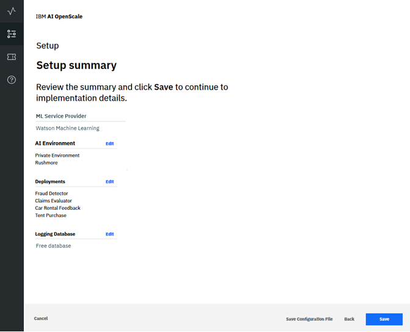
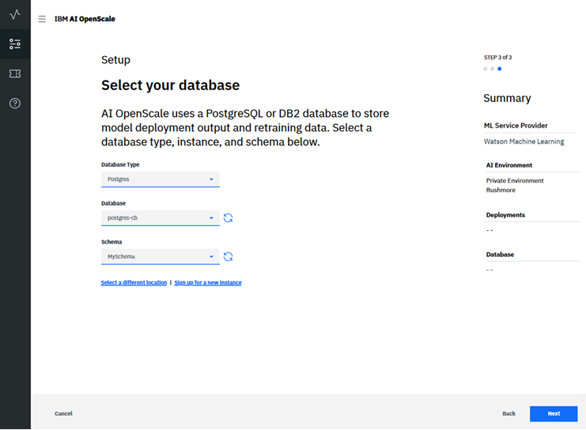
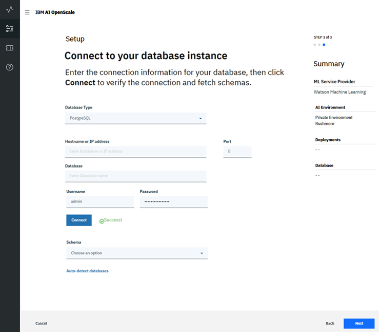
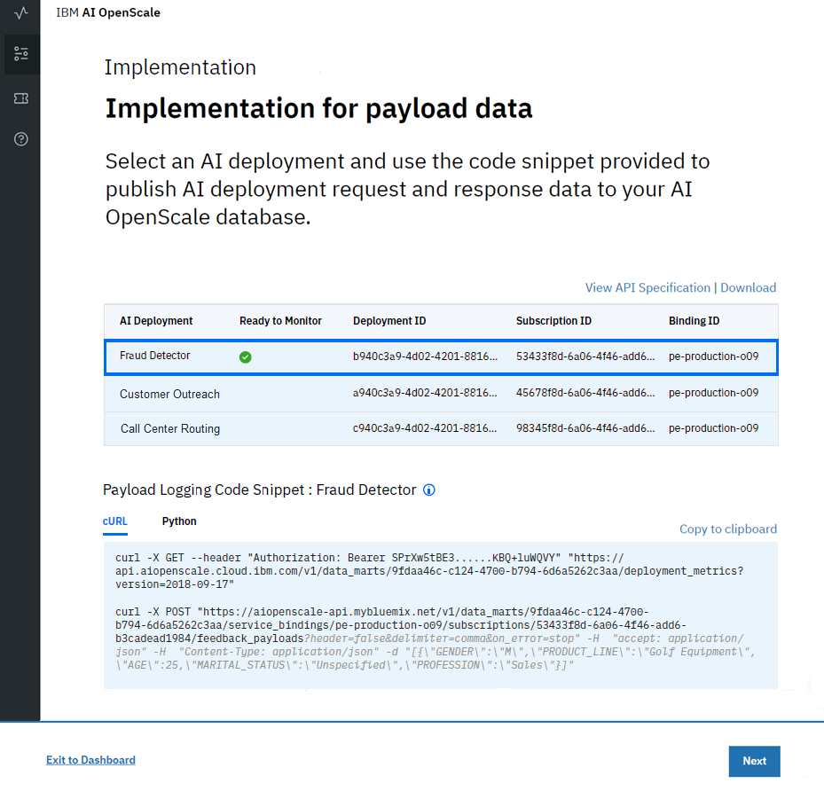

---

copyright:
  years: 2018, 2019
lastupdated: "2019-06-11"

keywords: databases, connections, scoring, requests

subcollection: ai-openscale

---

{:shortdesc: .shortdesc}
{:new_window: target="_blank"}
{:tip: .tip}
{:important: .important}
{:note: .note}
{:pre: .pre}
{:codeblock: .codeblock}
{:download: .download}
{:screen: .screen}
{:javascript: .ph data-hd-programlang='javascript'}
{:java: .ph data-hd-programlang='java'}
{:python: .ph data-hd-programlang='python'}
{:swift: .ph data-hd-programlang='swift'}
{:faq: data-hd-content-type='faq'}

# Specifying a database
{: #connect-db}

Specify a database for your {{site.data.keyword.aios_short}} instance to use.
{: shortdesc}

## Connecting to your database
{: #cdb-connect}

{{site.data.keyword.aios_short}} uses a database to store payload, feedback, and measurement data. Besides selecting a database, you may also select a schema for your database - a schema is a named collection of tables in the database.

1.  Choose a database. You have two options: the free database, or an existing or new database.

    

    If you have a paid {{site.data.keyword.cloud_notm}} account, you may provision a `Databases for PostgreSQL` or `Db2 Warehouse` service to take full advantage of integration with Watson Studio and continuous learning services. If you choose not to provision a paid service, you can use the free internal PostgreSQL storage with {{site.data.keyword.aios_short}}, but you will not be able to configure continuous learning for your model.
    {: note}

### Free Lite plan database
{: #cdb-lite}

**NOTE**: The free database has some important limitations:

- The free database is hosted, and is not directly accessible to you.
- {{site.data.keyword.aios_full}} will have full access to your database, and thus will have full access to your data.
- The free database is not GDPR-compliant. If your model processes personally-identifiable information (PII), you cannot use the free database. You must purchase a new database, or use an existing database that conforms to GDPR rules. See [Information security](/docs/services/ai-openscale?topic=ai-openscale-is-ov) to learn more.

To proceed with using the free database, click **Use the free database hosted by {{site.data.keyword.aios_short}}** tile, then review the summary data, and click **Save**.

  
  
You can upgrade to another database from the free database, however it is not possible to reconfigure a Compose for Postgres, Database for Postgres, or Db2 instance to the free database. After you upgrade it is impossible to return to using the free database. All the current data, such as the configuration, the scoring results, and explanations cannot be reused. By selecting another schema or database, the {{site.data.keyword.aios_short}} environment is completely reset.

### Existing or new database
{: #cdb-exn}

1.  Once you have selected the "Use existing or purchase new database" option, {{site.data.keyword.aios_short}} checks your {{site.data.keyword.Bluemix_notm}} account to locate any existing databases.

1.  Select your existing database type (Compose for Postgres, Database for Postgres, or Db2), then a database from the **Database** drop-down menu, and then a **Schema**:

    {{site.data.keyword.aios_short}} uses a PostgreSQL or Db2 database to store model related data (feedback data, scoring payload) and calculated metrics. Lite Db2 plans are not currently supported. For more information about training data, see [Why does {{site.data.keyword.aios_short}} need access to my training data?](/docs/services/ai-openscale?topic=ai-openscale-trainingdata#trainingdata)
    {: note}

    

1.  You can also click **Select a different location** to specify a database location outside of your {{site.data.keyword.Bluemix_notm}} account.

    {{site.data.keyword.aios_short}} uses a PostgreSQL or Db2 database to store model related data (feedback data, scoring payload) and calculated metrics. Lite Db2 plans are not currently supported.
    {: note}

    - Select the **Database Type** (`Compose for PostgreSQL`, `Database for PostgreSQL`, or `Db2`), then provide connection information:

        - For a `Compose for PostgreSQL` database, complete the following:

            - Hostname or IP address
            - Port
            - Database (name)
            - Username
            - Password

            

        - For a `Database for PostgreSQL` database, complete the following:

            - Host name or IP address
            - SSL Port
            - Base-64 encoded certificate
            - Database (name)
            - Username
            - Password

            

        - For a `Db2` database, complete the following:

            - Hostname or IP address
            - SSL Port
            - Database (name)
            - Username
            - Password

            

    - Once you have successfully connected, you can select a schema.

      The schema name needs to be provided explicitly if you provide a Db2 instance with limited access, which does not allow the schema name to be automatically generated. This applies to the Entry Db2 Warehouse plan.
      {: important}

      

1.  Click **Next** to review the summary data, then click **Save**.

## Sending a scoring request
{: #cdb-score}

To configure monitors, {{site.data.keyword.aios_short}} requires you to send a scoring payload, in order to begin to log the data that will be monitored.

For models deployed in {{site.data.keyword.pm_full}} just score your deployment, {{site.data.keyword.pm_short}} automatically sends the scoring payload to {{site.data.keyword.aios_short}}. For other machine learning engines, such as Microsoft Azure, Amazon SageMaker, or a custom machine learning engine the scoring payload must be sent using the Payload Logging API.

Select a deployment, in this case "Fraud Detector", and then use the provided `cURL` or `Python` code snippets to log model deployment request and response data. See [Payload logging for non-{{site.data.keyword.pm_full}} service instances](/docs/services/ai-openscale?topic=ai-openscale-cml-connect) for more detail.

The fields and values in the code snippets need to be substituted with your real values, as the ones provided are only examples.
{: important}

Once you have run your payload logging, you will see a checkmark in the "Ready to Monitor" column for the selected deployment. Click **Configure Monitors** to continue.

## Next steps
{: #cdb-next}

{{site.data.keyword.aios_short}} is now ready for you to [configure monitors for your deployments](/docs/services/ai-openscale?topic=ai-openscale-mo-config).
