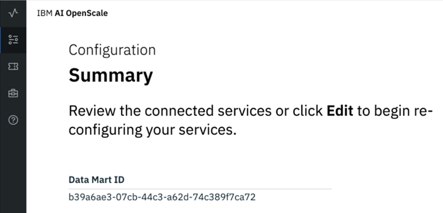

---

copyright:
  years: 2018, 2019
lastupdated: "2019-04-22"

keywords: credentials, REST API

subcollection: ai-openscale

---

{:shortdesc: .shortdesc}
{:new_window: target="_blank"}
{:tip: .tip}
{:pre: .pre}
{:codeblock: .codeblock}
{:screen: .screen}
{:javascript: .ph data-hd-programlang='javascript'}
{:java: .ph data-hd-programlang='java'}
{:python: .ph data-hd-programlang='python'}
{:swift: .ph data-hd-programlang='swift'}

# Creating credentials
{: #cred-create}

In order to access the {{site.data.keyword.aios_short}} REST APIs, a Platform API key and data mart (service instance) ID are required. The Platform API key gives an individual user the ability to access resources in the {{site.data.keyword.cloud_notm}}.

For enterprise accounts, an administrator can create the data mart, and then invite other users into the account, giving those users access to a specific {{site.data.keyword.aios_short}} data mart. A user can then create their own Platform API key, and can access the same {{site.data.keyword.aios_short}} data mart; there is no conflict or security risk.

To create a Platform API key, complete the following steps:

- Log into [{{site.data.keyword.cloud_notm}} ](https://{DomainName}){: new_window}.

- Select **Manage** --> **Security** --> **Platform API Keys**

    

- Create and save a Platform API key.

To find your data mart (or service instance) ID:

- In the {{site.data.keyword.aios_short}} **Configuration --> Summary** page, the first entry is your Data Mart (service instance) ID.

    
