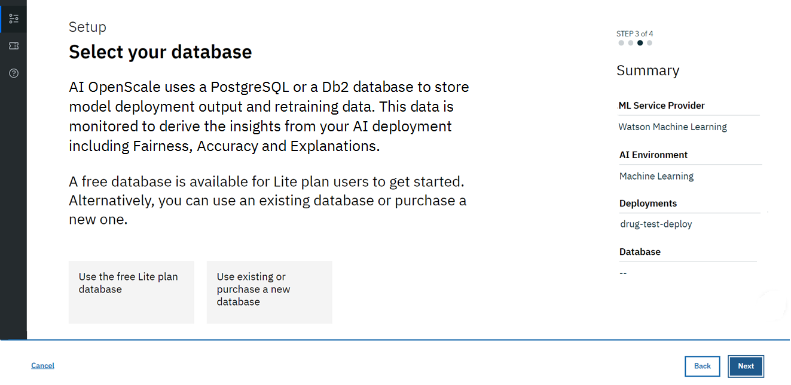
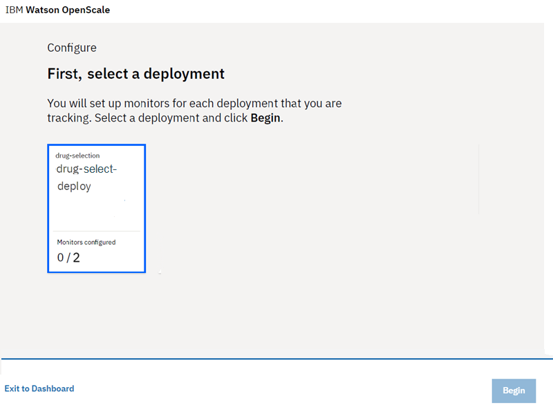
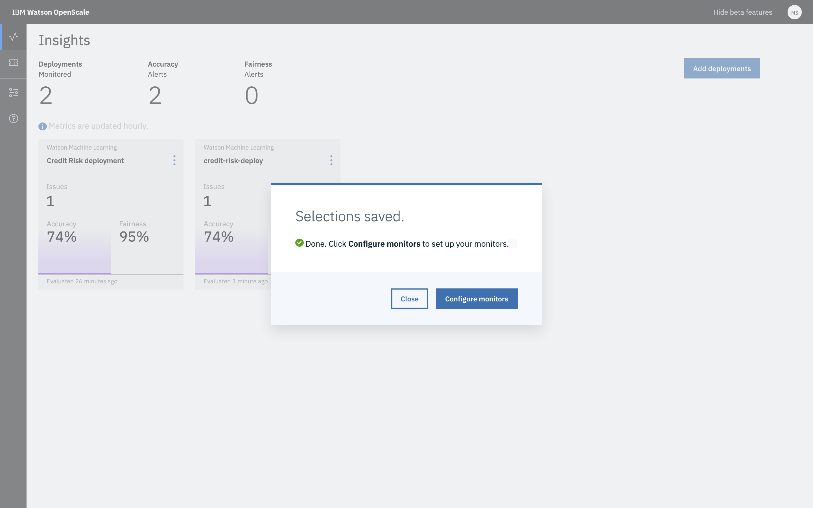
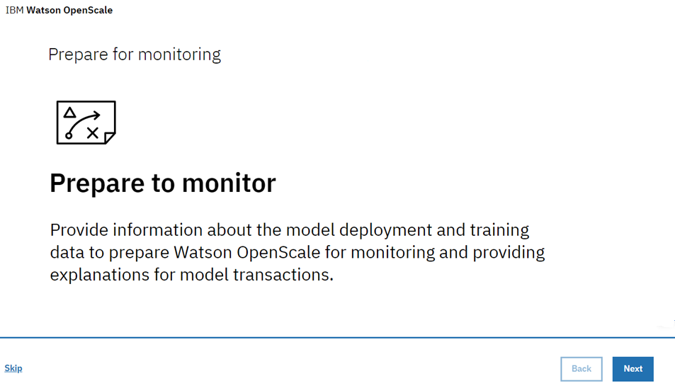
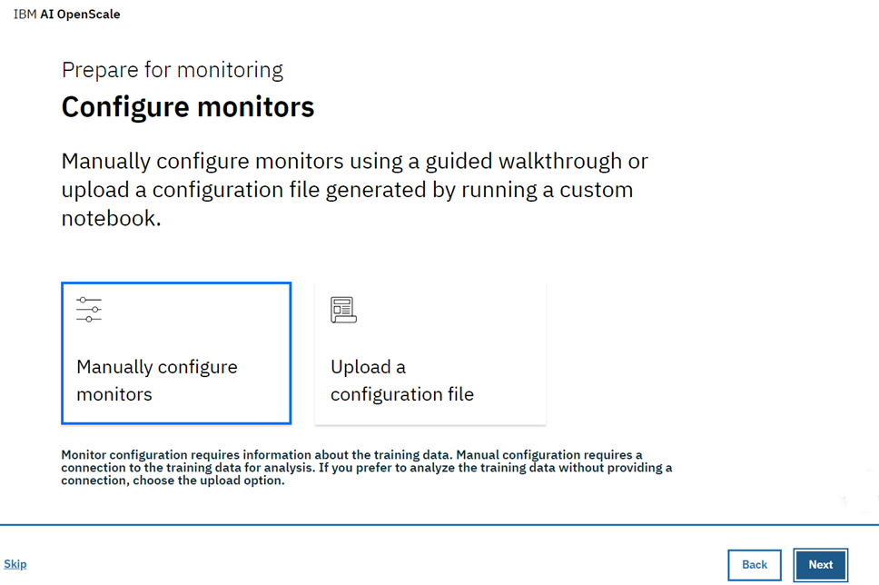
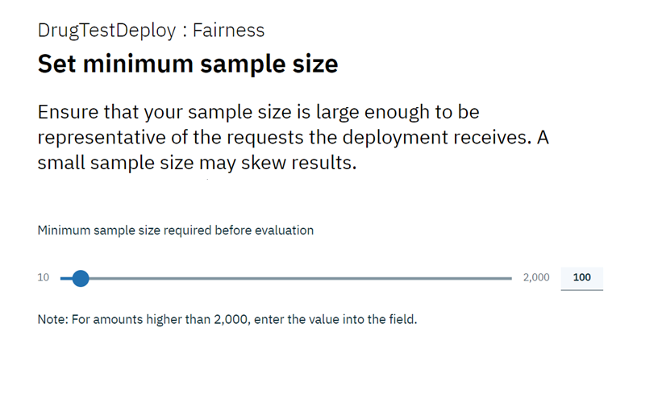
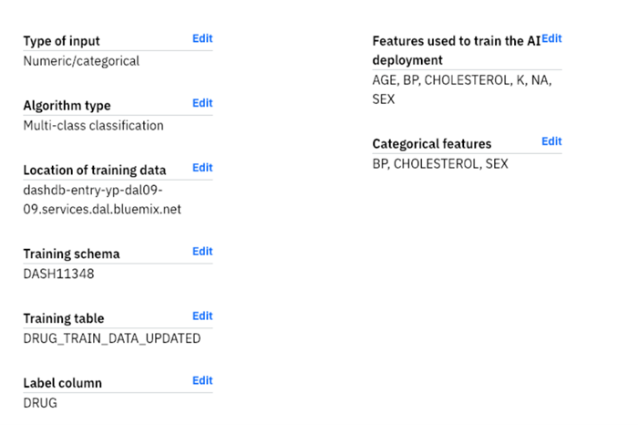
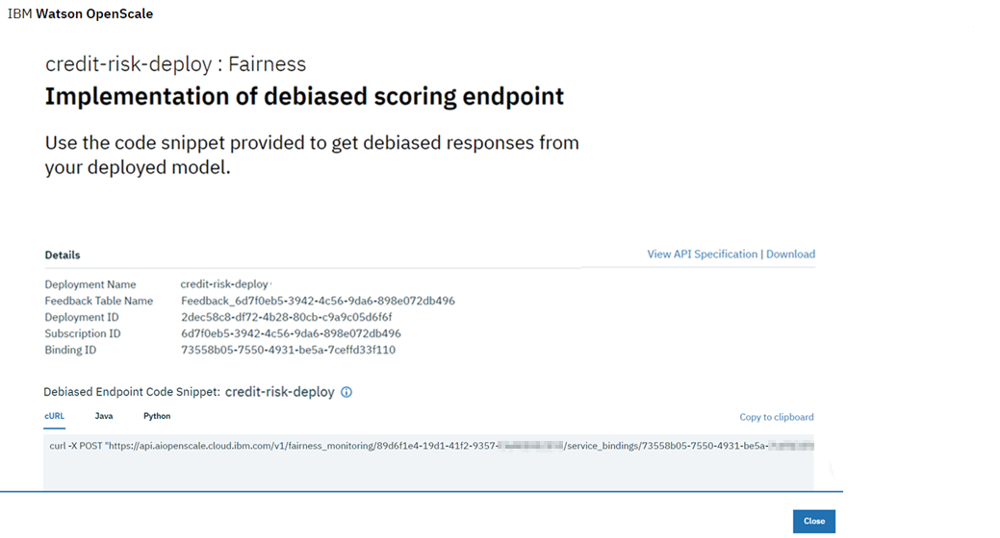

---

copyright:
  years: 2018, 2019
lastupdated: "2019-06-24"

keywords: ai, getting started, tutorial, understanding, fast start

subcollection: ai-openscale

---

{:shortdesc: .shortdesc}
{:external: target="_blank" .external}
{:tip: .tip}
{:important: .important}
{:note: .note}
{:pre: .pre}
{:codeblock: .codeblock}
{:download: .download}
{:screen: .screen}
{:javascript: .ph data-hd-programlang='javascript'}
{:java: .ph data-hd-programlang='java'}
{:python: .ph data-hd-programlang='python'}
{:swift: .ph data-hd-programlang='swift'}
{:faq: data-hd-content-type='faq'}

# The interactive setup tutorial
{: #gs-obj}

In this tutorial, you perform the following steps:

- [Provision {{site.data.keyword.Bluemix_notm}} machine learning and storage services](/docs/services/ai-openscale?topic=ai-openscale-gs-obj&locale=en-US#gs-prps).
- [Set up a Watson Studio project, and create, train and deploy a machine learning model](/docs/services/ai-openscale?topic=ai-openscale-gs-obj&locale=en-US#gs-setup).
- [Configure and explore trust, transparency and explainability for your model](/docs/services/ai-openscale?topic=ai-openscale-gs-obj&locale=en-US#gs-confaios).

## Provision prerequisite {{site.data.keyword.Bluemix_notm}} services
{: #gs-prps}

In addition to {{site.data.keyword.aios_short}}, to complete this tutorial, you need the following accounts and services.

**Important**: For best performance, it's recommended that the prerequisite services are created in the same region as {{site.data.keyword.aios_short}}. To view available locations for {{site.data.keyword.aios_short}}, see [Service availability](/docs/resources?topic=resources-services_region).

1.  Log in to your [{{site.data.keyword.Bluemix_notm}} account](https://{DomainName}){: external} with your {{site.data.keyword.ibmid}}.
1.  For each of the following services that you don't already have associated with your account, create an instance by clicking the link, giving the service a name, selecting the **Lite** (free) plan, and clicking the **Create** button:

    - [{{site.data.keyword.DSX}}](https://{DomainName}/catalog/services/watson-studio){: external}

      

    - [{{site.data.keyword.pm_full}}](https://{DomainName}/catalog/services/machine-learning){: external}

      

    - [Object Storage](https://{DomainName}/catalog/services/cloud-object-storage){: external}

      

## Set up a Watson Studio project
{: #gs-setup}

1.  Log in to your [Watson Studio account](https://dataplatform.ibm.com/){: external} and begin by creating a new project. Select **New project**.

    

1.  Select the **Standard** tile.

    

1.  Give your project a name and description, make sure the Object Storage service you created in the previous step is selected in the **Storage** menu, and click **Create**.

### Associate your {{site.data.keyword.Bluemix_notm}} Services with your Watson project
{: #gs-assoc}

1.  Open your Watson Studio project and select the **Settings** tab. In the **Associated Services** section, click **Add service** and then click **Watson**.

    

1.  Click the **Add** link on the **Machine Learning** tile.
2.  On the **Existing** tab, from the **Existing Service Instance** drop-down, click the service you created previously.
3. Click **Select**.

### Add the `Credit Risk` model
{: #gs-addmod}

1.  In {{site.data.keyword.DSX}}, select the **Assets** tab of your project, scroll to the **Watson Machine Learning Models** section, and click the **New Watson Machine Learning model** button.

1.  From the **Select model type** section, select **From sample** and the `Credit Risk` model, and then click **Create**.

    

### Deploy the `Credit Risk` model
{: #gs-depmod}

1.  From the the `Credit Risk` model page, click the **Deployments** tab, and then, click **Add Deployment**.
1.  Enter `credit-risk-deploy` as the name for your deployment, and select the **Web service** deployment type.
1.  Click **Save**.

## Configure {{site.data.keyword.aios_short}}
{: #gs-confaios}

### Provision an instance of {{site.data.keyword.aios_short}}
{: #gs-provaios}

1.  [Provision a new {{site.data.keyword.aios_short}} service instance](https://{DomainName}/catalog/services/watson-openscale){: external}

    

2.  Give your service a name, select the **Lite plan**, and click **Create**.
3. After your instance is provisioned, select it from the dashboard and click the **Launch** button.
4. If this is your first time launching {{site.data.keyword.aios_short}}, you are presented with the option of running the demo. For this tutorial, click **No thanks**.

### Choose a database
{: #gs-provaios}

1.  Next, you need to choose a database. You have two options: the free database, or an existing or new database. For this tutorial, select the **Choose the free Lite plan database** tile and click **Save**.

    

    The free database has some important limitations. It is a hosted database that does not give you separate access to it. It gives {{site.data.keyword.aios_short}} acccess to your database and data. It is not GDPR-compliant. See more complete details about each of these options in the [Specifying a database](/docs/services/ai-openscale?topic=ai-openscale-connect-db) topic. The existing database can be a PostgreSQL database or a Db2 database.
    {: tip}

1.  When prompted, click the **Select provider** button.

### Connect {{site.data.keyword.aios_short}} to your machine learning model
{: #gs-ctmod}

Now that the machine learning model has been deployed, you can select a machine learning provider to work with {{site.data.keyword.aios_short}}.

1.  For this tutorial, click the **Watson Machine Learning** tile.

1.  For this tutorial, select your {{site.data.keyword.pm_full}} instance from the menu and click **Save**.

    You also have the option to select a different {{site.data.keyword.pm_short}} location. See [Specifying an {{site.data.keyword.pm_full}} service instance](/docs/services/ai-openscale?topic=ai-openscale-wml-connect) for additional information.
    {: note}

    

1.  You are now able to select the deployed models that will be monitored by {{site.data.keyword.aios_short}}. Select the model you created and deployed and click **Configure**.

    

## Provide a set of sample data to your model
{: #gs-samp}

Before you can configure your monitors, you must generate at least one scoring request against your model in order to generate payload logging that the monitors can consume. In this section, you will provide sample data in the form of a JSON file to generate a scoring request.

1.  Download the [credit_payload_data.json](https://raw.githubusercontent.com/watson-developer-cloud/doc-tutorial-downloads/master/ai-openscale/credit_payload_data.json) file.

1.  Start {{site.data.keyword.DSX}}, go to the project that you created and from the **Deployments** tab click the **credit-risk-deploy** link.
2. Click the **Test** tab, and select the JSON input icon.

    

1.  Now, open the `credit_payload_data.json` file you downloaded, and copy the contents to the JSON field in the **Test** tab. Click the **Predict** button to send and score training payloads to your model.

    

### Preparing for monitoring
{: #gs-prepmon}

1.  Now, in the {{site.data.keyword.aios_short}} instance, click the **Add deployments** button, select your deployment and click **Configure**.

    

1.  Specify the feature that contains the answer that the model will predict. (In your database, which column from the table contains prediction values or labels?) In this case, the model predicts credit risk, so select the **Risk** column and click **Next**.

    

1.  Next you will provide information about your model and training data. Click **Next**.

    

1.  From the **Data type** menu, select **Numeric/categorical** as the type of data your deployment analyzes, and click **Next**.

    

1.  For numeric or categorical data, you need to provide information about the training data for your model in order to configure the monitors. Select **Manually configure monitors** to provide connection information to your training data.

    

1.  The algorithm type is important for monitoring your model metrics, such as Accuracy. Because the prediction that the model can make is "Risk" or "No Risk", select the **Binary classification** [algorithm type](/docs/services/ai-openscale?topic=ai-openscale-acc-monitor#acc-understand), and click **Next**.

    

1.  The location information for the sample data is pre-populated on the following screen. Select **Next** to continue.

    

1.  The schema and table are also pre-populated. Click **Next** to proceed.

    

1.  Now, you must specify the feature which contains the answer(s) the model will predict (in other words, in your database, which column from the table contains prediction values (labels)). In this case, the model will predict credit risk, so select the **Risk** column and click **Next**.

    Your training database has the values that you provided in order to train your model.
    {: note}

    

1.  Select the columns used to train the model. This is the data that your model deployment expects in a request. All the data columns except `_training` are inputs to the model. Select all other inputs and click **Next**.

    

1.  For categorical data, you must identify columns which now contain integers, but originally contained text values. Select the values as shown here.

    

1.  Review your selection summary, click **Save**, and then click **OK**.

### Configure Fairness monitoring
{: #gs-cfgfair}

1.  Click **Fairness**.

1.  Read about fairness and click **Next**. For more information, see [Fairness](/docs/services/ai-openscale?topic=ai-openscale-mf-monitor).

1.  You may now choose which features to monitor for fairness. For each feature you select, {{site.data.keyword.aios_short}} will monitor the deployed model's propensity for a favorable outcome for one group over the other. In this example, we'll monitor the **Sex** and **Age** features.

    Features are monitored individually, but any debiasing will correct issues for all features together. Click the **Sex** and **Age** tiles, and click **Next**.

1.  {{site.data.keyword.aios_short}} works to detect bias against a monitored group in comparison to a reference group. For the **Sex** feature, add the value `male` to the **Reference group**, and the value `female` to the **Monitored group**, and click **Next**.

    The model will be flagged as biased for **Sex** if the Risk prediction ratios for the monitored group differ from the ratios for the reference group. So if the model predicts Risk for male customers 60% of the time, and for female customers 20% of the time, it is biased.

    

1.  Assign a fairness threshold for **Sex**. The operations dashboard displays an alert if the fairness rating exceeds the threshold that you set. Set the threshold at 90%, and click **Next**.

1.  For the **Age** feature, add the values `26-74` to the **Reference group**, and the values `19-25` to the **Monitored group**, and click **Next**.

    As with **Sex**, the model will be flagged as biased for **Age** if the Risk prediction ratios for the monitored group differ from the ratios for the reference group. So if customers aged between 26 and 74 receive a Risk prediction at a different ratio than customers aged between 19 and 25, the model is biased.

    

1.  Set the threshold for **Age** at 90%, and click **Next**.

1.  Drag and drop values from the **Values from training data** field to the **Favorable values** and **Unfavorable values** fields. For this tutorial, the favorable value is **No Risk**, and the unfavorable value is **Risk**. Click **Next**.

    {{site.data.keyword.aios_short}} automatically detects which column in the payload logging database contains the prediction values, and presents them in the **Values from training data** field. Note that while your training database has values that you provided to train your model, the payload logging database contains feedback data collected at model runtime, that you can then optionally use to retrain and redeploy your model.
    {: note}

    

1.  Use the slider to adjust the minimum sample size to 100, then click **Next**.

    

    For this tutorial, the minimum sample size is set to 100. Normally, a larger sample size is recommended to ensure that the sample size is not too small, which would skew the results.
    {: note}

1.  Review your choices, click **Save**, and then click **OK**.

    

    The following window, which provides a debiased scoring endpoint, appears. Because this tutorial uses the GUI method and not the CLI to score data, to continue, click **OK**.

    

### Configure accuracy monitoring
{: #gs-cfgac}

1.  Click **Accuracy**.

1.  Read about accuracy and click **Next**. For more information, see [Accuracy](/docs/services/ai-openscale?topic=ai-openscale-acc-monitor).

1.  Set the accuracy alert threshold to 90% and click **Next**.

1.  On the next screen, use the slider to adjust the minimum sample size to 10, then click  **Next**.

    For this tutorial, the minimum sample size has been set to 10. Normally, a larger sample size is recommended to ensure the sample size is not too small, which would skew the results.
    {: note}

1.  For the maximum sample size, use 10000. Click **Next**.

1.  Review your choices, click **Save**, and then click **OK**.

1.  Finally, you're presented with an option to add feedback data, which is covered in the next section. For now, close the window by clicking **OK**, without clicking the **Add feedback data** button.

    For more details, see [Configuring the Accuracy monitor](/docs/services/ai-openscale?topic=ai-openscale-acc-monitor#acc-config).

## Provide a set of sample feedback data to your model
{: #gs-smpfeed}

To enable monitoring for accuracy, you must provide your model with feedback data. Accuracy data will not appear in the dashboard until that is done. You can generate the requests all at once by adding sample feedback data to the model for scoring. For this task, you'll download a CSV file that contains sample feedback data.

1.  Download the [credit_feedback_data.csv](https://raw.githubusercontent.com/watson-developer-cloud/doc-tutorial-downloads/master/ai-openscale/credit_feedback_data.csv) file.

1.  In {{site.data.keyword.aios_short}}, click the **Insights** tab.

    

1.  Click the tile for your deployed model.

    

1.  Then, click the edit icon to edit the deployment configuration.

    

1.  In the Summary side panel, click the **Add feedback data** button, and select the `credit_feedback_data.csv` file you downloaded. Select the **Comma (,)** delimiter, and then click **OK**.

    File sizes are currently limited to 8 MB.
    {: note}

    

    Adding the CSV file provides feedback data to your model.

    

## Viewing results
{: #gs-viewres}

After you configure accuracy monitoring, the accuracy check runs after one hour. In a production system, this makes sense so that your dashboard can accumulate feedback data. For the purposes of this tutorial, you'll probably want to trigger the accuracy check manually after you add your feedback data, so that you can see results in the **Insights** dashboard.

To check the result immediately, from the **Insights** page, select a deployment, and then click the **Check Fairness Now** or **Check quality now** button.

### View insights for your deployment
{: #gs-viewin}

1. From the [{{site.data.keyword.aios_short}} dashboard](https://aiopenscale.cloud.ibm.com/aiopenscale/){: external}, click the **Insights** tab.

  

1. View the Insights page to see an overview of metrics for your deployed models. You can view alerts for fairness or accuracy metrics that exceeds the 90% threshold.

  Fairness and Accuracy metrics can take up to an hour to display.
  {: tip}

  

### View monitoring data for your deployment
{: #gs-viewmon}

1.  Select a deployment by clicking the tile on the Insights page. The monitoring data for that deployment is shown. Note: After you upload the feedback .csv file, you may find that the Fairness or Accuracy data is not updated. To check the result immediately, click the **Check Fairness Now** or **Check quality now** button.
1.  Slide the marker across the chart to select data for the time frame during which you ran the sample data and sample feedback data. Then click **View details**.

    

1.  Next, review the charts for the data you monitored. For this example, use the **Feature** menu to select either `Age` or `Sex` in order to see details about the monitored data.

    See [Visualizing data for a specific hour](/docs/services/ai-openscale?topic=ai-openscale-it-ov#it-vdet) for more information about how to read these charts.
    {: tip}

    

### View explainability for a model transaction
{: #gs-viewextx}

1.  Click the **View transactions** button from the charts for the data you monitored.

    

1.  A list of transactions that contributed to bias for the past hour displays. To view a more detailed explanation of a particular transaction, from the **ACTION** column, click **Explain**.

    
    
1.  An explanation of how the model arrived at its conclusion displays. This explanation includes how confident the model was, the factors that contributed to the confidence level, and the columns that were fed to the model.

    

## Related information
{: #wos-info}

- To learn about biases, see [Fairness](/docs/services/ai-openscale-icp?topic=ai-openscale-icp-mf-monitor).
- To learn about how well your model predicts outcomes, see [Accuracy](/docs/services/ai-openscale-icp?topic=ai-openscale-icp-acc-monitor).
- To learn about interpreting charts, data, and transactions, see [Monitoring Fairness, Average Requests per Minute, and Accuracy](/docs/services/ai-openscale-icp?topic=ai-openscale-icp-itc-timechart).