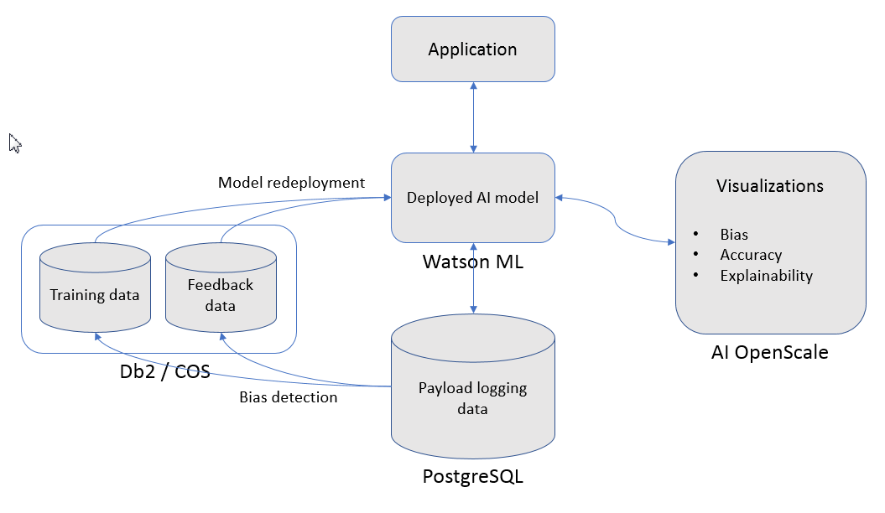

---

copyright:
  years: 2018
lastupdated: "2018-10-23"

---

{:shortdesc: .shortdesc}
{:new_window: target="_blank"}
{:tip: .tip}
{:note: .note}
{:important: .important}
{:deprecated: .deprecated}
{:pre: .pre}
{:codeblock: .codeblock}
{:screen: .screen}

# Getting started
{: #gettingstarted}

This topic provides reference material to help you get started using {{site.data.keyword.aios_full}}.
{: shortdesc}

## Complete the tutorial first
{: #gs-tutorial}

The first thing to do is [complete the tutorial](/docs/services/ai-openscale/tutorial.html). The tutorial contains a full list of prerequisites, along with step-by-step instructions for provisioning {{site.data.keyword.Bluemix_notm}} machine learning and data services, creating and deploying a machine learning model, and configuring the new {{site.data.keyword.aios_full}} service to monitor your model for trust and transparency.
{: important}

## After completing the tutorial

### View a {{site.data.keyword.aios_short}} video
{: #gs-view-demo}

Explore the main features of the {{site.data.keyword.aios_short}} tooling using examples based on fraud detection and loan approval workflows by watching [this video](https://www.youtube.com/watch?v=6Ei8rPVtCf8).

### Read this overview of {{site.data.keyword.aios_short}}
{: #gs-manual}

{{site.data.keyword.aios_short}} provides explanations into how decisions are being made by your AI models, and automatically detect and mitigate bias to produce fair, trusted outcomes.

To use AI OpenScale, *at a minimum* you will need:

- **A Watson Machine Learning (WML) service instance** connected to your {{site.data.keyword.Bluemix_notm}} account. This is where you store your AI models and deployments.

    **Note**: For the current release, only the Watson Machine Learning framework is supported.
    {: note}

    **Note**: The WML service instance must be present in the same {{site.data.keyword.Bluemix_notm}} account as the {{site.data.keyword.aios_short}} instance.
    {: note}

- **A PostgreSQL database** connected to your {{site.data.keyword.Bluemix_notm}} account. This is where you store payload, feedback, and measurement data.

    **Note**: For the current release, only a PostgreSQL database is supported.
    {: note}

    **Note**: The PostgreSQL database must be present in the same {{site.data.keyword.Bluemix_notm}} account as the {{site.data.keyword.aios_short}} instance.
    {: note}

- **An AI model**, deployed in the WML service instance.

    - The model can be any type (Spark ML, Deep learning, etc.), and should have an output schema defined.

    - The model training data must be available in either **Db2**, or in **Cloud Object Storage (COS)**. Access to the training data is not mandatory, but without it you will not be able to configure bias checking. See [Configuring the Fairness monitor](/docs/services/ai-openscale/monitor-fairness.html#config-fair) for more details.

    - If the model is accepting structured data as input, the model training data must be available in either Cloud Object Storage, or in Db2 for explainability to work. See [Configuring the Explainability monitor](/docs/services/ai-openscale/monitor-explain.html#config-explain).

    - If your AI model is deployed in a machine learning engine other than WML, you must enable payload logging for the external machine learning engine with a Python client. See [Working with other Machine Learning engines](/docs/services/ai-openscale/connect-ml.html) for more information.

## Next steps

- Complete the [advanced tutorial](tutorial-adv.html).
- [View monitored data](insight-overview.html) in the {{site.data.keyword.aios_short}} dashboard.
