---

title: Trust and transparency for your machine learning models with AI OpenScale
description: Monitor your machine learning deployments for bias, accuracy, and explainability
duration: 120
intro: In this tutorial, you will provision IBM Cloud machine learning and data services, create and deploy machine learning models in Watson studio, and configure the new IBM AI OpenScale product to monitor your models for trust and transparency.
takeaways:
- See how AI OpenScale provides trust and transparency for AI models
- Understand how IBM Cloud services and Watson Studio technologies can provide a seamless, AI-driven customer experience

copyright:
  years: 2018
lastupdated: "2018-12-04"

---

{:shortdesc: .shortdesc}
{:new_window: target="_blank"}
{:tip: .tip}
{:important: .important}
{:note: .note}
{:pre: .pre}
{:codeblock: .codeblock}
{:screen: .screen}
{:javascript: .ph data-hd-programlang='javascript'}
{:java: .ph data-hd-programlang='java'}
{:python: .ph data-hd-programlang='python'}
{:swift: .ph data-hd-programlang='swift'}

# Getting started
{: #gettingstarted}

{{site.data.keyword.aios_full}} allows enterprises to automate and operationalize AI lifecycle in business applications, ensuring AI models are free from bias, can be easily explained and understood by business users, and are auditable in business transactions. {{site.data.keyword.aios_short}} supports AI models built and run in the tools and model serve frameworks of your choice.
{: shortdesc}

## Overview
{: #gs-view-demo}

Get a quick overview of {{site.data.keyword.aios_short}} by watching this video.

  

    <iframe class="embed-responsive-item" id="youtubeplayer" title="Trust and Transparency in AI" type="text/html" width="640" height="390" src="https://www.youtube.com/embed/6Ei8rPVtCf8" frameborder="0" webkitallowfullscreen mozallowfullscreen allowfullscreen> </iframe>
  

## Use case and the value of {{site.data.keyword.aios_short}}

A biomedical company that produces heart drugs has collected data about a set of patients, all of whom suffered from the same illness. During their course of treatment, each patient responded to one of four medications. The company is using this data to build an AI assistant for medical practitioners, which will recommend the drug it believes to be the best choice for the patient.

The model uses patient data fields AGE, SEX, BP (blood pressure), CHOLESTEROL, K (potassium levels), and NA (sodium levels) to predict one of four values for the DRUG data field.

  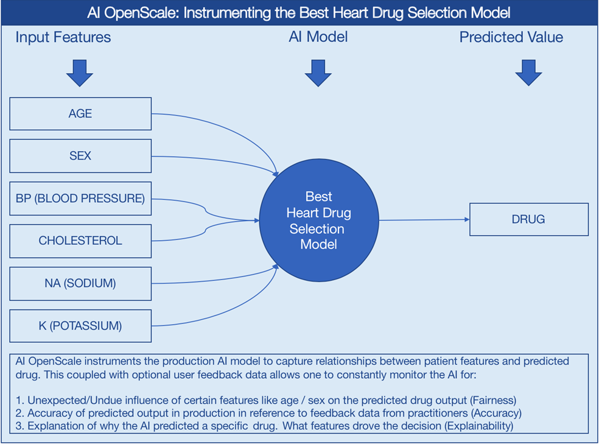

### How {{site.data.keyword.aios_short}} can help

- *Identify run-time bias in the model*: The company has established evidence that shows the key factors that should influence which drug is predicted are BP, CHOLESTEROL, K and NA. AGE and SEX do play a role, but they're not as significant when compared to the other indicators. The company suspects that the data coming from patient trials might have suffered from biases of the practitioners for prescribing medications based on SEX and BP. The company wants to constantly monitor for such biases being learned from the data, and flag a suspected bias.

- *Constantly validate the accuracy of the model*: The company routinely evaluates the model prediction by having experts provide their own drug recommendations based on the patient data. The goal is to integrate these manual evaluations as feedback, to tell the model in real time where it might be wrong, and improve it over time.

- *Make the model more trustworthy*: To achieve a successful adoption of its AI assistant, the company received feedback from its customer base of medical practitioners and doctors who said they would not trust the AI model recommendations without understanding the logic behind them.

Each of these issues will be addressed in this tutorial, through the use of {{site.data.keyword.aios_short}}:

- The Fairness monitor will flag SEX and BP biases the model may have
- The Accuracy monitor uses feedback generated by your experts to test the performance of the deployed model, to detect model drift
- The Explainability monitor makes each prediction more transparent, and provides data for what features were key influencers in the prediction

## Alternate setup option
{: #module}

Instead of completing the following tutorial to explore {{site.data.keyword.aios_short}}, technical users can install a Python module that automates the provisioning and configuration of prerequisite services. This module requires that Python 3 is installed, which includes the pip package management system. For instructions, see, [Installing a Python module to set up {{site.data.keyword.aios_short}}](/docs/services/ai-openscale/alt-setup.html).

## Tutorial objectives

In this tutorial, you will:

- Provision {{site.data.keyword.Bluemix_notm}} machine learning and storage services
- Set up a Watson Studio project, and create, train and deploy a machine learning model
- Configure and explore trust, transparency and explainability monitoring for your model

## Provision prerequisite {{site.data.keyword.Bluemix_notm}} services

In addition to {{site.data.keyword.aios_short}}, to complete this tutorial, you need the following accounts and services.

<!---

For the {{site.data.keyword.composeForPostgreSQL}} service, a **paid** Standard plan is needed. A $200 {{site.data.keyword.Bluemix_notm}} credit can be obtained by converting to a paid account with a credit card. If you already have a paid account, you will receive a one-time $16 refund of the cost for your first GB of storage, for one month.
{: tip}

--->

**Important**: For best performance, it's recommended that the prerequisite services are created in the same region as {{site.data.keyword.aios_short}}. To view available locations for {{site.data.keyword.aios_short}}, see [Service availability ](https://{DomainName}/docs/resources/services_region.html){: new_window}.

1. Log in to your [{{site.data.keyword.Bluemix_notm}} account ](https://{DomainName}){: new_window} with your {{site.data.keyword.ibmid}}.
2. For each of the following services that you don't already have associated with your account, create an instance by clicking the link, giving the service a name, selecting the **Lite** (free) plan, and clicking the **Create** button:
  - [Watson Studio ](https://{DomainName}/catalog/services/watson-studio){: new_window}

  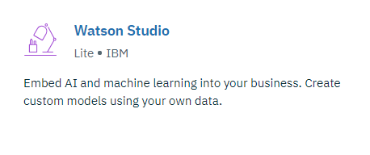

  - [Watson Machine Learning ](https://{DomainName}/catalog/services/machine-learning){: new_window}

  

  - [Object Storage ](https://{DomainName}/catalog/services/cloud-object-storage){: new_window}

  

<!---

### Provision a Db2 Warehouse service

- [Provision a Db2 Warehouse service ](https://{DomainName}/catalog/services/db2-warehouse){: new_window} if you do not already have one associated with your account:

  

- Give your service a name, choose the Entry plan, and click the **Create** button.

### Upload training data to Db2 Warehouse

- Download the [drug_train_data_updated.csv](https://raw.githubusercontent.com/watson-developer-cloud/doc-tutorial-downloads/master/ai-openscale/drug_train_data_updated.csv) file. Be sure to save the file download as a .CSV file.

- Open your existing (or newly-created) Db2 Warehouse from the [IBM Cloud console ](https://{DomainName}){: new_window}, click **Manage** from the left side panel, and then click the **Open** button.

- If necessary, use your Db2 credentials `username` and `password` to log in to Db2 Warehouse.

- Once Db2 Warehouse has opened, click the **Menu** button and select **Load** from the menu:

  

- Browse to the training data file, or drag and drop it into the appropriate area on the form. Click **Next**. Select a Schema from the list of load targets; this is usually in a format like `DASH12345`. Then click **New Table** on the right:

  

- Name your table HEART\_DRUG\_TRAINING, and click the **Create** button:

  

- Click **Next** to preview the data. On the preview screen, set the **Separator** field to a semicolon (;) and make sure the **Header in first row** option is checked:

  

- The training data should now be displaying correctly in columns. Click **Next** to continue, and then click **Begin Load** to load the data.

--->

## Set up a Watson Studio project

- Log in to your [Watson Studio account ](https://dataplatform.ibm.com/){: new_window}. Click the account avatar icon in the upper right and verify that the account you are using is the same account you used to create your {{site.data.keyword.Bluemix_notm}} services:

  

- In Watson Studio, begin by creating a new project. Select "Create a project":

  

- Select the **Standard** tile, to create the project:

  

- Give your project a name and description, make sure the Object Storage service you created in the previous step is selected in the **Storage** menu, and click **Create**.

### Associate your {{site.data.keyword.Bluemix_notm}} Services with your Watson project

- Open your Watson Studio project and select the **Settings** tab. Scroll down to the **Associated Services** section, click the **Add service** menu and select **Watson**:

  

- Click the **Add** link on the **Machine Learning** tile and select the **Existing** tab. Choose the service you created in the previous section from the **Existing Service Instance** menu and click **Select**.

<!---

- From the project settings tab, select **Add service** again and choose **Spark** from the menu. From the **Existing** tab, choose the Spark service you created and click **Select**.

--->

### Add the `Best Heart Drug Selection` model

- In Watson Studio, select the **Assets** tab of your project, scroll down to the **Watson Machine Learning Models** section, and click the **New Watson Machine Learning model** button.

- Select the **From sample** button of the **Select model type** menu, and select the `Best Heart Drug Selection` model:

  

- Click **Create**.

### Deploy the `Best Heart Drug Selection` model

- From the **Assets** tab in your Watson Studio project, scroll to the "Watson Machine Learning models" section, and click the `drug-selection` model you just created.

- Click the **Deployments** tab, then select **Add Deployment**.

- Enter `drug-test-deploy` as the name for your deployment, and select the **Web service** deployment type.

- Click **Save**.

## Configure {{site.data.keyword.aios_short}}

### Provision {{site.data.keyword.aios_short}}

- [Provision a new {{site.data.keyword.aios_short}} service instance ](https://{DomainName}/catalog/services/ai-openscale){: new_window}:

  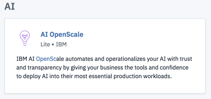

- Give your service a name, select the Lite plan, and click **Create**.

### Connect {{site.data.keyword.aios_short}} to your machine learning model

Now that the machine learning model has been deployed, you can configure {{site.data.keyword.aios_short}} to ensure trust and transparency with your models.

- Select the **Manage** tab of your {{site.data.keyword.aios_short}} instance, and click the **Launch application** button. The {{site.data.keyword.aios_full}} Getting Started page opens. Click **Begin**.

- Select the Watson Machine Learning tile and click **Next**.

- For this tutorial, select your Watson Machine Learning instance from the menu and click **Next**.

  You also have the option to select a different Machine Learning location; see [Specify your Watson Machine Learning instance](/docs/services/ai-openscale/connect-wml.html) for addtional information.
  {: note}

  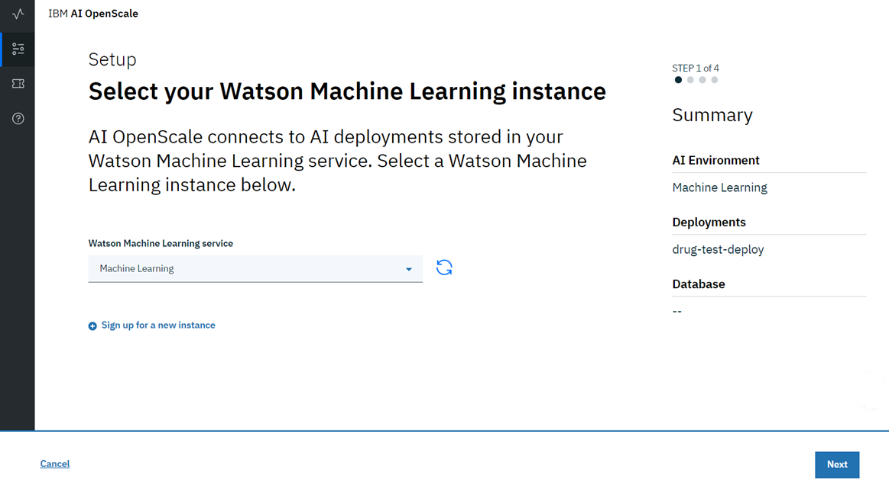

- You are now able to select the deployed models that will be monitored by {{site.data.keyword.aios_short}}. Check the model you created and deployed and click **Next**:

  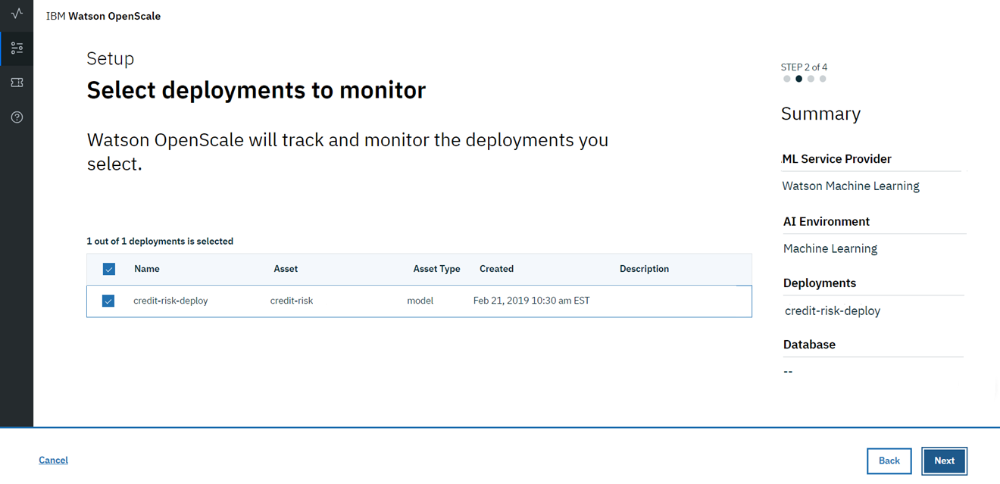

- Next, you need to choose a PostgreSQL database. You have two options: the free Lite plan database, or an existing or new database. For this tutorial, select the **Use the free Lite plan database** tile.

    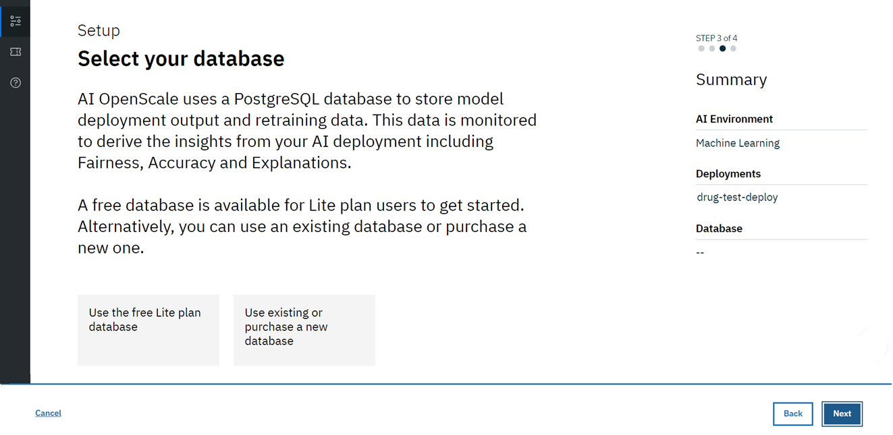

  See more complete details about each of these options in the [Specify your database](/docs/services/ai-openscale/connect-db.html) topic.
  {: note}

- Review the summary data and cick **Save**. Confirm and, when prompted, click the **Continue with Configuration** button.

  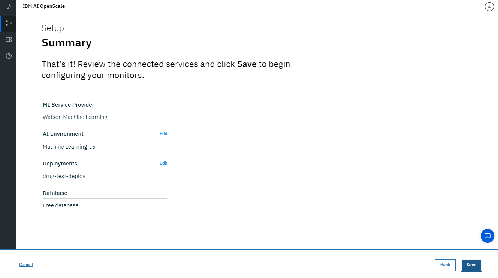

  Note the Data Mart ID is listed; this is your {{site.data.keyword.aios_short}} instance ID.

### Configure Fairness monitoring

- Select the deployment tile and click **Begin**:

  

- There are three areas to configure. Begin by selecting **Fairness** and clicking **Begin**.

- Read about fairness and click **Next**. For more information, see [Understanding Fairness](/docs/services/ai-openscale/monitor-fairness.html#understand-fair).

<!---
- Specify the location of the model training data by selecting **Db2** from the **Location** menu and filling out the remaining fields with the Db2 credentials created earlier before clicking **Next**.

- Once the database is connected, select your schema and the training data table in the menus, then click **Next**. Note that the data in the table should be in the format expected by the scoring endpoint, with an additional column containing the prediction values:

  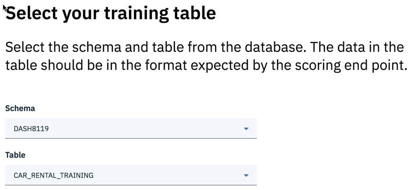

--->

- Select the [algorithm type](/docs/services/ai-openscale/monitor-accuracy.html#understand-accuracy). For the sample algorithm, there are multiple possible outcomes (four drug predictions), so select **Multi-class classification** from the menu and click **Next**:

  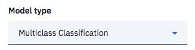

- Now, you must specify which column from the table contains prediction values (labels). In this case, it's the **DRUG** column, so select that one and click **Next**.

- You may now choose which features to monitor for fairness. In this example, we'll monitor the **SEX** and **BP** (*blood pressure*) features. Click the **SEX** and **BP** tiles, and click **Next**.

- {{site.data.keyword.aios_short}} works to detect bias against a monitored group in comparison to a reference group. For the **SEX** feature, add the value `M` (*male*) to the **Reference group**, and the value `F` (*female*) to the **Monitored group**, and click **Next**:

  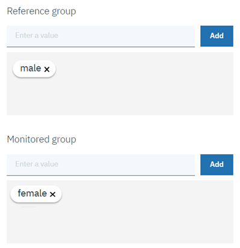

  The model will be flagged as biased for **SEX** if the drug prediction ratios for the monitored group differ from the ratios for the reference group. So if the model predicts drug X for male patients 60% of the time, and for female patients 20% of the time, it is biased.

- You may now assign a fairness threshold for **SEX**. You will see an alert on your operations dashboard if the Fairness rating falls below this threshold. Set the threshold at 90%, and click **Next**.

- For the **BP** feature, add the value `HIGH` to the **Reference group**, and the values `NORMAL` and `LOW` to the **Monitored group**, and click **Next**:

  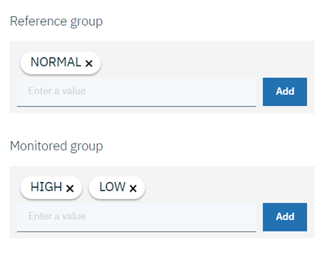

  As with **SEX**, the model will be flagged as biased for **BP** if the drug prediction ratios for the monitored group differ from the ratios for the reference group. So if patients with high blood pressure receive a drug at a different ratio than patients with low or normal blood pressure, the model is biased.

- Set the threshold for **BP** at 90%, and click **Next**.

- You will now select favorable and unfavorable prediction values from the payload logging (PostgreSQL) database. {{site.data.keyword.aios_short}} automatically detects which column in the payload logging data contains the prediction values, and presents them in the "Values from training data" section.

  For this tutorial, those values are **drugA**, **drugB**, **drugC**, and **drugX**. Drag and drop **drugC** as a Favorable value, and the others as Unfavorable values, to the form and click **Next**:

  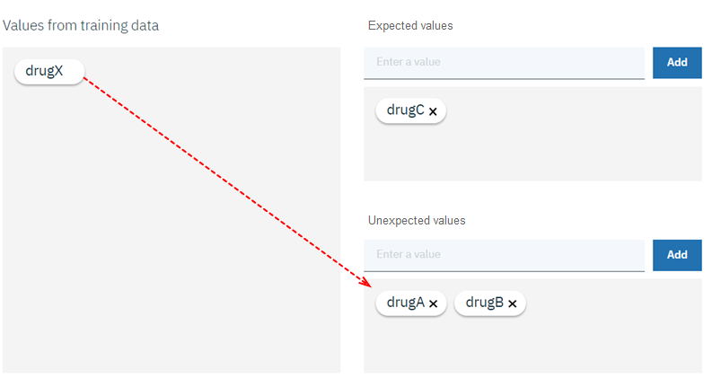

- Use the slider to adjust the minimum sample size to 100, then click  **Next**. Review your choices, and then click **Save**.

  For purposes of this tutorial, the minimum sample size has been set to 100. Normally, a larger sample size is recommended to ensure the sample size is not too small to skew results.
  {: note}
  
  Fairness metrics can take up to an hour to display.
  {: tip}

### Configure accuracy monitoring

- Select **Accuracy** and click **Begin**.

- Read about accuracy and click **Next**. For more information, see [Accuracy - How it works](/docs/services/ai-openscale/monitor-accuracy.html#how-it-works).

- Then, select the [algorithm type](/docs/services/ai-openscale/monitor-accuracy.html#understand-accuracy). For the sample algorithm, there are multiple possible outcomes (four drug predictions), so select **Multi-class classification** from the menu and click **Next**:

  

- Next, set the accuracy threshold to 90% and click **Next**.

- On the next screen, use the slider to adjust the minimum sample size to 10, then click  **Next**.

  **Note**: For purposes of this tutorial, the minimum sample size has been set to 10. Normally, a larger sample size is recommended to ensure the sample size is not too small to skew results.

- For the maximum sample size, use 10000. Click **Next**.

- You can review your choices before clicking **Save** to finalize them.

- Finally, you're presented with an optional button to **Add Feedback Data**. For now, select **Exit** without pressing this button.

### Configure explainability monitoring

- Select **Explainability** and click **Begin**.

- Read about explainability and click **Next**. For more information, see [Explainability](/docs/services/ai-openscale/monitor-explain.html).

- Select the type of data the deployment analyzes. The sample model receives numeric or categorical data, so select **Numeric/categorical** from the menu and click **Next**. For the sample model, an example of numeric data would be the `AGE` data column, such as `54`, while an example of categorical data would be the `CHOLESTEROL` data column, such as `NORMAL`.

<!---
- The training data is located in the Db2 Warehouse instance created earlier. Add the credentials in the form, **Test** the connection, and then click **Next**.

- To identify the location of the training table, set the schema to your Db2 Warehouse username, set the table to **CAR\_RENTAL\_TRAINING**, and click **Next**:

  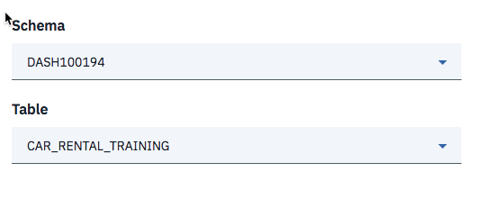

- Next, select the **Action** column, as it contains the prediction values from the machine learning service, and click **Next**.

--->

- Next, select the [algorithm type](/docs/services/ai-openscale/monitor-accuracy.html#understand-accuracy). For the sample algorithm, there are multiple possible outcomes (four drug predictions), so select **Multi-class Classification** from the menu and click **Next**:

  

- All the data columns are inputs to the model. Select all inputs and click **Next**:

  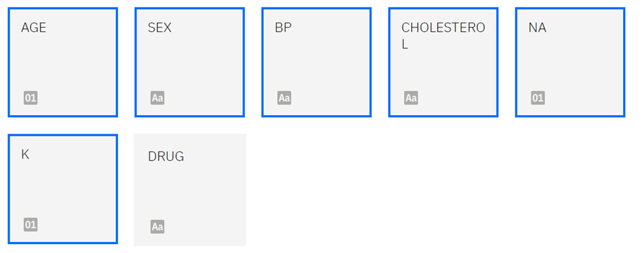

- For categorical features, neither **AGE**, **NA**, nor **K** contained text, so click **Next** without selecting any tiles. Review your input and click **Save**.

- You have finished configuring {{site.data.keyword.aios_short}}. It will now monitor your models and provide real-time bias detection, accuracy, and explainability. In the next steps, you will provide sample data for it to analyze.

<!---

## Connect your payload logging table to Watson Studio

- From the **Assets** tab in your Watson Studio project, click the **Add to project** button and select **Connection** from the menu:

  

- A list of your {{site.data.keyword.Bluemix_notm}} Services will appear. Select the Db2 instance you created earlier, and the click **Create**. You can now add the data from this database to your project. Click **Add to project** again, and selected **Connected assets**:

  

- Click the **Select source** link and choose your Db2 Warehouse instance, schema, and the HEART\_DRUG\_TRAINING table, then click **Select**.

  

- Give your asset a name, then click **Create**.

- Now add the PostgreSQL database. In your Watson Studio project, click **Add to project** and select **Connection**.

- Select the PostgreSQL instance you created earlier and click **Create**.

- Now add the payload logging table from PostgreSQL to Watson Studio. First, find the deployment ID for your model. From the **Deployments** tab of your Watson Studio project, click the **drug-test-deploy** link. On the **Overview** tab, scroll down and make note of the model ID:

  

- From the **Assets** tab of your Watson Studio project, click **Add to project** and select **Connected assets** from the menu. Click the **Select source** button and choose your PostgreSQL instance and the **public** schema.

- The payload logs are named _Payload\_\<model id\>_. Locate the one that matches the drug-selection model. Click **Select**, give the table a name, and click **Create**:

  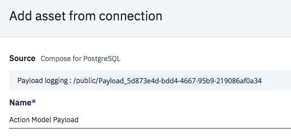

- With the model payload added as a data asset within Watson Studio, it's now easy to share, visualize and analyze. The payload table is currently empty. Next, you will provide some data for your model to analyze.

--->

## Provide a set of sample data to your model

- When configuring {{site.data.keyword.aios_short}}, you set the threshold for fairness and accuracy monitoring to 100 and 10 requests, respectively. No data will appear in the dashboard until this threshold is met. You can generate these requests all at once by feeding the training data back to the model for scoring.

- To generate requests, download the [drug_train_data.json](https://raw.githubusercontent.com/watson-developer-cloud/doc-tutorial-downloads/master/ai-openscale/drug_train_data.json) file.

- From the **Deployments** tab of your Watson Studio project, click the **drug-test-deploy** link, click the **Test** tab, and select the JSON input icon.

  

- Now, open the `drug_train_data.json` file you downloaded, and copy the contents to the JSON field in the **Test** tab. Click the **Predict** button to send and score training payloads to your model.

  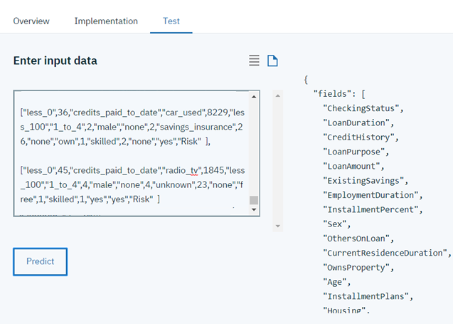

## Provide a set of sample feedback data to your model

- To enable monitoring for accuracy, you must retrain and redeploy your model with feedback data; no accuracy data will appear in the dashboard until this is done. You can generate these requests all at once by feeding sample feedback data to the model for scoring.

- Download the [drug_feedback_data.csv](https://raw.githubusercontent.com/watson-developer-cloud/doc-tutorial-downloads/master/ai-openscale/drug_feedback_data.csv) file.

- In {{site.data.keyword.aios_short}}, click the **Insights** tab:

  

- Click the tile for your deployed model.

  

- Then, click the icon to edit the deployment configuration:

  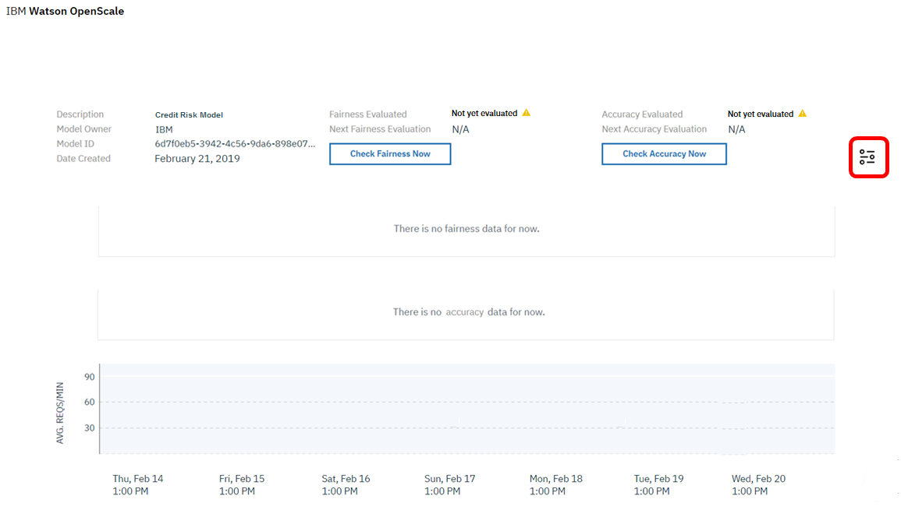

- In the "Summary" side panel, select the **Add Feedback Data** button, and select the `drug_feedback_data.csv` file you downloaded. Click **OK** when complete.

  **Note**: File sizes are currently limited to 8 MB.

  Adding the CSV file retrains and provides feedback data to your model.

  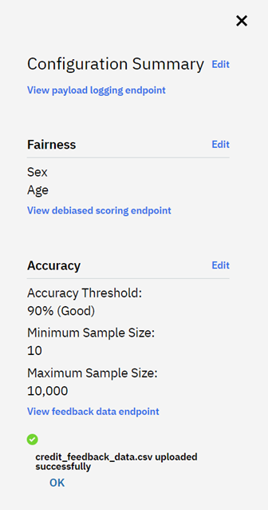

- Finally, [re-run the sample data set](/docs/services/ai-openscale/getting-started.html#provide-a-set-of-sample-data-to-your-model) against the updated model.

## Viewing results

### View insights for your deployment

Using the [AI OpenScale dashboard ](https://aiopenscale.cloud.ibm.com/aiopenscale/){: new_window}, click the **Insights** tab.

  Fairness metrics can take up to an hour to display.
  {: tip}

  

The Insights page provides an overview of metrics for your deployed models. You can easily see alerts for Fairness or Accuracy metrics that have fallen below the 90% threshold.

  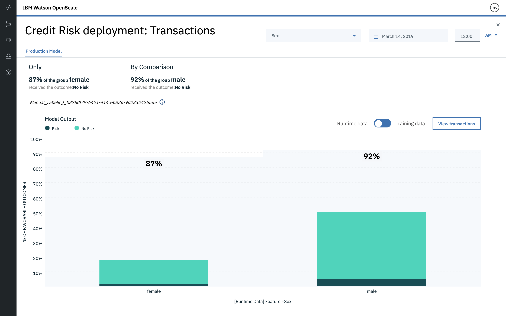

### View monitoring data for your deployment

Select a deployment by clicking the tile on the Insights page. The monitoring data for that deployment will appear. Slide the marker across the chart to select data for the time frame during which you ran the sample data and sample feedback data. Then select the **View details** link.

  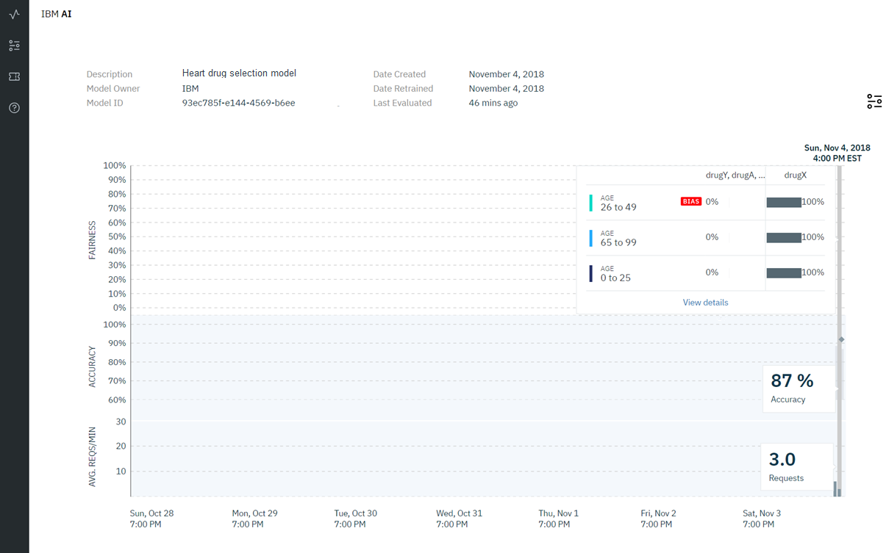

Now, you can review the charts for the data you monitored. For this example, you can use the **Feature** menu to select either "BP" or "SEX", in order to see details about the monitored data.

  

### View explainability for a model transaction

Select the **View transactions** button from the charts for the data you monitored.

  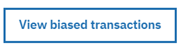

  a list of transactions for the past hour is listed. Copy one of the transaction IDs.

  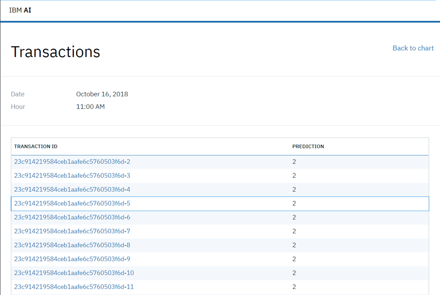

Using the [AI OpenScale dashboard ](https://aiopenscale.cloud.ibm.com/aiopenscale/){: new_window}, click the **Explainability** tab:

  

Paste the transaction ID value you copied into the search box and press **Return** on your keyboard. You will now see an explanation of how the model arrived at its conclusion, including how confident the model was, the factors that contributed to the confidence level, and the attributes fed to the model.

  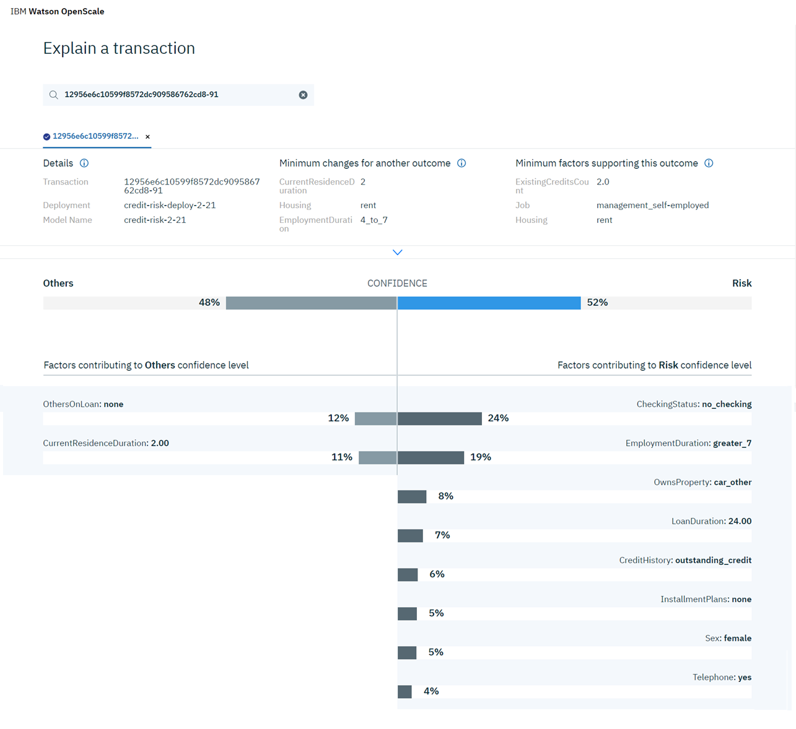
## Next steps

- See the [Working with monitored data](/docs/services/ai-openscale/insight-timechart.html) topic for more information.
