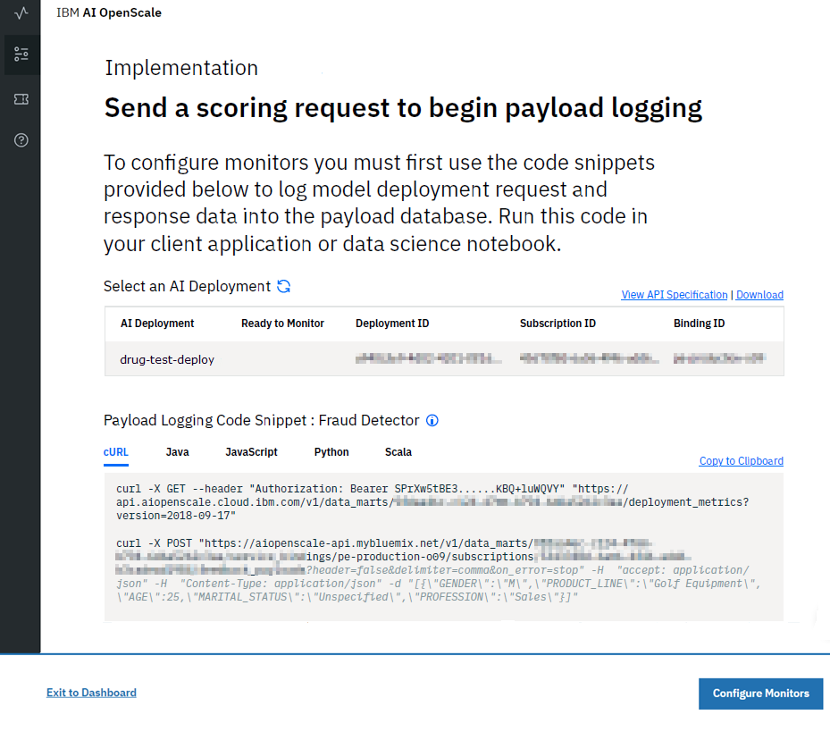

---

title: Trust and transparency for your machine learning models with {{site.data.keyword.aios_short}}
description: Monitor your machine learning deployments for bias, accuracy, and explainability
duration: 120
intro: In this tutorial, you will provision IBM Cloud machine learning and data services, create and deploy machine learning models in Watson studio, and configure the new IBM {{site.data.keyword.aios_full}} product to monitor your models for trust and transparency.
takeaways:
- See how {{site.data.keyword.aios_short}} provides trust and transparency for AI models
- Understand how IBM Cloud services and Watson Studio technologies can provide a seamless, AI-driven customer experience

copyright:
  years: 2018, 2019
lastupdated: "2019-03-16"

keywords: ai, getting started, tutorial, understanding, video

subcollection: ai-openscale

---

{:shortdesc: .shortdesc}
{:new_window: target="_blank"}
{:hide-dashboard: .hide-dashboard}
{:tip: .tip}
{:important: .important}
{:note: .note}
{:pre: .pre}
{:codeblock: .codeblock}
{:screen: .screen}
{:javascript: .ph data-hd-programlang='javascript'}
{:java: .ph data-hd-programlang='java'}
{:python: .ph data-hd-programlang='python'}
{:swift: .ph data-hd-programlang='swift'}

# Getting started
{: #gettingstarted}

{{site.data.keyword.aios_full}} allows enterprises to automate and operationalize AI lifecycle in business applications, ensuring AI models are free from bias, can be easily explained and understood by business users, and are auditable in business transactions. {{site.data.keyword.aios_short}} supports AI models built and run in the tools and model serve frameworks of your choice.
{: shortdesc}

## Overview
{: #gs-view-demo}

Get a quick overview of {{site.data.keyword.aios_short}} by watching this video.

  

    <iframe class="embed-responsive-item" id="youtubeplayer" title="Trust and Transparency in AI" type="text/html" width="640" height="390" src="https://www.youtube.com/embed/6Ei8rPVtCf8" frameborder="0" webkitallowfullscreen mozallowfullscreen allowfullscreen> </iframe>
  

## Use case of {{site.data.keyword.aios_short}}
{: #gs-use}

Traditional lenders are under pressure to expand their digital portfolio of financial services to a larger and more diverse audience, which requires a new approach to credit risk modeling. Their data science teams currently rely on standard modeling techniques - like decision trees and logistic regression - which work well for moderate datasets, and make recommendations that can be easily explained. This satisfies regulatory requirements that credit lending decisions must be transparent and explainable.

To provide credit access to a wider and riskier population, applicant credit histories must expand beyond traditional credit, like mortgages and car loans, to alternate credit sources like utility and mobile phone plan payment histories, plus education and job titles. These new data sources offer promise, but also introduce risk by increasing the likelihood of unexpected correlations which introduce bias based on an applicant’s age, gender, or other personal traits.

The data science techniques most suited to these diverse datasets, such as gradient boosted trees and neural networks, can generate highly accurate risk models, but at a cost. Such "black box" models generate opaque predictions that must somehow become transparent, to ensure regulatory approval such as Article 22 of the General Data Protection Regulation (GDPR), or the federal Fair Credit Reporting Act (FCRA) managed by the Consumer Financial Protection Bureau.

The credit risk model provided in this tutorial uses a training dataset that contains 20 attributes about each loan applicant. Two of those attributes - age and sex - can be tested for bias. For this tutorial, the focus will be on bias against sex and age.

{{site.data.keyword.aios_short}} will monitor the deployed model's propensity for a favorable outcome ("No Risk") for one group (the Reference Group) over another (the Monitored Group). In this tutorial, the Monitored Group for sex is `female`, while the Monitored Group for age is `19 to 25`.

<!---
### How {{site.data.keyword.aios_short}} can help
{: #gs-how}

- *Identify run-time bias in the model*: The company has established evidence that shows the key factors that should influence which drug is predicted are BP, CHOLESTEROL, K and NA. AGE and SEX do play a role, but they're not as significant when compared to the other indicators. The company suspects that the data coming from patient trials might have suffered from biases of the practitioners for prescribing medications based on SEX and BP. The company wants to constantly monitor for such biases being learned from the data, and flag a suspected bias.

- *Constantly validate the accuracy of the model*: The company routinely evaluates the model prediction by having experts provide their own drug recommendations based on the patient data. The goal is to integrate these manual evaluations as feedback, to tell the model in real time where it might be wrong, and improve it over time.

- *Make the model more trustworthy*: To achieve a successful adoption of its AI assistant, the company received feedback from its customer base of medical practitioners and doctors who said they would not trust the AI model recommendations without understanding the logic behind them.

Each of these issues will be addressed in this tutorial, through the use of {{site.data.keyword.aios_short}}:

- The Fairness monitor will flag SEX and BP biases the model may have
- The Accuracy monitor uses feedback generated by your experts to test the performance of the deployed model, to detect model drift
--->

## Alternate setup option
{: #gs-module}

Instead of completing the following tutorial to explore {{site.data.keyword.aios_short}}, technical users can install a Python module that automates the provisioning and configuration of prerequisite services. This module requires that Python 3 is installed, which includes the pip package management system. For instructions, see, [Installing a Python module to set up {{site.data.keyword.aios_short}}](/docs/services/ai-openscale?topic=ai-openscale-as-module).

Additional tutorial links may be found in the [Additional resources](/docs/services/ai-openscale?topic=ai-openscale-arsc-ov) topic.

## Tutorial objectives
{: #gs-obj}

In this tutorial, you will:

- Provision {{site.data.keyword.Bluemix_notm}} machine learning and storage services
- Set up a Watson Studio project, and create, train and deploy a machine learning model
- Configure and explore trust, transparency and explainability for your model

## Provision prerequisite {{site.data.keyword.Bluemix_notm}} services
{: #gs-prps}

In addition to {{site.data.keyword.aios_short}}, to complete this tutorial, you need the following accounts and services.

<!---

For the {{site.data.keyword.composeForPostgreSQL}} service, a **paid** Standard plan is needed. A $200 {{site.data.keyword.Bluemix_notm}} credit can be obtained by converting to a paid account with a credit card. If you already have a paid account, you will receive a one-time $16 refund of the cost for your first GB of storage, for one month.
{: tip}

--->

**Important**: For best performance, it's recommended that the prerequisite services are created in the same region as {{site.data.keyword.aios_short}}. To view available locations for {{site.data.keyword.aios_short}}, see [Service availability](/docs/resources?topic=resources-services_region).

1.  Log in to your [{{site.data.keyword.Bluemix_notm}} account ](https://{DomainName}){: new_window} with your {{site.data.keyword.ibmid}}.
1.  For each of the following services that you don't already have associated with your account, create an instance by clicking the link, giving the service a name, selecting the **Lite** (free) plan, and clicking the **Create** button:

    - [Watson Studio ](https://{DomainName}/catalog/services/watson-studio){: new_window}

      

    - [Watson Machine Learning ](https://{DomainName}/catalog/services/machine-learning){: new_window}

      

    - [Object Storage ](https://{DomainName}/catalog/services/cloud-object-storage){: new_window}

      

<!---

### Provision a Db2 Warehouse service
{: #gs-provdb2}

- [Provision a Db2 Warehouse service ](https://{DomainName}/catalog/services/db2-warehouse){: new_window} if you do not already have one associated with your account:

  

- Give your service a name, choose the Entry plan, and click the **Create** button.

### Upload training data to Db2 Warehouse
{: #gs-traindb2}

- Download the [drug_train_data_updated.csv ](https://raw.githubusercontent.com/watson-developer-cloud/doc-tutorial-downloads/master/ai-openscale/drug_train_data_updated.csv) file. Be sure to save the file download as a .CSV file.

- Open your existing (or newly-created) Db2 Warehouse from the [IBM Cloud console ](https://{DomainName}){: new_window}, click **Manage** from the left side panel, and then click the **Open** button.

- If necessary, use your Db2 credentials `username` and `password` to log in to Db2 Warehouse.

- Once Db2 Warehouse has opened, click the **Menu** button and select **Load** from the menu:

  

- Browse to the training data file, or drag and drop it into the appropriate area on the form. Click **Next**. Select a Schema from the list of load targets; this is usually in a format like `DASH12345`. Then click **New Table** on the right:

  

- Name your table HEART\_DRUG\_TRAINING, and click the **Create** button:

  

- Click **Next** to preview the data. On the preview screen, set the **Separator** field to a semicolon (;) and make sure the **Header in first row** option is checked:

  

- The training data should now be displaying correctly in columns. Click **Next** to continue, and then click **Begin Load** to load the data.

--->

## Set up a Watson Studio project
{: #gs-setup}

1.  Log in to your [Watson Studio account ](https://dataplatform.ibm.com/){: new_window} and begin by creating a new project. Select **Create a project**.

    

1.  Select the **Standard** tile.

    

1.  Give your project a name and description, make sure the Object Storage service you created in the previous step is selected in the **Storage** menu, and click **Create**.

### Associate your {{site.data.keyword.Bluemix_notm}} Services with your Watson project
{: #gs-assoc}

1.  Open your Watson Studio project and select the **Settings** tab. Scroll down to the **Associated Services** section, click the **Add service** menu and select **Watson**.

    

1.  Click the **Add** link on the **Machine Learning** tile and select the **Existing** tab. Choose the service you created in the previous section from the **Existing Service Instance** menu and click **Select**.

<!---

- From the project settings tab, select **Add service** again and choose **Spark** from the menu. From the **Existing** tab, choose the Spark service you created and click **Select**.

--->

### Add the `Credit Risk` model
{: #gs-addmod}

1.  In Watson Studio, select the **Assets** tab of your project, scroll down to the **Watson Machine Learning Models** section, and click the **New Watson Machine Learning model** button.

1.  From the **Select model type** section, select **From sample** and the `Credit Risk` model, and then click **Create**.

    

### Deploy the `Credit Risk` model
{: #gs-depmod}

1.  In your Watson Studio project, click the **Assets** tab, scroll to the **Watson Machine Learning models** section, and click the credit-risk model you just created.
2.  In the **ACTIONS** column, click the **Actions**  menu and then, click **Deploy**.
3. From the **Assets** tab in your Watson Studio project, scroll to the **Watson Machine Learning models** section, and click the `credit-risk` model you just created.
1.  Click the **Deployments** tab, then click **Add Deployment**.
1.  Enter `credit-risk-deploy` as the name for your deployment, and select the **Web service** deployment type.
1.  Click **Save**.

## Configure {{site.data.keyword.aios_short}}
{: #gs-confaios}

### Provision {{site.data.keyword.aios_short}}
{: hide-dashboard}
{: #gs-provaios}

1.  [Provision a new {{site.data.keyword.aios_short}} service instance ](https://{DomainName}/catalog/services/watson-openscale){: new_window}

<!---
    
--->

2.  Give your service a name, select the Lite plan, and click **Create**.

### Connect {{site.data.keyword.aios_short}} to your machine learning model
{: #gs-ctmod}

Now that the machine learning model has been deployed, you can configure {{site.data.keyword.aios_short}} to ensure trust and transparency with your models.

1.  Select the **Manage** tab of your {{site.data.keyword.aios_short}} instance, and click the **Launch application** button. The {{site.data.keyword.aios_full}} Getting Started page opens. Click **Begin**.

1.  Click the **Watson Machine Learning** tile.

1.  For this tutorial, select your Watson Machine Learning instance from the menu and click **Next**.

    You also have the option to select a different Machine Learning location. See [Specifying a Watson Machine Learning service instance](/docs/services/ai-openscale?topic=ai-openscale-wml-connect) for additional information.
    {: note}

    

1.  You are now able to select the deployed models that will be monitored by {{site.data.keyword.aios_short}}. Select the model you created and deployed and click **Next**.

    

1.  Next, you need to choose a database. You have two options: the free Lite plan database, or an existing or new database. For this tutorial, select the **Use the free Lite plan database** tile.

    See more complete details about each of these options in the [Specifying a database](/docs/services/ai-openscale?topic=ai-openscale-connect-db) topic. The existing database can be a PostgreSQL database or a Db2 database.
    {: tip}

    

1.  Review the summary data and click **Save**. Confirm and, when prompted, click the **Continue with Configuration** button.

    A Data Mart ID is also listed, which is the same thing as a {{site.data.keyword.aios_short}} instance ID.
    {: tip}

    

1.  Your screen might be similar to the following screen capture. Because you will use a GUI method to score your data, simply select the **Configure Monitors** button to complete this set-up.

    

### Provide a set of sample data to your model
{: #gs-samp}

Before you can configure your monitors, you must generate at least one scoring request against your model in order to generate payload logging that the monitors can consume. In this section, you will provide sample data in the form of a JSON file to generate a scoring request.

1.  Download the [credit_payload_data.json ](https://raw.githubusercontent.com/watson-developer-cloud/doc-tutorial-downloads/master/ai-openscale/credit_payload_data.json) file.

1.  From the **Deployments** tab of your Watson Studio project, click the **credit-risk-deploy** link, click the **Test** tab, and select the JSON input icon.

    

1.  Now, open the `credit_payload_data.json` file you downloaded, and copy the contents to the JSON field in the **Test** tab. Click the **Predict** button to send and score training payloads to your model.

    

### Preparing for monitoring
{: #gs-prepmon}

1.  Now, in the {{site.data.keyword.aios_short}} instance, select your deployment and click **Begin**.

    

1.  Select the **Prepare for monitoring** tile, and then click **Begin**.

    

1.  Next you will provide information about your model and training data. Click **Next**.

    

1.  From the **Data type** menu, select **Numeric/categorical** as the type of data your deployment analyzes, and click **Next**.

    

1.  For numeric or categorical data, you need to provide information about the training data for your model in order to configure the monitors. Select **Manually configure monitors** to provide connection information to your training data.

    

1.  The algorithm type is important for monitoring your model metrics, such as Accuracy. Because the prediction that the model can make is "Risk" or "No Risk", select the **Binary classification** [algorithm type](/docs/services/ai-openscale?topic=ai-openscale-acc-monitor#acc-understand), and click **Next**.

    

1.  The location information for the sample data is pre-populated on the following screen. Select **Next** to continue.

    

1.  The schema and table are also pre-populated. Click **Next** to proceed.

    

1.  Now, you must specify the feature which contains the answer(s) the model will predict (in other words, in your database, which column from the table contains prediction values (labels)). In this case, the model will predict credit risk, so select the **Risk** column and click **Next**.

    Your training database has the values that you provided in order to train your model.
    {: note}

    

1.  Select the columns used to train the model. This is the data that your model deployment expects in a request. All the data columns except `_training` are inputs to the model. Select all other inputs and click **Next**.

    

1.  For categorical data, you must identify columns which now contain integers, but originally contained text values. Select the values as shown here.

    

1.  Review your selection summary, click **Save**, and then click **OK**.

### Configure Fairness monitoring
{: #gs-cfgfair}

1.  Click **Fairness**.

1.  Read about fairness and click **Next**. For more information, see [Fairness](/docs/services/ai-openscale?topic=ai-openscale-mf-monitor).

1.  You may now choose which features to monitor for fairness. For each feature you select, {{site.data.keyword.aios_short}} will monitor the deployed model's propensity for a favorable outcome for one group over the other. In this example, we'll monitor the **Sex** and **Age** features.

    Features are monitored individually, but any debiasing will correct issues for all features together. Click the **Sex** and **Age** tiles, and click **Next**.

1.  {{site.data.keyword.aios_short}} works to detect bias against a monitored group in comparison to a reference group. For the **Sex** feature, add the value `male` to the **Reference group**, and the value `female` to the **Monitored group**, and click **Next**.

    The model will be flagged as biased for **Sex** if the Risk prediction ratios for the monitored group differ from the ratios for the reference group. So if the model predicts Risk for male customers 60% of the time, and for female customers 20% of the time, it is biased.

    

1.  You may now assign a fairness threshold for **Sex**. You will see an alert on your operations dashboard if the Fairness rating falls below this threshold. Set the threshold at 90%, and click **Next**.

1.  For the **Age** feature, add the values `26-74` to the **Reference group**, and the values `19-25` to the **Monitored group**, and click **Next**.

    As with **Sex**, the model will be flagged as biased for **Age** if the Risk prediction ratios for the monitored group differ from the ratios for the reference group. So if customers aged between 26 and 74 receive a Risk prediction at a different ratio than customers aged between 19 and 25, the model is biased.

    

1.  Set the threshold for **Age** at 90%, and click **Next**.

1.  Drag and drop values from the **Values from training data** field to the **Favorable values** and **Unfavorable values** fields. For this tutorial, the favorable value is **No Risk**, and the unfavorable value is **Risk**. Click **Next**.

    {{site.data.keyword.aios_short}} automatically detects which column in the payload logging database contains the prediction values, and presents them in the **Values from training data** field. Note that while your training database has values that you provided to train your model, the payload logging database contains feedback data collected at model runtime, that you can then optionally use to retrain and redeploy your model.
    {: note}

    

1.  Use the slider to adjust the minimum sample size to 100, then click **Next**.

    

    For this tutorial, the minimum sample size is set to 100. Normally, a larger sample size is recommended to ensure that the sample size is not too small, which would skew the results.
    {: note}

1.  Review your choices, click **Save**, and then click **OK**.

    

    The following window, which provides a debiased scoring endpoint, appears. Because this tutorial uses the GUI method and not the CLI to score data, to continue, click **OK**.

    

### Configure accuracy monitoring
{: #gs-cfgac}

1.  Click **Accuracy**.

1.  Read about accuracy and click **Next**. For more information, see [Accuracy](/docs/services/ai-openscale?topic=ai-openscale-acc-monitor).

1.  Set the accuracy alert threshold to 90% and click **Next**.

1.  On the next screen, use the slider to adjust the minimum sample size to 10, then click  **Next**.

    For this tutorial, the minimum sample size has been set to 10. Normally, a larger sample size is recommended to ensure the sample size is not too small, which would skew the results.
    {: note}

1.  For the maximum sample size, use 10000. Click **Next**.

1.  Review your choices, click **Save**, and then click **OK**.

1.  Finally, you're presented with an option to add feedback data, which is covered in the next section. For now, close the window by clicking **OK**, without clicking the **Add Feedback Data** button.

    For more details, see [Configuring the Accuracy monitor](/docs/services/ai-openscale?topic=ai-openscale-acc-monitor#acc-config).

## Provide a set of sample feedback data to your model
{: #gs-smpfeed}

To enable monitoring for accuracy, you must provide your model with feedback data. Accuracy data will not appear in the dashboard until that is done. You can generate the requests all at once by adding sample feedback data to the model for scoring. For this task, you'll download a CSV file that contains sample feedback data.

1.  Download the [credit_feedback_data.csv ](https://raw.githubusercontent.com/watson-developer-cloud/doc-tutorial-downloads/master/ai-openscale/credit_feedback_data.csv) file.

1.  In {{site.data.keyword.aios_short}}, click the **Insights** tab.

    

1.  Click the tile for your deployed model.

    

1.  Then, click the edit icon to edit the deployment configuration.

    

1.  In the Summary side panel, click the **Add Feedback Data** button, and select the `credit_feedback_data.csv` file you downloaded. Select the **Comma (,)** delimiter, and then click **OK**.

    File sizes are currently limited to 8 MB.
    {: note}

    

    Adding the CSV file provides feedback data to your model.

    

## Viewing results
{: #gs-viewres}

### View insights for your deployment
{: #gs-viewin}

1. From the [{{site.data.keyword.aios_short}} dashboard ](https://aiopenscale.cloud.ibm.com/aiopenscale/){: new_window}, click the **Insights** tab.

  

1. View the Insights page to see an overview of metrics for your deployed models. You can easily see alerts for Fairness or Accuracy metrics that have fallen below the 90% threshold.

  Fairness and Accuracy metrics can take up to an hour to display. 
  {: tip}

  

### View monitoring data for your deployment
{: #gs-viewmon}

1.  Select a deployment by clicking the tile on the Insights page. The monitoring data for that deployment is shown. Note: After you upload the feedback .csv file, you may find that the Fairness or Accuracy data is not updated. To check the result immediately, click the **Check Fairness Now** or **Check Accuracy Now** button.
1.  Slide the marker across the chart to select data for the time frame during which you ran the sample data and sample feedback data. Then click **View details**.

    

1.  Next, review the charts for the data you monitored. For this example, use the **Feature** menu to select either `Age` or `Sex` in order to see details about the monitored data.

    See [Visualizing data for a specific hour](/docs/services/ai-openscale?topic=ai-openscale-it-ov#it-vdet) for more information about how to read these charts.
    {: tip}

    

### View explainability for a model transaction
{: #gs-viewextx}

1.  Click the **View transactions** button from the charts for the data you monitored.

    

1.  A list of transactions that contributed to bias for the past hour displays. To view a more detailed explanation of a particular transaction, from the **ACTION** column, click **Explain**.

    

1.  An explanation of how the model arrived at its conclusion displays. This explanation includes how confident the model was, the factors that contributed to the confidence level, and the columns that were fed to the model.

    

## Next steps
{: #gs-next}

- Learn more about [viewing and interpreting the data](/docs/services/ai-openscale?topic=ai-openscale-it-ov) and [monitoring explainability](/docs/services/ai-openscale?topic=ai-openscale-ie-ov).
