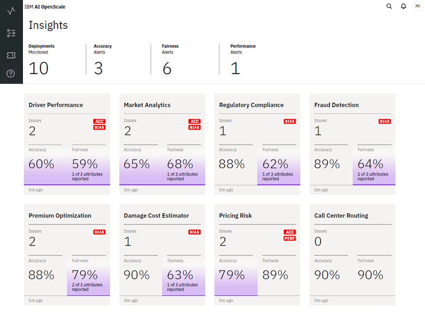
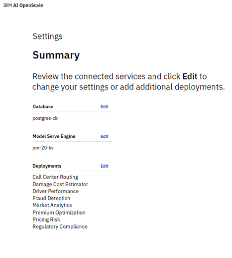

---

copyright:
  years: 2018, 2019
lastupdated: "2019-05-29"

keywords: dashboard, navigating, navigation, insights

subcollection: ai-openscale

---

{:shortdesc: .shortdesc}
{:new_window: target="_blank"}
{:important: .important}
{:note: .note}
{:tip: .tip}
{:pre: .pre}
{:codeblock: .codeblock}
{:screen: .screen}

# Navigating the dashboard
{: #io-ov}

You can track all the deployments you are monitoring through the {{site.data.keyword.aios_short}} dashboard. The dashboard is your main view into {{site.data.keyword.aios_short}}. The dashboard consists of the following tabs:

  

{: shortdesc}

## Insights
{: #io-ins}

The **Insights** tab (  ) provides a high-level view of your deployment monitoring.

  

- ***Deployments Monitored*** - In this example, a total of 10 deployments are being monitored. Eight of the ten deployments are shown as individual tiles below.

- ***Accuracy Alerts*** - A total of 3 Accuracy alerts are represented in the tiles below by purple shading. In this example, the `Driver Performance`, `Market Analytics`, and `Pricing Risk` deployments show Accuracy values of `60%`, `65%`, and `79%`, respectively.

- ***Fairness Alerts*** - There are a total of 6 Fairness alerts, represented in the tiles below by both purple shading, and by a small `BIAS` tag. In this example, the `Driver Performance`, `Market Analytics`, `Regulatory Compliance`, `Fraud Detection`, `Premium Optimization`, and `Damage Cost Estimator` deployments show Fairness values of `59%`, `68%`, `62%`, `64%`, `79%`, and `63%`, respectively.

Each tile provides a summary of monitoring activity for that deployment. Note that the `Call Center Routing` deployment tile shows no issues, indicating a fairly stable, accurate model.

### Next steps
{: #io-next}

Select any of the individual deployment tiles to view more details about that deployment. For more information, see [Monitoring Fairness, Average Requests per Minute, and Accuracy](/docs/services/ai-openscale?topic=ai-openscale-it-ov) and [Monitoring explainability](/docs/services/ai-openscale?topic=ai-openscale-ie-ov).

## Configuration
{: #io-conf}

The **Configure** tab (  ) opens a Configuration Summary for the selected deployment.

  

From here, you can directly edit the configuration settings for your deployment monitor.

## Transactions
{: #io-tran}

Use the **Explain a transaction** tab (  ) to search a specific transaction ID to explain a particular deployment transaction. For more information, see [Monitoring explainability](/docs/services/ai-openscale?topic=ai-openscale-ie-ov).

## Help tab
{: #io-help}

The Help tab (  ) provides additional information to assist you in using {{site.data.keyword.aios_short}}.
