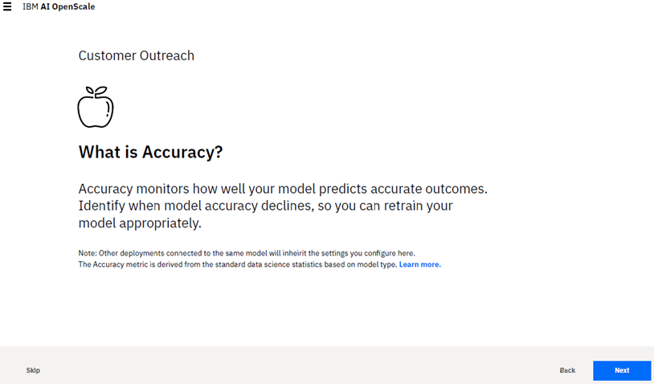

---

copyright:
  years: 2018, 2019
lastupdated: "2019-06-24"

keywords: accuracy, 

subcollection: ai-openscale

---

{:shortdesc: .shortdesc}
{:external: target="_blank" .external}
{:tip: .tip}
{:important: .important}
{:note: .note}
{:pre: .pre}
{:codeblock: .codeblock}
{:download: .download}
{:screen: .screen}
{:javascript: .ph data-hd-programlang='javascript'}
{:java: .ph data-hd-programlang='java'}
{:python: .ph data-hd-programlang='python'}
{:swift: .ph data-hd-programlang='swift'}
{:faq: data-hd-content-type='faq'}

# Configuring the Accuracy or Quality monitor
{: #acc-monitor}

The Quality monitor (preiously known as the Accuracy monitor) lets you know how well your model predicts outcomes.
{: shortdesc}

## Configuration steps
{: #acc-config}

From the **Accuracy** tab, on the **What is Accuracy?** page, click **Begin** to start the configuration process.

Configure the following settings on the successive pages of the Accuracy configuration tab:

-  Set the accuracy alert threshold. Select a value that represents an acceptable accuracy level.

    Accuracy is a value synthesized from relevant data science metrics associated with each particular model type. The score is a normalized measure to allow you to easily compare accuracy across different model types. In typical situations, an accuracy score of 80 is sufficient.
    {: note}

-  Set minimum and maximum sample sizes. Minimum size prevents measuring Accuracy until a minimum number of records are available in the evaluation dataset; this ensures the sample size is not too small to skew results. The maximum sample size helps better manage the time and effort it takes to evaluate the dataset; only the most recent records will be evaluated if this size is exceeded.

A summary of your selections is presented for review. If you want to change anything, click the **Edit** link for that section. Otherwise, click **Save** to complete your configuration.

### Next steps
{: #acc-next}

From the **Configure monitors** page, you can select another monitoring category.
