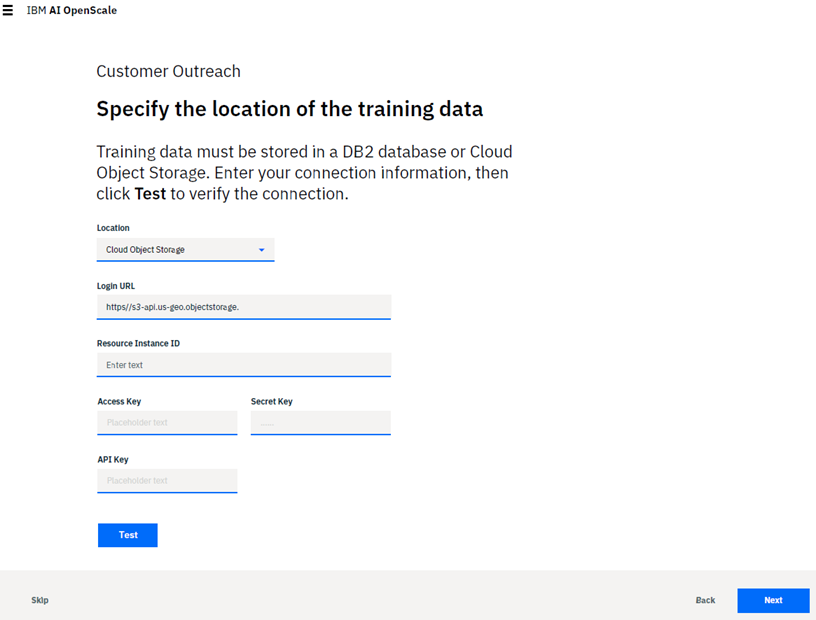
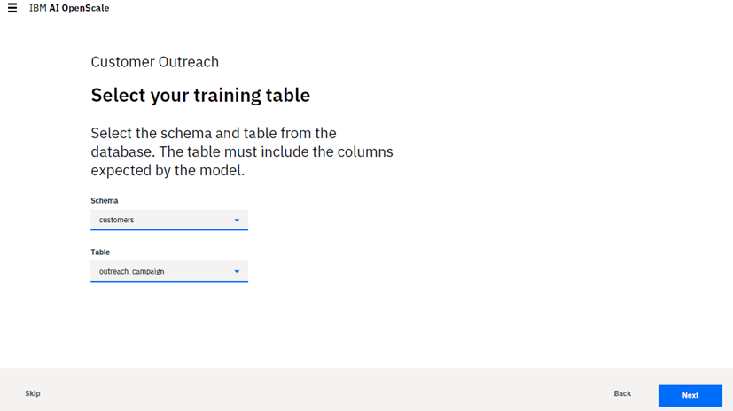
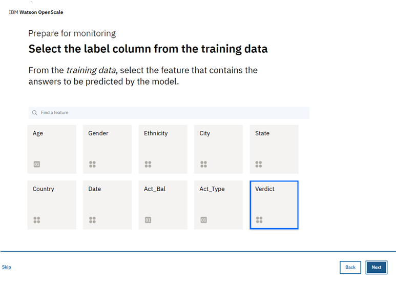
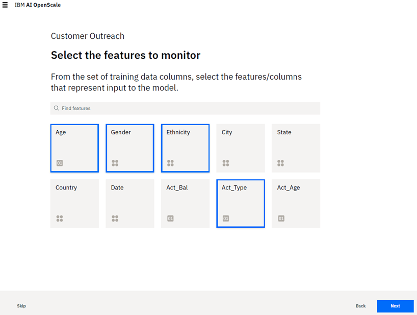
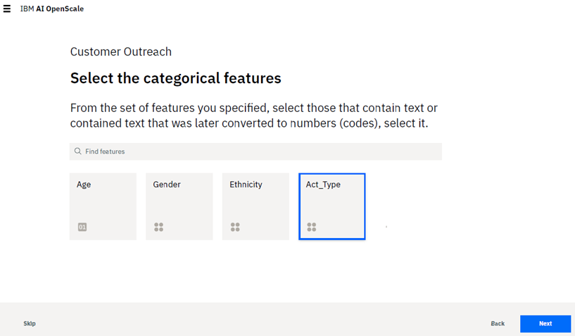

---

copyright:
  years: 2015, 2018
lastupdated: "2018-9-8"

---

{:shortdesc: .shortdesc}
{:new_window: target="_blank"}
{:tip: .tip}
{:pre: .pre}
{:codeblock: .codeblock}
{:screen: .screen}

# Explainability
{: #monitor-explain}

Explainability shows you the underlying factors that influenced the outcome of an individual transaction.
{: shortdesc}

## Configuring the Explainability monitor
{: #config-explain}

1.  From the *What is Explainability?* page, click **Next** to start the configuration process.

    

1.  On the *Specify type of input* page, select the type of data the deployment analyzes, for example: Numeric/categorical (structured data), Unstructured (text), or images.

    **Note**: Please note that for models that accept images as input, the image needs to be represented as a (height) x (width) x (# channels) format, where each point represents either monochrome or RGB values for each pixel. For models that accept text as input, it is expected that the model accepts the entire text, and not a vectorized representation of the text.

    

    **Note**: Only classification models and python functions which have categorical output are supported. Regression models are not supported.

    Click **Next** to continue.

1.  (Optional) - If your input type is `Numerical/categorical`, you must specify where the training data is located. Please ensure that the format of the training data is exactly the same as that expected by your model. For example, if the model expects `M` and `F` for the feature *Gender* then the training data should have `M` and `F`, not `Male` and `Female`. Currently {{site.data.keyword.aios_short}} supports Db2 database or Cloud Object Storage locations only.

    First, specify the Location (either `Db2` or `Cloud Object Storage`), then:

    - For a Db2 database, complete the following:

      - Host name or IP address
      - Port
      - Database (name)
      - Username
      - Password

      

    - For Cloud Object Storage, complete the following:

      - Log-in URL
      - Resource instance (ID)
      - Access key
      - Secret key
      - API key

      

    Ensure a valid connection by clicking the **Test** button to connect to the training data. Click **Next**.

    Specify the exact location in the Db2 database or Cloud Object Storage where the training data is located.

    - For a Db2 database, select both a schema and a training table that includes columns expected by your model:

      

    - For Cloud Object Storage, select a `Bucket` and a `Data Set`:

      

    Click **Next**.

1.  Choose the column that contains your prediction values and click **Next**.

    

1.  Select the columns used to train the model - these are the features that your model deployment expects in a request. Click **Next**.

    

1.  Finally, select the columns that contained text, and have been converted to integers. For example, if the original training data contained `Male` and `Female` for *Gender*, and they have now been mapped to `0` and `1` respectively, the training data now contains `0` and `1` values for the *Gender* column. Identify such columns which now contain integers, but originally contained text values.

     

1.  Click the **Next** button.

    A summary of your selections is presented for review. If you want to change anything, click the **Edit** link for that section.

 Click **Save** to complete your configuration.

### Next steps
{: #explain-next}

From the *Configure monitors* page, you can select another monitoring category.
