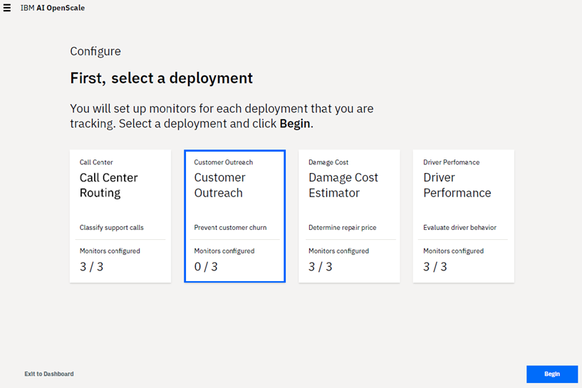
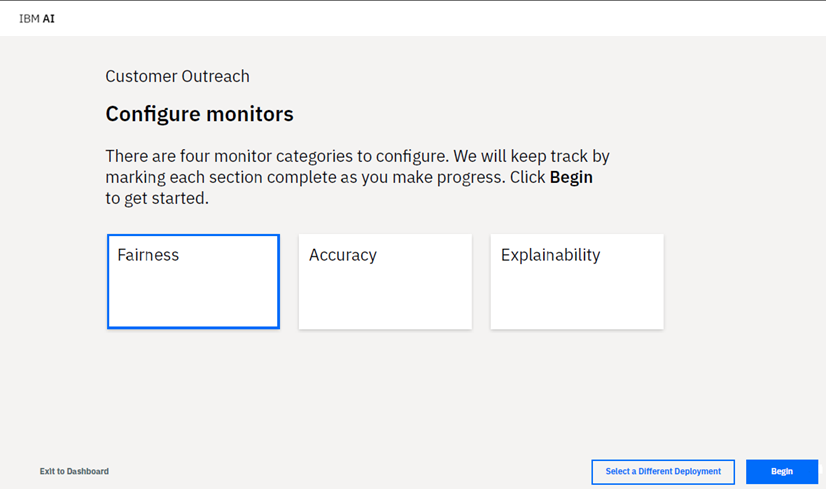

---

copyright:
  years: 2015, 2018
lastupdated: "2018-9-8"

---

{:shortdesc: .shortdesc}
{:new_window: target="_blank"}
{:tip: .tip}
{:pre: .pre}
{:codeblock: .codeblock}
{:screen: .screen}

# Configuring monitors for a deployment
{: #monitor-config}

Set up and enable monitors for each deployment that you are tracking with {{site.data.keyword.aios_short}}.
{: shortdesc}

## Monitoring categories
{: #monitor-types}

First, you must select a deployment.

**Note**: If there are multiple deployments for a given model, then when you configure one deployment, all other deployments for the same model also get configured.

  

Next, on the *Configure monitors* page, for each deployment that you selected, you must configure and enable how {{site.data.keyword.aios_short}} will monitor that deployment. You can configure all, some, or none of the monitors for a specific deployment.

There are three categories of monitoring available to each deployment:

  

- ***Fairness*** - Looks for biases in your deployed model. This allows you to then tune your model to ensure fair outcomes across different populations.

- ***Accuracy*** - Measures model accuracy. This helps identify when a model may need retraining to improve its outcomes.

- ***Explainability*** - Explains outcomes for individual transactions. Provides an understanding of the factors that influence an outcome.

### Next steps
{: #monitor-next}

To begin configuring monitors, select a category and click **Begin**.
