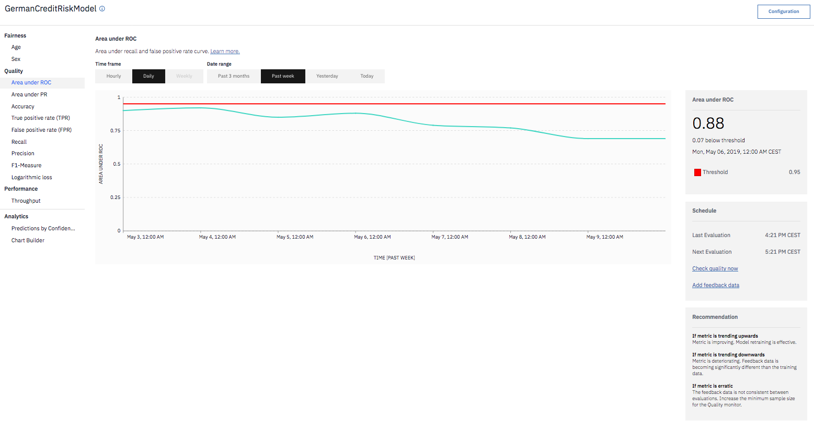

---

copyright:
  years: 2018, 2019
lastupdated: "2019-06-28"

keywords: metrics, monitoring, custom metrics, thresholds

subcollection: ai-openscale

---

{:shortdesc: .shortdesc}
{:new_window: target="_blank"}
{:tip: .tip}
{:important: .important}
{:note: .note}
{:pre: .pre}
{:codeblock: .codeblock}
{:screen: .screen}

# Metriken und Transaktionen analysieren 
{: #anlz_metrics}

{{site.data.keyword.aios_full}} bietet eine Vielzahl verschiedener Möglichkeiten zur Analyse von Metriken und Transaktionen.
{: shortdesc}

## Fairnessmetriken
{: #anlz_metrics_fairness}

Verwenden Sie die Fairnessüberwachung, um festzustellen, ob die von Ihrem Modell generierten Ergebnisse für eine überwachte Gruppe fair sind. Wenn die Fairnessüberwachung aktiviert ist, generiert sie standardmäßig jede Stunde eine Gruppe von Metriken. Sie können diese Metriken bedarfsgesteuert generieren, indem Sie auf die Schaltfläche **Qualität jetzt überprüfen** klicken oder indem Sie den Python-Client verwenden.

Fairnessmetriken werden auf der Basis der folgenden Informationen berechnet:

- Scoring-Nutzdaten

Für eine korrekte Überwachung muss jede Scoring-Anforderung auch in {{site.data.keyword.aios_short}} protokolliert werden. Die Protokollierung von Nutzdaten ist für {{site.data.keyword.pm_full}}-Engines automatisiert.

Bei anderen Machine Learning-Engines können die Nutzdaten entweder über den Python-Client oder über die REST-API bereitgestellt werden.

Bei Machine Learning-Engines, bei denen es sich nicht um {{site.data.keyword.pm_full}} handelt, werden durch die Fairnessüberwachung zusätzliche Scoring-Anforderung für die überwachte Bereitstellung erstellt.
{: note}

Alle Metrikwerte für einen bestimmten Zeitraum können im {{site.data.keyword.aios_short}}-Dashboard überwacht werden:

Sie können zugehörige Details überprüfen, z. B. günstige und ungünstige Ergebnisse:

Sie können Details zu Transaktionen anzeigen:

Sie können den empfohlenen verzerrungsbereinigten Scoring-Endpunkt anzeigen:

### Unterstützte Fairnessmetriken
{: #anlz_metrics_supfairmets}

Die folgenden Fairnessmetriken werden von {{site.data.keyword.aios_short}} unterstützt:

#### Fairness für eine Gruppe
{: #anlz_metrics_supfairmets_group}

- **Beschreibung**: Die Neigung des Modells, günstige Ergebnisse für eine Gruppe gegenüber einer anderen Gruppe zu liefern.
- **Standardschwellenwerte**: Unterer Grenzwert = 80 %
- **Standardempfehlung**: Der verzerrungsbereinigte Scoring-Endpunkt, den Sie in Ihrer Geschäftsanwendung verwenden können, um verzerrungsbereinigte Antworten vom bereitgestellten Modell zu erhalten.
- **Problemtyp**: Alle
- **Datentyp**: Strukturiert
- **Diagrammwerte**: Letzter Wert im Zeitrahmen
- **Verfügbare Metrikdetails**: Ja

### Unterstützte Fairnessdetails
{: #anlz_metrics_supfairdets}

Die folgenden Details für Fairnessmetriken werden von {{site.data.keyword.aios_short}} unterstützt:

- Prozentsätze der günstigen Ergebnisse für die einzelnen Gruppen
- Fairnessdurchschnittswerte für alle Fairnessgruppen

  Verhältnis der ungleichen Auswirkung = (% der günstigen Ergebnisse in der überwachten Gruppe) / (% der günstigen Ergebnisse in der Referenzgruppe)

- Verteilung der Daten für jede der überwachten Gruppen
- Verteilung der Nutzdaten

<!---
BTW, I propose to use screenshots with data from FastPath.
Source monitored group or referenced group
Source of bias is also in fairness metrics
--->

## Qualitätsmetriken
{: #anlz_metrics_quality}

Verwenden Sie die Qualitätsüberwachung, um zu ermitteln, wie gut die Ergebnisse von Ihrem Modell vorhergesagt werden. Wenn die Qualitätsüberwachung aktiviert ist, generiert sie standardmäßig jede Stunde eine Gruppe von Metriken. Sie können diese Metriken bedarfsgesteuert generieren, indem Sie auf die Schaltfläche **Qualität jetzt überprüfen** klicken oder indem Sie den Python-Client verwenden.

Qualitätsmetriken werden auf der Basis der folgenden Informationen berechnet:

- Manuell gekennzeichnete Rückmeldedaten
- Überwachte Bereitstellungsantworten für diese Daten

Für eine korrekte Überwachung müssen Rückmeldedaten regelmäßig in {{site.data.keyword.aios_short}} protokolliert werden. Die Rückmeldedaten können entweder über die Option "Rückmeldedaten hinzufügen" oder über den Python-Client bzw. die REST-API bereitgestellt werden.

Bei Machine Learning-Engines, bei denen es sich nicht um {{site.data.keyword.aios_short}} handelt, z. B. Microsoft Azure ML Studio oder Amazon Sagemaker ML, werden durch die Qualitätsüberwachung zusätzliche Scoring-Anforderungen für die überwachte Umgebung erstellt.
{: note}

Alle Metrikwerte für einen bestimmten Zeitraum können im {{site.data.keyword.aios_short}}-Dashboard überwacht werden:

Klicken Sie auf das Diagramm, um zugehörige Details, wie z. B. die Wahrheitsmatrix für die binäre Klassifikation und die Klassifikation mit mehreren Klassen, die für einige Metriken zur Verfügung stehen.

### Unterstützte Qualitätsmetriken
{: #anlz_metrics_supqualdets}

Die folgenden Qualitätsmetriken werden von {{site.data.keyword.aios_short}} unterstützt:

#### Fläche unterhalb der ROC-Kurve
{: #anlz_metrics_supqualdets_roc}

- **Beschreibung**: Die Fläche, die sich unterhalb der Recall-Kurve und der Kurve für die Falsch-positiv-Rate befindet.
- **Standardschwellenwerte**: Unterer Grenzwert = 80 %
- **Standardempfehlung**:
   - **Aufwärtstrend**: Ein Aufwärtstrend gibt eine Verbesserung der Metrik an. Dies bedeutet, dass das Retraining des Modells effektiv ist.
   - **Abwärtstrend**: Ein Abwärtstrend gibt eine Verschlechterung der Metrik an. Die Differenz zwischen den Rückmeldedaten und den Trainingsdaten vergrößert sich signifikant.
   - **Ungleichmäßige oder unregelmäßige Variation**: Eine ungleichmäßige oder unregelmäßige Variation weist darauf hin, dass die Rückmeldedaten zwischen den Bewertungen nicht konsistent sind. Erhöhen Sie den Mindeststichprobenumfang für die Qualitätsüberwachung.
- **Problemtyp**: Binäre Klassifikation
- **Diagrammwerte**: Letzter Wert im Zeitrahmen
- **Verfügbare Metrikdetails**: Wahrheitsmatrix

#### Fläche unterhalb der PR-Kurve
{: #anlz_metrics_supqualdets_pr}

- **Beschreibung**: Die Fläche, die sich unterhalb der PR-Kurve (PR = Precision Recall) befindet.
- **Standardschwellenwerte**: Unterer Grenzwert = 80 %
- **Standardempfehlung**:
   - **Aufwärtstrend**: Ein Aufwärtstrend gibt eine Verbesserung der Metrik an. Dies bedeutet, dass das Retraining des Modells effektiv ist.
   - **Abwärtstrend**: Ein Abwärtstrend gibt eine Verschlechterung der Metrik an. Die Differenz zwischen den Rückmeldedaten und den Trainingsdaten vergrößert sich signifikant.
   - **Ungleichmäßige oder unregelmäßige Variation**: Eine ungleichmäßige oder unregelmäßige Variation weist darauf hin, dass die Rückmeldedaten zwischen den Bewertungen nicht konsistent sind. Erhöhen Sie den Mindeststichprobenumfang für die Qualitätsüberwachung.
- **Problemtyp**: Binäre Klassifikation
- **Diagrammwerte**: Letzter Wert im Zeitrahmen
- **Verfügbare Metrikdetails**: Wahrheitsmatrix

#### Proportion der erklärten Varianz
{: #anlz_metrics_supqualdets_var}

- **Beschreibung**: Die Proportion der erklärten Varianz stellt das Verhältnis der erklärten Varianz zur Zielvarianz dar. Die erklärte Varianz gibt die Differenz zwischen der Zielvarianz und der Varianz eines Vorhersagefehlers an.
- **Standardschwellenwerte**: Unterer Grenzwert = 80 %
- **Standardempfehlung**:
   - **Aufwärtstrend**: Ein Aufwärtstrend gibt eine Verbesserung der Metrik an. Dies bedeutet, dass das Retraining des Modells effektiv ist.
   - **Abwärtstrend**: Ein Abwärtstrend gibt eine Verschlechterung der Metrik an. Die Differenz zwischen den Rückmeldedaten und den Trainingsdaten vergrößert sich signifikant.
   - **Ungleichmäßige oder unregelmäßige Variation**: Eine ungleichmäßige oder unregelmäßige Variation weist darauf hin, dass die Rückmeldedaten zwischen den Bewertungen nicht konsistent sind. Erhöhen Sie den Mindeststichprobenumfang für die Qualitätsüberwachung.
- **Problemtyp**: Regression
- **Diagrammwerte**: Letzter Wert im Zeitrahmen
- **Verfügbare Metrikdetails**: Keine

#### Mittlerer absoluter Fehler
{: #anlz_metrics_supqualdets_abserror}

- **Beschreibung**: Der Mittelwert der absoluten Differenz zwischen der Modellvorhersage und dem Zielwert.
- **Standardschwellenwerte**: Oberer Grenzwert = 80 %
- **Standardempfehlung**:
   - **Aufwärtstrend**: Ein Aufwärtstrend gibt eine Verschlechterung der Metrik an. Die Differenz zwischen den Rückmeldedaten und den Trainingsdaten vergrößert sich signifikant.
   - **Abwärtstrend**: Ein Abwärtstrend gibt eine Verbesserung der Metrik an. Dies bedeutet, dass das Retraining des Modells effektiv ist.
   - **Ungleichmäßige oder unregelmäßige Variation**: Eine ungleichmäßige oder unregelmäßige Variation weist darauf hin, dass die Rückmeldedaten zwischen den Bewertungen nicht konsistent sind. Erhöhen Sie den Mindeststichprobenumfang für die Qualitätsüberwachung.
- **Problemtyp**: Regression
- **Diagrammwerte**: Letzter Wert im Zeitrahmen
- **Verfügbare Metrikdetails**: Keine

#### Mittlerer quadratischer Fehler
{: #anlz_metrics_supqualdets_squerror}

- **Beschreibung**: Der Mittelwert der quadrierten Differenz zwischen der Modellvorhersage und dem Zielwert.
- **Standardschwellenwerte**: Oberer Grenzwert = 80 %
- **Standardempfehlung**:
   - **Aufwärtstrend**: Ein Aufwärtstrend gibt eine Verschlechterung der Metrik an. Die Differenz zwischen den Rückmeldedaten und den Trainingsdaten vergrößert sich signifikant.
   - **Abwärtstrend**: Ein Abwärtstrend gibt eine Verbesserung der Metrik an. Dies bedeutet, dass das Retraining des Modells effektiv ist.
   - **Ungleichmäßige oder unregelmäßige Variation**: Eine ungleichmäßige oder unregelmäßige Variation weist darauf hin, dass die Rückmeldedaten zwischen den Bewertungen nicht konsistent sind. Erhöhen Sie den Mindeststichprobenumfang für die Qualitätsüberwachung.
- **Problemtyp**: Regression
- **Diagrammwerte**: Letzter Wert im Zeitrahmen
- **Verfügbare Metrikdetails**: Keine

#### R im Quadrat
{: #anlz_metrics_supqualdets_r_squared}

- **Beschreibung**: Das Verhältnis der Differenz zwischen der Zielvarianz und der Varianz für einen Vorhersagefehler in Bezug zur Zielvarianz.
- **Standardschwellenwerte**: Unterer Grenzwert = 80 %
- **Standardempfehlung**:
   - **Aufwärtstrend**: Ein Aufwärtstrend gibt eine Verbesserung der Metrik an. Dies bedeutet, dass das Retraining des Modells effektiv ist.
   - **Abwärtstrend**: Ein Abwärtstrend gibt eine Verschlechterung der Metrik an. Die Differenz zwischen den Rückmeldedaten und den Trainingsdaten vergrößert sich signifikant.
   - **Ungleichmäßige oder unregelmäßige Variation**: Eine ungleichmäßige oder unregelmäßige Variation weist darauf hin, dass die Rückmeldedaten zwischen den Bewertungen nicht konsistent sind. Erhöhen Sie den Mindeststichprobenumfang für die Qualitätsüberwachung.
- **Problemtyp**: Regression
- **Diagrammwerte**: Letzter Wert im Zeitrahmen
- **Verfügbare Metrikdetails**: Keine

#### Wurzel für mittleren quadratischen Fehler
{: #anlz_metrics_supqualdets_squ_errors_mean}

- **Beschreibung**: Quadratwurzel des Mittelwerts der quadrierten Differenz zwischen der Modellvorhersage und dem Zielwert.
- **Standardschwellenwerte**: Oberer Grenzwert = 80 %
- **Standardempfehlung**:
   - **Aufwärtstrend**: Ein Aufwärtstrend gibt eine Verschlechterung der Metrik an. Die Differenz zwischen den Rückmeldedaten und den Trainingsdaten vergrößert sich signifikant.
   - **Abwärtstrend**: Ein Abwärtstrend gibt eine Verbesserung der Metrik an. Dies bedeutet, dass das Retraining des Modells effektiv ist.
   - **Ungleichmäßige oder unregelmäßige Variation**: Eine ungleichmäßige oder unregelmäßige Variation weist darauf hin, dass die Rückmeldedaten zwischen den Bewertungen nicht konsistent sind. Erhöhen Sie den Mindeststichprobenumfang für die Qualitätsüberwachung.
- **Problemtyp**: Regression
- **Diagrammwerte**: Letzter Wert im Zeitrahmen
- **Verfügbare Metrikdetails**: Keine

#### Genauigkeit
{: #anlz_metrics_supqualdets_acc}

- **Beschreibung**: Die Proportion der richtigen Vorhersagen.
- **Standardschwellenwerte**: Unterer Grenzwert = 80 %
- **Standardempfehlung**:
   - **Aufwärtstrend**: Ein Aufwärtstrend gibt eine Verbesserung der Metrik an. Dies bedeutet, dass das Retraining des Modells effektiv ist.
   - **Abwärtstrend**: Ein Abwärtstrend gibt eine Verschlechterung der Metrik an. Die Differenz zwischen den Rückmeldedaten und den Trainingsdaten vergrößert sich signifikant.
   - **Ungleichmäßige oder unregelmäßige Variation**: Eine ungleichmäßige oder unregelmäßige Variation weist darauf hin, dass die Rückmeldedaten zwischen den Bewertungen nicht konsistent sind. Erhöhen Sie den Mindeststichprobenumfang für die Qualitätsüberwachung.
- **Problemtypen**: Binäre Klassifikation und Klassifikation mit mehreren Klassen
- **Diagrammwerte**: Letzter Wert im Zeitrahmen
- **Verfügbare Metrikdetails**: Wahrheitsmatrix

#### Gewichtete Richtig-positiv-Rate (wTPR)
{: #anlz_metrics_supqualdets_wtpr}

- **Beschreibung**: Gewichteter Mittelwert der Klasse TPR mit Gewichtungen, die gleich der Klassenwahrscheinlichkeit sind.
- **Standardschwellenwerte**: Unterer Grenzwert = 80 %
- **Standardempfehlung**:
   - **Aufwärtstrend**: Ein Aufwärtstrend gibt eine Verbesserung der Metrik an. Dies bedeutet, dass das Retraining des Modells effektiv ist.
   - **Abwärtstrend**: Ein Abwärtstrend gibt eine Verschlechterung der Metrik an. Die Differenz zwischen den Rückmeldedaten und den Trainingsdaten vergrößert sich signifikant.
   - **Ungleichmäßige oder unregelmäßige Variation**: Eine ungleichmäßige oder unregelmäßige Variation weist darauf hin, dass die Rückmeldedaten zwischen den Bewertungen nicht konsistent sind. Erhöhen Sie den Mindeststichprobenumfang für die Qualitätsüberwachung.
- **Problemtyp**: Klassifikation mit mehreren Klassen
- **Diagrammwerte**: Letzter Wert im Zeitrahmen
- **Verfügbare Metrikdetails**: Wahrheitsmatrix

#### Richtig-positiv-Rate (TPR)
{: #anlz_metrics_supqualdets_tpr}

- **Beschreibung**: Anteil der richtigen Vorhersagen innerhalb der Vorhersagen in der positiven Klasse.
- **Standardschwellenwerte**: Unterer Grenzwert = 80 %
- **Standardempfehlung**:
   - **Aufwärtstrend**: Ein Aufwärtstrend gibt eine Verbesserung der Metrik an. Dies bedeutet, dass das Retraining des Modells effektiv ist.
   - **Abwärtstrend**: Ein Abwärtstrend gibt eine Verschlechterung der Metrik an. Die Differenz zwischen den Rückmeldedaten und den Trainingsdaten vergrößert sich signifikant.
   - **Ungleichmäßige oder unregelmäßige Variation**: Eine ungleichmäßige oder unregelmäßige Variation weist darauf hin, dass die Rückmeldedaten zwischen den Bewertungen nicht konsistent sind. Erhöhen Sie den Mindeststichprobenumfang für die Qualitätsüberwachung.
- **Problemtyp**: Binäre Klassifikation
- **Diagrammwerte**: Letzter Wert im Zeitrahmen
- **Verfügbare Metrikdetails**: Wahrheitsmatrix

#### Gewichtete Falsch-positiv-Rate (wFPR)
{: #anlz_metrics_supqualdets_wfpr_weighted}

- **Beschreibung**: Gewichteter Mittelwert der Klasse FPR mit Gewichtungen, die gleich der Klassenwahrscheinlichkeit sind.
- **Standardschwellenwerte**: Unterer Grenzwert = 80 %
- **Standardempfehlung**:
   - **Aufwärtstrend**: Ein Aufwärtstrend gibt eine Verbesserung der Metrik an. Dies bedeutet, dass das Retraining des Modells effektiv ist.
   - **Abwärtstrend**: Ein Abwärtstrend gibt eine Verschlechterung der Metrik an. Die Differenz zwischen den Rückmeldedaten und den Trainingsdaten vergrößert sich signifikant.
   - **Ungleichmäßige oder unregelmäßige Variation**: Eine ungleichmäßige oder unregelmäßige Variation weist darauf hin, dass die Rückmeldedaten zwischen den Bewertungen nicht konsistent sind. Erhöhen Sie den Mindeststichprobenumfang für die Qualitätsüberwachung.
- **Problemtyp**: Klassifikation mit mehreren Klassen
- **Diagrammwerte**: Letzter Wert im Zeitrahmen
- **Verfügbare Metrikdetails**: Wahrheitsmatrix

#### Falsch-positiv-Rate (FPR)
{: #anlz_metrics_supqualdets_fpr_false}

- **Beschreibung**: Anteil der falschen Vorhersagen innerhalb der positiven Klasse.
- **Standardschwellenwerte**: Unterer Grenzwert = 80 %
- **Standardempfehlung**:
   - **Aufwärtstrend**: Ein Aufwärtstrend gibt eine Verbesserung der Metrik an. Dies bedeutet, dass das Retraining des Modells effektiv ist.
   - **Abwärtstrend**: Ein Abwärtstrend gibt eine Verschlechterung der Metrik an. Die Differenz zwischen den Rückmeldedaten und den Trainingsdaten vergrößert sich signifikant.
   - **Ungleichmäßige oder unregelmäßige Variation**: Eine ungleichmäßige oder unregelmäßige Variation weist darauf hin, dass die Rückmeldedaten zwischen den Bewertungen nicht konsistent sind. Erhöhen Sie den Mindeststichprobenumfang für die Qualitätsüberwachung.
- **Problemtyp**: Binäre Klassifikation
- **Diagrammwerte**: Letzter Wert im Zeitrahmen
- **Verfügbare Metrikdetails**: Wahrheitsmatrix

#### Gewichtete Trefferquote
{: #anlz_metrics_supqualdets_weighted_recall}

- **Beschreibung**: Gewichteter Mittelwert der Trefferquote mit Gewichtungen, die gleich der Klassenwahrscheinlichkeit sind.
- **Standardschwellenwerte**: Unterer Grenzwert = 80 %
- **Standardempfehlung**:
   - **Aufwärtstrend**: Ein Aufwärtstrend gibt eine Verbesserung der Metrik an. Dies bedeutet, dass das Retraining des Modells effektiv ist.
   - **Abwärtstrend**: Ein Abwärtstrend gibt eine Verschlechterung der Metrik an. Die Differenz zwischen den Rückmeldedaten und den Trainingsdaten vergrößert sich signifikant.
   - **Ungleichmäßige oder unregelmäßige Variation**: Eine ungleichmäßige oder unregelmäßige Variation weist darauf hin, dass die Rückmeldedaten zwischen den Bewertungen nicht konsistent sind. Erhöhen Sie den Mindeststichprobenumfang für die Qualitätsüberwachung.
- **Problemtyp**: Klassifikation mit mehreren Klassen
- **Diagrammwerte**: Letzter Wert im Zeitrahmen
- **Verfügbare Metrikdetails**: Wahrheitsmatrix

#### Trefferquote
{: #anlz_metrics_supqualdets_recall}

- **Beschreibung**: Anteil der richtigen Vorhersagen innerhalb der positiven Klasse.
- **Standardschwellenwerte**: Unterer Grenzwert = 80 %
- **Standardempfehlung**:
   - **Aufwärtstrend**: Ein Aufwärtstrend gibt eine Verbesserung der Metrik an. Dies bedeutet, dass das Retraining des Modells effektiv ist.
   - **Abwärtstrend**: Ein Abwärtstrend gibt eine Verschlechterung der Metrik an. Die Differenz zwischen den Rückmeldedaten und den Trainingsdaten vergrößert sich signifikant.
   - **Ungleichmäßige oder unregelmäßige Variation**: Eine ungleichmäßige oder unregelmäßige Variation weist darauf hin, dass die Rückmeldedaten zwischen den Bewertungen nicht konsistent sind. Erhöhen Sie den Mindeststichprobenumfang für die Qualitätsüberwachung.
- **Problemtyp**: Binäre Klassifikation
- **Diagrammwerte**: Letzter Wert im Zeitrahmen
- **Verfügbare Metrikdetails**: Wahrheitsmatrix

#### Gewichtete Genauigkeit
{: #anlz_metrics_supqualdets_wgth_prec}

- **Beschreibung**: Gewichteter Mittelwert der Genauigkeit mit Gewichtungen, die gleich der Klassenwahrscheinlichkeit sind.
- **Standardschwellenwerte**: Unterer Grenzwert = 80 %
- **Standardempfehlung**:
   - **Aufwärtstrend**: Ein Aufwärtstrend gibt eine Verbesserung der Metrik an. Dies bedeutet, dass das Retraining des Modells effektiv ist.
   - **Abwärtstrend**: Ein Abwärtstrend gibt eine Verschlechterung der Metrik an. Die Differenz zwischen den Rückmeldedaten und den Trainingsdaten vergrößert sich signifikant.
   - **Ungleichmäßige oder unregelmäßige Variation**: Eine ungleichmäßige oder unregelmäßige Variation weist darauf hin, dass die Rückmeldedaten zwischen den Bewertungen nicht konsistent sind. Erhöhen Sie den Mindeststichprobenumfang für die Qualitätsüberwachung.
- **Problemtyp**: Klassifikation mit mehreren Klassen
- **Diagrammwerte**: Letzter Wert im Zeitrahmen
- **Verfügbare Metrikdetails**: Wahrheitsmatrix

#### Genauigkeit
{: #anlz_metrics_supqualdets_precision}

- **Beschreibung**: Anteil der richtigen Vorhersagen innerhalb der Vorhersagen in der positiven Klasse.
- **Standardschwellenwerte**: Unterer Grenzwert = 80 %
- **Standardempfehlung**:
   - **Aufwärtstrend**: Ein Aufwärtstrend gibt eine Verbesserung der Metrik an. Dies bedeutet, dass das Retraining des Modells effektiv ist.
   - **Abwärtstrend**: Ein Abwärtstrend gibt eine Verschlechterung der Metrik an. Die Differenz zwischen den Rückmeldedaten und den Trainingsdaten vergrößert sich signifikant.
   - **Ungleichmäßige oder unregelmäßige Variation**: Eine ungleichmäßige oder unregelmäßige Variation weist darauf hin, dass die Rückmeldedaten zwischen den Bewertungen nicht konsistent sind. Erhöhen Sie den Mindeststichprobenumfang für die Qualitätsüberwachung.
- **Problemtyp**: Binäre Klassifikation
- **Diagrammwerte**: Letzter Wert im Zeitrahmen
- **Verfügbare Metrikdetails**: Wahrheitsmatrix

#### Gewichtetes F1-Maß
{: #anlz_metrics_supqualdets_wght_f1-measure}

- **Beschreibung**: Gewichteter Mittelwert des F1-Maßes mit Gewichtungen, die gleich der Klassenwahrscheinlichkeit sind.
- **Standardschwellenwerte**: Unterer Grenzwert = 80 %
- **Standardempfehlung**:
   - **Aufwärtstrend**: Ein Aufwärtstrend gibt eine Verbesserung der Metrik an. Dies bedeutet, dass das Retraining des Modells effektiv ist.
   - **Abwärtstrend**: Ein Abwärtstrend gibt eine Verschlechterung der Metrik an. Die Differenz zwischen den Rückmeldedaten und den Trainingsdaten vergrößert sich signifikant.
   - **Ungleichmäßige oder unregelmäßige Variation**: Eine ungleichmäßige oder unregelmäßige Variation weist darauf hin, dass die Rückmeldedaten zwischen den Bewertungen nicht konsistent sind. Erhöhen Sie den Mindeststichprobenumfang für die Qualitätsüberwachung.
- **Problemtyp**: Klassifikation mit mehreren Klassen
- **Diagrammwerte**: Letzter Wert im Zeitrahmen
- **Verfügbare Metrikdetails**: Wahrheitsmatrix

#### F1-Maß
{: #anlz_metrics_supqualdets_f1-measr}

- **Beschreibung**: Harmonisches Mittel zwischen Genauigkeit und Trefferquote.
- **Standardschwellenwerte**: Unterer Grenzwert = 80 %
- **Standardempfehlung**:
   - **Aufwärtstrend**: Ein Aufwärtstrend gibt eine Verbesserung der Metrik an. Dies bedeutet, dass das Retraining des Modells effektiv ist.
   - **Abwärtstrend**: Ein Abwärtstrend gibt eine Verschlechterung der Metrik an. Die Differenz zwischen den Rückmeldedaten und den Trainingsdaten vergrößert sich signifikant.
   - **Ungleichmäßige oder unregelmäßige Variation**: Eine ungleichmäßige oder unregelmäßige Variation weist darauf hin, dass die Rückmeldedaten zwischen den Bewertungen nicht konsistent sind. Erhöhen Sie den Mindeststichprobenumfang für die Qualitätsüberwachung.
- **Problemtyp**: Binäre Klassifikation
- **Diagrammwerte**: Letzter Wert im Zeitrahmen
- **Verfügbare Metrikdetails**: Wahrheitsmatrix

#### Logarithmischer Verlust
{: #anlz_metrics_supqualdets_log_loss}

- **Beschreibung**: Mittelwert der Zielklassenwahrscheinlichkeit (Konfidenz) der Logarithmen. Wird auch als erwartete Log-Likelihood bezeichnet.
- **Standardschwellenwerte**: Unterer Grenzwert = 80 %
- **Standardempfehlung**:
   - **Aufwärtstrend**: Ein Aufwärtstrend gibt eine Verbesserung der Metrik an. Dies bedeutet, dass das Retraining des Modells effektiv ist.
   - **Abwärtstrend**: Ein Abwärtstrend gibt eine Verschlechterung der Metrik an. Die Differenz zwischen den Rückmeldedaten und den Trainingsdaten vergrößert sich signifikant.
   - **Ungleichmäßige oder unregelmäßige Variation**: Eine ungleichmäßige oder unregelmäßige Variation weist darauf hin, dass die Rückmeldedaten zwischen den Bewertungen nicht konsistent sind. Erhöhen Sie den Mindeststichprobenumfang für die Qualitätsüberwachung.
- **Problemtypen**: Binäre Klassifikation und Klassifikation mit mehreren Klassen
- **Diagrammwerte**: Letzter Wert im Zeitrahmen
- **Verfügbare Metrikdetails**: Keine

### Unterstützte Qualitätsdetails
{: #anlz_metrics_supqualdets_suppr_dets}

Die folgenden Details für Qualitätsmetriken werden von {{site.data.keyword.aios_short}} unterstützt:

#### Wahrheitsmatrix
{: #anlz_metrics_supqualdets_confusion}

Mithilfe der Wahrheitsmatrix können Sie analysieren, für welche der Rückmeldedaten die Antwort der überwachten Bereitstellung korrekt ist und für welche nicht.

## Leistungsmetriken
{: #anlz_metrics_performance}

Mithilfe der Leistungsüberwachung können Sie die Geschwindigkeit ermitteln, mit der Datensätze in Ihrer Bereitstellung verarbeitet werden. Die Leistungsüberwachung wird bei der Auswahl der Bereitstellung aktiviert, die mithilfe von {{site.data.keyword.aios_short}} verfolgt und überwacht werden soll.

Leistungsmetriken werden auf der Basis der folgenden Informationen berechnet:

- Scoring-Nutzdaten

Für eine korrekte Überwachung muss jede Scoring-Anforderung auch in {{site.data.keyword.aios_short}} protokolliert werden. Die Protokollierung von Nutzdaten ist für {{site.data.keyword.pm_full}}-Engines automatisiert. Bei anderen Machine Learning-Engines können die Nutzdaten entweder über den Python-Client oder über die REST-API bereitgestellt werden. Bei der Leistungsüberwachung werden keine zusätzlichen Scoring-Anforderungen für die überwachte Bereitstellung erstellt.

Leistungsmetrikwerte für einen bestimmten Zeitraum können im {{site.data.keyword.aios_short}}-Dashboard überwacht werden:

### Unterstützte Leistungsmetriken
{: #anlz_metrics_performance_supp_quality_mets}

Die folgenden Leistungsmetriken werden von {{site.data.keyword.aios_short}} unterstützt:

#### Durchsatz
{: #anlz_metrics_performance_supp_quality_mets_through}

- **Beschreibung**: Durchschnittliche Anzahl von Scoring-Anforderungen pro Minute in einem bestimmten Zeitrahmen.
- **Standardschwellenwerte**: Nicht zutreffend
- **Standardempfehlung**: Nicht zutreffend
- **Problemtyp**: Alle
- **Diagrammwerte**: Durchschnittswert im Zeitrahmen
- **Verfügbare Metrikdetails**: Keine

## Nutzdatenanalyse
{: #anlz_metrics_payload}

Sie können die an Ihre Bereitstellung gesendeten Scoring-Nutzdaten im ausgewählten Datenbereich analysieren, indem Sie eine der folgenden Methoden verwenden:

- Überprüfung von Vorhersageklassen und Konfidenzverteilung in den einzelnen Klassen
   
   
   
- Angepasstes Diagramm (Auswahl zwischen Merkmalen, Vorhersageklassen und Konfidenz)
   
   

