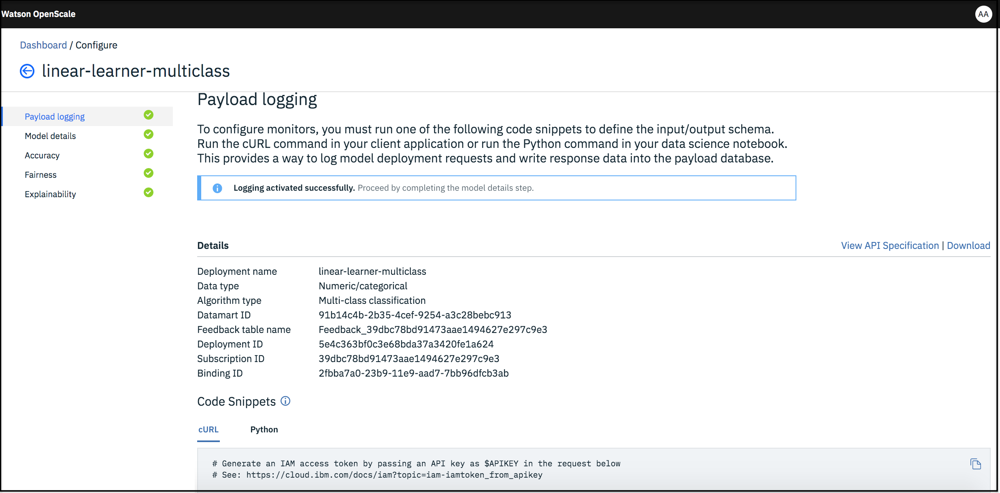

---

copyright:
  years: 2018, 2019
lastupdated: "2019-05-29"

keywords: databases, connections, scoring, requests

subcollection: ai-openscale

---

{:shortdesc: .shortdesc}
{:new_window: target="_blank"}
{:tip: .tip}
{:important: .important}
{:note: .note}
{:pre: .pre}
{:codeblock: .codeblock}
{:screen: .screen}

# Datenbank angeben
{: #connect-db}

Geben Sie eine Datenbank an, die von Ihrer {{site.data.keyword.aios_short}}-Instanz verwendet werden soll.
{: shortdesc}

## Verbindung zu Ihrer Datenbank herstellen
{: #cdb-connect}

{{site.data.keyword.aios_short}} verwendet eine Datenbank zum Speichern von Nutzdateninformationen, Feedbackdaten und Messdaten. Sie können nicht nur eine Datenbank auswählen, sondern bei Bedarf auch ein Schema für die ausgewählte Datenbank. Ein Schema ist eine benannte Sammlung (Gruppe) von Tabellen in der Datenbank.

1.  Wählen Sie eine Datenbank aus. Dabei stehen die folgenden beiden Optionen zur Auswahl: die kostenlose Datenbank oder eine vorhandene oder neue Datenbank.

    

    Wenn Sie über ein gebührenpflichtiges {{site.data.keyword.cloud_notm}}-Konto verfügen, können Sie einen Service vom Typ `Databases for PostgreSQL` oder einen `Db2 Warehouse`-Service einrichten, um die Vorteile der Integration mit Watson Studio und Services für kontinuierliches Lernen optimal zu nutzen. Wenn Sie sich gegen die Einrichtung eines gebührenpflichtigen Service entscheiden, können Sie zwar den kostenlosen internen PostgreSQL-Speicher mit {{site.data.keyword.aios_short}} verwenden, aber Sie können kein kontinuierliches Lernen für Ihr Modell konfigurieren.
    {: note}

### Datenbank des kostenlosen Lite-Plans
{: #cdb-lite}

**HINWEIS**: Für die kostenlose Datenbank gelten einige wichtige Einschränkungen:

- Die kostenlose Datenbank wird gehostet und ist für Sie nicht direkt zugänglich.
- {{site.data.keyword.aios_full}} hat uneingeschränkten Zugriff auf Ihre Datenbank und damit auch uneingeschränkten Zugriff auf Ihre Daten.
- Die kostenlose Datenbank ist nicht DSGVO-konform. Wenn von Ihrem Modell personenbezogene Angaben verarbeitet werden, dürfen Sie die kostenlose Datenbank nicht verwenden. In diesem Fall müssen Sie eine neue Datenbank erwerben oder eine bestehende Datenbank verwenden, den Regeln der DSGVO entspricht. Näheres zu diesem Thema enthält der Abschnitt [Informationssicherheit](/docs/services/ai-openscale?topic=ai-openscale-is-ov).

Wenn Sie mit der Verwendung der kostenlosen Datenbank fortfahren möchten, klicken Sie auf die Kachel zur **Nutzung der kostenlosen Datenbank, die von {{site.data.keyword.aios_short}} gehostet wird**, überprüfen Sie anschließend die Übersichtsdaten und klicken Sie auf **Speichern**.

  
  
Sie können für die kostenlose Datenbank ein Upgrade auf eine andere Datenbank durchführen. Es ist jedoch nicht möglich, eine Compose for Postgres-, Database for Postgres- oder Db2-Instanz für die kostenlose Datenbank zu konfigurieren. Es ist nicht möglich, nach dem Upgrade zur Verwendung der kostenlosen Datenbank zurückzukehren. Alle aktuellen Daten, wie z. B. die Konfiguration, die Scoring-Ergebnisse und die Erklärungen, können nicht wiederverwendet werden. Wenn Sie ein anderes Schema oder eine andere Datenbank auswählen, wird die {{site.data.keyword.aios_short}}-Umgebung vollständig zurückgesetzt.

### Vorhandene oder neue Datenbank
{: #cdb-exn}

1.  Nachdem Sie die Option 'Vorhandene Datenbank verwenden oder neue Datenbank kaufen' ausgewählt haben, überprüft {{site.data.keyword.aios_short}} Ihr {{site.data.keyword.Bluemix_notm}}-Konto auf bereits vorhandene Datenbanken.

1.  Wählen Sie zunächst den Typ Ihrer vorhandenen Datenbank (Compose for Postgres, Database for Postgres oder Db2) aus und wählen Sie dann im Dropdown-Menü **Datenbank** eine Datenbank und anschließend ein **Schema** aus:

    {{site.data.keyword.aios_short}} verwendet eine PostgreSQL- oder Db2-Datenbank zum Speichern modellbezogener Daten (Rückmeldedaten, Scoring-Nutzdaten) und berechneter Metriken. Lite-Pläne mit Db2 werden gegenwärtig nicht unterstützt. Weitere Informationen zu Trainingsdaten finden Sie in [Warum benötigt {{site.data.keyword.aios_short}} Zugriff auf meine Trainingsdaten?](/docs/services/ai-openscale?topic=ai-openscale-trainingdata#trainingdata)
    {: note}

    

1.  Sie können auch auf **Anderen Standort auswählen** auswählen, um eine Speicherposition der Datenbank außerhalb Ihres {{site.data.keyword.Bluemix_notm}}-Kontos anzugeben.

    {{site.data.keyword.aios_short}} verwendet eine PostgreSQL- oder Db2-Datenbank zum Speichern modellbezogener Daten (Rückmeldedaten, Scoring-Nutzdaten) und berechneter Metriken. Lite-Pläne mit Db2 werden gegenwärtig nicht unterstützt.
    {: note}

    - Wählen Sie den **Datenbanktyp** aus (`Compose for PostgreSQL`, `Database for PostgreSQL` oder `Db2`) und geben Sie dann die Verbindungsinformationen an:

        - Wenn Sie eine `Compose for PostgreSQL`-Datenbank verwenden, stellen Sie die entsprechenden Angaben für die folgenden Felder bereit:

            - Hostname oder IP-Adresse
            - Port
            - Datenbank (Name)
            - Benutzername
            - Kennwort

            

        - Wenn Sie eine `Database for PostgreSQL`-Datenbank verwenden, stellen Sie die entsprechenden Angaben für die folgenden Felder bereit:

            - Hostname oder IP-Adresse
            - SSL-Port
            - Zertifikat mit Base64-Codierung
            - Datenbank (Name)
            - Benutzername
            - Kennwort

            

        - Wenn Sie eine `Db2`-Datenbank verwenden, stellen Sie die entsprechenden Angaben für die folgenden Felder bereit:

            - Hostname oder IP-Adresse
            - SSL-Port
            - Datenbank (Name)
            - Benutzername
            - Kennwort

            

    - Nach erfolgreicher Verbindungsherstellung können Sie ein Schema auswählen.

      Der Schemaname muss explizit angegeben werden, wenn Sie eine Db2-Instanz mit eingeschränktem Zugriff bereitstellen, denn in diesem Fall ist die automatische Generierung des Schemanamens nicht möglich. Dies betrifft den Db2 Warehouse-Einstiegsplan.
      {: important}

      

1.  Klicken Sie auf **Weiter**, überprüfen Sie die Zusammenfassung der Angaben und klicken Sie dann auf **Speichern**.

## Scoring-Anforderung senden
{: #cdb-score}

Zum Konfigurieren von Überwachungsprogrammen erfordert {{site.data.keyword.aios_short}}, dass Sie eine Scoring-Anforderung senden, um mit der Protokollierung der Daten zu beginnen, die künftig überwacht werden.

Für Modelle, die in Watson Machine Learning bereitgestellt sind, führt {{site.data.keyword.aios_short}} automatisch ein Scoring durch.
{: note:}

Wählen Sie eine Bereitstellung aus, in diesem Fall 'Fraud Detector' (Betrugserkennung), und verwenden Sie dann die bereitgestellten `cURL`- oder `Python`-Code-Snippets zum Protokollieren von Daten zu den Modellbereitstellungsanforderungen und Antwortdaten. Weitere Informationen enthält der Abschnitt [Nutzdatenprotokollierung für andere Serviceinstanzen als die Watson Machine Learning-Serviceinstanz](/docs/services/ai-openscale?topic=ai-openscale-cml-connect).

Die Felder und Werte in den Code-Snippets müssen durch die tatsächlichen Werte ersetzt werden, da es sich bei den angegebenen Werten lediglich um Beispiele handelt.
{: important}

Nachdem Sie Ihre Nutzdatenprotokollierung ausgeführt haben, wird für die ausgewählte Bereitstellung in der Spalte 'Bereit zur Überwachung' ein Häkchen angezeigt. Klicken Sie zum Fortfahren auf **Überwachungen konfigurieren**.

## Weitere Schritte
{: #cdb-next}

{{site.data.keyword.aios_short}} ist jetzt so eingerichtet, dass Sie [Überwachungen für die Bereitstellungen konfigurieren](/docs/services/ai-openscale?topic=ai-openscale-mo-config) können.
