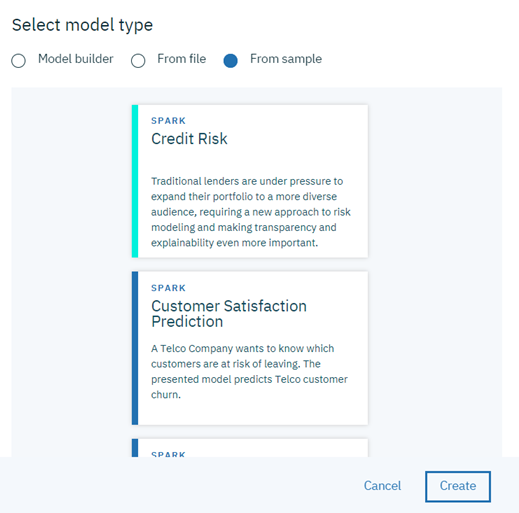
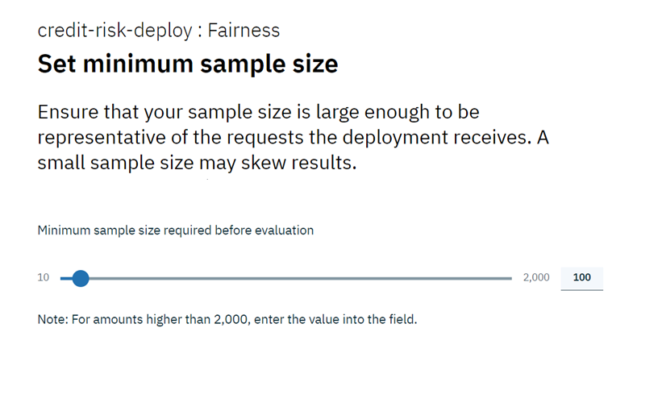

---

title: Trust and transparency for your machine learning models with {{site.data.keyword.aios_short}}
description: Monitor your machine learning deployments for bias, accuracy, and explainability
duration: 120
intro: In this tutorial, you will provision IBM Cloud machine learning and data services, create and deploy machine learning models in Watson studio, and configure the new IBM {{site.data.keyword.aios_full}} product to monitor your models for trust and transparency.
takeaways:
- See how {{site.data.keyword.aios_short}} provides trust and transparency for AI models
- Understand how IBM Cloud services and Watson Studio technologies can provide a seamless, AI-driven customer experience

copyright:
  years: 2018, 2019
lastupdated: "2019-06-28"

keywords: ai, getting started, tutorial, understanding, video

subcollection: ai-openscale

---

{:shortdesc: .shortdesc}
{:new_window: target="_blank"}
{:hide-dashboard: .hide-dashboard}
{:tip: .tip}
{:important: .important}
{:note: .note}
{:pre: .pre}
{:codeblock: .codeblock}
{:screen: .screen}
{:javascript: .ph data-hd-programlang='javascript'}
{:java: .ph data-hd-programlang='java'}
{:python: .ph data-hd-programlang='python'}
{:swift: .ph data-hd-programlang='swift'}

# Erste Schritte - Lernprogramm (Grundlagen)
{: #gettingstarted}

{{site.data.keyword.aios_full}} ermöglicht Unternehmen die Automatisierung und Operationalisierung des AI-Lebenszyklus in Geschäftsanwendungen und stellt dabei sicher, dass AI-Modelle verzerrungsfrei sind, ohne großen Aufwand erklärt und von Geschäftsanwendern verstanden werden können und in Geschäftstransaktionen überprüfbar sind. {{site.data.keyword.aios_short}} unterstützt AI-Modelle, die in den Tools und Modell-Server-Frameworks Ihrer Wahl erstellt und ausgeführt werden.
{: shortdesc}

## Überblick
{: #gs-view-demo}

Mit dem folgenden Video können Sie sich einen schnellen Überblick über {{site.data.keyword.aios_short}} verschaffen.

  

    <iframe class="embed-responsive-item" id="youtubeplayer" title="Vertrauen und Transparenz in AI" type="text/html" width="640" height="390" src="https://www.youtube.com/embed/6Ei8rPVtCf8" frameborder="0" webkitallowfullscreen mozallowfullscreen allowfullscreen> </iframe>
  

## Anwendungsfall von {{site.data.keyword.aios_short}}
{: #gs-use}

Konventionelle Kreditgeber stehen unter dem Druck, ihr digitales Portfolio an Finanzdienstleistungen auf ein umfangreicheres und vielfältigeres Publikum auszuweiten, was einen neuen Ansatz bei der Kreditrisikomodellierung erfordert. Ihre Data-Science-Teams stützen sich derzeit auf Standardmodellierungstechniken wie Entscheidungsstrukturen und logistische Regression, die für moderate Datensätze gut funktionieren und Empfehlungen generieren, die leicht zu erklären sind. Damit wird den gesetzlichen Bestimmungen, dass Kreditentscheidungen transparent und nachvollziehbar sein müssen, Rechnung getragen.

Um einem breiteren Bevölkerungsanteil mit höherem Risiko Zugang zu Krediten zu ermöglichen, müssen die Bonitätsgeschichten (Kredithistorien) von Antragstellern über die herkömmlichen Kredite wie Hypotheken und KFZ-Darlehen hinausgehen und alternative Kreditquellen wie das Zahlungsverhalten gegenüber Versorgungsunternehmen und Preisplänen bei Mobilfunkanbietern sowie Bildungs- und Berufsbezeichnungen erschließen. Diese neuen Datenquellen bieten nicht nur vielversprechende Perspektiven, sondern bringen auch Risiken mit sich, indem sie die Wahrscheinlichkeit unerwarteter Korrelationen erhöhen, die aufgrund von Alter, Geschlecht oder anderen persönlichen Merkmalen eines Antragstellers Verzerrungen verursachen.

Die für diese verschiedenartigen Datasets am besten geeigneten Data-Science-Techniken, wie etwa gradientengetriebene Baumstrukturen und neuronale Netze, können zwar hochpräzise Risikomodelle generieren, allerdings zu einem entsprechenden Preis. Derartige 'Blackbox'-Modelle generieren undurchsichtige Vorhersagen, die irgendwie transparent gemacht werden müssen, um die behördliche Genehmigung sicherzustellen, wie beispielsweise durch Artikel 22 der Datenschutz-Grundverordnung (DSGVO) oder den Fair Credit Reporting Act (FCRA), das vom Bureau of Consumer Financial Protection (BCFP) verwaltet wird.

Das in diesem Lernprogramm bereitgestellte Kreditrisikomodell verwendet ein Trainingsdataset, das 20 Attribute zu jedem Kreditantragsteller enthält. Zwei dieser Attribute - Alter und Geschlecht - können auf Verzerrungen getestet werden. In diesem Lernprogramm steht die Verzerrung bei Geschlecht und Alter im Fokus. Weitere Informationen zu den Trainingsdaten finden Sie unter [Warum muss {{site.data.keyword.aios_short}} auf meine Trainingsdaten zugreifen?](/docs/services/ai-openscale?topic=ai-openscale-trainingdata#trainingdata)

{{site.data.keyword.aios_short}} überwacht, welche Neigung zu einem günstigen Ergebnis ('Kein Risiko') das bereitgestellte Modell bei einer Gruppe (der Referenzgruppe) gegenüber einer anderen Gruppe (d. h. der überwachten Gruppe) aufweist. In diesem Lernprogramm ist die auf Geschlecht überwachte Gruppe `Weiblich` und die auf Alter überwachte Gruppe besteht aus Antragstellern im Alter von `19 bis 25` Jahren.

<!---
### How {{site.data.keyword.aios_short}} can help
{: #gs-how}

- *Identify run-time bias in the model*: The company has established evidence that shows the key factors that should influence which drug is predicted are BP, CHOLESTEROL, K and NA. AGE and SEX do play a role, but they're not as significant when compared to the other indicators. The company suspects that the data coming from patient trials might have suffered from biases of the practitioners for prescribing medications based on SEX and BP. The company wants to constantly monitor for such biases being learned from the data, and flag a suspected bias.

- *Constantly validate the accuracy of the model*: The company routinely evaluates the model prediction by having experts provide their own drug recommendations based on the patient data. The goal is to integrate these manual evaluations as feedback, to tell the model in real time where it might be wrong, and improve it over time.

- *Make the model more trustworthy*: To achieve a successful adoption of its AI assistant, the company received feedback from its customer base of medical practitioners and doctors who said they would not trust the AI model recommendations without understanding the logic behind them.

Each of these issues will be addressed in this tutorial, through the use of {{site.data.keyword.aios_short}}:

- The Fairness monitor will flag SEX and BP biases the model may have
- The Accuracy monitor uses feedback generated by your experts to test the performance of the deployed model, to detect model drift
--->

## Setup options
{: #gs-module}

There are several setup options, depending on your preference and level of expertise.

- [The automated setup](/docs/services/ai-openscale?topic=ai-openscale-wos-fast-start) guides you through the process by performing tasks for you in the background.

   Use of a tour means that you can watch and click through to the next part of the tour.
   
- [The following getting started tutorial](/docs/services/ai-openscale?topic=ai-openscale-gs-obj#gs-obj) lets you take control with an easy-to-follow script.

   Use the interface to perform common tasks with a sample model and injected data.
   
- [The advanced tutorial](/docs/services/ai-openscale?topic=ai-openscale-crt-ov) enables more technical users to install a Python module that automates the provisioning and configuration of prerequisite services. This advanced tutorial is for data scientists or users who are comfortable with coding, Python and Notebooks. It's an example of how the {{site.data.keyword.aios_short}} client can be used to perform functionality programatically. The notebook that is used in this tutorial results in the same place as following the [automated setup](/docs/services/ai-openscale?topic=ai-openscale-wos-fast-start).

   This module requires that Python 3 is installed, which includes the pip package management system. For instructions, see, [Installing a Python module to set up {{site.data.keyword.aios_short}}](/docs/services/ai-openscale?topic=ai-openscale-as-module).

Links zu zusätzlichen Lernprogrammen finden Sie im Abschnitt [Zusätzliche Ressourcen](/docs/services/ai-openscale?topic=ai-openscale-arsc-ov). 

## Ziele des Lernprogramms
{: #gs-obj}

In diesem Lernprogramm werden die folgenden Aspekte behandelt: 

- Bereitstellen der Machine Learning- und Speicherservices von {{site.data.keyword.Bluemix_notm}}
- Einrichten eines Watson Studio-Projekts und Erstellen, Trainieren und Bereitstellen eines Machine Learning-Modells
- Konfigurieren und Erkunden der Vertrauenswürdigkeit, Transparenz und Erklärbarkeit für Ihr Modell

## Vorausgesetzte {{site.data.keyword.Bluemix_notm}}-Services bereitstellen
{: #gs-prps}

Zusätzlich zu {{site.data.keyword.aios_short}} benötigen Sie die nachfolgend aufgeführten Konten und Services, um dieses Lernprogramm auszuführen. 

<!---

For the {{site.data.keyword.composeForPostgreSQL}} service, a **paid** Standard plan is needed. A $200 {{site.data.keyword.Bluemix_notm}} credit can be obtained by converting to a paid account with a credit card. If you already have a paid account, you will receive a one-time $16 refund of the cost for your first GB of storage, for one month.
{: tip}

--->

**Wichtig**: Zur Leistungsoptimierung wird empfohlen, die vorausgesetzten Services in derselben Region zu erstellen wie {{site.data.keyword.aios_short}}. Informationen zu verfügbaren Standorten für {{site.data.keyword.aios_short}} finden Sie in [Serviceverfügbarkeit](/docs/resources?topic=resources-services_region). 

1.  Melden Sie sich bei Ihrem [{{site.data.keyword.Bluemix_notm}}-Konto ](https://{DomainName}){: new_window} mit Ihrer {{site.data.keyword.ibmid}} an. 
1.  Erstellen Sie für jeden der folgenden Services, der Ihrem Konto noch nicht zugeordnet ist, eine Instanz. Klicken Sie hierzu auf den Link, legen Sie einen Namen für den Service fest wählen Sie den (kostenlosen) **Lite**-Plan aus und klicken Sie auf die Schaltfläche **Erstellen**: 

    - [Watson Studio ](https://{DomainName}/catalog/services/watson-studio){: new_window}

      

    - [Watson Machine Learning ](https://{DomainName}/catalog/services/machine-learning){: new_window}

      

    - [Object Storage ](https://{DomainName}/catalog/services/cloud-object-storage){: new_window}

      

<!---

### Db2 Warehouse-Service bereitstellen
{: #gs-provdb2}

- [Stellen Sie einen Db2 Warehouse-Service bereit ](https://{DomainName}/catalog/services/db2-warehouse){: new_window}, falls Ihrem Konto nicht bereits ein solcher Service zugeordnet ist: 

  

- Legen Sie einen Namen für den Service fest, wählen Sie den Einstiegsplan aus und klicken Sie auf die Schaltfläche **Erstellen**. 

### Trainingsdaten in Db2 Warehouse hochladen
{: #gs-traindb2}

- Download the [drug_train_data_updated.csv ](https://raw.githubusercontent.com/watson-developer-cloud/doc-tutorial-downloads/master/ai-openscale/drug_train_data_updated.csv) file. Be sure to save the file download as a .CSV file.

- Open your existing (or newly-created) Db2 Warehouse from the [IBM Cloud console ](https://{DomainName}){: new_window}, click **Manage** from the left side panel, and then click the **Open** button.

- If necessary, use your Db2 credentials `username` and `password` to log in to Db2 Warehouse.

- Once Db2 Warehouse has opened, click the **Menu** button and select **Load** from the menu:

  

- Navigieren Sie zu der Datei mit den Trainingsdaten oder ziehen Sie sie in den entsprechenden Bereich im Formular und legen Sie sie dort ab. Klicken Sie auf **Weiter**. Wählen Siu in der Liste der Ladeziele ein Schema aus. Dieses Schema weist in der Regel ein Format wie 'DASH12345' auf. Klicken Sie dann auf der rechten Seite auf **Neue 'Tabelle**:

  

- Geben Sie Ihrer Tabelle den Namen 'HEART\_DRUG\_TRAINING' und klicken Sie auf die Schaltfläche **Erstellen**:

  

- Klicken Sie auf **Weiter**, um eine Vorschau der Daten anzuzeigen. Legen Sie in der Anzeige für die Vorschau für das Feld **Trennzeichen** das Semikolon (;) fest und stellen Sie sicher, dass die Option **Header in erster Zeile** ausgewählt ist:

  

- Die Trainingsdaten müssten nun ordnungsgemäß in Spalten angezeigt werden. Klicken Sie zum Fortfahren auf **Weiter** und klicken Sie dann auf **Mit dem Laden beginnen**, um die Daten zu laden.

--->

## Watson Studio-Projekt einrichten
{: #gs-setup}

1.  Melden Sie sich bei Ihrem [Watson Studio-Konto ](https://dataplatform.ibm.com/){: new_window} an und beginnen Sie mit der Erstellung eines neuen Projekts. Wählen Sie **Projekt erstellen** aus.

    

1.  Wählen Sie die Kachel **Standard** aus.

    

1.  Geben Sie Ihrem Projekt einen Namen und eine Beschreibung, stellen Sie sicher, dass Sie den im vorherigen Schritt erstellten Object Storage-Service im Menü **Speicher** auswählen, und klicken Sie auf **Erstellen**.

### {{site.data.keyword.Bluemix_notm}}-Services dem Watson-Projekt zuordnen
{: #gs-assoc}

1.  Öffnen Sie Ihr Watson Studio-Projekt und wählen Sie die Registerkarte **Einstellungen** aus. Blättern Sie bis zum Abschnitt **Zugehörige Services** vor, klicken Sie auf das Menü **Service hinzufügen** und wählen Sie **Watson** aus.

    

1.  Klicken Sie auf der Kachel **Machine Learning** auf **Hinzufügen** und wählen Sie die Registerkarte **Vorhanden** aus. Wählen Sie im Menü **Vorhandene Service-Instanz** den Service aus, den Sie im vorherigen Abschnitt erstellt haben, und klicken Sie auf **Auswählen**.

<!---

- Wählen Sie auf der Registerkarte für Projekteinstellungen erneut die Option **Service hinzufügen** aus und wählen Sie im Menü die Option **Spark** aus. Wählen Sie auf der Registerkarte **Vorhanden** den von Ihnen erstellten Spark-Service aus und klicken Sie auf **Auswählen**.

--->

### Modell `Kreditrisiko` hinzufügen
{: #gs-addmod}

1.  Wählen Sie in Watson Studio für Ihr Projekt die Registerkarte **Assets** aus, blättern Sie bis zum Abschnitt **Watson Machine Learning-Modelle** vor und klicken Sie auf die Schaltfläche **Neues Watson Machine Learning-Modell**.

1.  Wählen Sie im Abschnitt **Modelltyp auswählen** die Option **Aus Beispiel** und das Modell `Kreditrisiko` aus und klicken Sie anschließend auf **Erstellen**.

    

### Modell `Kreditrisiko` bereitstellen
{: #gs-depmod}

1.  Klicken Sie in Ihrem Watson Studio-Projekt auf die Registerkarte **Assets**, blättern Sie bis zum Abschnitt **Watson Machine Learning-Modelle** vor und klicken Sie auf das Modell 'credit-risk' , das Sie soeben erstellt haben.
2.  Klicken Sie in der Spalte **AKTIONEN** auf das Menü **Aktionen**  und klicken Sie dann auf **Bereitstellen**.
3. Blättern Sie auf der Registerkarte **Assets** in Ihrem Watson Studio-Projekt bis zum Abschnitt **Watson Machine Learning-Modelle** vor und klicken Sie auf das Modell `credit-risk`, das Sie soeben erstellt haben.
1.  Klicken Sie auf die Registerkarte **Bereitstellungen** und dann auf **Bereitstellung hinzufügen**.
1.  Geben Sie als Namen für Ihre Bereitstellung die Zeichenfolge `credit-risk-deploy` an und wählen Sie als Bereitstellungstyp die Option **Web-Service** aus.
1.  Klicken Sie auf **Speichern**.

## {{site.data.keyword.aios_short}} konfigurieren
{: #gs-confaios}

### {{site.data.keyword.aios_short}} einrichten
{: hide-dashboard}
{: #gs-provaios}

1.  [Neue {{site.data.keyword.aios_short}}-Serviceinstanz einrichten ](https://{DomainName}/catalog/services/watson-openscale){: new_window}

<!---
    
--->

2.  Benennen Sie Ihren Service, wählen Sie den Plan 'Lite' aus und klicken Sie auf **Erstellen**.

### Verbindung von {{site.data.keyword.aios_short}} zu Ihrem Machine Learning-Modell herstellen
{: #gs-ctmod}

Nachdem das Machine Learning-Modell bereitgestellt worden ist, können Sie {{site.data.keyword.aios_short}} konfigurieren, um Vertrauen und Transparenz im Zusammenhang mit Ihren Modellen sicherzustellen.

1.  Wählen Sie für Ihre {{site.data.keyword.aios_short}}-Instanz die Registerkarte **Verwalten** aus und klicken Sie auf die Schaltfläche **Anwendung starten**. Die {{site.data.keyword.aios_full}}-Seite für 'Erste Schritte' wird geöffnet. Klicken Sie auf **Beginnen**.

1.  Klicken Sie auf die Kachel **Watson Machine Learning**.

1.  Wählen Sie für dieses Lernprogramm im Menü Ihre Watson Machine Learning-Instanz aus und klicken Sie auf **Weiter**.

    Sie haben auch die Möglichkeit, einen anderen Machine Learning-Standort auszuwählen. Weitere Informationen enthält der Abschnitt [Watson Machine Learning-Serviceinstanz angeben](/docs/services/ai-openscale?topic=ai-openscale-wml-connect).
    {: note}

    

1.  Sie können nun die bereitgestellten Modelle auswählen, die künftig von {{site.data.keyword.aios_short}} überwacht werden. Wählen Sie das Modell aus, das Sie erstellt und bereitgestellt haben, und klicken Sie auf **Weiter**.

    

1.  Als Nächstes müssen Sie eine Datenbank auswählen. Dabei stehen die folgenden beiden Optionen zur Auswahl: die kostenlose Datenbank oder eine vorhandene bzw. neue Datenbank. Wählen Sie für dieses Lernprogramm die Kachel **Kostenlose, von {{site.data.keyword.aios_short}} gehostete Datenbank verwenden** aus.

    Für die kostenlose Datenbank gelten einige wichtige Einschränkungen. Es handelt sich um eine per Hosting bereitgestellte Datenbank, auf die Ihnen kein separater Zugriff ermöglicht wird. {{site.data.keyword.aios_short}} erhält Zugriff auf Ihre Datenbank und Ihre Daten. Die Datenbank entspricht nicht den Vorgaben der DSGVO. Ausführlichere und detaillierte Informationen zu jeder dieser Optionen enthält der Abschnitt [Datenbank angeben](/docs/services/ai-openscale?topic=ai-openscale-connect-db). Bei der vorhandenen Datenbank kann es sich um eine PostgreSQL-Datenbank oder eine Db2-Datenbank handeln. 
    {: tip}

    

1.  Überprüfen Sie die Zusammenfassung der Angaben und klicken Sie auf **Speichern**. Bestätigen Sie den Vorgang und klicken Sie bei entsprechender Aufforderung auf die Schaltfläche **Mit Konfiguration fortfahren**.

    Es wird auch eine Datamart-ID aufgeführt, was dasselbe ist wie eine {{site.data.keyword.aios_short}}-Instanz-ID.
    {: tip}

    

1.  Ihre Anzeige kann Ähnlichkeit mit dem folgenden Screenshot haben. Das Sie für das Scoring Ihrer Daten eine GUI-Methode verwenden werden, klicken Sie einfach auf die Schaltfläche **Überwachungen konfigurieren**, um diese Konfiguration zu beenden.

    

### Stichprobendaten für das Modell bereitstellen
{: #gs-samp}

Bevor Sie Ihre Überwachungen konfigurieren können, müssen Sie mindestens eine Scoring-Anforderung für Ihr Modell generieren, um eine Protokollierung von Nutzdaten zu generieren, die von den Überwachungen verarbeitet werden kann. In diesem Abschnitt stellen Sie Stichprobendaten in Form einer JSON-Datei zur Verfügung, um eine Scoring-Anforderung zu generieren.

1.  Laden Sie die Datei [credit_payload_data.json ](https://raw.githubusercontent.com/watson-developer-cloud/doc-tutorial-downloads/master/ai-openscale/credit_payload_data.json) herunter.

1.  Klicken Sie auf der Registerkarte **Bereitstellungen** Ihres Watson Studio-Projekts auf den Link **credit-risk-deploy** und dann auf die Registerkarte **Testen** und wählen Sie das Symbol für JSON-Eingaben aus.

    

1.  Öffnen Sie jetzt die heruntergeladene Datei `credit_payload_data.json` und kopieren Sie den Inhalt dieser Datei in das JSON-Feld auf der Registerkarte **Testen**. Klicken Sie auf die Schaltfläche **Vorhersagen**, um Trainingsnutzdaten an Ihr Modell zu senden und sie zu bewerten.

    

### Für die Überwachung vorbereiten
{: #gs-prepmon}

1.  Wählen Sie nun in der {{site.data.keyword.aios_short}}-Instanz Ihre Bereitstellung aus und klicken Sie auf **Beginnen**.

    

1.  Geben Sie das Merkmal an, das die Antwort enthält, die das Modell vorhersagen wird. (Diejenige Spalte in Ihrer Datenbank, die die Vorhersagewerte oder Kennzeichnungen enthält.) Im vorliegenden Fall sagt das Modell das Kreditrisiko vorher. Wählen Sie daher die Spalte **Risiko** aus und klicken Sie auf **Weiter**.

    

1.  Als Nächstes geben Sie Informationen zu Ihrem Modell und zu Ihren Trainingsdaten an. Klicken Sie auf **Weiter**.

    

1.  Wählen Sie im Menü **Datentyp** den Eintrag **Numerisch/kategorial** als Typ von Daten aus, den Ihre Bereitstellung analysiert, und klicken Sie auf **Weiter**.

    

1.  Bei numerischen oder kategorialen Daten müssen Sie Informationen zu den Trainingsdaten für Ihr Modell angeben, um die Überwachungen konfigurieren zu können. Wählen Sie **Überwachungen manuell konfigurieren** aus, um Informationen für die Verbindungsherstellung zu Ihren Trainingsdaten bereitzustellen.

    

1.  Der Algorithmustyp ist wichtig für die Überwachung Ihrer Modellmetriken, wie z.B. Genauigkeit. Da die Vorhersage, die das Modell treffen kann, 'Risiko' oder 'Kein Risiko' lautet, wählen Sie **Binäre Klassifikation** als [Algorithmustyp](/docs/services/ai-openscale?topic=ai-openscale-acc-monitor#acc-understand) aus und klicken Sie auf **Weiter**.

    

1.  Die Standortinformationen für die Stichprobendaten sind in der folgenden Anzeige bereits enthalten. Klicken Sie zum Fortfahren auf **Weiter**.

    

1.  Das Schema und die Tabelle sind ebenfalls bereits mit Daten gefüllt. Fahren Sie durch Klicken auf **Weiter** fort.

    

1.  Jetzt müssen Sie das Merkmal angeben, das die Antwort(en) enthält, die das Modell vorhersagen wird, in anderen Worten also diejenige Spalte in Ihrer Datenbank, die die Vorhersagewerte (Kennzeichnungen) enthält. Im vorliegenden Fall sagt das Modell das Kreditrisiko vorher. Wählen Sie daher die Spalte **Risiko** aus und klicken Sie auf **Weiter**.

    Ihre Trainingsdatenbank enthält die Werte, die Sie zum Trainieren Ihres Modells bereitgestellt haben.
    {: note}

    

1.  Wählen Sie die Spalten aus, die zum Trainieren des Modells verwendet werden sollen. Dies sind die Daten, die Ihre Modellbereitstellung in einer Anfrage erwartet. Mit Ausnahme von `_training` handelt es sich bei allen Datenspalten um Eingaben für das Modell. Wählen Sie alle anderen Eingaben aus und klicken Sie auf **Weiter**.

    

1.  Bei kategorialen Daten müssen Sie Spalten angeben, die jetzt zwar Ganzzahlen enthalten, ursprünglich aber Textwerte enthielten. Wählen Sie die Werte wie hier gezeigt aus.

    

1.  Überprüfen Sie die Zusammenfassung der von Ihnen getroffenen Auswahl, klicken Sie auf **Speichern** und anschließend auf **OK**.

### Fairnessüberwachung konfigurieren
{: #gs-cfgfair}

1.  Klicken Sie auf **Fairness**.

1.  Lesen Sie die Angaben zur Fairness und klicken Sie auf **Weiter**. Weitere Informationen hierzu enthält der Abschnitt [Fairness](/docs/services/ai-openscale?topic=ai-openscale-mf-monitor).

1.  Sie können nun auswählen, welche Merkmale auf Fairness überwacht werden sollen. Für jedes von Ihnen ausgewählte Merkmal überwacht {{site.data.keyword.aios_short}}, welche Neigung zu einem günstigen Ergebnis das bereitgestellte Modell bei einer Gruppe gegenüber einer anderen Gruppe aufweist. In diesem Beispiel werden die Merkmale **Geschlecht** und **Alter** überwacht.

    Merkmale werden einzeln überwacht, aber jedes Debiasing (Verzerrungsbereinigung) korrigiert Probleme gemeinsam für alle Merkmale. Klicken Sie auf die Kacheln für **Geschlecht** und **Alter** und klicken Sie dann auf **Weiter**.

1.  {{site.data.keyword.aios_short}} erkennt Verzerrungen bei einer überwachten Gruppe im Vergleich zu einer Referenzgruppe. Fügen Sie für das Merkmal **Geschlecht** den Wert `Männlich` zu **Referenzgruppe** und den Wert `Weiblich` zu **Überwachte Gruppe** hinzu und klicken Sie auf **Weiter**.

    Das Modell wird für **Geschlecht** als verzerrt markiert, wenn die Proportionen der Risikovorhersage für die überwachte Gruppe von denen für die Referenzgruppe abweichen. Wenn das Modell also für männliche Kunden in 60 % der Fälle das Ergebnis 'Risiko' vorhersagt und für weibliche Kunden in 20 % der Fälle, ist es verzerrt.

    

1.  Sie können nun einen Fairnessschwellenwert für **Geschlecht** zuordnen. In Ihrem Dashboard für Unternehmensaktivitäten wird ein Alert angezeigt, wenn der Fairnesswert unter diesen Schwellenwert sinkt. Legen Sie einen Prozentsatz von 90 % als Schwellenwert fest und klicken Sie auf **Weiter**.

1.  Fügen Sie für das Merkmal **Alter** die Werte `26 bis 74` zu **Referenzgruppe** und die Werte `19 bis 25` zur **Überwachte Gruppe** hinzu und klicken Sie auf **Weiter**.

    Wie beim Merkmal **Geschlecht** wird das Modell für **Alter** als verzerrt markiert, wenn die Proportionen der Risikovorhersage für die überwachte Gruppe von denen für die Referenzgruppe abweichen. Wenn also Kunden zwischen 26 und 74 Jahren in einer anderen Proportion die Vorhersage 'Risiko' erhalten als Kunden im Alter von 19 und 25 Jahren, so ist das Modell verzerrt.

    

1.  Legen Sie für **Alter** einen Prozentsatz von 90 % fest und klicken Sie auf **Weiter**.

1.  Ziehen Sie Werte aus dem Feld **Werte aus den Trainingsdaten** und legen Sie diese in den Feldern **Günstige Werte** bzw. **Ungünstige Werte** ab. Bei diesem Lernprogramm ist **Kein Risiko** der günstige Wert, während **Risiko** als ungünstiger Wert gilt. Klicken Sie auf **Weiter**.

    {{site.data.keyword.aios_short}} erkennt automatisch, welche Spalte in der Datenbank für die Nutzdatenprotokollierung die Vorhersagewerte enthält und stellt diese im Feld **Werte aus den Trainingsdaten** dar. Beachten Sie, dass Ihre Trainingsdatenbank zwar Werte enthält, die Sie zum Trainieren Ihres Modells angegeben haben, die Datenbank für die Nutzdatenprotokollierung jedoch Rückmeldedaten enthält, die während der Laufzeit des Modells erfasst wurden und mit denen Sie Ihr Modell anschließend optional umtrainieren und neu bereitstellen können.
    {: note}

    

1.  Legen Sie den Mindeststichprobenumfang fest, indem Sie den Schieberegler auf den Wert 100 verschieben, und klicken Sie dann auf **Weiter**.

    

    In diesem Lernprogramm wird als Mindeststichprobenumfang ein Wert von 100 verwendet. Normalerweise wird eine größerer Stichprobenumfang empfohlen, um sicherzustellen, dass die Ergebnisse nicht etwa durch einen zu kleinen Stichprobenumfang verfälscht werden.
    {: note}

1.  Überprüfen Sie die von Ihnen getroffene Auswahl, klicken Sie auf **Speichern** und anschließend auf **OK**.

    

    Das folgende Fenster wird mit einem verzerrungsbereinigten Scoring-Endpunkt angezeigt. Da in diesem Lernprogramm zum Durchführen des Scoring für Daten die GUI-Methode und nicht die CLI (Befehlszeilenschnittstelle) verwendet wird, müssen Sie zum Fortfahren auf **OK** klicken.

    

### Genauigkeitsüberwachung konfigurieren
{: #gs-cfgac}

1.  Klicken Sie auf **Genauigkeit**.

1.  Lesen Sie die Angabe zur Genauigkeit und klicken Sie auf **Weiter**. Weitere Informationen hierzu enthält der Abschnitt [Genauigkeit](/docs/services/ai-openscale?topic=ai-openscale-acc-monitor).

1.  Legen einen Prozentsatz von 90 % als Alertschwellenwert für die Genauigkeit fest und klicken Sie auf **Weiter**.

1.  Legen Sie auf der nächsten Anzeige den Mindeststichprobenumfang fest, indem Sie den Schieberegler auf den Wert 10 verschieben, und klicken Sie dann auf **Weiter**.

    In diesem Lernprogramm wurde als Mindeststichprobenumfang ein Wert von 10 festgelegt. Normalerweise wird eine größerer Stichprobenumfang empfohlen, um sicherzustellen, dass die Ergebnisse nicht etwa durch einen zu kleinen Stichprobenumfang verfälscht werden.
    {: note}

1.  Legen Sie als Maximalstichprobenumfang den Wert 10.000 fest. Klicken Sie auf **Weiter**.

1.  Überprüfen Sie die von Ihnen getroffene Auswahl, klicken Sie auf **Speichern** und anschließend auf **OK**.

1.  Zum Schluss erhalten Sie die Möglichkeit, auf Wunsch Rückmeldedaten hinzuzufügen. Dieses Thema wird im nächsten Abschnitt behandelt. Schließen Sie zunächst das Fenster, indem Sie auf **OK** klicken, ohne jedoch auf die Schaltfläche **Rückmeldedaten hinzufügen** zu klicken.

    Weitere Details hierzu enthält der Abschnitt [Genauigkeitsüberwachung konfigurieren](/docs/services/ai-openscale?topic=ai-openscale-acc-monitor#acc-config).

## Stichprobenrückmeldedaten für das Modell bereitstellen
{: #gs-smpfeed}

Um die Genauigkeitsüberwachung zu ermöglichen, müssen Sie Ihrem Modell Rückmeldedaten zur Verfügung stellen. Genauigkeitsdaten werden erst dann im Dashboard angezeigt, wenn dies geschehen ist. Sie können die Anforderungen auf einmal generieren, indem Sie zum Durchführen des Scoring Stichprobenrückmeldedaten zum Modell hinzufügen. Für diese Task laden Sie eine CSV-Datei herunter, die Stichprobenrückmeldedaten enthält.

1.  Laden Sie die Datei [credit_feedback_data.csv ](https://raw.githubusercontent.com/watson-developer-cloud/doc-tutorial-downloads/master/ai-openscale/credit_feedback_data.csv) herunter.

1.  Klicken Sie in {{site.data.keyword.aios_short}} auf die Registerkarte **Einsichten**.

    

1.  Klicken Sie auf die Kachel für Ihr bereitgestelltes Modell.

    

1.  Klicken Sie anschließend auf das Symbol 'Bearbeiten', um die Bereitstellungskonfiguration zu bearbeiten.

    

1.  Klicken Sie im Seitenfenster 'Zusammenfassung' auf die Schaltfläche **Rückmeldedaten hinzufügen** und wählen Sie die heruntergeladene Datei `credit_feedback_data.csv` aus. Wählen Sie als Begrenzungszeichen die Option **Komma (,)** aus und klicken Sie dann auf **OK**.

    Die Größe für Dateien ist gegenwärtig auf 8 MB begrenzt.
    {: note}

    

    Durch Hinzufügen der CSV-Datei werden Ihrem Modell Rückmeldedaten zur Verfügung gestellt.

    

## Ergebnisse anzeigen
{: #gs-viewres}

Nachdem Sie die Genauigkeitsüberwachung konfiguriert haben, wird die Genauigkeitsprüfung nach Ablauf einer Stunde ausgeführt. In einem Produktionssystem ist dies sinnvoll, damit Ihr Dashboard Rückmeldedaten sammeln kann. Für die Zwecke dieses Tutorials ist es wahrscheinlich wünschenswert, die Genauigkeitsprüfung manuell auszulösen, nachdem Sie Ihre Rückmeldedaten hinzugefügt haben, so dass die Ergebnisse im Dashboard **Einsichten** angezeigt werden .

Wenn Sie das Ergebnis sofort überprüfen möchten, wählen Sie auf der Seite **Einsichten** eine Bereitstellung aus und klicken Sie dann auf die Schaltfläche **Fairness jetzt überprüfen** oder **Qualität jetzt überprüfen**.

### Einsichten für Ihre Bereitstellung anzeigen
{: #gs-viewin}

1. Klicken Sie im [{{site.data.keyword.aios_short}}-Dashboard ](https://aiopenscale.cloud.ibm.com/aiopenscale/){: new_window} auf die Registerkarte **Einsichten**.

  

1. Auf der Seite 'Einsichten' können Sie sich einen Überblick über die Metriken für Ihre bereitgestellten Modelle verschaffen. Sie können ohne großen Aufwand Alerts für Fairness- oder Genauigkeitsmetriken anzeigen, die unter den Schwellenwert von 90 % gefallen sind.

  Es kann bis zu eine Stunde verstreichen, bevor Metriken für Fairness und Genauigkeit angezeigt werden. 
  {: tip}

  

### Überwachungsdaten für Ihre Bereitstellung anzeigen
{: #gs-viewmon}

1.  Wählen Sie eine Bereitstellung aus, indem Sie auf der Seite 'Einsichten' auf die entsprechende Kachel klicken. Es werden die Überwachungsdaten für diese Bereitstellung angezeigt. Hinweis: Nachdem Sie die CSV-Datei mit Rückmeldedaten hochgeladen haben, kann es sein, dass die Fairness- oder Genauigkeitsdaten nicht aktualisiert werden. Wenn Sie das Ergebnis sofort überprüfen möchten, klicken Sie auf die Schaltfläche **Fairness jetzt überprüfen** oder **Qualität jetzt überprüfen**.
1.  Verschieben Sie die Markierung auf dem Diagramm, um Daten für den Zeitrahmen auszuwählen, für den Sie die Stichprobendaten und die Rückmeldestichprobendaten ausgeführt haben. Klicken Sie dann auf **Details anzeigen**.

    

1.  Überprüfen Sie als Nächstes die Diagramme auf die von Ihnen überwachten Daten. Wählen Sie für dieses Beispiel im Menü **Merkmal** das Element `Alter` oder `Geschlecht` aus, damit Details zu den überwachten Daten angezeigt werden.

    Weitere Informationen dazu, wie Sie diese Diagramme lesen, enthält der Abschnitt [Visualisierung von Daten für eine bestimmte Uhrzeit anzeigen](/docs/services/ai-openscale?topic=ai-openscale-it-ov#it-vdet).
    {: tip}

    

### Erklärbarkeit für eine Modelltransaktion anzeigen
{: #gs-viewextx}

1.  Klicken Sie in den Diagrammen für die von Ihnen überwachten Daten auf die Schaltfläche **Transaktionen anzeigen**.

    

1.  Es wird eine Liste der Transaktionen angezeigt, die in der vergangenen Stunde zu einer Verzerrung beigetragen haben. Wenn eine detailliertere Erklärung einer bestimmten Transaktion angezeigt werden soll, klicken Sie in der Spalte **AKTION** auf **Erklären**.

    

1.  Es wird eine Erklärung dahingehend angezeigt, wie das Modell zu seiner Schlussfolgerung gekommen ist. Diese Erklärung beinhaltet, wie zuversichtlich das Modell war (Konfidenzniveau), welche Faktoren zum Konfidenzniveau beigetragen haben und welche Spalten dem Modell zugeführt wurden.

    

## Weitere Schritte
{: #gs-next}

- Informieren Sie sich weiter über die [Anzeige und Interpretation der Daten](/docs/services/ai-openscale?topic=ai-openscale-it-ov) und über die [Überwachung der Erklärbarkeit](/docs/services/ai-openscale?topic=ai-openscale-ie-ov).
