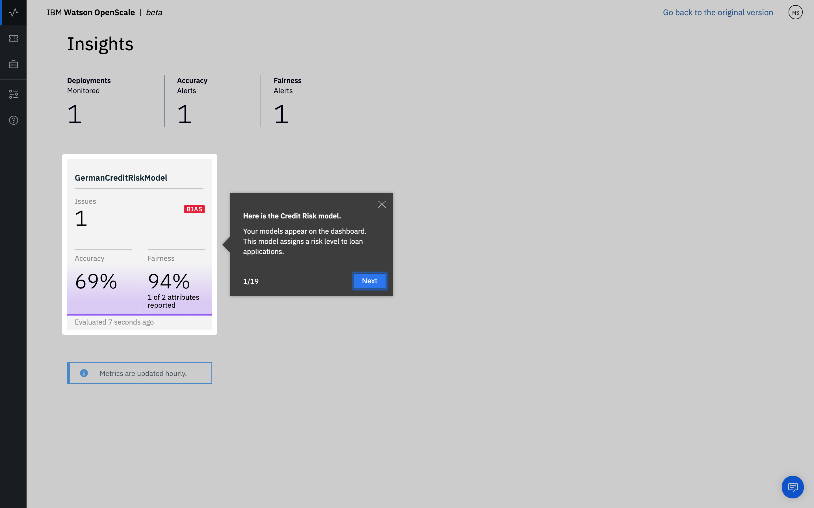

---

title: Vertrauen und Transparenz für Ihre Machine Learning-Modelle mit {{site.data.keyword.aios_short}}
description: Monitor your machine learning deployments for bias, accuracy, and explainability
duration: 120
intro: In this tutorial, you will provision {{site.data.keyword.Bluemix}} machine learning and data services, create and deploy machine learning models in Watson studio, and configure the new IBM {{site.data.keyword.aios_full}} product to monitor your models for trust and transparency.
takeaways:
- See how {{site.data.keyword.aios_short}} provides trust and transparency for AI models
- Understand how {{site.data.keyword.Bluemix}} services and Watson Studio technologies can provide a seamless, AI-driven customer experience

copyright:
  years: 2018, 2019
lastupdated: "2019-06-28"

keywords: ai, getting started, tutorial, understanding, video

subcollection: ai-openscale

---

{:shortdesc: .shortdesc}
{:external: target="_blank" .external}
{:hide-dashboard: .hide-dashboard}
{:tip: .tip}
{:important: .important}
{:note: .note}
{:pre: .pre}
{:codeblock: .codeblock}
{:screen: .screen}
{:javascript: .ph data-hd-programlang='javascript'}
{:java: .ph data-hd-programlang='java'}
{:python: .ph data-hd-programlang='python'}
{:swift: .ph data-hd-programlang='swift'}

# Lernprogramm 'Erste Schritte' (automatisierte Konfiguration)
{: #gettingstarted}

{{site.data.keyword.aios_full}} ermöglicht Unternehmen die Automatisierung und Operationalisierung des AI-Lebenszyklus in Geschäftsanwendungen und stellt dabei sicher, dass AI-Modelle verzerrungsfrei sind, ohne großen Aufwand erklärt und von Geschäftsanwendern verstanden werden können und in Geschäftstransaktionen überprüfbar sind. {{site.data.keyword.aios_short}} unterstützt AI-Modelle, die in den Tools und Modell-Server-Frameworks Ihrer Wahl erstellt und ausgeführt werden.
{: shortdesc}

## Überblick
{: #gs-view-demo}

Mit dem folgenden Video können Sie sich einen schnellen Überblick über {{site.data.keyword.aios_short}} verschaffen.

  

    <iframe class="embed-responsive-item" id="youtubeplayer" title="Vertrauen und Transparenz in AI" type="text/html" width="640" height="390" src="https://www.youtube.com/embed/6Ei8rPVtCf8" frameborder="0" webkitallowfullscreen mozallowfullscreen allowfullscreen> </iframe>
  

## Anwendungsfall von {{site.data.keyword.aios_short}}
{: #gs-use}

Konventionelle Kreditgeber stehen unter dem Druck, ihr digitales Portfolio an Finanzdienstleistungen auf ein umfangreicheres und vielfältigeres Publikum auszuweiten, was einen neuen Ansatz bei der Kreditrisikomodellierung erfordert. Ihre Data-Science-Teams stützen sich derzeit auf Standardmodellierungstechniken wie Entscheidungsstrukturen und logistische Regression, die für moderate Datensätze gut funktionieren und Empfehlungen generieren, die leicht zu erklären sind. Damit wird den gesetzlichen Bestimmungen, dass Kreditentscheidungen transparent und nachvollziehbar sein müssen, Rechnung getragen.

Um einem breiteren Bevölkerungsanteil mit höherem Risiko Zugang zu Krediten zu ermöglichen, müssen die Bonitätsgeschichten (Kredithistorien) von Antragstellern über die herkömmlichen Kredite wie Hypotheken und KFZ-Darlehen hinausgehen und alternative Kreditquellen wie das Zahlungsverhalten gegenüber Versorgungsunternehmen und Preisplänen bei Mobilfunkanbietern sowie Bildungs- und Berufsbezeichnungen erschließen. Diese neuen Datenquellen bieten nicht nur vielversprechende Perspektiven, sondern bringen auch Risiken mit sich, indem sie die Wahrscheinlichkeit unerwarteter Korrelationen erhöhen, die aufgrund von Alter, Geschlecht oder anderen persönlichen Merkmalen eines Antragstellers Verzerrungen verursachen.

Die für diese verschiedenartigen Datasets am besten geeigneten Data-Science-Techniken, wie etwa gradientengetriebene Baumstrukturen und neuronale Netze, können zwar hochpräzise Risikomodelle generieren, allerdings zu einem entsprechenden Preis. Derartige 'Blackbox'-Modelle generieren undurchsichtige Vorhersagen, die irgendwie transparent gemacht werden müssen, um die behördliche Genehmigung sicherzustellen, wie beispielsweise durch Artikel 22 der Datenschutz-Grundverordnung (DSGVO) oder den Fair Credit Reporting Act (FCRA), das vom Bureau of Consumer Financial Protection (BCFP) verwaltet wird.

Das in diesem Lernprogramm bereitgestellte Kreditrisikomodell verwendet ein Trainingsdataset, das 20 Attribute zu jedem Kreditantragsteller enthält. Zwei dieser Attribute - Alter und Geschlecht - können auf Verzerrungen getestet werden. In diesem Lernprogramm steht die Verzerrung bei Geschlecht und Alter im Fokus. Weitere Informationen zu den Trainingsdaten finden Sie unter [Warum muss {{site.data.keyword.aios_short}} auf meine Trainingsdaten zugreifen?](/docs/services/ai-openscale?topic=ai-openscale-trainingdata#trainingdata)

{{site.data.keyword.aios_short}} überwacht, welche Neigung zu einem günstigen Ergebnis ('Kein Risiko') das bereitgestellte Modell bei einer Gruppe (der Referenzgruppe) gegenüber einer anderen Gruppe (d. h. der überwachten Gruppe) aufweist. In diesem Lernprogramm ist die auf Geschlecht überwachte Gruppe `Weiblich` und die auf Alter überwachte Gruppe besteht aus Antragstellern im Alter von `19 bis 25` Jahren.

## Konfigurationsoptionen
{: #gs-module}

Abhängig von Ihrer Präferenz und Ihrem Fachwissen gibt es mehrere Konfigurationsoptionen.

- Die folgende [automatisierte Konfiguration](/docs/services/ai-openscale?topic=ai-openscale-wos-fast-start#wos-fast-start) führt Sie durch den Prozess, indem Tasks im Hintergrund ausgeführt werden.

   Die Verwendung einer Tour bedeutet, dass Sie die Tour anzeigen und per Mausklick zum nächsten Teil der Tour wechseln können.
   
- Die [interaktive Konfiguration](/docs/services/ai-openscale?topic=ai-openscale-gs-obj#gs-obj) ermöglicht Ihnen, die Steuerung mit einem leicht verständlichen Script zu übernehmen.

   Verwenden Sie die Schnittstelle, um einheitlich verwendete Tasks mit einem Beispielmodell und eingefügten Daten durchzuführen.
   
- Das [Lernprogramm für Fortgeschrittene](/docs/services/ai-openscale?topic=ai-openscale-crt-ov) versetzt technisch versiertere Benutzer in die Lage, ein Python-Modul zu installieren, das die Einrichtung/Bereitstellung und Konfiguration von vorausgesetzten Services automatisiert. Dieses Lernprogramm für fortgeschrittene Benutzer richtet sich an Data-Scientists oder Benutzer, die mit dem Schreiben von Code, mit Python und mit Notebooks vertraut sind. Es veranschaulicht, wie der {{site.data.keyword.aios_short}}-Client verwendet werden kann, um Funktionen programmgesteuert auszuführen. Das Notebook, das in diesem Lernprogramm verwendet wird, ist an derselben Position zu finden wie bei der [automatisierten Konfiguration](/docs/services/ai-openscale?topic=ai-openscale-wos-fast-start#wos-fast-start).

   Dieses Modul erfordert, dass Python 3 installiert ist, worin das Paketmanagementsystem pip enthalten ist. Entsprechende Anweisungen enthält [Python-Modul zum Konfigurieren von {{site.data.keyword.aios_short}} installieren](/docs/services/ai-openscale?topic=ai-openscale-as-module).

Links zu zusätzlichen Lernprogrammen finden Sie im Abschnitt [Zusätzliche Ressourcen](/docs/services/ai-openscale?topic=ai-openscale-arsc-ov).

## Automatisierte Konfiguration
{: #wos-fast-start}

Wenn Sie schnell sehen möchten, wie von {{site.data.keyword.aios_short}} ein Modell überwacht wird, nutzen Sie die Option für das Demo-Szenario, die bereitgestellt wird, wenn Sie sich zum ersten Mal an der Benutzerschnittstelle von {{site.data.keyword.aios_short}} anmelden.  Informationen hierzu finden Sie unter [Mit Demo der Benutzerschnittstelle arbeiten](#wos-work-demo).
{: shortdesc}

## Vorbereitende Schritte
{: #wos-prereqs}

Bevor Sie mit der Tour beginnen, müssen die folgenden Ressourcen konfiguriert sein:

- [{{site.data.keyword.ibmid}}](/docs/account?topic=account-signup){: external}
- [{{site.data.keyword.aios_full}}](/docs/services/ai-openscale?topic=ai-openscale-gettingstarted#crt-wos-faststart)

Die Tour für automatisierte Konfiguration ist so konzipiert, dass sie mit der geringstmöglichen Benutzerinteraktion auskommt. Folgenden Entscheidungen werden automatisch getroffen:

- Wenn mehrere {{site.data.keyword.pm_full}}-Instanzen eingerichtet sind, wird der API-Aufruf zum Auflisten der Instanzen ausgeführt und eine beliebige {{site.data.keyword.pm_short}}-Instanz wird als erste Instanz der betreffenden Liste angezeigt. 
- Zum Erstellen einer neuen Lite-Version von {{site.data.keyword.pm_full}} verwendet das {{site.data.keyword.aios_short}}-Installationsprogramm die Standardressourcengruppe für Ihr {{site.data.keyword.Bluemix}}-Konto.

### {{site.data.keyword.aios_short}}-Service bereitstellen
{: #crt-wos-faststart}

Stellen Sie sicher, dass Sie {{site.data.keyword.aios_full}} einrichten, sofern dies nicht bereits geschehen ist. 

- [Richten Sie eine {{site.data.keyword.aios_short}}-Instanz](https://{DomainName}/catalog/services/watson-openscale){: external} ein, sofern Ihrem Konto noch keine solche Instanz zugeordnet ist:

  

1. Klicken Sie auf **Katalog** > **AI** > **{{site.data.keyword.aios_short}}**.
2. Geben Sie Ihrem Service einen Namen, wählen Sie einen Plan aus und klicken Sie auf die Schaltfläche **Erstellen**.
3. Klicken Sie zum Starten von {{site.data.keyword.aios_short}} auf die Schaltfläche **Anwendung starten**.

## Automatische Konfiguration
{: #wos-work-demo}

1.  Melden Sie sich an der {{site.data.keyword.aios_short}}-Instanz in {{site.data.keyword.Bluemix}} an.
1.  Wenn Sie Ihre {{site.data.keyword.aios_short}}-Instanz automatisch mithilfe von Beispieldaten konfigurieren möchten, klicken Sie auf **Automatische Konfiguration**.

   

   Wenn die {{site.data.keyword.aios_short}}-Services bereitgestellt werden, können Sie das Demoszenario überprüfen. Klicken Sie nach dem Abschluss der Bereitstellung auf die Schaltfläche **Tour starten**, um eine Tour durch das {{site.data.keyword.aios_short}}-Dashboard zu starten. Fahren Sie mit [Ergebnisse in {{site.data.keyword.aios_short}} anzeigen](#wos-open) fort.

## Ergebnisse in {{site.data.keyword.aios_short}} anzeigen
{: #wos-open}

Um Einblicke in die Fairness und Genauigkeit des Modells, die Details der zu überwachenden Daten und die Erklärbarkeit für eine einzelne Transaktion zu erhalten, öffnen Sie das {{site.data.keyword.aios_short}}-Dashboard. Jede Bereitstellung wird als Kachel angezeigt. Die Tour hat eine Bereitstellung namens `GermanCreditRiskModel` konfiguriert, wie auf dem folgenden Screenshot zu sehen ist:

   

### Insights anzeigen
{: #wos-insights}

Auf der Seite 'Insights' werden auf einen Blick alle eventuellen Probleme im Zusammenhang mit Fairness und Genauigkeit angezeigt, wie sie anhand der konfigurierten Schwellenwerte festgestellt wurden.

   

### Überwachungsdaten anzeigen
{: #wos-monitoring}

1.  Klicken Sie auf der Seite 'Insights' auf die Kachel `GermanCreditRiskModelICP`, um Details zu den überwachten Daten anzuzeigen.
1.  Klicken Sie auf die Markierung und ziehen Sie sie über das Diagramm, um einen Tag und einen Zeitraum anzuzeigen, zu dem Daten dargestellt werden; klicken Sie danach auf den Link **Details anzeigen**. Alternativ können Sie auf unterschiedliche Zeiträume im Diagramm klicken, um das angezeigte Datum zu ändern. 

Informationen zur Interpretation des Zeitreihendiagramms erhalten Sie im Abschnitt [Insights abrufen](/docs/services/ai-openscale?topic=ai-openscale-it-ov).

### Erklärbarkeit anzeigen
{: #wos-explain}

Um die Faktoren zu verstehen, die beteiligt sind, wenn eine Verzerrung für einen bestimmten Zeitraum vorliegt, klicken Sie in der im vorherigen Abschnitt dargestellten Visualisierungsanzeige auf das Optionsfeld **Verzerrte Transaktionen**.

   

Für diejenigen Transaktionen, die eine Verzerrung aufweisen, werden die Transaktions-IDs der letzten Stunde aufgelistet. Für das in diesem Modul verwendete Modell gibt es für die verfügbaren Anforderungen eine Verzerrung.

   

Informationen zum Suchen und Erklären von Transaktionen finden Sie im Abschnitt [Erklärbarkeit überwachen](/docs/services/ai-openscale?topic=ai-openscale-ie-ov).

   

## Tour beenden
{: #wos-done-demo}

Nachdem Sie die Tour beendet haben, können Sie entweder Ihre eigene Modellbereitstellung zum Dashboard hinzufügen oder das bereitgestellte Lernprogramm weiter erkunden. 

- Um Ihr eigenes Modell zum Dashboard hinzuzufügen, klicken Sie auf die Schaltfläche **Zum Dashboard hinzufügen**.
- Für die weitere Erkundung des Modells im Lernprogramm klicken Sie auf die Kachel für deutsches Kreditrisiko.

## Weitere Schritte
{: #gs-next}

- Informieren Sie sich weiter über die [Anzeige und Interpretation der Daten](/docs/services/ai-openscale?topic=ai-openscale-it-ov) und über die [Überwachung der Erklärbarkeit](/docs/services/ai-openscale?topic=ai-openscale-ie-ov).
