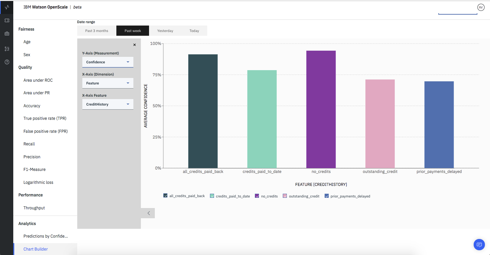

---

copyright:
  years: 2018, 2019
lastupdated: "2019-06-28"

keywords: fairness, fairness monitor, payload, perturbation, training data, debiased

subcollection: ai-openscale

---

{:shortdesc: .shortdesc}
{:external: target="_blank" .external}
{:tip: .tip}
{:important: .important}
{:note: .note}
{:pre: .pre}
{:codeblock: .codeblock}
{:download: .download}
{:screen: .screen}
{:javascript: .ph data-hd-programlang='javascript'}
{:java: .ph data-hd-programlang='java'}
{:python: .ph data-hd-programlang='python'}
{:swift: .ph data-hd-programlang='swift'}
{:faq: data-hd-content-type='faq'}

# Diagrammerstellungsfunktion 
{: #chart_builder}

Erstellen Sie mit der Diagrammerstellungsfunktion von {{site.data.keyword.aios_short}} angepasste Visualisierungen, damit Sie Modellvorhersagen und -eingaben zur Laufzeit besser verstehen können. Die Diagrammerstellungsfunktion bietet die Möglichkeit, die Ausgabe zur Modellvorhersage für die Merkmale oder Datenbereiche anzuzeigen, die von einem Unternehmen als besonders wichtig erachtet werden. Dies erleichtert es, neue Trends in den Daten zu entdecken, die die Geschäfts- und Datenwissenschaftsteams dann dazu veranlassen könnten, Änderungen am AI-Modell vorzunehmen. 
{: shortdesc}

Wenn Sie z. B. mit dem Kreditrisikomodell aus den Lernprogrammen vertraut sind, können Sie die Aufteilung in Vorhersageklassen für verschiedene Bereiche des Attributs für den Kreditverlauf erkennen. 

   
      
   Sie können auch erkennen, wie hoch der Konfidenzwert bei dem Modell ist, wenn Sie für diese Bereiche des Kreditverlaufs eine Vorhersage machen. Die an Ihre Bereitstellung gesendeten Scoring-Nutzdaten können Sie im ausgewählten Datenbereich mithilfe eines angepassten Diagramms (Auswahl von Merkmalen, Vorhersageklassen und Konfidenz) analysieren.

   
   
