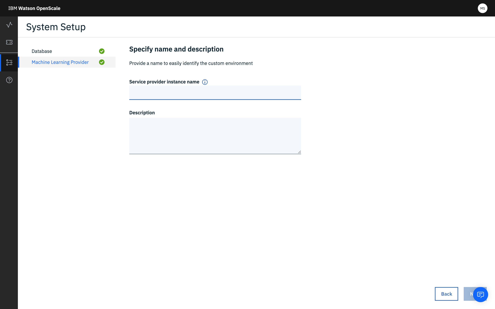

---

copyright:
  years: 2018, 2019
lastupdated: "2019-06-28"

keywords: machine learning, services, ml, custom 

subcollection: ai-openscale

---

{:shortdesc: .shortdesc}
{:external: target="_blank" .external}
{:tip: .tip}
{:important: .important}
{:note: .note}
{:pre: .pre}
{:codeblock: .codeblock}
{:download: .download}
{:screen: .screen}
{:javascript: .ph data-hd-programlang='javascript'}
{:java: .ph data-hd-programlang='java'}
{:python: .ph data-hd-programlang='python'}
{:swift: .ph data-hd-programlang='swift'}
{:faq: data-hd-content-type='faq'}

# Angepasste ML-Serviceinstanz angeben
{: #co-connect}

Als ersten Schritt im {{site.data.keyword.aios_short}}-Tool geben Sie eine Serviceinstanz an. In Ihrer Serviceinstanz speichern Sie Ihre AI-Modelle und -Bereitstellungen.
{: shortdesc}

## Angepasste Serviceinstanz verbinden
{: #co-config}

{{site.data.keyword.aios_short}} stellt die Verbindung zu AI-Modellen und Bereitstellungen in einer Serviceinstanz her. Sie können eine Verbindung zu einem angepassten Service herstellen.

1. Klicken Sie auf der Registerkarte **Konfigurieren** auf **Machine Learning-Provider**. Abhängig von Ihrer Umgebung werden möglicherweise nicht alle der folgenden Provider angezeigt:

   

2. Wählen Sie die Kachel **Angepasste Umgebung** aus.

   

1.  Geben Sie Ihre Berechtigungsnachweise ein und speichern Sie sie:

    - Benutzername: Der Benutzername für Ihren angepassten ML-Provider.
    - Kennwort: Das Kennwort für Ihren angepassten ML-Provider.
    - Instanzname des Service-Providers: Der spezifische Name, der diesem Service-Provider zugeordnet ist.
    - Beschreibung: (optional) Ihre Beschreibung dieser Service-Provider-Instanz in einfacher Sprache. Wenn Sie Produktions- und Testumgebungen haben, wäre dies ein guter Ort, um diese Informationen einzuschließen.

4. Wählen Sie aus, ob Sie eine Verbindung zu Ihren Bereitstellungen herstellen möchten, indem Sie eine [Liste anfordern](/docs/services/ai-openscale?topic=ai-openscale-co-connect#co-config-request-list) oder indem Sie [einzelne Scoring-Endpunkte eingeben](/docs/services/ai-openscale?topic=ai-openscale-co-connect#co-config-scoring-endpoints).

   
    
5. Klicken Sie auf **Weiter**.

### Bereitstellungsliste anfordern
{: #co-config-request-list}

1. Geben Sie bei Auswahl der Kachel **Bereitstellungsliste anfordern** Ihre Berechtigungsnachweise und den API-Endpunkt ein und klicken Sie dann auf **Speichern**.

   

2. Kehren Sie nach dem Speichern Ihrer Machine Learning-Konfiguration zum **Dashboard** zurück, klicken Sie auf die Registerkarte **Insights** und dann auf die Schaltfläche **Zum Dashboard hinzufügen**.

3. Wählen Sie eine Bereitstellung in der Liste aus und klicken Sie auf **Konfigurieren**.

Nun können Sie die Überwachung konfigurieren.

### Einzelne Scoring-Endpunkte angeben
{: #co-config-scoring-endpoints}

1. Geben Sie bei Auswahl der Kachel **Individuelle Scoring-Endpunkte eingeben** Ihre Berechtigungsnachweise für den API-Endpunkt ein und klicken Sie dann auf **Speichern**.

2. Kehren Sie nach dem Speichern Ihrer Machine Learning-Konfiguration zum **Dashboard** zurück, klicken Sie auf die Registerkarte **Insights** und dann auf **Zum Dashboard hinzufügen** button.

3. Klicken Sie auf die Schaltfläche **Endpunkt hinzufügen**.

4. Wählen Sie im Dropdown-Menü die angepasste Umgebung aus, geben Sie den Namen der Bereitstellung und den API-Endpunkt ein und klicken Sie auf **Speichern**.

Nun können Sie die Überwachung konfigurieren.

### Funktionsweise
{: #co-works}

Die folgende Abbildung verdeutlicht die Unterstützung für die angepasste Umgebung:


Weitere Informationen können Sie auch über die folgenden Links aufrufen:

[{{site.data.keyword.aios_short}}-API für Nutzdatenprotokollierung](https://{DomainName}/apidocs/ai-openscale#publish-scoring-payload){: external}

[API für angepasste Bereitstellung](https://aiopenscale-custom-deployement-spec.mybluemix.net/){: external}

[SDK für Python-Clientbindung](http://ai-openscale-python-client.mybluemix.net/#bindings){: external}

[Mit der angepassten Machine Learning-Engine arbeiten](https://github.com/pmservice/ai-openscale-tutorials/blob/master/notebooks/AI%20OpenScale%20and%20Custom%20ML%20Engine.ipynb){: external}

[Python-SDK für IBM Watson OpenScale](https://pypi.org/project/ibm-ai-openscale/){: external}

- **Eingabekriterien für das Modell zur Unterstützung von Überwachungen**

  Ihr Modell sollte einen Merkmalvektor als Eingabe verwenden. Dabei handelt es sich im Wesentlichen um eine Sammlung (Gruppe) von benannten Feldern und ihren Werten, wobei die Felder, die auf Verzerrung überwacht werden, eine Gruppe dieser Felder darstellen:

  ```bash
  {
    "fields": [
        "name",
        "age",
        "position"
    ],
    "values": [
        [
            "john",
            33,
            "engineer"
        ],
        [
            "mike",
            23,
            "student"
        ]
    ]
  }
  ```

  In diesem Beispiel könnte `"age"` ein Feld sein, das von jemandem auf Fairness hin ausgewertet wird.

  Wenn es sich bei der Eingabe um einen Tensor/Matrix handelt, der aus dem Eingabemerkmalbereich transformiert wird (was bei Deep Learning - also 'tiefgehendem Lernen' - aus Text oder Images oft der Fall ist), kann dieses Modell von der {{site.data.keyword.aios_short}}-Plattform im aktuellen Release nicht verarbeitet werden. Im weiteren Sinne können Deep-Learning-Modelle mit Text- oder Imageeingaben nicht zur Erkennung und Entschärfung von Verzerrungen verwendet werden.

  Zusätzlich sollten zur Unterstützung der Erklärbarkeit Trainingsdaten geladen werden.

  Zur Erklärbarkeit von Text sollte der gesamte Text eines der Merkmale sein. Die Erklärbarkeit von Images für ein Modell vom Typ 'Angepasst' wird im aktuellen Release nicht unterstützt.
  {: note}

- **Ausgabekriterien für das Modell zur Unterstützung von Überwachungen**

  Ihr Modell sollte neben den Vorhersagewahrscheinlichkeiten verschiedener Klassen in diesem Modell den Eingabemerkmalvektor ausgeben.

  ```bash
  {
    "fields": [
        "name",
        "age",
        "position",
        "prediction",
        "probability"
    ],
    "labels": [
        "personal",
        "camping"
    ],
    "values": [
        [
            "john",
            33,
            "engineer",
            "personal",
            [
                0.6744664422398081,
                0.3255335577601919
            ]
        ],
        [
            "mike",
            23,
            "student"
            "camping",
            [
                0.2794765664946941,
                0.7205234335053059
            ]
        ]
    ]
  }
  ```

  Im vorliegenden Beispiel sind `"personal”` und `"camping"` die möglichen Klassen und die Bewertungen in jeder Scoring-Ausgabe werden beiden Klassen zugewiesen. Wenn die Vorhersagewahrscheinlichkeiten fehlen, funktioniert zwar die Erkennung von Verzerrungen, nicht aber die automatische Verzerrungsbereinigung.

  Die vorhergehende Scoring-Ausgabe muss von einem Live-Scoring-Endpunkt aus zugänglich sein, der von {{site.data.keyword.aios_short}} über REST aufgerufen werden kann. Für AzureML, SageMaker und {{site.data.keyword.pm_full}} wird von {{site.data.keyword.aios_short}} direkt eine Verbindung zu nativen Scoring-Endpunkten aufgebaut, sodass Sie sich keine Gedanken um die Implementierung der Scoring-Spezifikation machen müssen.

### Weitere Schritte
{: #co-next}

Nun können Sie in {{site.data.keyword.aios_short}} die [Überwachungen konfigurieren](/docs/services/ai-openscale?topic=ai-openscale-mo-config).
