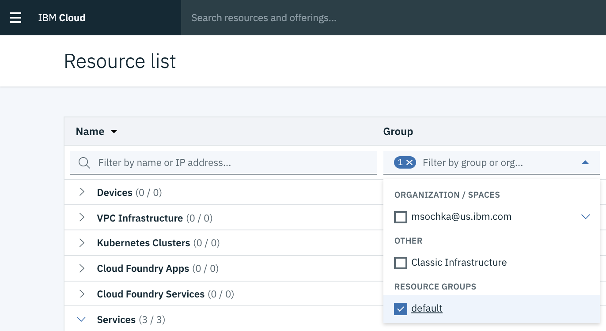

---

copyright:
  years: 2018, 2019
lastupdated: "2019-06-28"

keywords: credentials, REST API, data mart

subcollection: ai-openscale

---

{:shortdesc: .shortdesc}
{:external: target="_blank" .external}
{:tip: .tip}
{:important: .important}
{:note: .note}
{:pre: .pre}
{:codeblock: .codeblock}
{:download: .download}
{:screen: .screen}
{:javascript: .ph data-hd-programlang='javascript'}
{:java: .ph data-hd-programlang='java'}
{:python: .ph data-hd-programlang='python'}
{:swift: .ph data-hd-programlang='swift'}
{:faq: data-hd-content-type='faq'}

# Berechtigungsnachweise für {{site.data.keyword.aios_short}} erstellen
{: #cred-create}

Um auf die {{site.data.keyword.aios_full}}-REST-APIs zugreifen zu können, sind ein Plattform-API-Schlüssel und eine Datamart-ID (Serviceinstanz-ID) erforderlich. Mit einem Plattform-API-Schlüssel wird ein einzelner Benutzer in die Lage versetzt, auf Ressourcen in der {{site.data.keyword.cloud_notm}} zuzugreifen.
{: shortdesc}

Für Unternehmenskonten kann ein Administrator das Datamart erstellen, andere Benutzer zum Konto einladen und diesen Benutzern Zugriff auf ein bestimmtes {{site.data.keyword.aios_short}}-Datamart erteilen. Ein Benutzer kann dann seinen eigenen Plattform-API-Schlüssel erstellen und auf dasselbe {{site.data.keyword.aios_short}}-Datamart zugreifen. Dies stellt keinen Konflikt bzw. kein Sicherheitsrisiko dar.

## Plattform-API-Schlüssel erstellen
{: #cred-create-apikey}

Führen Sie zum Erstellen eines Plattform-API-Schlüssels die folgenden Schritte aus:

1. Melden Sie sich bei [{{site.data.keyword.cloud_notm}}](https://{DomainName}){: external} an.

2. Wählen Sie **Verwalten** --> **Sicherheit** --> **Plattform-API-Schlüssel** aus. 

    

3. Erstellen und speichern Sie einen Plattform-API-Schlüssel.

Sie finden Sie Ihre Datamart-ID (oder Serviceinstanz-ID):

1. Klicken Sie auf die Kachel für Modellbereitstellung.
2. Klicken Sie auf das Symbol **Konfigurieren** .
3. Klicken Sie auf **Endpunkt der Nutzdatenprotokollierung anzeigen**.
4. Suchen Sie auf der Seite {{site.data.keyword.aios_short}}**Nutzdatenprotokollierung** das Feld **Datamart-ID**.

    

## Über die Befehlskonsole Berechtigungsnachweise für die Serviceinstanz erstellen
{: #cred-creds}

Führen Sie zum Erstellen von Berechtigungsnachweisen für {{site.data.keyword.aios_short}} mit der {{site.data.keyword.cloud_notm}} [Befehlskonsole](/docs/cli?topic=cloud-cli-ibmcloud-cli) die folgenden Schritte aus:

1. Rufen Sie Ihren API-Schlüssel durch Ausführen des folgenden Befehls ab:

    ```curl
    ibmcloud login --sso
    ibmcloud iam api-key-create 'my_key'
    ```

    Es werden die folgenden Informationen angezeigt:

    ```bash
    Name         my_key
    Created At   2018-10-09T14:04+0000
    API Key      Tg4Gxxxxxxxxxxxxxxxxx_xxxxxxxxxxxxxxxxxQU-nE
    Locked       false
    UUID         ApiKey-xxxxxxxxx-afd7-xxxxx-b0e1-xxxxxxxxxxx
    ```
2. Überprüfen Sie, welche Ressourcengruppe Sie in Ihrem {{site.data.keyword.cloud_notm}}-Konto verwenden.

  

  Wenn Sie nicht die Ressourcengruppe `Default` verwenden, führen Sie den folgenden Befehl aus, um einen Berechtigungsnachweis für {{site.data.keyword.aios_short}} abzurufen:

   ```curl
   ibmcloud target -g myResourceGroup
   ```

  Hierbei steht `myResourceGroup` für den Namen der Ressourcengruppe, die der {{site.data.keyword.aios_short}}-Instanz zugeordnet ist.

3. Rufen Sie Ihre {{site.data.keyword.aios_short}}-Instanz-ID durch Ausführen des folgenden Befehls ab:

    ```curl
    ibmcloud resource service-instance '<Namen_Ihrer_Watson_OpenScale-Instanz>'
    ```
    **Hinweis**: Wenn Sie die {{site.data.keyword.cloud_notm}}-Befehlskonsole unter Windows verwenden, ersetzen Sie die einzelnen Hochkommas (') in den zuvor genannten Befehlen jeweils durch Anführungszeichen (").

    Es werden die folgenden Informationen angezeigt:

    ```bash
    Name:                  AI OpenScale-my_instance
    ID:                    crn:v1:ibmcloud:public:aiopenscale:us-south:a/c2f2xxxxxxxxxxxx867::
    GUID:                  03daxxxx-xxxx-xxxx-xxxx-xxxxxxxx38a7
    Location:              us-south
    Service Name:          aiopenscale
    Service Plan Name:     lite
    Resource Group Name:   Default
    State:                 active
    Type:                  service_instance
    Sub Type:
    Tags:
    Created at:            2018-09-17T13:58:43Z
    Updated at:
    ```

    Der Wert für `GUID` gibt die ID für Ihre {{site.data.keyword.aios_short}}-Instanz an.
        
## Weitere Schritte
{: #cred-create-next-steps}

Geben Sie Ihren Machine Learning-Anbieter an:

- [IBM Watson Machine Learning-Serviceinstanz angeben](https://test.cloud.ibm.com/docs/services/ai-openscale?topic=ai-openscale-wml-connect)
- [Microsoft Azure ML Studio-Instanz angeben](https://test.cloud.ibm.com/docs/services/ai-openscale?topic=ai-openscale-connect-azure)
- [Microsoft Azure ML Service-Instanz angeben](https://test.cloud.ibm.com/docs/services/ai-openscale?topic=ai-openscale-connect-azureservice)
- [Amazon SageMaker ML-Serviceinstanz angeben](https://test.cloud.ibm.com/docs/services/ai-openscale?topic=ai-openscale-csm-connect)
- [Angepasste ML-Serviceinstanz angeben](https://test.cloud.ibm.com/docs/services/ai-openscale?topic=ai-openscale-co-connect)
