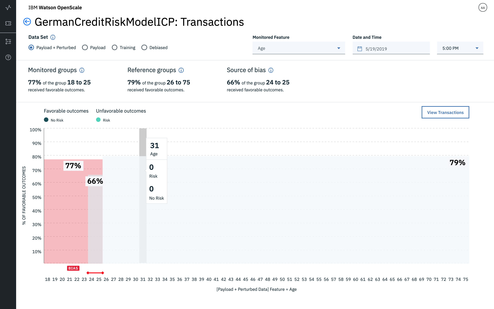
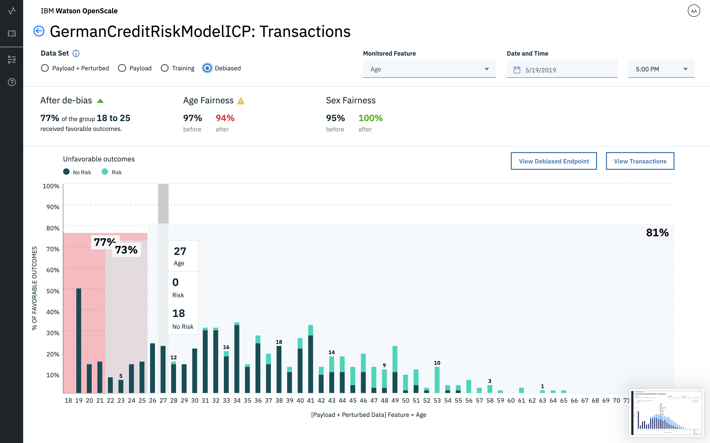
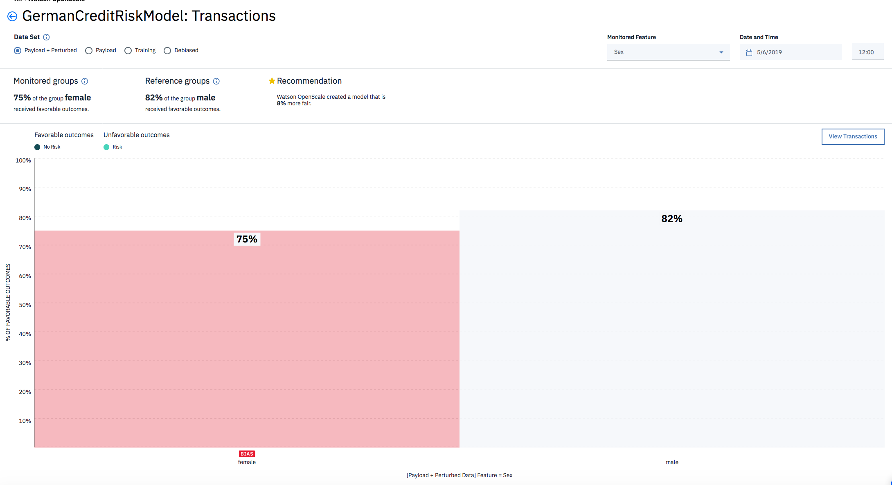

---

copyright:
  years: 2018, 2019
lastupdated: "2019-06-28"

keywords: metrics, monitoring, custom metrics, thresholds

subcollection: ai-openscale

---

{:shortdesc: .shortdesc}
{:external: target="_blank" .external}
{:tip: .tip}
{:important: .important}
{:note: .note}
{:pre: .pre}
{:codeblock: .codeblock}
{:download: .download}
{:screen: .screen}
{:javascript: .ph data-hd-programlang='javascript'}
{:java: .ph data-hd-programlang='java'}
{:python: .ph data-hd-programlang='python'}
{:swift: .ph data-hd-programlang='swift'}
{:faq: data-hd-content-type='faq'}

# Übersicht zu Fairnessmetriken
{: #anlz_metrics_fairness}

Verwenden Sie die Fairnessüberwachung in {{site.data.keyword.aios_full}}, um festzustellen, ob die von Ihrem Modell generierten Ergebnisse für eine überwachte Gruppe fair sind. Wenn die Fairnessüberwachung aktiviert ist, generiert sie standardmäßig jede Stunde eine Gruppe von Metriken. Sie können diese Metriken bedarfsgesteuert generieren, indem Sie auf die Schaltfläche **Qualität jetzt überprüfen** klicken oder indem Sie den Python-Client verwenden.
{: shortdesc}

{{site.data.keyword.aios_short}} erkennt automatisch, ob bekannte geschützte Attribute in einem Modell vorliegen. Werden derartige Attribute von {{site.data.keyword.aios_short}} erkannt, wird automatisch die Konfiguration einer Verzerrungsüberwachung für die einzelnen Attribute empfohlen, um sicherzustellen, dass die Verzerrung bei diesen möglicherweise schutzwürdigen Attributen in der Produktionsumgebung verfolgt wird. 

{{site.data.keyword.aios_short}} erkennt derzeit die folgenden geschützten Attribute und empfiehlt eine Überwachung für diese Attribute: 

- Geschlecht (sex)
- Ethnizität (ethnicity)
- Familienstand (marital status)
- Alter (age)
- Postleitzahl (zip code)

Zusätzlich zum Erkennen geschützter Attribute empfiehlt {{site.data.keyword.aios_short}} die Werte in den einzelnen Attribute, die als zu überwachende Werte, und die Werte, die als Referenzwerte festgelegt werden sollten. {{site.data.keyword.aios_short}} empfiehlt z. B., im Attribut für Geschlecht (sex) die Werte für Frau (Woman) und nicht-binär (Non-binary) als zu überwachende Werte und den Wert für Mann (Male) als Referenzwert für die Verzerrungsüberwachung zu konfigurieren. Die Empfehlungen können Sie bei Bedarf über die Anzeige für die Verzerrungskonfiguration ändern. 

Empfohlene Werte für die Verzerrungsüberwachung beschleunigen die Konfiguration und stellen sicher, dass Sie Ihre AI-Modelle auf Fairness gegenüber sensiblen Attributen überprüfen. Da die Regulierungsbehörden den Blick für algorithmische Verzerrung schärfen, wird es immer wichtiger, dass Unternehmen ein konkrete Vorstellung davon haben, wie ihre Modelle funktionieren und ob sie Ergebnisse für bestimmte Gruppen liefern, die den Anforderungen an Fairness nicht entsprechen.

## Informationen zu Fairness
{: #mf-understand}

{{site.data.keyword.aios_short}} überprüft Ihr bereitgestelltes Modell während der Laufzeit auf Verzerrungen. Damit Verzerrungen für ein bereitgestelltes Modell erkannt werden können, müssen Sie Fairnessattribute wie etwa Alter oder Geschlecht definieren, wie nachfolgend im Abschnitt [Fairnessüberwachung konfigurieren](#mf-config) detailliert beschrieben wird.

Damit die Verzerrungsprüfung in {{site.data.keyword.aios_short}} aktiviert werden kann, muss das Ausgabeschema für ein Modell oder eine Funktion in {{site.data.keyword.pm_short}} angegeben werden. Das Ausgabeschema kann anhand der Eigenschaft `client.repository.ModelMetaNames.OUTPUT_DATA_SCHEMA` im Metadatenbereich er API `store_model` angegeben werden. Weitere Informationen finden Sie in der [Dokumentation zum {{site.data.keyword.pm_full}}-Client](http://wml-api-pyclient-dev.mybluemix.net/#repository){: external}.

### Funktionsweise
{: #mf-works}

Bevor Sie die Fairnessüberwachung konfigurieren, sollten Sie sich mit einigen zentralen Konzepten vertraut machen, die Sie unbedingt verstehen sollten:

- Bei Fairnessattributen handelt es sich um Modellattribute, für die das Modell wahrscheinlich eine Verzerrung aufweist. Für das Fairnessattribut **`Geschlecht`** könnte das Modell zum Beispiel eine Verzerrung gegenüber bestimmten Werten für das Geschlecht (`Weiblich`, `Transsexuell` usw.) aufweisen. Ein weiteres Beispiel für ein Fairnessattribut ist das **`Alter`**, bei dem das Modell gegenüber Menschen in einer bestimmten Altersgruppe eine Verzerrung aufweisen kann, zum Beispiel in der Altersgruppe von `18 bis 25` Jahren.

- Referenzwert und überwachter Wert: Die Werte von Fairnessattributen lassen sich in zwei unterschiedliche Kategorien aufteilen: Referenzwerte und überwachte Werte. Die überwachten Werte sind diejenigen, bei denen wahrscheinlich eine Diskrimination auftritt. Im Fall eines Fairnessattributs **`Geschlecht`** könnten als überwachte Werte `Weiblich` und `Transsexuell` verwendet werden. Bei einem numerischen Fairnessattribut wie **`Alter`** können die überwachten Werte `[18-25]` lauten. Alle anderen Werte für ein bestimmtes Fairnessattribut werden dann als Referenzwerte betrachtet, wie zum Beispiel `Geschlecht=Männlich` oder `Alter=[26,100]`.

- Günstiges/ungünstiges Ergebnis: Die Ausgabe eines Modells wird entweder als günstig (Favorable) oder ungünstig (Unfavorable) eingestuft. Wenn das Modell zum Beispiel vorhersagt, ob eine Person ein Darlehen erhalten sollte oder nicht, könnten `Darlehen bewilligt` oder `Darlehen teilbewilligt` als günstiges Ergebnis und im Gegensatz dazu `Darlehen abgelehnt` als ungünstiges Ergebnis dienen. Somit wird davon ausgegangen, dass das günstige Ergebnis ein positives Ergebnis ist, während ein ungünstiges Ergebnis als negativ angesehen wird.

Der {{site.data.keyword.aios_short}}-Algorithmus berechnet Verzerrungen auf Stundenbasis und verwendet dabei die letzten `N` Datensätzen, die in der Nutzdatenprotokollierungstabelle vorhanden sind, wobei der Wert für `N` bei der Konfiguration der Fairness angegeben wird. Vom Algorithmus werden diese letzten `N` Datensätze zum Generieren weiterer Daten durch Perturbation verändert.

Die Perturbation wird durch eine Änderung des Werts für das Fairnessattribut vom Referenzwert in den überwachten Wert (oder umgekehrt) erreicht. Die durch Perturbation veränderten Daten werden danach an das Modell gesendet, um dessen Verhalten zu auszuwerten. Vom Algorithmus werden die letzten `N` Datensätze in der Nutzdatentabelle und das Verhalten des Modells in Bezug auf durch Perturbation veränderte Daten überprüft, um zu entscheiden, ob im Modell Verzerrungen auftreten.

Ein Modell wird als verzerrt angesehen, wenn für diesen kombinierten Datenbestand der Prozentsatz der günstigen Ergebnisse für die überwachte Klasse niedriger als der Prozentsatz der günstigen Ergebnisse für die Referenzklasse ist; dies ist der Fall, wenn der Unterschied einen bestimmten Schwellenwert überschreitet. Dieser Schwellenwert muss bei der Konfiguration der Fairness angegeben werden.

Fairnesswerte können über 100 % liegen. Dies bedeutet, dass die überwachte Gruppe mehr günstige Ergebnisse als die Referenzgruppe erhalten hat. Darüber hinaus bleibt der Fairnesswert konstant, wenn keine neuen Scoring-Anforderungen gesendet werden.
{: note}

### Berechnung
{: #mf-bias-math}

Bei der in {{site.data.keyword.aios_short}} verwendeten Fairnessmetrik handelt es sich um die ungleiche Auswirkung. Diese misst die Rate, mit der eine nicht privilegierte Gruppe ein bestimmtes Ergebnis erhält, im Vergleich zu der Rate, mit der eine privilegierte Gruppe dasselbe Ergebnis erhält.

Die folgende mathematische Formel wird zur Berechnung der ungleichen Auswirkung verwendet:

```
                     (num_positives(privileged=False) / num_instances(privileged=False))
Ungleiche Auswirkung =   ______________________________________________________________________

                     (num_positives(privileged=True) / num_instances(privileged=True))
```

Dabei gilt Folgendes: `num_positives` ist die Anzahl der einzelnen Gruppenmitglieder (entweder privileged=False, d. h. nicht privilegiert, oder privileged=True, d. h. privilegiert), die ein positives Ergebnis erhalten; num_instances ist die Gesamtzahl der Gruppenmitglieder.

Das Ergebnis der Berechnung ist ein Prozentsatz, d. h., der Prozentsatz der Rate, mit der die nicht privilegierte Gruppe das positive Ergebnis erhält, im Vergleich zur Rate, mit der die privilegierte Gruppe das positive Ergebnis erhält. Beispiel: Wenn in einem Kreditrisikomodell einem Anteil von 80 % der nicht privilegierten Antragsteller und einem Anteil von 100 % der privilegierten Antragsteller die Prognose “kein Risiko” zugewiesen wird, beträgt die ungleiche Auswirkung dieses Modells 80 % (dies wird als Fairness-Score in {{site.data.keyword.aios_short}} dargestellt). 

In {{site.data.keyword.aios_short}} werden die positiven Ergebnisse als günstige Ergebnisse bezeichnet, die negativen Ergebnisse als ungünstige Ergebnisse. Die privilegierte Gruppe wird als Referenzgruppe bezeichnet, die nicht privilegierte Gruppe als überwachte Gruppe.


### Visualisierung für Verzerrungen 
{: #mf-monitor-bias-viz}

Wenn eine potenzielle Verzerrung festgestellt wird, führt {{site.data.keyword.aios_short}} eine Reihe von Funktionen aus, um zu ermitteln, ob die Verzerrung real ist. {{site.data.keyword.aios_short}} ändert die Daten durch Perturbation, indem der überwachte Wert mit dem Referenzwert gespiegelt und dieser neue Datensatz dann anhand des Modells verarbeitet wird. Anschließend wird die daraus resultierende Ausgabe als verzerrungsbereinigte Ausgabe zurückgegeben. Darüber hinaus trainiert {{site.data.keyword.aios_short}} ein gespiegeltes verzerrungsbereinigtes Modell, das dann verwendet wird, um eine verzerrte Prognose eines Modell zu erkennen. 

Zur Berechnung der Fairness und der Genauigkeit werden zwei unterschiedliche Datensätze verwendet. Die Fairness wird anhand der Nutzdaten und der durch Perturbation veränderten Daten berechnet. Die Genauigkeit wird anhand der Rückmeldedaten berechnet. Zur Berechnung der Genauigkeit benötigt {{site.data.keyword.aios_short}} manuell gekennzeichnete Daten. Diese sind nur in Rückmeldungstabelle vorhanden.

Die Ergebnisse dieser Feststellungen sind in der Visualisierung für Verzerrungen verfügbar, die die folgenden Ansichten umfasst. (Die Ansichten werden nur dann angezeigt, wenn Daten zur Unterstützung vorhanden sind.)

- **Nutzdaten + durch Perturbation veränderten Daten**: Enthält die für die ausgewählte Stunde erhaltene Scoring-Anforderung sowie zusätzliche Datensätze für vorherige Stunden, falls die für die Bewertung erforderliche Mindestanzahl von Datensätzen nicht erreicht wurde. Darüber hinaus sind zusätzliche durch Perturbation veränderte/synthetisierte Datensätze enthalten, die dazu verwendet werden, die Antwort des Modells zu testen, wenn sich der Wert des überwachten Merkmals ändert.

   Beachten Sie die folgenden Details zu Nutzdaten und durch Perturbation veränderte Daten:

   - Anzahl der Datensätze, die für diese Stunde aus der Nutzdatentabelle gelesen werden
   - Zusätzliche Datensätze, die für vorherige Stunden gelesen werden (Beispiel: Wenn für `min_records` in der Fairnesskonfiguration der Wert 1000 festgelegt wird und zwischen 14:00 Uhr und 15:00 Uhr nur 10 Datensätze hinzugefügt werden, liest das System weitere 990 Datensätze aus vorherigen Stunden, damit die Mindestanforderung erfüllt wird.)
   - Durch Perturbation veränderte Datensätze pro Fairnessattribut
   - Zeitmarke des ältesten Datensatzes in dem Zeitrahmen, für den die Verzerrung berechnet werden soll
   - Zeitmarke des neuesten Datensatzes in dem Zeitrahmen, für den die Verzerrung berechnet werden soll

  


- **Nutzdaten**: Die tatsächlichen Scoring-Anforderungen, die das Modell für die ausgewählte Stunde erhält.

   Beachten Sie die folgenden Details zu Nutzdaten:
   
   - Anzahl der Datensätze, die aus der Nutzdatentabelle gelesen werden bzw. für die eine Verzerrungsbereinigungsoperation durchgeführt wird
   - Zeitmarke des ältesten Datensatzes in dem Zeitrahmen, für den die Verzerrung berechnet werden soll
   - Zeitmarke des neuesten Datensatzes in dem Zeitrahmen, für den die Verzerrung berechnet werden soll


  

- **Trainingsdaten**: Die Trainingsdatensätze, die für das Training des Modells verwendet werden.

   Beachten Sie die folgenden Details zu Trainingsdaten:
   
   - Anzahl der Trainingsdatensätze. Trainingsdaten werden einmal gelesen und die Verteilung wird in der Variablen `subscription/fairness_configuration` gespeichert. Bei der Berechnung der Verteilung sollte auch die Anzahl der Trainingsdatensätze ermittelt und in derselben Verteilung gespeichert werden. Wenn Trainingsdaten geändert werden, d. h., wenn der Befehl `POST /data_distribution` erneut ausgeführt wird, wird darüber hinaus dieser Wert in der Variablen `fairness_configuration/training_data_distribution` aktualisiert. Beim Senden dieser Metrik muss auch diese Wert gesendet werden.
   - Zeitpunkt der letzten Verarbeitung der Trainingsdaten (erste und nachfolgende Aktualisierungen)

  
   

   
- **Verzerrungsbereinigte Daten**: Die Ausgabe des Verzerrungsbereinigungsalgorithmus nach der Verarbeitung der Laufzeitdaten und der durch Perturbation veränderten Daten. Bei Auswahl des Optionsfelds **Verzerrungsbereinigt** werden die Änderungen im verzerrungsbereinigten Modell im Vergleich zum Produktionsmodell angezeigt. Das Diagramm spiegelt den verbesserten Ergebnisstatus für Gruppen wider.


   Beachten Sie die folgenden Details zu verzerrungsbereinigten Daten:
   
   - Anzahl der Datensätze, die aus der Nutzdatentabelle gelesen werden bzw. für die eine Verzerrungsbereinigungsoperation durchgeführt wird
   - Zusätzliche Datensätze, die für die Verzerrungsbereinigungsoperation gelesen und damit ebenfalls verzerrungsbereinigt werden. Diese Zahl entspricht der Zahl bei der Auswahl von `Nutzdaten + durch Perturbation veränderten Daten`.
   - Durch Perturbation veränderte Datensätze pro Fairnessattribut
   - Zeitmarke des ältesten Datensatzes in dem Zeitrahmen, für den die Verzerrung berechnet werden soll
   - Zeitmarke des neuesten Datensatzes in dem Zeitrahmen, für den die Verzerrung berechnet werden soll
   - Vorher/nachher-Fairnesswerte werden im Header der Ansicht 'Verzerrungsbereinigt' angezeigt. 
      - Die Genauigkeit **nachher** wird berechnet, indem die Rückmeldedaten an die aktive Verzerrungsbereinigungs-API gesendet werden. Diese API gibt die verzerrungsbereinigte Prognose zurück. Darüber hinaus enthalten die Rückmeldedaten die manuelle Kennzeichnung. Die manuelle Kennzeichnung wird mit der verzerrungsbereinigten Prognose verglichen, um die Genauigkeit zu berechnen. Diese API gibt die verzerrungsbereinigte Prognose zurück. Darüber hinaus enthält die Rückmeldungstabelle die manuelle Kennzeichnung. Die manuelle Kennzeichnung wird mit der verzerrungsbereinigten Prognose verglichen, um die Genauigkeit zu berechnen. 
      - Die Genauigkeit **vorher** wird anhand derselben Rückmeldedaten berechnet. Für diese Berechnung werden die Rückmeldedaten an das Modell gesendet, um die Prognose zu erhalten; der prognostizierte Wert wird mit der manuellen Kennzeichnung verglichen, um die Genauigkeit zu erhalten.

  
  
### Beispiel
{: #mf-ex1}

Nehmen Sie einen Datenpunkt, bei dem das Modell für `Geschlecht=Männlich` (Referenzwert) ein günstiges Ergebnis vorhersagt. Wird der Datensatz jedoch durch Perturbationen gestört, indem `Geschlecht` zu `Weiblich` (überwachter Wert) geändert wird, während die Werte für alle übrigen Merkmale gleicht bleiben, sagt das Modell ein ungünstiges Ergebnis vorher. Ein Modell gilt allgemein als kognitiv verzerrt, wenn es genügend Datenpunkte (in den letzten `N` Datensätzen in der Nutzdatentabelle zuzüglich den durch Perturbation gestörten Daten) enthält, bei denen das Modell in verzerrter Weise agiert hat.

### Unterstützte Modelle
{: #mf-supmo}

 {{site.data.keyword.aios_short}} unterstützt die Erkennung von Verzerrungen nur für diejenigen Modelle und Python-Funktionen, die eine Art strukturierter Daten in ihrem Merkmalsvektor erwarten.

Fairnessmetriken werden auf der Basis der folgenden Informationen berechnet:

- Scoring-Nutzdaten

Für eine korrekte Überwachung muss jede Scoring-Anforderung auch in {{site.data.keyword.aios_short}} protokolliert werden. Die Protokollierung von Nutzdaten ist für {{site.data.keyword.pm_full}}-Engines automatisiert.

Bei anderen Machine Learning-Engines können die Nutzdaten entweder über den Python-Client oder über die REST-API bereitgestellt werden.

Bei Machine Learning-Engines, bei denen es sich nicht um {{site.data.keyword.pm_full}} handelt, werden durch die Fairnessüberwachung zusätzliche Scoring-Anforderung für die überwachte Bereitstellung erstellt.
{: note}

Alle Metrikwerte für einen bestimmten Zeitraum können im {{site.data.keyword.aios_short}}-Dashboard überwacht werden:


Sie können zugehörige Details überprüfen, z. B. günstige und ungünstige Ergebnisse:



Sie können Details zu Transaktionen anzeigen:


Sie können den empfohlenen verzerrungsbereinigten Scoring-Endpunkt anzeigen:


### Unterstützte Fairnessmetriken
{: #anlz_metrics_supfairmets}

Die folgenden Fairnessmetriken werden von {{site.data.keyword.aios_short}} unterstützt:

- [Fairness für eine Gruppe](https://test.cloud.ibm.com/docs/services/ai-openscale?topic=ai-openscale-quality_group)

Die folgenden geschützten Attribute werden von {{site.data.keyword.aios_short}} unterstützt: 

- [Geschlecht](/docs/services/ai-openscale?topic=ai-openscale-quality_group#quality_group-sex)
- [Ethnizität](/docs/services/ai-openscale?topic=ai-openscale-quality_group#quality_group-ethnicity)
- [Familienstand](/docs/services/ai-openscale?topic=ai-openscale-quality_group#quality_group-marital)
- [Alter](/docs/services/ai-openscale?topic=ai-openscale-quality_group#quality_group-age)
- [Postleitzahl](/docs/services/ai-openscale?topic=ai-openscale-quality_group#quality_group-zip)


### Unterstützte Fairnessdetails
{: #anlz_metrics_supfairdets}

Die folgenden Details für Fairnessmetriken werden von {{site.data.keyword.aios_short}} unterstützt:

- Prozentsätze der günstigen Ergebnisse für die einzelnen Gruppen
- Fairnessdurchschnittswerte für alle Fairnessgruppen

```
                          (% der günstigen Ergebnisse in der überwachten Gruppe)
Quote der ungleichen Auswirkung =  ________________________________________________________
                                      (% der günstigen Ergebnisse in der Referenzgruppe)
```

- Verteilung der Daten für jede der überwachten Gruppen
- Verteilung der Nutzdaten
