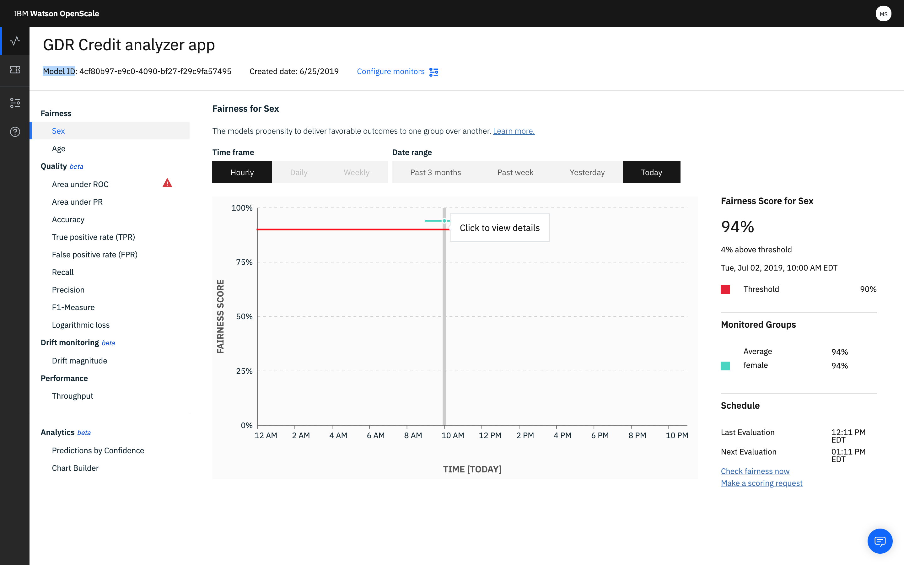

---

copyright:
  years: 2018, 2019
lastupdated: "2019-06-28"

keywords: fairness, monitoring, charts, de-biasing, bias, accuracy

subcollection: ai-openscale

---

{:shortdesc: .shortdesc}
{:external: target="_blank" .external}
{:tip: .tip}
{:important: .important}
{:note: .note}
{:pre: .pre}
{:codeblock: .codeblock}
{:download: .download}
{:screen: .screen}
{:javascript: .ph data-hd-programlang='javascript'}
{:java: .ph data-hd-programlang='java'}
{:python: .ph data-hd-programlang='python'}
{:swift: .ph data-hd-programlang='swift'}
{:faq: data-hd-content-type='faq'}

# Daten für eine Bereitstellung anzeigen
{: #it-vdep}

Wählen Sie im Dashboard eine Bereitstellung aus, damit Überwachungsdaten für diese Bereitstellung angezeigt werden. In der Überschrift werden Informationen zum bereitgestellten Modell angezeigt, z. B. die Felder für **Modell-ID** und **Erstellungsdatum**.
{: shortdesc}

Da die Algorithmusprüfungen nur jede Stunde ausgeführt werden, sind außerdem Links vorhanden, mit denen Sie Fairness und Qualität bei Bedarf jederzeit prüfen können. In der Anzeige **Zeitplan** können Sie auf die folgenden Links klicken, um eine sofortige Überprüfung Ihrer Daten vorzunehmen:

Klicken Sie als Nächstes auf das Diagramm und verschieben Sie die Markierung auf dem Diagramm, um Statistiken für eine einzelne Stunde anzuzeigen:

- ***Fairness***: Zwei Fairnessmerkmale (Geschlecht und Alter) haben die für die Genehmigung festgelegten Schwellenwerte eingehalten.
- ***Qualität***: Die Metrik **Fläche unterhalb der ROC-Kurve** zeigt einen Alert an, da dieser Wert gegen den konfigurierten Schwellenwert verstößt.
- ***Durchschnittliche Anf./Min. ***: Klicken Sie auf die Metrik **Durchsatz**, um die Anzahl der Datensätze anzuzeigen, die pro Minute verarbeitet wurden. Der Durchsatz wird minütlich berechnet und im Diagramm wird sein Durchschnittswert über den Verlauf der Stunde angezeigt.

## Transaktionen anzeigen
{: #it-tra}

Diese Option ermöglicht Ihnen, die einzelnen Transaktionen anzuzeigen, die zu einer Verzerrung beigetragen haben, wenn Sie auf die Schaltfläche **Transaktionen anzeigen** klicken.

Es wird eine Liste der Transaktionen aufgeführt, bei denen die Bereitstellung verzerrt agiert hat. Klicken Sie für Transaktions-IDs Ihrer Wahl auf den Link **Erklären**, damit in der Registerkarte 'Erklärbarkeit' Details zu der jeweiligen Transaktion angegeben werden. Weitere Informationen hierzu enthält der Abschnitt [Erklärbarkeit überwachen](/docs/services/ai-openscale?topic=ai-openscale-ie-ov).

Wählen Sie die Sicht **Alle Transaktionen** aus, damit alle Transaktionen für das ausgewählte Merkmal (in diesem Beispiel 'ALTER') und den ausgewählten Zeitpunkt (in diesem Beispiel '15. September 2018 13:00') angezeigt werden:

Wählen Sie die Ansicht **Verzerrte Transaktionen** aus, damit nur die Untergruppe der Transaktionen angezeigt wird, bei denen eine Verzerrung der Ergebnisse festgestellt wurde. Jede verzerrte Transaktion wird mit einer ähnlichen, aber geringfügig abgewandelten (durch Perturbation gestörten) Transaktion verglichen, die aufzeigt, wie die Änderung des Wertes für das überwachte Merkmal (ALTER) ein günstiges Ergebnis für die verzerrte Transaktion nach sich zieht:

