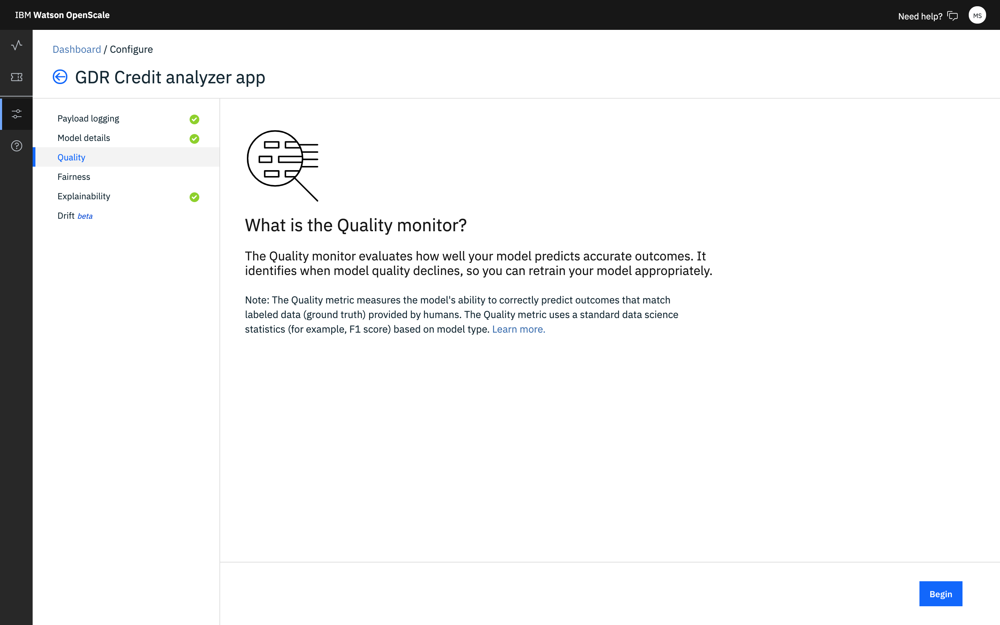

---

copyright:
  years: 2018, 2019
lastupdated: "2019-06-28"

keywords: accuracy, 

subcollection: ai-openscale

---

{:shortdesc: .shortdesc}
{:external: target="_blank" .external}
{:tip: .tip}
{:important: .important}
{:note: .note}
{:pre: .pre}
{:codeblock: .codeblock}
{:download: .download}
{:screen: .screen}
{:javascript: .ph data-hd-programlang='javascript'}
{:java: .ph data-hd-programlang='java'}
{:python: .ph data-hd-programlang='python'}
{:swift: .ph data-hd-programlang='swift'}
{:faq: data-hd-content-type='faq'}

# Qualitäts- (Genauigkeits-) Überwachung konfigurieren
{: #acc-monitor}

Mithilfe der Qualitätsüberwachung (bisher unter der Bezeichnung 'Genauigkeitsüberwachung' bekannt) können Sie die Genauigkeit der von Ihrem Modell gelieferten Vorhersagen ermitteln.
{: shortdesc}

## Konfigurationsschritte
{: #acc-config}

Klicken Sie auf der Registerkarte **Qualität** auf der Seite **Was ist die Qualitätsüberwachung?** auf **Beginnen**, um den Konfigurationsprozess zu starten.

Konfigurieren Sie auf den nachfolgenden Seiten der Registerkarte 'Genauigkeit' die folgenden Einstellungen:

-  Legen Sie den Schwellenwert für Genauigkeitsalerts fest. Wählen Sie einen Wert aus, der eine akzeptable Genauigkeitsstufe liefert. Wenn Sie beispielsweise das **deutsche Kreditrisikomodell** für das interaktive Lernprogramm verwenden, legen Sie den Alert fest auf **90%**.

    Genauigkeit ist ein Wert, der aus relevanten Data-Science-Metriken, die jedem Modelltyp zugeordnet sind, synthetisch erstellt ist. Die Bewertung ist ein normalisiertes Maß, mit dem Sie die Genauigkeit unterschiedlicher Modelltypen ohne großen Aufwand miteinander vergleichen können. In typischen Situationen ist ein Genauigkeitswert von 80 ausreichend. Für das Lernprogramm empfehlen wir 90, um größere Mengen von Daten zu generieren.
    {: note}

-  Legen Sie die minimale und die maximale Stichprobengröße fest. Der Mindeststichprobenumfang verhindert die Messung der Genauigkeit so lange, bis im Dataset für die Auswertung eine Mindestanzahl von Datensätzen zur Verfügung steht, um sicherzustellen, dass die Ergebnisse nicht etwa durch einen zu kleinen Stichprobenumfang verfälscht werden. Der Maximalstichprobenumfang hilft, den für die Datasetauswertung anfallenden Zeit- und Arbeitsaufwand besser zu steuern. Bei Überschreitung der Angabe für den Umfang werden nur die neuesten Datensätze ausgewertet. Wenn Sie beispielsweise das **deutsche Kreditrisikomodell** für das interaktive Lernprogramm verwenden, legen Sie den minimalen Stichprobenumfang auf **100** und den maximalen Stichprobenumfang auf **10000** fest.

Zur Überprüfung wird eine Zusammenfassung der von Ihnen getroffenen Auswahl angezeigt. Falls Sie Änderungen vornehmen möchten, klicken Sie für den betreffenden Abschnitt auf den Link **Bearbeiten**. Klicken Sie andernfalls zum Abschließen Ihrer Konfiguration auf **Speichern**.

### Weitere Schritte
{: #acc-next}

Klicken Sie auf die Registerkarte **Fairness** und dann auf **Beginnen**, um mit der Konfiguration der Überwachungen fortzufahren. Weitere Informationen hierzu enthält der Abschnitt [Fairnessüberwachung konfigurieren](/docs/services/ai-openscale?topic=ai-openscale-mf-monitor).
