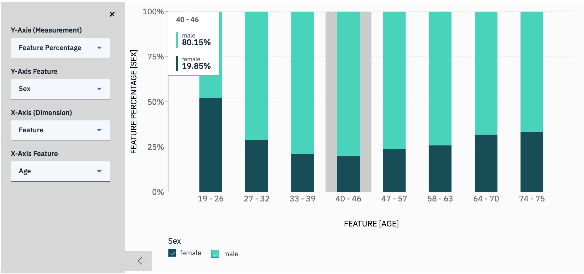

---

copyright:
  years: 2018, 2019
lastupdated: "2019-05-29"

keywords: metrics, monitoring, custom metrics, thresholds

subcollection: ai-openscale

---

{:shortdesc: .shortdesc}
{:new_window: target="_blank"}
{:tip: .tip}
{:important: .important}
{:note: .note}
{:pre: .pre}
{:codeblock: .codeblock}
{:screen: .screen}

# Análisis de métricas y transacciones 
{: #anlz_metrics}

Puede utilizar {{site.data.keyword.aios_full}} para analizar métricas y transacciones mediante diversos medios.
{: shortdesc}

## Métricas de equidad
{: #anlz_metrics_fairness}

Utilice la supervisión de equidad para determinar si los resultados que genera el modelo son justos o no para el grupo supervisado. Cuando la supervisión de equidad está habilitada, de forma predeterminada genera un conjunto de métricas cada hora. Puede generar estas métricas bajo demanda pulsando el botón **Comprobar calidad ahora** o utilizando el cliente Python.

Las métricas de equidad se calculan en función de la siguiente información:

- Los datos de carga útil de puntuación.

Para una supervisión adecuada, cada solicitud de puntuación se debe registrar también en {{site.data.keyword.aios_short}}. El registro de datos de carga útil está automatizado para los motores de {{site.data.keyword.pm_full}}.

Para otros motores de aprendizaje automático, los datos de carga útil se pueden proporcionar mediante el cliente Python o la API REST.

Para motores de aprendizaje automático que no sean {{site.data.keyword.pm_full}}, la supervisión de equidad crea solicitudes de puntuación adicionales en el despliegue supervisado.
{: note}

Puede revisar los valores de todas las métricas a lo largo del tiempo en el panel de control de {{site.data.keyword.aios_short}}:

Puede revisar los detalles relacionados, como los resultados favorables y desfavorables:

Puede ver las transacciones detalladas:

Puede ver el punto final de puntuación sesgada recomendado:

### Métricas de equidad recomendadas
{: #anlz_metrics_supfairmets}

{{site.data.keyword.aios_short}} da soporte a las métricas de equidad siguientes:

#### Equidad para un grupo
{: #anlz_metrics_supfairmets_group}

- **Descripción**: la propensidad de los modelos a entregar resultados favorables a un grupo más que a otro.
- **Umbrales predeterminados**: límite inferior = 80%
- **Recomendación predeterminada**: punto final de puntuación sesgada que puede utilizar en su aplicación empresarial para recibir respuestas sesgadas del modelo desplegado.
- **Tipo de problema**: todos
- **Tipo de datos**: estructurados
- **Valores de gráfico**: último valor en el margen de tiempo
- **Detalles de métricas disponibles**: sí

### Detalles de equidad soportados
{: #anlz_metrics_supfairdets}

{{site.data.keyword.aios_short}} da soporte a los siguientes detalles de métricas de equidad:

- Los porcentajes favorables para cada uno de los grupos
- Los promedios de equidad para todos los grupos de equidad

  Proporción de impacto desigual = (% de resultado favorable en grupo supervisado) / (% de resultado favorable en grupo de referencia)

- Distribución de los datos para cada uno de los grupos supervisados
- Distribución de los datos de carga útil

<!---
BTW, I propose to use screenshots with data from FastPath.
Source monitored group or referenced group
Source of bias is also in fairness metrics
--->

## Métricas de calidad
{: #anlz_metrics_quality}

Utilice la supervisión de calidad para determinar con qué precisión el modelo predice los resultados. Cuando la supervisión de calidad está habilitada, de forma predeterminada genera un conjunto de métricas cada hora. Puede generar estas métricas bajo demanda pulsando el botón **Comprobar calidad ahora** o utilizando el cliente Python.

Las métricas de calidad se calculan según la siguiente información:

- Los datos de opiniones etiquetados manualmente
- Las respuestas de despliegue supervisado para estos datos.

Para una supervisión adecuada, los datos de opiniones se deben registrar regularmente en {{site.data.keyword.aios_short}}. Los datos de opiniones se pueden proporcionar mediante la opción "Añadir datos de opiniones" o mediante el cliente Python o la API REST.

Para motores de aprendizaje automático que no sean {{site.data.keyword.aios_short}}, como por ejemplo Microsoft Azure ML Studio o Amazon Sagemaker ML, la supervisión de calidad crea solicitudes de puntuación adicionales en el despliegue supervisado.
{: note}

Puede revisar los valores de todas las métricas a lo largo del tiempo en el panel de control de {{site.data.keyword.aios_short}}:

Para consultar la información relacionada, como por ejemplo Confusion Matrix para la clasificación binaria y multiclase, que está disponible para algunas métricas, pulse en la gráfica.

### Métricas de calidad soportadas
{: #anlz_metrics_supqualdets}

{{site.data.keyword.aios_short}} da soporte a las métricas de calidad siguientes:

#### Área bajo ROC
{: #anlz_metrics_supqualdets_roc}

- **Descripción**: área bajo exhaustividad y curva de índice de falsos positivos.
- **Umbrales predeterminados**: límite inferior = 80%
- **Recomendación predeterminada**:
   - **Tendencia al alza**: una tendencia al alza indica que la métrica está mejorando. Esto significa que el reentrenamiento del modelo es efectivo.
   - **Tendencia a la baja**: una tendencia a la baja indica que la métrica se está deteriorando. Los datos de opinión son ligeramente diferentes a los datos de entrenamiento.
   - **Variación errática o irregular**: una variación errática o irregular indica que los datos de opinión no son coherentes entre evaluaciones. Incremente el tamaño mínimo de la muestra para el supervisor de calidad.
- **Tipo de problema**: clasificación binaria
- **Valores de gráfico**: último valor en el margen de tiempo
- **Detalles de métricas disponibles**: Confusion Matrix

#### Área bajo PR
{: #anlz_metrics_supqualdets_pr}

- **Descripción**: área bajo precisión y curva de exhaustividad
- **Umbrales predeterminados**: límite inferior = 80%
- **Recomendación predeterminada**:
   - **Tendencia al alza**: una tendencia al alza indica que la métrica está mejorando. Esto significa que el reentrenamiento del modelo es efectivo.
   - **Tendencia a la baja**: una tendencia a la baja indica que la métrica se está deteriorando. Los datos de opinión son ligeramente diferentes a los datos de entrenamiento.
   - **Variación errática o irregular**: una variación errática o irregular indica que los datos de opinión no son coherentes entre evaluaciones. Incremente el tamaño mínimo de la muestra para el supervisor de calidad.
- **Tipo de problema**: clasificación binaria
- **Valores de gráfico**: último valor en el margen de tiempo
- **Detalles de métricas disponibles**: Confusion Matrix

#### Proporción de varianza explicada
{: #anlz_metrics_supqualdets_var}

- **Descripción**: la proporción de varianza explicada es la proporción de varianza explicada y la varianza de destino. La varianza explicada es la diferencia entre la varianza de destino y la varianza de error de predicción.
- **Umbrales predeterminados**: límite inferior = 80%
- **Recomendación predeterminada**:
   - **Tendencia al alza**: una tendencia al alza indica que la métrica está mejorando. Esto significa que el reentrenamiento del modelo es efectivo.
   - **Tendencia a la baja**: una tendencia a la baja indica que la métrica se está deteriorando. Los datos de opinión son ligeramente diferentes a los datos de entrenamiento.
   - **Variación errática o irregular**: una variación errática o irregular indica que los datos de opinión no son coherentes entre evaluaciones. Incremente el tamaño mínimo de la muestra para el supervisor de calidad.
- **Tipo de problema**: Regresión
- **Valores de gráfico**: último valor en el margen de tiempo
- **Detalles de métricas disponibles**: ninguno

#### Error absoluto promedio
{: #anlz_metrics_supqualdets_abserror}

- **Descripción**: promedio de la diferencia absoluta entre la predicción del modelo y el valor de destino
- **Umbrales predeterminados**: límite superior = 80%
- **Recomendación predeterminada**:
   - **Tendencia al alza**: una tendencia al alza indica que la métrica se está deteriorando. Los datos de opinión son ligeramente diferentes a los datos de entrenamiento.
   - **Tendencia a la baja**: una tendencia a la baja indica que la métrica está mejorando. Esto significa que el reentrenamiento del modelo es efectivo.
   - **Variación errática o irregular**: una variación errática o irregular indica que los datos de opinión no son coherentes entre evaluaciones. Incremente el tamaño mínimo de la muestra para el supervisor de calidad.
- **Tipo de problema**: Regresión
- **Valores de gráfico**: último valor en el margen de tiempo
- **Detalles de métricas disponibles**: ninguno

#### Error cuadrático promedio
{: #anlz_metrics_supqualdets_squerror}

- **Descripción**: promedio de la diferencia cuadrática entre la predicción del modelo y el valor de destino
- **Umbrales predeterminados**: límite superior = 80%
- **Recomendación predeterminada**:
   - **Tendencia al alza**: una tendencia al alza indica que la métrica se está deteriorando. Los datos de opinión son ligeramente diferentes a los datos de entrenamiento.
   - **Tendencia a la baja**: una tendencia a la baja indica que la métrica está mejorando. Esto significa que el reentrenamiento del modelo es efectivo.
   - **Variación errática o irregular**: una variación errática o irregular indica que los datos de opinión no son coherentes entre evaluaciones. Incremente el tamaño mínimo de la muestra para el supervisor de calidad.
- **Tipo de problema**: Regresión
- **Valores de gráfico**: último valor en el margen de tiempo
- **Detalles de métricas disponibles**: ninguno

#### R cuadrado
{: #anlz_metrics_supqualdets_r_squared}

- **Descripción**: proporción de diferencia entre la varianza de destino y la varianza para error de predicción con la varianza de destino
- **Umbrales predeterminados**: límite inferior = 80%
- **Recomendación predeterminada**:
   - **Tendencia al alza**: una tendencia al alza indica que la métrica está mejorando. Esto significa que el reentrenamiento del modelo es efectivo.
   - **Tendencia a la baja**: una tendencia a la baja indica que la métrica se está deteriorando. Los datos de opinión son ligeramente diferentes a los datos de entrenamiento.
   - **Variación errática o irregular**: una variación errática o irregular indica que los datos de opinión no son coherentes entre evaluaciones. Incremente el tamaño mínimo de la muestra para el supervisor de calidad.
- **Tipo de problema**: Regresión
- **Valores de gráfico**: último valor en el margen de tiempo
- **Detalles de métricas disponibles**: ninguno

#### Raíz del error cuadrático promedio
{: #anlz_metrics_supqualdets_squ_errors_mean}

- **Descripción**: raíz cuadrada de media de cuadrado de la diferencia entre la predicción del modelo y el valor de destino
- **Umbrales predeterminados**: límite superior = 80%
- **Recomendación predeterminada**:
   - **Tendencia al alza**: una tendencia al alza indica que la métrica se está deteriorando. Los datos de opinión son ligeramente diferentes a los datos de entrenamiento.
   - **Tendencia a la baja**: una tendencia a la baja indica que la métrica está mejorando. Esto significa que el reentrenamiento del modelo es efectivo.
   - **Variación errática o irregular**: una variación errática o irregular indica que los datos de opinión no son coherentes entre evaluaciones. Incremente el tamaño mínimo de la muestra para el supervisor de calidad.
- **Tipo de problema**: Regresión
- **Valores de gráfico**: último valor en el margen de tiempo
- **Detalles de métricas disponibles**: ninguno

#### Exactitud
{: #anlz_metrics_supqualdets_acc}

- **Descripción**: la proporción de predicciones correctas
- **Umbrales predeterminados**: límite inferior = 80%
- **Recomendación predeterminada**:
   - **Tendencia al alza**: una tendencia al alza indica que la métrica está mejorando. Esto significa que el reentrenamiento del modelo es efectivo.
   - **Tendencia a la baja**: una tendencia a la baja indica que la métrica se está deteriorando. Los datos de opinión son ligeramente diferentes a los datos de entrenamiento.
   - **Variación errática o irregular**: una variación errática o irregular indica que los datos de opinión no son coherentes entre evaluaciones. Incremente el tamaño mínimo de la muestra para el supervisor de calidad.
- **Tipos de problema**: clasificación binaria y clasificación multiclase
- **Valores de gráfico**: último valor en el margen de tiempo
- **Detalles de métricas disponibles**: Confusion Matrix

#### Índice de verdaderos positivos ponderados (wTPR)
{: #anlz_metrics_supqualdets_wtpr}

- **Descripción**: media ponderada de clase TPR con ponderaciones iguales a la probabilidad de clase
- **Umbrales predeterminados**: límite inferior = 80%
- **Recomendación predeterminada**:
   - **Tendencia al alza**: una tendencia al alza indica que la métrica está mejorando. Esto significa que el reentrenamiento del modelo es efectivo.
   - **Tendencia a la baja**: una tendencia a la baja indica que la métrica se está deteriorando. Los datos de opinión son ligeramente diferentes a los datos de entrenamiento.
   - **Variación errática o irregular**: una variación errática o irregular indica que los datos de opinión no son coherentes entre evaluaciones. Incremente el tamaño mínimo de la muestra para el supervisor de calidad.
- **Tipo de problema**: clasificación multiclase
- **Valores de gráfico**: último valor en el margen de tiempo
- **Detalles de métricas disponibles**: Confusion Matrix

#### Índice de verdaderos positivos (TPR)
{: #anlz_metrics_supqualdets_tpr}

- **Descripción**: proporción de predicciones correctas en predicciones de clase positiva
- **Umbrales predeterminados**: límite inferior = 80%
- **Recomendación predeterminada**:
   - **Tendencia al alza**: una tendencia al alza indica que la métrica está mejorando. Esto significa que el reentrenamiento del modelo es efectivo.
   - **Tendencia a la baja**: una tendencia a la baja indica que la métrica se está deteriorando. Los datos de opinión son ligeramente diferentes a los datos de entrenamiento.
   - **Variación errática o irregular**: una variación errática o irregular indica que los datos de opinión no son coherentes entre evaluaciones. Incremente el tamaño mínimo de la muestra para el supervisor de calidad.
- **Tipo de problema**: clasificación binaria
- **Valores de gráfico**: último valor en el margen de tiempo
- **Detalles de métricas disponibles**: Confusion Matrix

#### Índice de falsos positivos ponderados (wFPR)
{: #anlz_metrics_supqualdets_wfpr_weighted}

- **Descripción**: media ponderada de clase FPR con ponderaciones iguales a la probabilidad de clase
- **Umbrales predeterminados**: límite inferior = 80%
- **Recomendación predeterminada**:
   - **Tendencia al alza**: una tendencia al alza indica que la métrica está mejorando. Esto significa que el reentrenamiento del modelo es efectivo.
   - **Tendencia a la baja**: una tendencia a la baja indica que la métrica se está deteriorando. Los datos de opinión son ligeramente diferentes a los datos de entrenamiento.
   - **Variación errática o irregular**: una variación errática o irregular indica que los datos de opinión no son coherentes entre evaluaciones. Incremente el tamaño mínimo de la muestra para el supervisor de calidad.
- **Tipo de problema**: clasificación multiclase
- **Valores de gráfico**: último valor en el margen de tiempo
- **Detalles de métricas disponibles**: Confusion Matrix

#### Índice de falsos positivos (FPR)
{: #anlz_metrics_supqualdets_fpr_false}

- **Descripción**: proporción de predicciones incorrectas en clase positiva
- **Umbrales predeterminados**: límite inferior = 80%
- **Recomendación predeterminada**:
   - **Tendencia al alza**: una tendencia al alza indica que la métrica está mejorando. Esto significa que el reentrenamiento del modelo es efectivo.
   - **Tendencia a la baja**: una tendencia a la baja indica que la métrica se está deteriorando. Los datos de opinión son ligeramente diferentes a los datos de entrenamiento.
   - **Variación errática o irregular**: una variación errática o irregular indica que los datos de opinión no son coherentes entre evaluaciones. Incremente el tamaño mínimo de la muestra para el supervisor de calidad.
- **Tipo de problema**: clasificación binaria
- **Valores de gráfico**: último valor en el margen de tiempo
- **Detalles de métricas disponibles**: Confusion Matrix

#### Exhaustividad ponderada
{: #anlz_metrics_supqualdets_weighted_recall}

- **Descripción**: media ponderada de exhaustividad con ponderaciones iguales a la probabilidad de clase
- **Umbrales predeterminados**: límite inferior = 80%
- **Recomendación predeterminada**:
   - **Tendencia al alza**: una tendencia al alza indica que la métrica está mejorando. Esto significa que el reentrenamiento del modelo es efectivo.
   - **Tendencia a la baja**: una tendencia a la baja indica que la métrica se está deteriorando. Los datos de opinión son ligeramente diferentes a los datos de entrenamiento.
   - **Variación errática o irregular**: una variación errática o irregular indica que los datos de opinión no son coherentes entre evaluaciones. Incremente el tamaño mínimo de la muestra para el supervisor de calidad.
- **Tipo de problema**: clasificación multiclase
- **Valores de gráfico**: último valor en el margen de tiempo
- **Detalles de métricas disponibles**: Confusion Matrix

#### Exhaustividad
{: #anlz_metrics_supqualdets_recall}

- **Descripción**: proporción de predicciones correctas en clase positiva
- **Umbrales predeterminados**: límite inferior = 80%
- **Recomendación predeterminada**:
   - **Tendencia al alza**: una tendencia al alza indica que la métrica está mejorando. Esto significa que el reentrenamiento del modelo es efectivo.
   - **Tendencia a la baja**: una tendencia a la baja indica que la métrica se está deteriorando. Los datos de opinión son ligeramente diferentes a los datos de entrenamiento.
   - **Variación errática o irregular**: una variación errática o irregular indica que los datos de opinión no son coherentes entre evaluaciones. Incremente el tamaño mínimo de la muestra para el supervisor de calidad.
- **Tipo de problema**: clasificación binaria
- **Valores de gráfico**: último valor en el margen de tiempo
- **Detalles de métricas disponibles**: Confusion Matrix

#### Precisión ponderada
{: #anlz_metrics_supqualdets_wgth_prec}

- **Descripción**: media ponderada de precisión con ponderaciones iguales a la probabilidad de clase
- **Umbrales predeterminados**: límite inferior = 80%
- **Recomendación predeterminada**:
   - **Tendencia al alza**: una tendencia al alza indica que la métrica está mejorando. Esto significa que el reentrenamiento del modelo es efectivo.
   - **Tendencia a la baja**: una tendencia a la baja indica que la métrica se está deteriorando. Los datos de opinión son ligeramente diferentes a los datos de entrenamiento.
   - **Variación errática o irregular**: una variación errática o irregular indica que los datos de opinión no son coherentes entre evaluaciones. Incremente el tamaño mínimo de la muestra para el supervisor de calidad.
- **Tipo de problema**: clasificación multiclase
- **Valores de gráfico**: último valor en el margen de tiempo
- **Detalles de métricas disponibles**: Confusion Matrix

#### Precisión
{: #anlz_metrics_supqualdets_precision}

- **Descripción**: proporción de predicciones correctas en predicciones de clase positiva
- **Umbrales predeterminados**: límite inferior = 80%
- **Recomendación predeterminada**:
   - **Tendencia al alza**: una tendencia al alza indica que la métrica está mejorando. Esto significa que el reentrenamiento del modelo es efectivo.
   - **Tendencia a la baja**: una tendencia a la baja indica que la métrica se está deteriorando. Los datos de opinión son ligeramente diferentes a los datos de entrenamiento.
   - **Variación errática o irregular**: una variación errática o irregular indica que los datos de opinión no son coherentes entre evaluaciones. Incremente el tamaño mínimo de la muestra para el supervisor de calidad.
- **Tipo de problema**: clasificación binaria
- **Valores de gráfico**: último valor en el margen de tiempo
- **Detalles de métricas disponibles**: Confusion Matrix

#### Medida F1 ponderada
{: #anlz_metrics_supqualdets_wght_f1-measure}

- **Descripción**: medida ponderada de la medida F1 con ponderaciones iguales a la probabilidad de clase
- **Umbrales predeterminados**: límite inferior = 80%
- **Recomendación predeterminada**:
   - **Tendencia al alza**: una tendencia al alza indica que la métrica está mejorando. Esto significa que el reentrenamiento del modelo es efectivo.
   - **Tendencia a la baja**: una tendencia a la baja indica que la métrica se está deteriorando. Los datos de opinión son ligeramente diferentes a los datos de entrenamiento.
   - **Variación errática o irregular**: una variación errática o irregular indica que los datos de opinión no son coherentes entre evaluaciones. Incremente el tamaño mínimo de la muestra para el supervisor de calidad.
- **Tipo de problema**: clasificación multiclase
- **Valores de gráfico**: último valor en el margen de tiempo
- **Detalles de métricas disponibles**: Confusion Matrix

#### Medida F1
{: #anlz_metrics_supqualdets_f1-measr}

- **Descripción**: media armónica de precisión y exhaustividad
- **Umbrales predeterminados**: límite inferior = 80%
- **Recomendación predeterminada**:
   - **Tendencia al alza**: una tendencia al alza indica que la métrica está mejorando. Esto significa que el reentrenamiento del modelo es efectivo.
   - **Tendencia a la baja**: una tendencia a la baja indica que la métrica se está deteriorando. Los datos de opinión son ligeramente diferentes a los datos de entrenamiento.
   - **Variación errática o irregular**: una variación errática o irregular indica que los datos de opinión no son coherentes entre evaluaciones. Incremente el tamaño mínimo de la muestra para el supervisor de calidad.
- **Tipo de problema**: clasificación binaria
- **Valores de gráfico**: último valor en el margen de tiempo
- **Detalles de métricas disponibles**: Confusion Matrix

#### Pérdida logarítmica
{: #anlz_metrics_supqualdets_log_loss}

- **Descripción**: media de probabilidades de clase de destino de logaritmos (confianza). También se conoce como logaritmo de verosimilitud previsto.
- **Umbrales predeterminados**: límite inferior = 80%
- **Recomendación predeterminada**:
   - **Tendencia al alza**: una tendencia al alza indica que la métrica está mejorando. Esto significa que el reentrenamiento del modelo es efectivo.
   - **Tendencia a la baja**: una tendencia a la baja indica que la métrica se está deteriorando. Los datos de opinión son ligeramente diferentes a los datos de entrenamiento.
   - **Variación errática o irregular**: una variación errática o irregular indica que los datos de opinión no son coherentes entre evaluaciones. Incremente el tamaño mínimo de la muestra para el supervisor de calidad.
- **Tipo de problema**: clasificación binaria y clasificación multiclase
- **Valores de gráfico**: último valor en el margen de tiempo
- **Detalles de métricas disponibles**: ninguno

### Detalles de calidad soportados
{: #anlz_metrics_supqualdets_suppr_dets}

{{site.data.keyword.aios_short}} da soporte a los siguientes detalles de métricas de calidad:

#### Confusion Matrix
{: #anlz_metrics_supqualdets_confusion}

Confusion Matrix le ayuda a comprender para cuáles de sus datos de opiniones la respuesta de despliegue supervisado es correcta y para cuáles no lo es.

## Métricas de rendimiento
{: #anlz_metrics_performance}

Utilice la supervisión de rendimiento para conocer la velocidad de los registros de datos procesados por el despliegue. La supervisión de rendimiento se habilita al seleccionar el despliegue para el seguimiento y la supervisión por parte de {{site.data.keyword.aios_short}}.

Las métricas de rendimiento se calculan en función de la información siguiente:

- Los datos de carga útil de puntuación

Para una supervisión adecuada, cada solicitud de puntuación se debe registrar también en {{site.data.keyword.aios_short}}. El registro de datos de carga útil está automatizado para los motores de {{site.data.keyword.pm_full}}. Para otros motores de aprendizaje automático, los datos de carga útil se pueden proporcionar mediante el cliente Python o la API REST. La supervisión de rendimiento no crea ninguna solicitud de puntuación adicional en el despliegue supervisado.

Puede revisar el valor de las métricas de rendimiento a lo largo del tiempo en el panel de control de {{site.data.keyword.aios_short}}:

### Métricas de rendimiento soportadas
{: #anlz_metrics_performance_supp_quality_mets}

{{site.data.keyword.aios_short}} da soporte a las siguientes métricas de rendimiento:

#### Productividad
{: #anlz_metrics_performance_supp_quality_mets_through}

- **Descripción**: promedio de solicitudes de puntuación por minuto en un periodo de tiempo específico
- **Umbrales predeterminados**: no aplicable
- **Recomendación predeterminada**: no aplicable
- **Tipo de problema**: todos
- **Valores de gráfico**: valor promedio en el periodo de tiempo
- **Detalles de métricas disponibles**: ninguno

## Análisis de datos de carga útil
{: #anlz_metrics_payload}

Puede analizar la carga útil de puntuación que se envía al despliegue en el rango de datos seleccionado mediante uno de los dos métodos siguientes:

- Por clases de predicción de revisión y distribución de confianza en cada clase
   
   
   
- Por gráfico personalizado (seleccionando entre características, clases de predicción y confianza)
   
   

