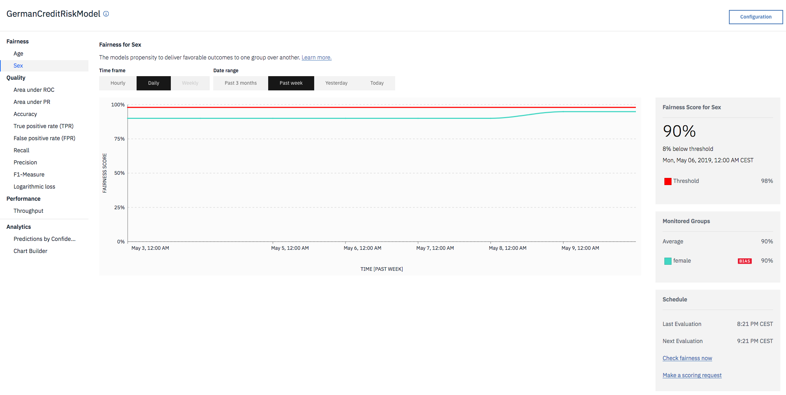

---

copyright:
  years: 2018, 2019
lastupdated: "2019-06-11"

keywords: metrics, monitoring, custom metrics, thresholds

subcollection: ai-openscale

---

{:shortdesc: .shortdesc}
{:external: target="_blank" .external}
{:tip: .tip}
{:important: .important}
{:note: .note}
{:pre: .pre}
{:codeblock: .codeblock}
{:download: .download}
{:screen: .screen}
{:javascript: .ph data-hd-programlang='javascript'}
{:java: .ph data-hd-programlang='java'}
{:python: .ph data-hd-programlang='python'}
{:swift: .ph data-hd-programlang='swift'}
{:faq: data-hd-content-type='faq'}

# Descripción general de las métricas de equidad
{: #anlz_metrics_fairness}

Utilice la supervisión de equidad de {{site.data.keyword.aios_full}} para determinar si los resultados que genera el modelo son justos o no para el grupo supervisado. Cuando la supervisión de equidad está habilitada, de forma predeterminada genera un conjunto de métricas cada hora. Puede generar estas métricas bajo demanda pulsando el botón **Comprobar calidad ahora** o utilizando el cliente Python.
{: shortdesc}

{{site.data.keyword.aios_short}} identifica automáticamente si algún atributo protegido conocido está presente en un modelo. Cuando {{site.data.keyword.aios_short}} detecta estos atributos, automáticamente recomienda configurar los supervisores de sesgo para cada atributo presente, a fin de garantizar que se realiza el seguimiento en producción del sesgo en estos atributos potencialmente sensibles. 

Actualmente, {{site.data.keyword.aios_short}} detecta y recomienda supervisores para los siguientes atributos protegidos: 

- sexo
- grupo étnico
- estado civil
- edad
- código postal

Además de detectar los atributos protegidos, {{site.data.keyword.aios_short}} recomienda qué valores de cada atributo se deberían establecer como valores supervisados y cuáles como valores de referencia.  Así, por ejemplo, {{site.data.keyword.aios_short}} recomienda que, para el atributo "Sexo", en el supervisor de sesgo se configure "Mujer" y "No binario" como valores supervisados y "Hombre" como valor de referencia. Si desea cambiar alguna de las recomendaciones, puede editarlas mediante el panel de configuración de sesgo. 

Los supervisores de sesgo recomendados ayudan a agilizar la configuración y garantizan que compruebe la equidad respecto a los atributos sensibles de sus modelos de inteligencia artificial. A medida que los reguladores prestan cada vez más atención al sesgo algorítmico, es cada vez más importante que las organizaciones comprendan el funcionamiento de sus modelos y si estos generan resultados injustos para determinados grupos. 

Las métricas de equidad se calculan en función de la siguiente información:

- Los datos de carga útil de puntuación.

Para una supervisión adecuada, cada solicitud de puntuación se debe registrar también en {{site.data.keyword.aios_short}}. El registro de datos de carga útil está automatizado para los motores de {{site.data.keyword.pm_full}}.

Para otros motores de aprendizaje automático, los datos de carga útil se pueden proporcionar mediante el cliente Python o la API REST.

Para motores de aprendizaje automático que no sean {{site.data.keyword.pm_full}}, la supervisión de equidad crea solicitudes de puntuación adicionales en el despliegue supervisado.
{: note}

Puede revisar los valores de todas las métricas a lo largo del tiempo en el panel de control de {{site.data.keyword.aios_short}}:



Puede revisar los detalles relacionados, como los resultados favorables y desfavorables:


Puede ver las transacciones detalladas:


Puede ver el punto final de puntuación sesgada recomendado:


### Métricas de equidad recomendadas
{: #anlz_metrics_supfairmets}

{{site.data.keyword.aios_short}} da soporte a las métricas de equidad siguientes:

- [Equidad para un grupo](https://test.cloud.ibm.com/docs/services/ai-openscale?topic=ai-openscale-quality_group)

{{site.data.keyword.aios_short}} da soporte a los siguientes atributos protegidos: 

- [sexo](/docs/services/ai-openscale?topic=ai-openscale-quality_group#quality_group-sex)
- [grupo étnico](/docs/services/ai-openscale?topic=ai-openscale-quality_group#quality_group-ethnicity)
- [estado civil](/docs/services/ai-openscale?topic=ai-openscale-quality_group#quality_group-marital)
- [edad](/docs/services/ai-openscale?topic=ai-openscale-quality_group#quality_group-age)
- [código postal](/docs/services/ai-openscale?topic=ai-openscale-quality_group#quality_group-zip)


### Detalles de equidad soportados
{: #anlz_metrics_supfairdets}

{{site.data.keyword.aios_short}} da soporte a los siguientes detalles de métricas de equidad:

- Los porcentajes favorables para cada uno de los grupos
- Los promedios de equidad para todos los grupos de equidad

```
                              (% de resultados favorables en grupo supervisado
Índice de impacto desigual =  ____________________________________________
                              (% de resultados favorables en grupo de referencia)
```

- Distribución de los datos para cada uno de los grupos supervisados
- Distribución de los datos de carga útil
