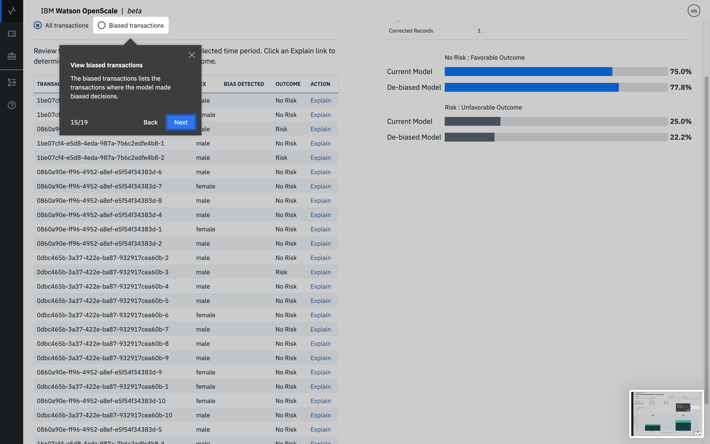

---

copyright:
  years: 2018, 2019
lastupdated: "2019-06-24"

keywords: ai, getting started, tutorial, understanding, fast start

subcollection: ai-openscale

---

{:shortdesc: .shortdesc}
{:new_window: target="_blank"}
{:hide-dashboard: .hide-dashboard}
{:tip: .tip}
{:important: .important}
{:note: .note}
{:pre: .pre}
{:codeblock: .codeblock}
{:screen: .screen}
{:javascript: .ph data-hd-programlang='javascript'}
{:java: .ph data-hd-programlang='java'}
{:python: .ph data-hd-programlang='python'}
{:swift: .ph data-hd-programlang='swift'}

# Configuración automatizada
{: #wos-fast-start}

Para ver rápidamente cómo {{site.data.keyword.aios_short}} supervisa un modelo, ejecute la opción de escenario de demostración que se proporciona al iniciar sesión por primera vez en la interfaz de usuario de {{site.data.keyword.aios_short}}.  Consulte [Trabajar con la demostración de la interfaz de usuario](#wos-work-demo).
{: shortdesc}

## Antes de empezar
{: #wos-prereqs}

Antes de empezar la visita guiada, debe tener los recursos siguientes ya configurados:

- {{site.data.keyword.ibmid}}
- {{site.data.keyword.aios_full}}

## Trabajar con la demostración de la interfaz de usuario
{: #wos-work-demo}

1.  Inicie sesión en la instancia de {{site.data.keyword.aios_short}} en {{site.data.keyword.bluemix_full}}.
1.  Para trabajar con el escenario de demo, pulse **Ejecutar demo**.

   

   Mientras se proporcionan los servicios de {{site.data.keyword.aios_short}}, puede revisar el escenario de demostración:

   

Cuando se haya completado el suministro, pulse el botón **Adelante** para realizar la visita guiada del panel de control de {{site.data.keyword.aios_short}} y continúe con [Visualización de los resultados en {{site.data.keyword.aios_short}}](#wos-open).

   

## Visualización de los resultados en {{site.data.keyword.aios_short}}
{: #wos-open}

Para ver los detalles sobre la equidad y la exactitud del modelo, los detalles de los datos supervisados y la explicabilidad de una transacción individual, abra el panel de control de{{site.data.keyword.aios_short}}. Cada despliegue se muestra como un mosaico. La visita guiada ha configurado un despliegue denominado `GermanCreditRiskModel`, tal como se muestra en la siguiente captura de pantalla:

   

### Ver detalles
{: #wos-insights}

La página Detalles muestra de un solo vistazo cualquier problema relacionado con la equidad y la exactitud, según determinan los umbrales configurados.

   

### Ver datos de supervisión
{: #wos-monitoring}

1.  En la página Detalles, pulse el mosaico `GermanCreditRiskModelICP` para ver los detalles sobre los datos supervisados.
1.  Pulse y arrastre el marcador por el gráfico para ver un periodo de día y hora que muestre datos y a continuación pulse el enlace **Ver detalles**. Como alternativa, puede pulsar distintos periodos de tiempo en el gráfico para cambiar los datos que se visualizan.

     - Por ejemplo, la pantalla siguiente muestra datos correspondientes a una fecha y hora específicas. Las fechas y las horas varían, en función de cuándo se ejecuta el módulo.

     - Para obtener información sobre cómo interpretar el gráfico de series de tiempo, consulte [Supervisión de la equidad, solicitudes promedio por minuto y exactitud](/docs/services/ai-openscale-icp?topic=ai-openscale-icp-itc-timechart).

   

1.  Para ver detalles sobre la supervisión de datos de `SEXO`, asegúrese de que `SEXO` esté seleccionado en el menú desplegable.

    - Observe que en la siguiente captura de pantalla existe un sesgo.
    
   

    - Para obtener información sobre cómo interpretar el gráfico de los puntos de datos de una hora específica, consulte [Visualización de datos](/docs/services/ai-openscale-icp?topic=ai-openscale-icp-itc-timechart#itc-data-visual).

### Ver explicabilidad
{: #wos-explain}

Para comprender los factores que contribuyen a que haya un sesgo para un periodo de tiempo determinado, en la pantalla visualización que se muestra en la sección anterior pulse el botón de selección **Transacciones sesgadas**.

   

Se listan los ID de transacción de la última hora correspondientes a las transacciones sesgadas. Para el modelo utilizado en este módulo, existe un sesgo para las solicitudes disponibles.

   

Para obtener información sobre cómo buscar y explicar transacciones, consulte [Supervisión de la explicabilidad](/docs/services/ai-openscale-icp?topic=ai-openscale-icp-ie-ov).

   

## Finalización de la visita guiada
{: #wos-done-demo}

1. Pulse el botón **Fin**.

   

2. Pulse el botón **Adelante** para empezar a trabajar con {{site.data.keyword.aios_short}}.

   

## Información relacionada
{: #wos-info}

- Para obtener información sobre sesgos, consulte [Equidad](/docs/services/ai-openscale-icp?topic=ai-openscale-icp-mf-monitor).
- Para obtener información sobre la exactitud con la que el modelo predice los resultados, consulte [Exactitud](/docs/services/ai-openscale-icp?topic=ai-openscale-icp-acc-monitor).
- Para obtener más información sobre cómo interpretar los gráficos, datos y transacciones, consulte [Supervisión de la equidad, solicitudes promedio por minuto y exactitud](/docs/services/ai-openscale-icp?topic=ai-openscale-icp-itc-timechart).
