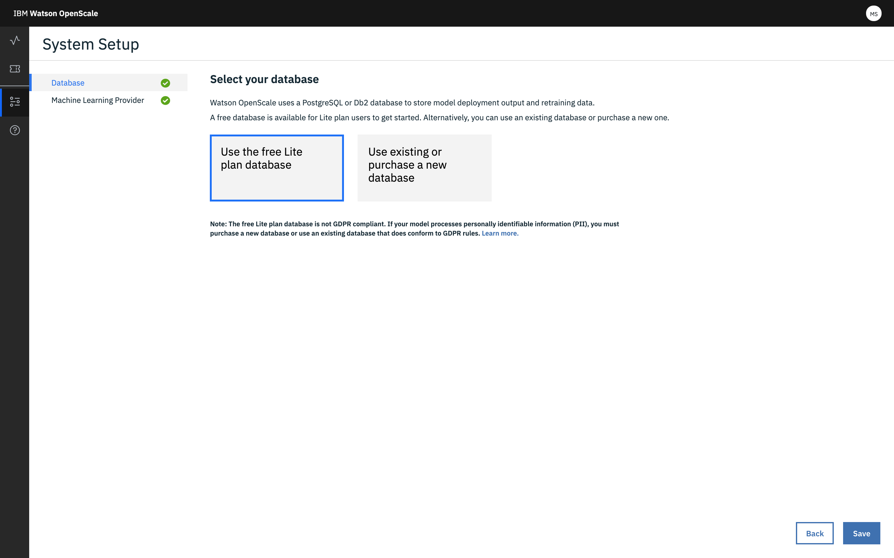
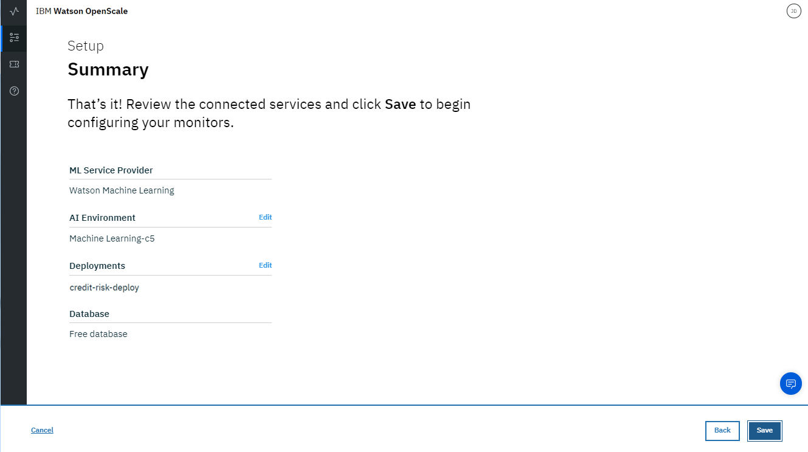
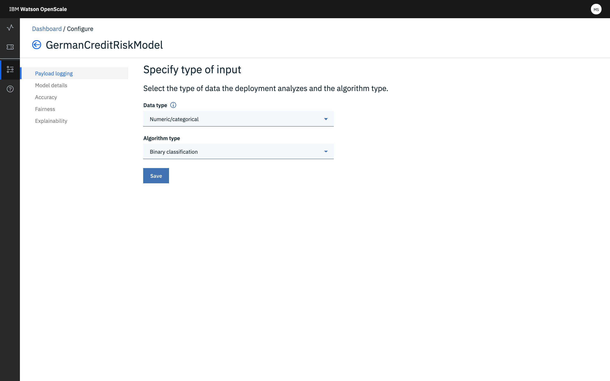
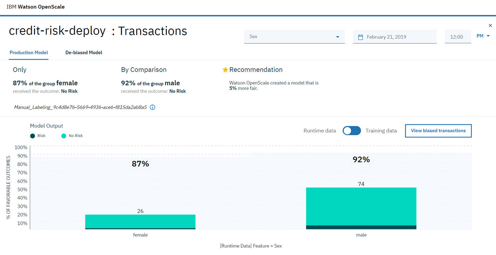

---

title: Trust and transparency for your machine learning models with {{site.data.keyword.aios_short}}
description: Monitor your machine learning deployments for bias, accuracy, and explainability
duration: 120
intro: In this tutorial, you will provision IBM Cloud machine learning and data services, create and deploy machine learning models in Watson studio, and configure the new IBM {{site.data.keyword.aios_full}} product to monitor your models for trust and transparency.
takeaways:
- See how {{site.data.keyword.aios_short}} provides trust and transparency for AI models
- Understand how IBM Cloud services and Watson Studio technologies can provide a seamless, AI-driven customer experience

copyright:
  years: 2018, 2019
lastupdated: "2019-05-06"

keywords: ai, getting started, tutorial, understanding, video

subcollection: ai-openscale

---

{:shortdesc: .shortdesc}
{:new_window: target="_blank"}
{:hide-dashboard: .hide-dashboard}
{:tip: .tip}
{:important: .important}
{:note: .note}
{:pre: .pre}
{:codeblock: .codeblock}
{:screen: .screen}
{:javascript: .ph data-hd-programlang='javascript'}
{:java: .ph data-hd-programlang='java'}
{:python: .ph data-hd-programlang='python'}
{:swift: .ph data-hd-programlang='swift'}

# Cómo empezar - Guía de aprendizaje (básico)
{: #gettingstarted}

{{site.data.keyword.aios_full}} permite a las empresas automatizar y operacionalizar el ciclo de vida de la inteligencia artificial en las aplicaciones empresariales, garantizando que los modelos de inteligencia artificial no contienen sesgos, que los usuarios empresariales los pueden explicar y comprender fácilmente y que son auditables en las transacciones empresariales. {{site.data.keyword.aios_short}} admite modelos de inteligencia artificial creados y ejecutados en las herramientas y que sirven como modelos de las infraestructuras que se elijan.
{: shortdesc}

## Descripción general
{: #gs-view-demo}

Vea este vídeo para obtener una descripción general rápida de {{site.data.keyword.aios_short}}.

  

    <iframe class="embed-responsive-item" id="youtubeplayer" title="Confianza y transparencia en la inteligencia artificial" type="text/html" width="640" height="390" src="https://www.youtube.com/embed/6Ei8rPVtCf8" frameborder="0" webkitallowfullscreen mozallowfullscreen allowfullscreen> </iframe>
  

## Caso de uso de {{site.data.keyword.aios_short}}
{: #gs-use}

Los prestamistas tradicionales se ven presionados a ampliar su cartera digital de servicios financieros a un público más amplio y diverso, lo que requiere un nuevo enfoque al modelado de riesgo crediticio. Sus equipos de ciencia de datos actualmente se basan en técnicas de modelado tradicionales, como árboles de decisión y regresión logística, que funcionan bien para conjuntos de datos moderados y realizan recomendaciones que se pueden explicar fácilmente. Esto satisface los requisitos normativos de que las decisiones sobre préstamos crediticios deben ser transparentes y explicables.

Para proporcionar acceso a crédito a una población más amplia y de mayor riesgo, las historias de crédito de los solicitantes deben expandirse más allá del crédito tradicional, como, por ejemplo, los créditos hipotecarios y los créditos para vehículos, a fuentes de créditos alternativas como las historias de pago de planes de telefonía móvil y servicios, así como a la formación y los puestos laborales. Estas nuevas fuentes de datos prometen, pero también añaden riesgo, puesto que aumenta la probabilidad de correlaciones inesperadas que introduzcan un sesgo según la edad, el sexo y otras características personales de los solicitantes.

Las técnicas de ciencia de datos más adecuadas para estos diversos conjuntos de datos, tales como los árboles de potenciación del gradiente y las redes neuronales, pueden generar modelos de riesgo precisos, pero con un coste. Estos modelos "de caja negra" generan predicciones opacas que de alguna manera deben ser transparentes, a fin de garantizar la aprobación normativa, como por ejemplo el Artículo 22 de la Regulación de Protección General de Datos (GDPR) o el Fair Credit Reporting Act (FCRA) del gobierno federal de Estados Unidos que gestiona el Consumer Financial Protection Bureau.

El modelo de riesgo crediticio que se proporciona en esta guía de aprendizaje utiliza un conjunto de datos de entrenamiento que contiene 20 atributos sobre cada solicitante de préstamo. Dos de estos atributos, edad y sexo, se pueden probar para comprobar si presentan algún sesgo. Para esta guía de aprendizaje, nos centraremos en el sesgo respecto a sexo y edad.

{{site.data.keyword.aios_short}} supervisará la propensión del modelo desplegado a un resultado favorable ("Sin riesgo") para un grupo (el grupo de referencia) respecto a otro (el grupo supervisado). En esta guía de aprendizaje, el grupo supervisado para sexo es `mujer`, y el grupo supervisado para edad es `de 19 a 25`.

<!---
### How {{site.data.keyword.aios_short}} can help
{: #gs-how}

- *Identify run-time bias in the model*: The company has established evidence that shows the key factors that should influence which drug is predicted are BP, CHOLESTEROL, K and NA. AGE and SEX do play a role, but they're not as significant when compared to the other indicators. The company suspects that the data coming from patient trials might have suffered from biases of the practitioners for prescribing medications based on SEX and BP. The company wants to constantly monitor for such biases being learned from the data, and flag a suspected bias.

- *Constantly validate the accuracy of the model*: The company routinely evaluates the model prediction by having experts provide their own drug recommendations based on the patient data. The goal is to integrate these manual evaluations as feedback, to tell the model in real time where it might be wrong, and improve it over time.

- *Make the model more trustworthy*: To achieve a successful adoption of its AI assistant, the company received feedback from its customer base of medical practitioners and doctors who said they would not trust the AI model recommendations without understanding the logic behind them.

Each of these issues will be addressed in this tutorial, through the use of {{site.data.keyword.aios_short}}:

- The Fairness monitor will flag SEX and BP biases the model may have
- The Accuracy monitor uses feedback generated by your experts to test the performance of the deployed model, to detect model drift
--->

## Alternate setup option
{: #gs-module}

Instead of completing the following tutorial to explore {{site.data.keyword.aios_short}}, technical users can install a Python module that automates the provisioning and configuration of prerequisite services. This module requires that Python 3 is installed, which includes the pip package management system. For instructions, see, [Installing a Python module to set up {{site.data.keyword.aios_short}}](/docs/services/ai-openscale?topic=ai-openscale-as-module).

Additional tutorial links may be found in the [Additional resources](/docs/services/ai-openscale?topic=ai-openscale-arsc-ov) topic.

## Tutorial objectives
{: #gs-obj}

In this tutorial, you will:

- Provision {{site.data.keyword.Bluemix_notm}} machine learning and storage services
- Set up a Watson Studio project, and create, train and deploy a machine learning model
- Configure and explore trust, transparency and explainability for your model

## Provision prerequisite {{site.data.keyword.Bluemix_notm}} services
{: #gs-prps}

In addition to {{site.data.keyword.aios_short}}, to complete this tutorial, you need the following accounts and services.

<!---

Para el servicio de {{site.data.keyword.composeForPostgreSQL}}, se requiere un plan Standard **de pago**. Se puede obtener un crédito de {{site.data.keyword.Bluemix_notm}} por valor de 200 dólares si se convierte en una cuenta de pago con una tarjeta de crédito. Si ya tiene una cuenta de pago, recibirá un reembolso único de 16 dólares del coste de su primer GB de almacenamiento, durante un mes.
{: sugerencia}

--->

**Importante**: Para obtener el mejor rendimiento, se recomienda que los servicios de requisito previo se creen en la misma región que {{site.data.keyword.aios_short}}. Para ver las ubicaciones disponibles para {{site.data.keyword.aios_short}}, consulte [Disponibilidad del servicio](/docs/resources?topic=resources-services_region).

1.  Inicie sesión en su cuenta de [{{site.data.keyword.Bluemix_notm}} ](https://{DomainName}){: new_window} con su {{site.data.keyword.ibmid}}.
1.  Para cada uno de los servicios siguientes que no tenga aún asociados a su cuenta, cree una instancia pulsando el enlace, dándole un nombre al servicio y seleccionando el plan **Lite** (gratuito) y pulsando el botón **Crear**:
    - [Watson Studio ](https://{DomainName}/catalog/services/watson-studio){: new_window}

      

    - [Watson Machine Learning ](https://{DomainName}/catalog/services/machine-learning){: new_window}

      

    - [Object Storage ](https://{DomainName}/catalog/services/cloud-object-storage){: new_window}

      

<!---

### Suministre un servicio de Db2 Warehouse
{: #gs-provdb2}

- [Suministre un servicio de Db2 Warehouse ](https://{DomainName}/catalog/services/db2-warehouse){: new_window} si no tiene aún uno asociado con su cuenta:
  

- Dé un nombre al servicio, elija el plan Entry y pulse el botón **Crear**.

### Cargue los datos de entrenamiento a Db2 Warehouse
{: #gs-traindb2}

- Descargue el archivo [drug_train_data_updated.csv ](https://raw.githubusercontent.com/watson-developer-cloud/doc-tutorial-downloads/master/ai-openscale/drug_train_data_updated.csv). Asegúrese de guardar la descarga de archivo como archivo .CSV.

- Abra el Db2 Warehouse existente (o que acaba de crear) desde la [consola de IBM Cloud ](https://{NombreDominio}){: nueva_ventana}, pulse **Gestionar** en el panel izquierdo y a continuación pulse el botón **Abrir**.
- Si es necesario, utilice sus credenciales de Db2 `username` y `password` para iniciar sesión en Db2 Warehouse.

- Una vez que se haya abierto Db2 Warehouse, pulse el botón **Menú** y seleccione **Cargar** en el menú:

  

- Vaya al archivo de datos de entrenamiento o arrástrelo y suéltelo en el área adecuada del formulario. Pulse **Siguiente**. Seleccione un esquema en la lista de destinos de carga; suele estar en un formato como `DASH12345`. A continuación, pulse **Nueva tabla** a la derecha:

  

- Dé un nombre a la tabla HEART\_DRUG\_TRAINING y pulse el botón **Crear**:

  

- Pulse **Siguiente** para obtener una vista previa de los datos. En la pantalla de vista previa, establezca el campo **Separador** junto a un punto y coma (;) y asegúrese de que la opción **Cabecera en primera fila** esté seleccionada:
  

- Los datos de entrenamiento ahora se deberían visualizar correctamente en columnas. Pulse **Siguiente** para continuar y a continuación pulse **Iniciar carga** para cargar los datos.
--->

## Configure un proyecto de Watson Studio
{: #gs-setup}

1.  Inicie sesión en su [cuenta de Watson Studio ](https://dataplatform.ibm.com/){: new_window} y empiece a crear un proyecto nuevo. Seleccione **Crear un proyecto**.

    

1.  Seleccione el mosaico **Standard**.

    

1.  Dé un nombre y una descripción al proyecto, asegúrese de que el servicio de Object Storage que ha creado en el paso anterior esté seleccionado en el menú **Storage** y pulse **Crear**.

### Asocie los servicios de {{site.data.keyword.Bluemix_notm}} con el proyecto de Watson
{: #gs-assoc}

1.  Abra el proyecto de Watson Studio y seleccione la pestaña **Valores**. Desplácese a la sección **Servicios asociados**, pulse el menú **Añadir servicio** y seleccione **Watson**.
    

1.  Pulse el enlace **Añadir** en el mosaico **Machine Learning** y seleccione la pestaña **Existente**. Elija el servicio que ha creado en la sección anterior del menú **Instancia de servicio existente** y pulse **Seleccionar**.

<!---

- En la pestaña de valores del proyecto, seleccione de nuevo **Añadir servicio** y elija **Spark** en el menú. En la pestaña **Existente**, elija el servicio de que ha creado y pulse **Seleccionar**.

--->

### Añada el modelo `Riesgo crediticio`
{: #gs-addmod}

1.  En Watson Studio, seleccione la pestaña **Activos** del proyecto, desplácese a la sección **Modelos de Watson Machine Learning** y pulse el botón **Nuevo modelo de Watson Machine Learning**.
1.  En la sección **Seleccionar tipo de modelo**, seleccione **Desde ejemplo** y el modelo `Riesgo crediticio` y a continuación pulse **Crear**.

    

### Despliegue el modelo `Riesgo crediticio`
{: #gs-depmod}

1.  En el proyecto de Watson Studio, pulse la pestaña **Activos**, desplácese a la sección **Modelos de Watson Machine Learning** y pulse el modelo de riesgo crediticio que acaba de crear.
2.  En la columna **ACCIONES**, pulse el menú **Acciones**  y a continuación pulse **Desplegar**.
3. En la pestaña **Activos** del proyecto de Watson Studio, desplácese a la sección **Modelos de Watson Machine Learning** y pulse el modelo `credit-risk` que acaba de crear.
1.  Pulse la pestaña **Despliegues** y a continuación pulse **Añadir despliegue**.
1.  Especifique `credit-risk-deploy` como nombre del despliegue y seleccione el tipo de despliegue **Servicio web**.
1.  Pulse **Guardar**.

## Configure {{site.data.keyword.aios_short}}
{: #gs-confaios}

### Suministre {{site.data.keyword.aios_short}}
{: hide-dashboard}
{: #gs-provaios}

1.  [Suministre una nueva instancia de servicio de {{site.data.keyword.aios_short}} ](https://{DomainName}/catalog/services/watson-openscale){: new_window}
<!---
    
--->

2.  Dé un nombre al servicio, seleccione el plan Lite y pulse **Crear**.

### Conecte {{site.data.keyword.aios_short}} al modelo de aprendizaje automático
{: #gs-ctmod}

Ahora que el modelo de aprendizaje automático se ha desplegado, puede configurar {{site.data.keyword.aios_short}} para garantizar la confianza y transparencia con sus modelos.

1.  Seleccione la pestaña **Gestionar** de la instancia de {{site.data.keyword.aios_short}} y pulse el botón **Iniciar aplicación**. Se abre la página Cómo empezar de {{site.data.keyword.aios_full}}. Pulse **Empezar**.

1.  Pulse el mosaico **Watson Machine Learning**.

1.  Para esta guía de aprendizaje, seleccione su instancia de Watson Machine Learning en el menú y pulse **Siguiente**.
    También tiene la opción de seleccionar una ubicación de Machine Learning distinta. Consulte [Especificación de una instancia de servicio de Watson Machine Learning](/docs/services/ai-openscale?topic=ai-openscale-wml-connect) para obtener información adicional.
    {: note}

    

1.  Ahora puede seleccionar los modelos desplegados que supervisará {{site.data.keyword.aios_short}}. Seleccione el modelo que ha creado y desplegado y pulse **Siguiente**.

    

1.  A continuación, debe elegir una base de datos. Tiene dos opciones: la base de datos del plan Lite gratuito o una base de datos nueva o existente. Para esta guía de aprendizaje, seleccione el mosaico **Utilizar la base de datos del plan Lite gratuito**.

    Consulte todos los detalles sobre cada una de estas opciones en el tema [Especificación de una base de datos](/docs/services/ai-openscale?topic=ai-openscale-connect-db). La base de datos existente puede ser una base de datos PostgreSQL o una base de datos Db2.
    {: tip}

    

1.  Revise los datos de resumen y pulse **Guardar**. Confirme y, cuando se le solicite, pulse el botón **Continuar con la configuración**.

    Se lista también un ID de despensa de datos, que coincide con el ID de instancia de {{site.data.keyword.aios_short}}.
    {: tip}

    

1.  Su pantalla podría ser similar a la siguiente captura de pantalla. Puesto que utilizará un método de la GUI para puntuar sus datos, seleccione simplemente el botón **Configurar supervisores** para completar esta configuración.

    

### Proporcione un conjunto de datos de ejemplo al modelo
{: #gs-samp}

Para configurar sus supervisores, primero debe generar al menos una solicitud de puntuación para el modelo a fin de generar registro de carga útil que puedan consumir los supervisores. En esta sección, proporcionaremos datos de ejemplo en forma de un archivo JSON para generar una solicitud de puntuación.
1.  Descargue el archivo [credit_payload_data.json ](https://raw.githubusercontent.com/watson-developer-cloud/doc-tutorial-downloads/master/ai-openscale/credit_payload_data.json).

1.  En la pestaña **Despliegues** del proyecto de Watson Studio, pulse el enlace **credit-risk-deploy**, pulse la pestaña **Probar** y seleccione el icono de entrada de JSON.
    

1.  Ahora, abra el archivo `credit_payload_data.json` que ha descargado y copie el contenido en el campo JSON de la pestaña **Probar**. Pulse el botón **Predecir** para enviar y puntuar cargas útiles de entrenamiento al modelo.

    

### Preparación para la supervisión
{: #gs-prepmon}

1.  Ahora, en la instancia de {{site.data.keyword.aios_short}}, seleccione el despliegue y pulse **Empezar**.

    

1.  Seleccione el título **Preparación de la supervisión** y a continuación pulse **Empezar**.

    

1.  A continuación proporcionará información sobre el modelo y los datos de entrenamiento. Pulse **Siguiente**.

    

1.  En el menú **Tipo de datos**, seleccione **Numérico/categórico** como el tipo de datos que analiza su despliegue, y pulse **Siguiente**.

    

1.  Para datos numéricos o categóricos, debe proporcionar información sobre los datos de entrenamiento de su modelo para configurar los supervisores. Seleccione **Configurar manualmente los supervisores** para proporcionar información sobre los datos de entrenamiento.

    

1.  El tipo de algoritmo es importante para supervisar las métricas del modelo, como por ejemplo la exactitud. Puesto que la predicción del modelo puede ser "Riesgo" o "Sin riesgo", seleccione el [tipo de algoritmo](/docs/services/ai-openscale?topic=ai-openscale-acc-monitor#acc-understand) **Clasificación binaria** y pulse **Siguiente**.

    

1.  La información de ubicación de los datos de ejemplo está precompletada en la pantalla siguiente. Seleccione **Siguiente** para continuar.

    

1.  El esquema y la tabla aparecen también precompletados. Pulse **Siguiente** para continuar.

    

1.  Ahora, debe especificar la característica que contiene las respuestas que predecirá el modelo (en otras palabras, en la base de datos, qué columna de la tabla contiene valores de predicción (etiquetas)). En este caso, el modelo predecirá el riesgo crediticio, así que seleccione la columna **Riesgo** y pulse **Siguiente**.

    La base de datos de entrenamiento tiene los valores que ha proporcionado para entregar su modelo.
    {: note}

    

1.  Seleccione las columnas utilizadas para entregar el modelo. Estos son los datos que el despliegue del modelo espera en una solicitud. Todas las columnas de datos excepto `_training` son entradas para el modelo. Seleccione todas las otras entradas y pulse **Siguiente**.

    

1.  Para datos categóricos, debe identificar las columnas que ahora contienen enteros, pero que originalmente contenían valores de texto. Seleccione los valores que se muestran aquí.

    

1.  Revise el resumen de las selecciones, pulse **Guardar** y a continuación pulse **Aceptar**.

### Configurar la supervisión de equidad
{: #gs-cfgfair}

1.  Pulse **Equidad**.

1.  Lea sobre la equidad y pulse **Siguiente**. Para obtener más información, consulte [Equidad](/docs/services/ai-openscale?topic=ai-openscale-mf-monitor).

1.  Ahora puede elegir qué características supervisar para la equidad. Para cada característica que seleccione, {{site.data.keyword.aios_short}} supervisará la propensión del modelo desplegado a un resultado favorable para un grupo sobre otro. En este ejemplo, supervisaremos las características **Sexo** y **Edad**.

    Las características se supervisan individualmente, pero cualquier sesgo corregirá los problemas de todas las características a la vez. Pulse los mosaicos **Sexo** y **Edad** y pulse **Siguiente**.

1.  {{site.data.keyword.aios_short}} sirve para detectar el sesgo para un grupo supervisado en comparación con un grupo de referencia. Para la característica **Sexo**, añada el valor `hombre` al **Grupo de referencia** y el valor `mujer` al **Grupo supervisado** y pulse **Siguiente**.

    El modelo se marcará como sesgado para **Sexo** si las proporciones de predicción de riesgo para el grupo supervisado difieren de las proporciones para el grupo de referencia. Por lo tanto, si el modelo predice Riesgo para los clientes hombre el 60% del tiempo, y para los clientes mujer el 20% del tiempo, está sesgado.

    

1.  Ahora puede asignar un umbral de equidad para **Sexo**. Verá una alerta en el panel de control de operaciones si la calificación de Equidad cae por debajo de este umbral. Establezca el umbral en el 90% y pulse **Siguiente**.

1.  Para la característica **Edad**, añada los valores `26-74` al **Grupo de referencia**, y los valores `19-25` al **Grupo supervisado** y pulse **Siguiente**.

    De la misma forma que con **Sexo**, el modelo se marcará como sesgado para **Edad** si las proporciones de predicción de riesgo para el grupo supervisado difieren de las proporciones para el grupo de referencia. Por lo tanto, si los clientes cuya edad está entre 26 y 74 reciben una predicción de riesgo con una proporción distinta que los clientes cuya edad está entre 19 y 25, el modelo está sesgado.

    

1.  Establezca el umbral para **Edad** en el 90% y pulse **Siguiente**.

1.  Arrastre y suelte los valores del campo **Valores de datos de entrenamiento** a los campos **Valores favorables** y **Valores desfavorables**. Para esta guía de aprendizaje, el valor favorable es **Sin riesgo** y el valor no favorable es **Riesgo**. Pulse **Siguiente**.

    {{site.data.keyword.aios_short}} detecta automáticamente qué columna de la base de datos de registro de carga útil contiene los valores de predicción, y los presenta en el campo **Valores de datos de entrenamiento**. Tenga en cuenta que mientras que la base de datos de entrenamiento tiene valores que ha proporcionado para entrenar su modelo, la base de datos de registro de carga útil contiene datos de opinión recopilados durante la ejecución del modelo, que a continuación se pueden utilizar para volver a entrenar y desplegar de nuevo el modelo.
    {: note}

    

1.  Utilice el graduador para ajustar el tamaño mínimo de la muestra a 100, y a continuación pulse **Siguiente**.

    

    Para esta guía de aprendizaje, el tamaño mínimo de la muestra se establece en 100. Normalmente se recomienda un tamaño mayor de la muestra para garantizar que su tamaño no es demasiado pequeño, lo que podría causar desviaciones en los resultados.
    {: note}

1.  Revise sus opciones, pulse **Guardar** y a continuación **Aceptar**.

    

    Aparece la ventana siguiente, que proporciona un punto final de puntuación sesgado. Puesto que esta guía de aprendizaje utiliza el método de la GUI y no la CLI para puntuar los datos, para continuar pulse **Aceptar**.

    

### Configurar la supervisión de la exactitud
{: #gs-cfgac}

1.  Pulse **Exactitud**.

1.  Lea sobre la exactitud y pulse **Siguiente**. Para obtener más información, consulte [Exactitud](/docs/services/ai-openscale?topic=ai-openscale-acc-monitor).

1.  Establezca el umbral de alerta de exactitud en 90% y pulse **Siguiente**.

1.  En la pantalla siguiente, utilice el graduador para ajustar el tamaño mínimo de la muestra a 10, y a continuación pulse  **Siguiente**.

    Para esta guía de aprendizaje, el tamaño mínimo de la muestra se ha establecido en 10. Normalmente se recomienda un tamaño mayor de la muestra para garantizar que su tamaño no es demasiado pequeño, lo que podría causar desviaciones en los resultados.
    {: note}

1.  Para el tamaño máximo de la muestra, utilice 10000. Pulse **Siguiente**.

1.  Revise sus opciones, pulse **Guardar** y a continuación **Aceptar**.

1.  Finalmente, se le presenta una opción para añadir datos de opinión, que se tratan en la siguiente sección. Por ahora, cierre la ventana pulsando **Aceptar**, sin pulsar el botón **Añadir datos de opinión**.

    Para obtener más información, consulte [Configuración del supervisor de exactitud](/docs/services/ai-openscale?topic=ai-openscale-acc-monitor#acc-config).

## Proporcione un conjunto de datos de opinión de muestra al modelo
{: #gs-smpfeed}

Para habilitar la supervisión de la exactitud, debe proporcionar al modelo los datos de opinión. Hasta que no se hace esto, los datos de exactitud no aparecen en el panel de control. Puede generar todas las solicitudes a la vez añadiendo datos de opinión de muestra al modelo para la puntuación. Para esta tarea, descargará un archivo CSV que contiene datos de opinión de muestra.

1.  Descargue el archivo [credit_feedback_data.csv ](https://raw.githubusercontent.com/watson-developer-cloud/doc-tutorial-downloads/master/ai-openscale/credit_feedback_data.csv).

1.  En {{site.data.keyword.aios_short}}, pulse la pestaña **Detalles**.

    

1.  Pulse el mosaico para el modelo desplegado.

    

1.  A continuación, pulse el icono Editar para editar la configuración de despliegue.

    

1.  En el panel lateral Resumen, pulse el botón **Añadir datos de opinión** y seleccione el archivo `credit_feedback_data.csv` que ha descargado. Seleccione el delimitador **Coma (,)** y a continuación pulse **Aceptar**.

    Los tamaños de archivo están actualmente limitados a 8 MB.
    {: note}

    

    La adición del archivo CSV proporciona datos de opinión al modelo.

    

## Visualización de los resultados
{: #gs-viewres}

La comprobación de exactitud se ejecuta una hora después de haber configurado la supervisión de la exactitud. En un sistema de producción, esto tiene sentido, ya que el panel de control puede acumular datos de opinión. Para los fines de esta guía de aprendizaje, probablemente deseará desencadenar manualmente la comprobación de exactitud después de añadir los datos de opinión, de manera que pueda ver los resultados en el panel de control **Detalles**.

Para comprobar inmediatamente el resultado, en la página **Detalles**, seleccione un despliegue y a continuación pulse el botón **Comprobar equidad ahora** o **Comprobar exactitud ahora**.

### Ver detalles del despliegue
{: #gs-viewin}

1. En el panel de control de [{{site.data.keyword.aios_short}} ](https://aiopenscale.cloud.ibm.com/aiopenscale/){: new_window}, pulse la pestaña **Detalles**.

  

1. Consulte en la página Detalles una descripción general de las métricas de sus modelos desplegados. Puede ver fácilmente las alertas de las métricas de Equidad o Exactitud que han caído por debajo del umbral del 90% .

  Las métricas de Equidad y Exactitud pueden tardar hasta una hora en mostrarse.
  {: tip}

  

### Ver datos de supervisión del despliegue
{: #gs-viewmon}

1.  Seleccione un despliegue pulsando el mosaico en la página Detalles. Se muestran los datos de supervisión de ese despliegue. Nota: Después de subir el archivo .csv de opinión, es posible que se encuentre con que los datos de Equidad o Exactitud no se han actualizado. Para comprobar inmediatamente el resultado, pulse el botón **Comprobar equidad ahora** o **Comprobar exactitud ahora**.
1.  Deslice el marcador por el gráfico para seleccionar datos del periodo de tiempo durante el que ha ejecutado los datos de muestra y los datos de opinión de muestra. A continuación, pulse **Ver detalles**.

    

1.  A continuación, revise en los gráficos los datos que ha supervisado. Para este ejemplo, utilice el menú **Característica** para seleccionar `Edad` o `Sexo` para ver detalles sobre los datos supervisados.

    Consulte [Visualización de datos de una hora específica](/docs/services/ai-openscale?topic=ai-openscale-it-ov#it-vdet) para obtener más información sobre cómo leer estos gráficos.
    {: tip}

    

### Vea la explicabilidad de una transacción de modelo
{: #gs-viewextx}

1.  Pulse el botón **Ver transacciones** de los gráficos para los datos que ha supervisado.

    

1.  Aparece una lista de las transacciones que han contribuido al sesgo durante la última hora. Para ver una explicación más detallada de una transacción determinada, en la columna **ACCIÓN** pulse **Explicar**.

    

1.  Se muestra una explicación de cómo el modelo ha llegado a esta conclusión. Esta explicación incluye el grado de seguridad del modelo, los factores que han contribuido al nivel de confianza y las columnas con las que se ha alimentado el modelo.

    

## Pasos siguientes
{: #gs-next}

- Obtenga más información sobre cómo [ver e interpretar los datos](/docs/services/ai-openscale?topic=ai-openscale-it-ov) y [supervisar la explicabilidad](/docs/services/ai-openscale?topic=ai-openscale-ie-ov).
