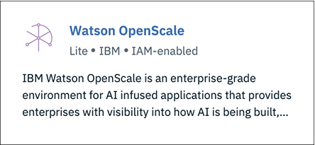

---

title: Confianza y transparencia para los modelos de aprendizaje automático con {{site.data.keyword.aios_short}}
description: Monitor your machine learning deployments for bias, accuracy, and explainability
duration: 120
intro: In this tutorial, you will provision {{site.data.keyword.Bluemix}} machine learning and data services, create and deploy machine learning models in Watson studio, and configure the new IBM {{site.data.keyword.aios_full}} product to monitor your models for trust and transparency.
takeaways:
- See how {{site.data.keyword.aios_short}} provides trust and transparency for AI models
- Understand how {{site.data.keyword.Bluemix}} services and Watson Studio technologies can provide a seamless, AI-driven customer experience

copyright:
  years: 2018, 2019
lastupdated: "2019-06-11"

keywords: ai, getting started, tutorial, understanding, video

subcollection: ai-openscale

---

{:shortdesc: .shortdesc}
{:external: target="_blank" .external}
{:hide-dashboard: .hide-dashboard}
{:tip: .tip}
{:important: .important}
{:note: .note}
{:pre: .pre}
{:codeblock: .codeblock}
{:screen: .screen}
{:javascript: .ph data-hd-programlang='javascript'}
{:java: .ph data-hd-programlang='java'}
{:python: .ph data-hd-programlang='python'}
{:swift: .ph data-hd-programlang='swift'}

# Guía de aprendizaje de iniciación (configuración automática)
{: #gettingstarted}

{{site.data.keyword.aios_full}} permite a las empresas automatizar y operacionalizar el ciclo de vida de la inteligencia artificial en las aplicaciones empresariales, garantizando que los modelos de inteligencia artificial no contienen sesgos, que los usuarios empresariales los pueden explicar y comprender fácilmente y que son auditables en las transacciones empresariales. {{site.data.keyword.aios_short}} admite modelos de inteligencia artificial creados y ejecutados en las herramientas y que sirven como modelos de las infraestructuras que se elijan.
{: shortdesc}

## Descripción general
{: #gs-view-demo}

Vea este vídeo para obtener una descripción general rápida de {{site.data.keyword.aios_short}}.

  

    <iframe class="embed-responsive-item" id="youtubeplayer" title="Confianza y transparencia en la inteligencia artificial" type="text/html" width="640" height="390" src="https://www.youtube.com/embed/6Ei8rPVtCf8" frameborder="0" webkitallowfullscreen mozallowfullscreen allowfullscreen> </iframe>
  

## Caso de uso de {{site.data.keyword.aios_short}}
{: #gs-use}

Los prestamistas tradicionales se ven presionados a ampliar su cartera digital de servicios financieros a un público más amplio y diverso, lo que requiere un nuevo enfoque al modelado de riesgo crediticio. Sus equipos de ciencia de datos actualmente se basan en técnicas de modelado tradicionales, como árboles de decisión y regresión logística, que funcionan bien para conjuntos de datos moderados y realizan recomendaciones que se pueden explicar fácilmente. Esto satisface los requisitos normativos de que las decisiones sobre préstamos crediticios deben ser transparentes y explicables.

Para proporcionar acceso a crédito a una población más amplia y de mayor riesgo, las historias de crédito de los solicitantes deben expandirse más allá del crédito tradicional, como, por ejemplo, los créditos hipotecarios y los créditos para vehículos, a fuentes de créditos alternativas como las historias de pago de planes de telefonía móvil y servicios, así como a la formación y los puestos laborales. Estas nuevas fuentes de datos prometen, pero también añaden riesgo, puesto que aumenta la probabilidad de correlaciones inesperadas que introduzcan un sesgo según la edad, el sexo y otras características personales de los solicitantes.

Las técnicas de ciencia de datos más adecuadas para estos diversos conjuntos de datos, tales como los árboles de potenciación del gradiente y las redes neuronales, pueden generar modelos de riesgo precisos, pero con un coste. Estos modelos "de caja negra" generan predicciones opacas que de alguna manera deben ser transparentes, a fin de garantizar la aprobación normativa, como por ejemplo el Artículo 22 de la Regulación de Protección General de Datos (GDPR) o el Fair Credit Reporting Act (FCRA) del gobierno federal de Estados Unidos que gestiona el Consumer Financial Protection Bureau.

El modelo de riesgo crediticio que se proporciona en esta guía de aprendizaje utiliza un conjunto de datos de entrenamiento que contiene 20 atributos sobre cada solicitante de préstamo. Dos de estos atributos, edad y sexo, se pueden probar para comprobar si presentan algún sesgo. Para esta guía de aprendizaje, nos centraremos en el sesgo respecto a sexo y edad. Para obtener más información sobre los datos de entrenamiento, consulte [¿Por qué {{site.data.keyword.aios_short}} necesita acceder a mis datos de entrenamiento?](/docs/services/ai-openscale?topic=ai-openscale-trainingdata#trainingdata)

{{site.data.keyword.aios_short}} supervisará la propensión del modelo desplegado a un resultado favorable ("Sin riesgo") para un grupo (el grupo de referencia) respecto a otro (el grupo supervisado). En esta guía de aprendizaje, el grupo supervisado para sexo es `mujer`, y el grupo supervisado para edad es `de 19 a 25`.

## Opciones de configuración
{: #gs-module}

Existen varias opciones de configuración, en función de su preferencia y nivel de experiencia.

- [La siguiente configuración automática](/docs/services/ai-openscale?topic=ai-openscale-wos-fast-start) le guía por el proceso,
realizando tareas en su nombre en segundo plano.

   El uso de una visita guiada significa que puede ver y pulsar la siguiente parte de la visita guiada.
   
- [La configuración interactiva](/docs/services/ai-openscale?topic=ai-openscale-gs-obj#gs-obj) le permite tomar el control con un
script fácil de seguir.

   Utilice la interfaz para realizar tareas comunes con un modelo de ejemplo y datos inyectados.
   
- [La guía de aprendizaje avanzada](/docs/services/ai-openscale?topic=ai-openscale-crt-ov) permite a más usuarios técnicos instalar
un módulo de Python que automatiza el suministro y la configuración de servicios de requisito previo. Esta guía de aprendizaje avanzada es para usuarios o
científicos de datos que se sienten cómodos con códigos, Python y cuadernos. Es un ejemplo de cómo el cliente de {{site.data.keyword.aios_short}}
se puede utilizar para realizar funcionalidad de forma programada. El cuaderno que se utiliza en esta guía de aprendizaje está en el mismo lugar que la
[configuración automática](/docs/services/ai-openscale?topic=ai-openscale-wos-fast-start) siguiente.

   Este módulo requiere que Python 3 esté instalado, lo que incluye el sistema de gestión de paquetes PIP. Para ver instrucciones, consulte
[Instalación de un módulo Python para configurar {{site.data.keyword.aios_short}}](/docs/services/ai-openscale?topic=ai-openscale-as-module).

Para obtener enlaces de guía de aprendizaje adicionales, consulte [Recursos
adicionales](/docs/services/ai-openscale?topic=ai-openscale-arsc-ov).

## Configuración automatizada
{: #wos-fast-start}

Para ver rápidamente cómo {{site.data.keyword.aios_short}} supervisa un modelo, ejecute la opción de escenario de demostración que se proporciona al iniciar sesión por primera vez en la interfaz de usuario de {{site.data.keyword.aios_short}}.  Consulte [Trabajar con la demostración de la interfaz de usuario](#wos-work-demo).
{: shortdesc}

## Antes de empezar
{: #wos-prereqs}

Antes de empezar la visita guiada, debe tener configurados los recursos siguientes:

- [{{site.data.keyword.ibmid}}](/docs/account?topic=account-signup)
- [{{site.data.keyword.aios_full}}](/docs/services/ai-openscale?topic=ai-openscale-gettingstarted#crt-wos-faststart)

La visita de configuración automatizada está diseñada para funcionar con la menor interacción posible con el usuario. Toma automáticamente las siguientes decisiones:

- Si tiene configuradas varias instancias de {{site.data.keyword.pm_full}}, el proceso de instalación se ejecuta, llama a la API para listar las instancias, y elige la instancia de {{site.data.keyword.pm_short}} que aparece primero en la lista resultante. 
- Para crear una nueva versión Lite de {{site.data.keyword.pm_full}}, el instalador de {{site.data.keyword.aios_short}} utiliza el grupo de recursos predeterminado para su cuenta de {{site.data.keyword.Bluemix}}.

### Suministre un servicio de {{site.data.keyword.aios_full}}
{: #crt-wos-faststart}

Si no lo ha hecho todavía, asegúrese de que suministre {{site.data.keyword.aios_full}}. 

- [Suministre una instancia de {{site.data.keyword.aios_short}}](https://{DomainName}/catalog/services/watson-openscale){: external} si todavía no tiene una asociada con su cuenta:

  

1. Pulse **Catálogo** > **AI** > **{{site.data.keyword.aios_short}}**.
2. Asigne un nombre a su servicio, elija un plan y pulse el botón **Crear**.
3. Para empezar {{site.data.keyword.aios_short}}, pulse el botón **Cómo empezar** button.

## Trabajar con la demostración de la interfaz de usuario
{: #wos-work-demo}

1.  Inicie sesión en la instancia de {{site.data.keyword.aios_short}} en {{site.data.keyword.Bluemix}}.
1.  Para trabajar con el escenario de demo, pulse **Ejecutar demo**.

   

   Mientras se proporcionan los servicios de {{site.data.keyword.aios_short}}, puede revisar el escenario de demostración:

   

Cuando se haya completado el suministro, pulse el botón **Adelante** para realizar la visita guiada del panel de control de {{site.data.keyword.aios_short}} y continúe con [Visualización de los resultados en {{site.data.keyword.aios_short}}](#wos-open).

   

## Visualización de los resultados en {{site.data.keyword.aios_short}}
{: #wos-open}

Para ver los detalles sobre la equidad y la exactitud del modelo, los detalles de los datos supervisados y la explicabilidad de una transacción
individual, abra el panel de control de {{site.data.keyword.aios_short}}. Cada despliegue se muestra como un mosaico. La visita guiada ha configurado un despliegue denominado `GermanCreditRiskModel`, tal como se muestra en la siguiente captura de pantalla:

   

### Ver detalles
{: #wos-insights}

La página Detalles muestra de un solo vistazo cualquier problema relacionado con la equidad y la exactitud, según determinan los umbrales configurados.

   

### Ver datos de supervisión
{: #wos-monitoring}

1.  En la página Detalles, pulse el mosaico `GermanCreditRiskModelICP` para ver los detalles sobre los datos supervisados.
1.  Pulse y arrastre el marcador por el gráfico para ver un periodo de día y hora que muestre datos y a continuación pulse el enlace **Ver detalles**. Como alternativa, puede pulsar distintos periodos de tiempo en el gráfico para cambiar los datos que se visualizan.

     - Por ejemplo, la pantalla siguiente muestra datos correspondientes a una fecha y hora específicas. Las fechas y las horas varían, en función de cuándo se ejecuta el módulo.

     - Para obtener información sobre cómo interpretar el gráfico de series de tiempo, consulte [Supervisión de la equidad, solicitudes promedio por minuto y exactitud](/docs/services/ai-openscale-icp?topic=ai-openscale-icp-itc-timechart).

   

1.  Para ver detalles sobre la supervisión de datos de `SEXO`, asegúrese de que `SEXO` esté seleccionado en el menú desplegable.

    - Observe que en la siguiente captura de pantalla existe un sesgo.
    
   

    - Para obtener información sobre cómo interpretar el gráfico de los puntos de datos de una hora específica, consulte [Visualización de datos](/docs/services/ai-openscale-icp?topic=ai-openscale-icp-itc-timechart#itc-data-visual).

### Ver explicabilidad
{: #wos-explain}

Para comprender los factores que contribuyen a que haya un sesgo para un periodo de tiempo determinado, en la pantalla visualización que se muestra en la sección anterior pulse el botón de selección **Transacciones sesgadas**.

   

Se listan los ID de transacción de la última hora correspondientes a las transacciones sesgadas. Para el modelo utilizado en este módulo, existe un sesgo para las solicitudes disponibles.

   

Para obtener información sobre cómo buscar y explicar transacciones, consulte [Supervisión de la explicabilidad](/docs/services/ai-openscale-icp?topic=ai-openscale-icp-ie-ov).

   

## Finalización de la visita guiada
{: #wos-done-demo}

1. Pulse el botón **Fin**.

   

2. Pulse el botón **Adelante** para empezar a trabajar con {{site.data.keyword.aios_short}}.

   

## Pasos siguientes
{: #gs-next}

- Obtenga más información sobre cómo [ver e interpretar los datos](/docs/services/ai-openscale?topic=ai-openscale-it-ov) y [supervisar la explicabilidad](/docs/services/ai-openscale?topic=ai-openscale-ie-ov).
