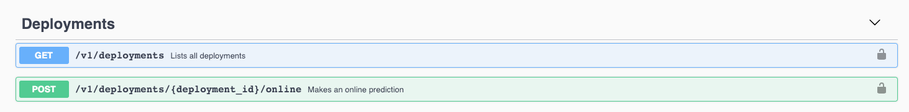
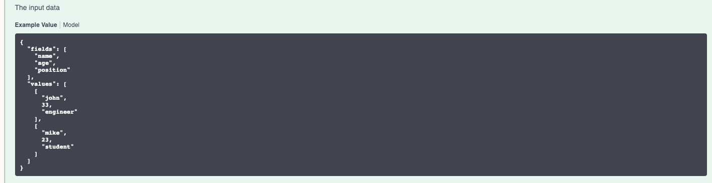

---

copyright:
  years: 2018, 2019
lastupdated: "2019-06-28"

keywords: machine learning engines, frameworks, Microsoft Azure, Amazone SageMaker, custom ML engine 

subcollection: ai-openscale

---

{:shortdesc: .shortdesc}
{:external: target="_blank" .external}
{:tip: .tip}
{:important: .important}
{:note: .note}
{:pre: .pre}
{:codeblock: .codeblock}
{:download: .download}
{:screen: .screen}
{:javascript: .ph data-hd-programlang='javascript'}
{:java: .ph data-hd-programlang='java'}
{:python: .ph data-hd-programlang='python'}
{:swift: .ph data-hd-programlang='swift'}
{:faq: data-hd-content-type='faq'}

# Motor de aprendizaje automático personalizado
{: #fmrk-workaround-customengine}

Un motor de aprendizaje automático personalizado proporciona las prestaciones de infraestructura y alojamiento para modelos de aprendizaje automático
y aplicaciones web. Los motores de aprendizaje automático personalizados a los que da soporte {{site.data.keyword.aios_short}} deben cumplir los
requisitos siguientes:

- Exponga dos tipos de puntos finales de API REST:

   * punto final de descubrimiento (lista GET de despliegues y detalles)
   * puntos finales de puntuación (puntuación en línea y en tiempo real)

- Todos los puntos finales deben ser compatibles con la especificación de swagger a la que se va a dar soporte.

- La carga útil de entrada y salida a y desde el despliegue deben ser compatibles con el formato de archivo JSON que se describe en la
especificación.

En esta etapa sólo se da soporte a los formatos `BasicAuth` o `none`.
{: Note}

En el ejemplo siguiente se muestra la especificación de puntos finales de la API REST:

En el ejemplo siguiente se muestra el formato de una carga útil de entrada:

## ¿Cuándo es un motor de aprendizaje automático personalizado la mejor opción para mí?
{: #fmrk-workaround-enging-choice}

Un motor de aprendizaje automático personalizado es la mejor opción cuando se cumplen las situaciones siguientes:

- No está utilizando ninguno de los productos listos para usar disponibles para dar servicio a sus modelos de aprendizaje automático. Para ello, solo debe
desarrollar su propio sistema. No hay ni habrá soporte directo en {{site.data.keyword.aios_short}} para ello.
- {{site.data.keyword.aios_short}} todavía no da soporte al motor de servicio que está utilizando de un proveedor de terceros. En este caso,
considere el desarrollo de un motor de aprendizaje automático personalizado que englobe los despliegues originales o nativos.

## Pasos siguientes
{: #fmrk-workaround-nxt-steps-over}

Implemente su propia solución utilizando uno de estos [ejemplos de aprendizaje automático personalizado](/docs/services/ai-openscale?topic=ai-openscale-fmrk-workaround-cstmmlsengex).
