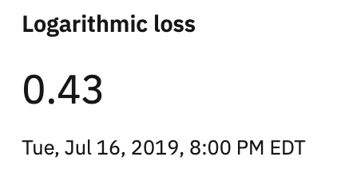
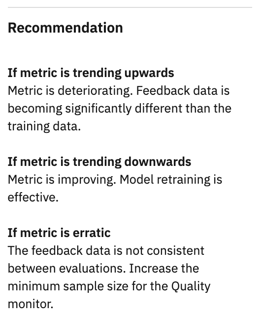

---

copyright:
  years: 2018, 2019
lastupdated: "2019-06-28"

keywords: fairness, fairness monitor, payload, perturbation, training data, debiased, Logarithmic loss

subcollection: ai-openscale

---

{:shortdesc: .shortdesc}
{:external: target="_blank" .external}
{:tip: .tip}
{:important: .important}
{:note: .note}
{:pre: .pre}
{:codeblock: .codeblock}
{:download: .download}
{:screen: .screen}
{:javascript: .ph data-hd-programlang='javascript'}
{:java: .ph data-hd-programlang='java'}
{:python: .ph data-hd-programlang='python'}
{:swift: .ph data-hd-programlang='swift'}
{:faq: data-hd-content-type='faq'}

# Pérdida logarítmica
{: #quality_log_loss}

La pérdida logarítmica proporciona la media de probabilidades de clase de destino de logaritmos (confianza). También se conoce como Logaritmo de verosimilitud prevista y es una medida eficaz de rendimiento del modelo.
{: shortdesc}

## Detalles de la pérdida logarítmica
{: #quality_log_loss-glance}

- **Descripción**: media de probabilidades de clase de destino de logaritmos (confianza). También se conoce como logaritmo de verosimilitud previsto.
- **Umbrales predeterminados**: límite inferior = 80%
- **Recomendación predeterminada**:
   - **Tendencia al alza**: una tendencia al alza indica que la métrica se está deteriorando. Los datos de opinión son ligeramente diferentes a los datos de entrenamiento.
   - **Tendencia a la baja**: una tendencia a la baja indica que la métrica está mejorando. Esto significa que el reentrenamiento del modelo es efectivo.
   - **Variación errática o irregular**: una variación errática o irregular indica que los datos de opinión no son coherentes entre evaluaciones. Incremente el tamaño mínimo de la muestra para el supervisor de calidad.
- **Tipo de problema**: clasificación binaria y clasificación multiclase
- **Valores de gráfico**: último valor en el margen de tiempo
- **Detalles de métricas disponibles**: ninguno

## Interpretación de la pantalla
{: #quality_log_loss-display}


### Puntuación de equidad
{: #quality_log_loss-display-fairness-score}

Para la métrica de pérdida logarítmica, se muestra la siguiente puntuación de equidad. 



### Planificación
{: #quality_log_loss-display-schedule}

El panel **Planificación** muestra las horas de la **Última evaluación** y la **Próxima evaluación**. Las métricas de calidad se evalúan cada hora. Puede forzar la evaluación pulsando **Comprobar calidad ahora**. También puede añadir opiniones pulsando **Añadir datos de opiniones**.


### Recomendación
{: #quality_log_loss-display-recommendations}

Para ayudarle a interpretar el gráfico, el panel **Recomendación** muestra las tendencias que indican mejora o deterioro de la efectividad del modelo.




## Cómo calcularlo
{: #quality_log_loss-math}

Para un modelo binario, la pérdida logarítmica se calcula mediante la fórmula siguiente:

```
-(y log(p) + (1-y)log(1-p))
```

donde p = etiqueta verdadera e y = probabilidad prevista

Para un modelo multiclase, la pérdida logarítmica se calcula mediante la fórmula siguiente:

```
  M
-SUM Yo,c log(Po,c)
 c=1 
```

donde M > 2, p = etiqueta verdadera e y = probabilidad prevista
