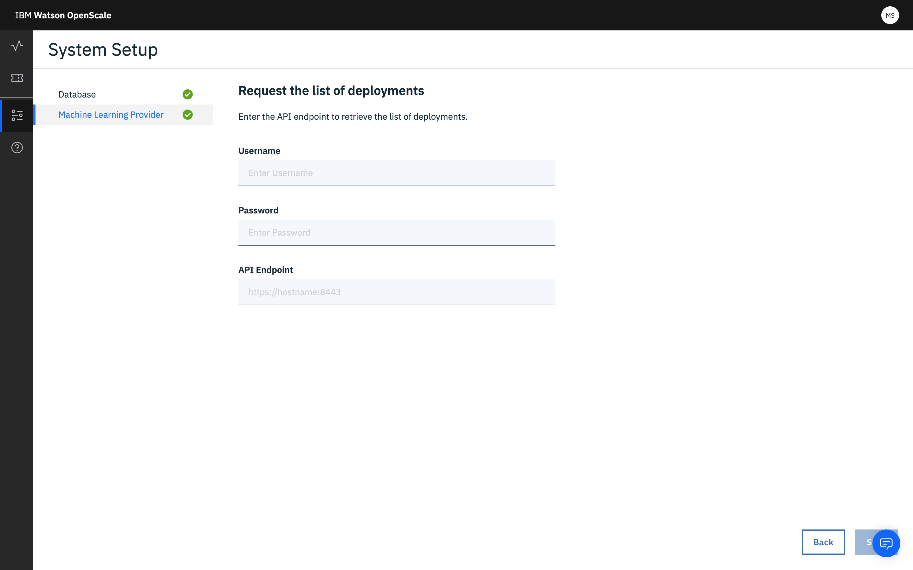
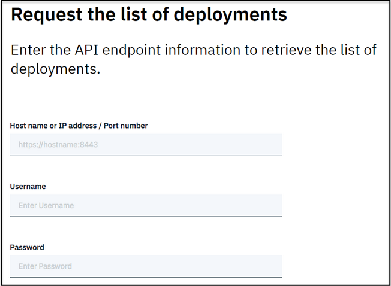

---

copyright:
  years: 2018, 2019
lastupdated: "2019-06-11"

keywords: machine learning, services, ml, custom 

subcollection: ai-openscale

---

{:shortdesc: .shortdesc}
{:external: target="_blank" .external}
{:tip: .tip}
{:important: .important}
{:note: .note}
{:pre: .pre}
{:codeblock: .codeblock}
{:download: .download}
{:screen: .screen}
{:javascript: .ph data-hd-programlang='javascript'}
{:java: .ph data-hd-programlang='java'}
{:python: .ph data-hd-programlang='python'}
{:swift: .ph data-hd-programlang='swift'}
{:faq: data-hd-content-type='faq'}

# Spécification d'une instance de service ML personnalisé
{: #co-connect}

Votre première étape dans l'outil {{site.data.keyword.aios_short}} consiste à spécifier une instance de service. Votre instance de service est l'endroit où vous stockez vos modèles et déploiements d'IA.
{: shortdesc}

## Connecter votre instance de service personnalisé
{: #co-config}

{{site.data.keyword.aios_short}} se connecte aux modèles et déploiements d'IA dans une instance de service.

1.  Sur la page d'accueil de l'outil {{site.data.keyword.aios_short}}, cliquez sur **Commencer**.

    

2.  Sélectionnez le carreau **Custom** et cliquez sur **Suivant**.

    

3.  Connectez-vous aux déploiements en sélectionnant l'une des options :

    

4.  Si vous avez sélectionné le carreau "Entrer les noeuds finaux d'évaluation individuels", entrez vos identifiants :

    

5.  Cliquez sur **Suivant**.

    - Si vous avez sélectionné le carreau "Entrer les noeuds finaux d'évaluation individuels", vous devez fournir un nom de déploiement et un noeud final :

      

      Cliquez sur **Suivant**.

    - Si vous avez sélectionné le carreau "Demander la liste des déploiements", vous devez fournir un nom d'hôte ou une adresse IP et un numéro de port :

      

      Cliquez sur **Suivant**.

      Faites ensuite votre sélection dans la liste des déploiements :

      

6.  Vérifiez les déploiements sélectionnés.

    

7.  Cliquez sur **Suivant**.

### Fonctionnement
{: #co-works}

Cette image montre la prise en charge de l'environnement personnalisé :


Vous pouvez également consulter les liens suivants :

[API de journalisation de contenu AIOS](https://{DomainName}/apidocs/ai-openscale#publish-scoring-payload){: external}

[API de déploiement personnalisé](https://aiopenscale-custom-deployement-spec.mybluemix.net/){: external}

[SDK de liaison du client Python](http://ai-openscale-python-client.mybluemix.net/#bindings){: external}

[Utilisation du moteur d'apprentissage automatique personnalisé](https://github.com/pmservice/ai-openscale-tutorials/blob/master/notebooks/AI%20OpenScale%20and%20Custom%20ML%20Engine.ipynb){: external}

[SDK Python pour IBM Watson OpenScale](https://pypi.org/project/ibm-ai-openscale/){: external}

- **Critères d'entrée pour que le modèle supporte les moniteurs**

  Votre modèle doit prendre en entrée un vecteur de fonction, qui est fondamentalement une collection de zones nommées avec leur valeur
(incluant les zones dont le biais est surveillé) :

  ```bash
  {
    "fields": [
        "name",
        "age",
        "position"
    ],
    "values": [
        [
            "john",
            33,
            "engineer"
        ],
        [
            "mike",
            23,
            "student"
        ]
    ]
  }
  ```

  Dans cet exemple, `“age”` pourrait être une zone dont quelqu'un évalue l'équité.

  Si l'entrée est un tenseur/matrice,
qui est transformé à partir de l'espace de fonctions d'entrée
(ce qui est souvent le cas dans l'apprentissage en profondeur à partir de texte ou d'images),
le modèle ne peut pas être traité par la plateforme {{site.data.keyword.aios_short}} dans l'édition actuelle. Par extension, les modèles d'apprentissage en profondeur avec des entrées texte ou images ne peuvent pas être traités pour la détection et l'atténuation de biais.

  En outre, des données de formation doivent être chargées pour prendre en charge l'explicabilité.

  Pour l'explicabilité sur du texte, le texte complet doit faire partie des fonctions. L'explicabilité sur les images pour un modèle personnalisé n'est pas prise en charge dans l'édition actuelle.
  {: note}

- **Critères de sortie pour que le modèle supporte les moniteurs**

  Votre modèle doit sortir le vecteur de fonction d'entrée avec les probabilités de prévision de diverses de ses classes.

  ```bash
  {
    "fields": [
        "name",
        "age",
        "position",
        "prediction",
        "probability"
    ],
    "labels": [
        "personal",
        "camping"
    ],
    "values": [
        [
            "john",
            33,
            "engineer",
            "personal",
            [
                0.6744664422398081,
                0.3255335577601919
            ]
        ],
        [
            "mike",
            23,
            "student"
            "camping",
            [
                0.2794765664946941,
                0.7205234335053059
            ]
        ]
    ]
  }
  ```

  Dans cet exemple, `"personal”` et `“camping”` sont les classes possibles,
et les scores de chaque sortie d'évaluation sont affectés aux deux classes. S'il manque les probabilités de prévision, la détection de biais fonctionnera mais pas le débiais automatique.

  La sortie d'évaluation précédente doit être accessible depuis un noeud final d'évaluation actif que {{site.data.keyword.aios_short}} peut appeler par REST. Pour AzureML, SageMaker et {{site.data.keyword.pm_full}},
{{site.data.keyword.aios_short}} se connecte directement aux noeuds finaux d'évaluation natifs
(donc vous n'avez pas à vous inquiéter de l'implémentation de la spécification d'évaluation)

### Etapes suivantes
{: #co-next}

{{site.data.keyword.aios_short}} est maintenant prêt
à ce que vous [spécifiiez une base de données](/docs/services/ai-openscale?topic=ai-openscale-connect-db).
