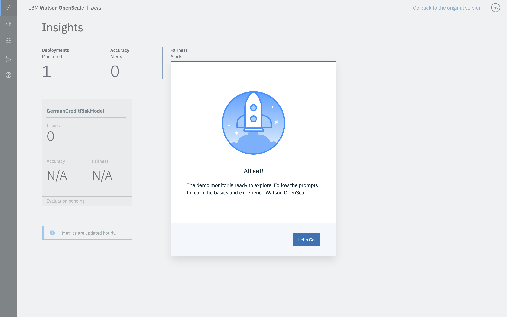
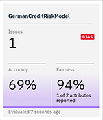
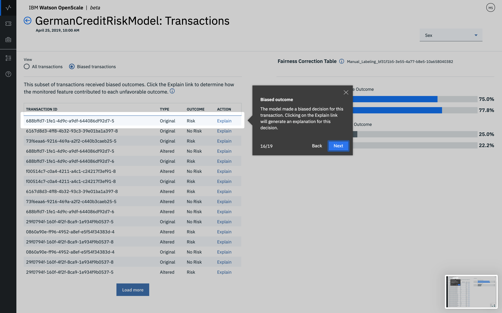

---

copyright:
  years: 2018, 2019
lastupdated: "2019-05-29"

keywords: ai, getting started, tutorial, understanding, fast start

subcollection: ai-openscale

---

{:shortdesc: .shortdesc}
{:new_window: target="_blank"}
{:hide-dashboard: .hide-dashboard}
{:tip: .tip}
{:important: .important}
{:note: .note}
{:pre: .pre}
{:codeblock: .codeblock}
{:screen: .screen}
{:javascript: .ph data-hd-programlang='javascript'}
{:java: .ph data-hd-programlang='java'}
{:python: .ph data-hd-programlang='python'}
{:swift: .ph data-hd-programlang='swift'}

# Configuration automatique
{: #wos-fast-start}

Pour voir rapidement comment {{site.data.keyword.aios_short}} surveille un modèle, exécutez l'option de scénario de démonstration fournie lors de votre première connexion à l'interface utilisateur {{site.data.keyword.aios_short}}.  Voir [Utilisation de la démonstration de l'interface utilisateur](#wos-work-demo).
{: shortdesc}

## Avant de commencer
{: #wos-prereqs}

Avant de commencer la visite guidée, vous devez avoir déjà configuré les ressources suivantes :

- {{site.data.keyword.ibmid}}
- {{site.data.keyword.aios_full}}

## Utilisation de la démonstration de l'interface utilisateur
{: #wos-work-demo}

1.  Connectez-vous à votre instance {{site.data.keyword.aios_short}} sur {{site.data.keyword.bluemix_full}}.
1.  Pour utiliser le scénario de démonstration, cliquez sur **Lancer la démonstration**.

   

   Lors de l'application des accès aux services {{site.data.keyword.aios_short}}, vous pouvez consulter le scénario de démonstration :

   

Une fois l'application des accès terminée, cliquez sur le bouton **C'est parti** pour visiter le tableau de bord {{site.data.keyword.aios_short}}, puis allez à la section [Affichage des résultats dans {{site.data.keyword.aios_short}}](#wos-open).

   

## Affichage des résultats dans {{site.data.keyword.aios_short}}
{: #wos-open}

Pour consulter les analyses de l'équité et de l'exactitude du modèle, les détails des données surveillées et l'explicabilité d'une transaction individuelle, ouvrez le tableau de bord {{site.data.keyword.aios_short}}. Chaque déploiement est affiché sous la forme d'un carreau. La visite guidée a configuré un déploiement nommé `GermanCreditRiskModel`, montré par la capture d'écran suivante :

   

### Afficher les analyses
{: #wos-insights}

La page Analyses permet de voir d'un coup d'oeil les problèmes d'équité et d'exactitude déterminés par les seuils configurés.

   

### Afficher les données de surveillance
{: #wos-monitoring}

1.  Sur la page Analyses, cliquez sur le carreau `GermanCreditRiskModelICP` pour afficher les détails des données surveillées.
1.  Cliquez sur le marqueur du graphe et faites-le glisser pour afficher une période de date et d'heure présentant les données, puis cliquez sur le lien **Afficher les détails**. Vous avez également la possibilité de cliquer sur différentes périodes de temps dans le graphe pour modifier les données affichées.

     - Par exemple, l'écran suivant affiche les données d'une date/heure donnée. Les dates et heures varient en fonction du moment où vous exécutez le module.

     - Pour savoir comment interpréter le graphe de temps,
voir [Surveillance de l'équité, du nombre moyen de demandes par minute et de l'exactitude](/docs/services/ai-openscale-icp?topic=ai-openscale-icp-itc-timechart).

   

1.  Pour voir les détails de la surveillance des données de `SEXE`, sélectionnez `SEXE` dans le menu déroulant.

    - Remarquez que la capture d'écran suivante présente un biais.
    
   

    - Pour plus d'informations sur l'interprétation du graphe des points de données à une heure spécifique, voir [Visualisation des données](/docs/services/ai-openscale-icp?topic=ai-openscale-icp-itc-timechart#itc-data-visual).

### Afficher l'explicabilité
{: #wos-explain}

Pour comprendre les facteurs contributeurs s'il y a du biais pour une certaine période, sélectionnez le bouton d'option **Transactions biaisées** dans l'écran de visualisation présenté à la section précédente.

   

Les ID des transactions de la dernière heure qui présentent un biais s'affichent. Pour le modèle utilisé dans ce module, il y a un biais pour les demandes disponibles. 

   

Pour savoir comment trouver et expliquer les transactions, voir [Surveillance de l'explicabilité](/docs/services/ai-openscale-icp?topic=ai-openscale-icp-ie-ov).

   

## Fin de la visite guidée
{: #wos-done-demo}

1. Cliquez sur le bouton **Terminé**.

   

2. Cliquez sur le bouton **C'est parti** pour commencer à utiliser {{site.data.keyword.aios_short}}.

   

## Informations connexes
{: #wos-info}

- Pour découvrir ce que sont les biais, voir [Equité](/docs/services/ai-openscale-icp?topic=ai-openscale-icp-mf-monitor).
- Pour savoir si votre modèle prévoit bien les résultats, voir [Exactitude](/docs/services/ai-openscale-icp?topic=ai-openscale-icp-acc-monitor).
- Pour savoir comment interpréter les graphes, les données et les transactions, voir [Surveillance de l'équité, du nombre moyen de demandes par minute et de l'exactitude](/docs/services/ai-openscale-icp?topic=ai-openscale-icp-itc-timechart).
