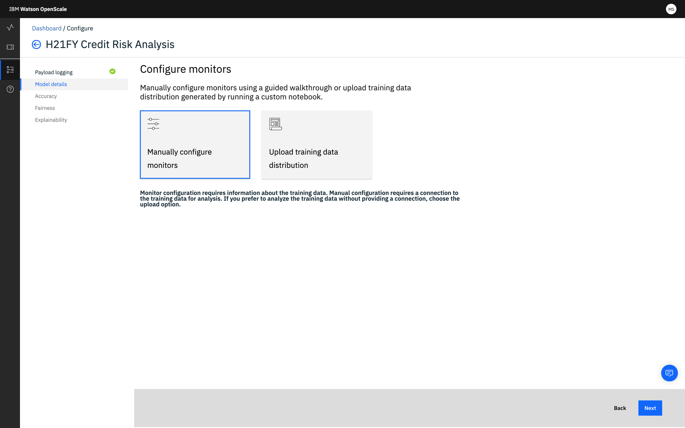

---

copyright:
  years: 2018, 2019
lastupdated: "2019-06-24"

keywords: deployment, monitors, data

subcollection: ai-openscale

---

{:shortdesc: .shortdesc}
{:new_window: target="_blank"}
{:tip: .tip}
{:important: .important}
{:note: .note}
{:pre: .pre}
{:codeblock: .codeblock}
{:screen: .screen}

# Préparation des moniteurs pour un déploiement
{: #mo-config}

Configurez et activez les moniteurs pour chaque déploiement que vous suivez avec {{site.data.keyword.aios_short}}.
{: shortdesc}

## Sélection d'un déploiement
{: #mo-select-deploy}

1.  Vous devez d'abord sélectionner un déploiement.

    S'il y a plusieurs déploiements pour un modèle donné, lorsque vous en configurez un, tous les autres pour le même modèle sont également configurés.
    {: note}

    

1.  Sélectionnez le carreau *Préparer la surveillance*.

    

## Type de données
{: #mo-work-data}

1.  Vous allez maintenant fournir des informations sur votre modèle et vos données de formation ; cliquez sur **Suivant**. Pour plus d'informations sur les données de formation, voir [Pourquoi {{site.data.keyword.aios_short}} a-t-il besoin d'accéder à mes données de formation ?](/docs/services/ai-openscale?topic=ai-openscale-trainingdata#trainingdata)

    

1.  Dans le menu déroulant, sélectionnez le type de données que votre déploiement analyse, puis cliquez sur **Suivant**.

    

### Données numériques/catégorielles
{: #mo-nuca}

Pour les données numériques ou catégorielles, vous devez fournir des informations sur les données de formation de votre modèle pour configurer les moniteurs.

  

- **Configurer les moniteurs manuellement** - vous devez fournir les informations de connexion à vos données de formation.

    - Sélectionnez le [type d'algorithme](/docs/services/ai-openscale?topic=ai-openscale-acc-monitor#acc-understand) et cliquez sur **Suivant** :

      

      Assurez-vous que le format des données de formation soiit exactement celui attendu par votre modèle. Par exemple, si le modèle attend `M` et `F` pour la fonction *Sexe*,
les données de formation doivent contenir `M` et `F`, et non `Masculin` et `Féminin`. Actuellement, {{site.data.keyword.aios_short}} supporte uniquement les emplacements de base de données Db2 ou Cloud Object Storage.
        {: important}

    - Indiquez l'emplacement (`Db2` ou `Cloud Object Storage`) puis :

        - Pour une base de données Db2, renseignez les informations suivantes :

            - Nom d'hôte ou adresse IP
            - Port
            - Base de données (nom)
            - Nom d'utilisateur
            - Mot de passe

            

        - Pour Cloud Object Storage, renseignez les informations suivantes :

            - URL de connexion

              L'URL de connexion doit correspondre au paramètre de région du compartiment où se trouvent vos données de formation. Vous indiquerez le compartiment des données de formation à l'étape suivante.
              {: important}

            - Instance de ressource (ID)
            - Clé d'API

            

    - Assurez-vous que la connexion est valide en cliquant sur le bouton **Tester** pour vous connecter aux données de formation. Cliquez sur **Suivant**.

    - Indiquez l'emplacement exact des données de formation dans la base de données Db2 ou dans Cloud Object Storage.

        - Pour une base de données Db2, sélectionnez un schéma et une table de formation contenant les colonnes attendues par votre modèle :

          

        - Pour Cloud Object Storage, sélectionnez un compartiment et un ensemble de données :

          

          Cliquez sur **Suivant** pour passer à l'étape 5 ci-dessous.

- **Télécharger un fichier de configuration** - Choisissez cette option si vous préférez garder privées vos données de formation. Vous pouvez utiliser un bloc-notes Python personnalisé pour fournir à {{site.data.keyword.aios_short}}
les informations pour analyser vos données de formation sans lui donner accès à celles-ci.

  Le bloc-notes Python vous permet de capturer des valeurs distinctes dans les colonnes du schéma, ainsi que le nom des colonnes. Il vous permet également de préconfigurer le moniteur d'équité.

    - Téléchargez le [bloc-notes personnalisé
](https://github.com/IBM-Watson/aios-data-distribution/blob/master/training_statistics_notebook.ipynb){: new_window}
et remplacez les identifiants par les vôtres.

    - Passez soigneusement en revue le bloc-notes, en indiquant les données pour votre modèle aux endroits appropriés. Enregistrez le bloc-notes.

    - Exécutez le bloc-notes pour générer un fichier de configuration formaté en JSON.

    - Téléchargez le fichier de configuration JSON.

        

    - Cliquez sur **Suivant**.

- {{site.data.keyword.aios_short}} localisera vos données de formation à partir des métadonnées stockées avec le modèle en WML. Choisissez la colonne de libellé dans les données de formation qui contient vos valeurs de prévision et cliquez sur **Suivant**.

  

- Sélectionnez les colonnes utilisées pour former le modèle ; il s'agit des fonctions attendues par votre déploiement de modèle dans une demande. Cliquez sur **Suivant**.

    

- Enfin, sélectionnez les colonnes qui contenaient du texte et ont été converties en entiers. Par exemple, si les données de formation initiales contenaient `Masculin` et `Féminin` pour *Sexe*
et qu'elles sont maintenant mappées sur `0` et `1` respectivement,
elles contiennent maintenant les valeurs `0` et `1` pour la colonne *Sexe*. Identifiez ces colonnes qui contiennent maintenant des entiers mais contenaient initialement des valeurs texte. Cliquez sur **Suivant**.

    

### Images et texte non structuré
{: #mo-imun}

- **Images**

  Pour les modèles qui acceptent des images en entrée,
l'image doit être représentée sous la forme (hauteur) x (largeur) x (nombre de canaux),
chaque point étant la valeur monochrome ou RVB d'un pixel.

- **Texte non structuré**

   Les modèles qui acceptent du texte en entrée doivent accepter la totalité du texte, et non une représentation vectorisée de celui-ci.

## Vérification et enregistrement de la configuration
{: #mo-save}

Vérifiez le récapitulatif de vos sélections et cliquez sur **Enregistrer** pour continuer.

  

### Etapes suivantes
{: #mo-next}

Pour commencer à configurer les moniteurs, sélectionnez une catégorie et cliquez sur **Commencer**.
