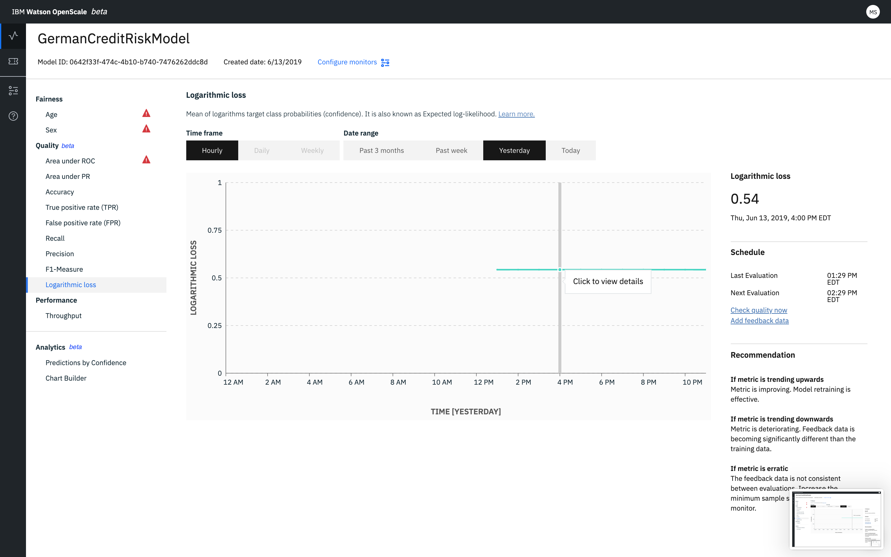

---

copyright:
  years: 2018, 2019
lastupdated: "2019-06-11"

keywords: fairness, fairness monitor, payload, perturbation, training data, debiased, Logarithmic loss

subcollection: ai-openscale

---

{:shortdesc: .shortdesc}
{:external: target="_blank" .external}
{:tip: .tip}
{:important: .important}
{:note: .note}
{:pre: .pre}
{:codeblock: .codeblock}
{:download: .download}
{:screen: .screen}
{:javascript: .ph data-hd-programlang='javascript'}
{:java: .ph data-hd-programlang='java'}
{:python: .ph data-hd-programlang='python'}
{:swift: .ph data-hd-programlang='swift'}
{:faq: data-hd-content-type='faq'}

# Perte logarithmique 
{: #quality_log_loss}

La perte logarithmique donne la moyenne des logarithmes des probabilités de classe cible (confiance).
Elle est également appelée log de vraisemblance attendu et est une mesure efficace du fonctionnement d'un modèle.
{: shortdesc}

## La perte logarithmique en bref
{: #quality_log_loss-glance}

- **Description** : moyenne des logarithmes des probabilités de classe cible (confiance). Egalement appelée log de vraisemblance attendu.
- **Seuils par défaut** : limite inférieure = 80 %
- **Recommandation par défaut** :
   - **Tendance à la hausse** : une tendance à la hausse indique que la métrique s'améliore. Cela signifie que le recyclage des modèles est effectif.
   - **Tendance à la baisse** : une tendance à la baisse indique que la métrique se dégrade. Les données de commentaires deviennent nettement différentes des données de formation.
   - **Variation erratique ou irrégulière** : une variation erratique ou irrégulière indique que les données de commentaires ne sont pas cohérentes d'une évaluation à l'autre. Augmentez la taille d'échantillon minimale pour le moniteur de qualité.
- **Type de problème** : classification binaire et classification multi-classes
- **Valeurs de graphique** : dernière valeur dans la période
- **Détails de métriques disponibles** : aucun

## Interprétation de l'affichage
{: #quality_log_loss-display}



## Calculs
{: #quality_log_loss-math}

Pour un modèle binaire, la perte logarithmique est calculée à l'aide de la formule suivante :

```
-(y log(p) + (1-y)log(1-p))
```

où p = étiquette vraie et y = probabilité prévue

Pour un modèle multi-classe, la perte logarithmique est calculée à l'aide de la formule suivante :

```
  M
-SOMME Yo,c log(Po,c)
 c=1
```

où M > 2, p = étiquette vraie et y = probabilité prévue
