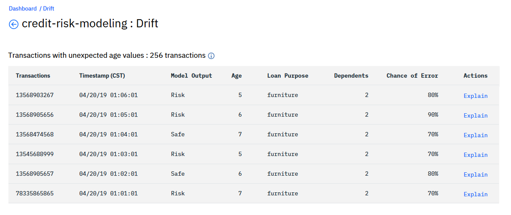

---

copyright:
  years: 2018, 2019
lastupdated: "2019-06-28"

keywords: drift, behavior, metrics

subcollection: ai-openscale

---

{:shortdesc: .shortdesc}
{:external: target="_blank" .external}
{:tip: .tip}
{:important: .important}
{:note: .note}
{:pre: .pre}
{:codeblock: .codeblock}
{:download: .download}
{:screen: .screen}
{:javascript: .ph data-hd-programlang='javascript'}
{:java: .ph data-hd-programlang='java'}
{:python: .ph data-hd-programlang='python'}
{:swift: .ph data-hd-programlang='swift'}
{:faq: data-hd-content-type='faq'}

# Ampleur de la dérive 
{: #behavior-drift-ovr}

Au fil du temps, l'importance et l'impact de certaines fonctions d'un modèle évoluent.
Cela affecte les applications associées et les résultats métier qui en découlent.
Avec la détection de dérive, {{site.data.keyword.aios_short}} offre un moyen de suivre les métriques et la performance d'un modèle,
et la manière dont le poids des caractéristiques évolue dans le temps.
Lorsque les données évoluent,
l'aptitude de votre modèle à faire des prévisions exactes peut se dégrader.
L'ampleur de la dérive est le degré de dégradation des performances de prévision dans le temps.
Les informations sur la dérive vous permettent de prendre des mesures correctives.
{: shortdesc}

## Comprendre ce qu'est la détection de dérive
{: #behavior-drift-understand}

La dérive est la dégradation des performances de prévision dans le temps en raison d'un contexte inconnu. Au fur et à mesure que vos données évoluent,
l'aptitude de votre modèle à faire des prévisions exactes peut se dégrader. {{site.data.keyword.aios_short}} détecte la dérive et la met en évidence afin que vous puissiez effectuer des actions correctives.

### Fonctionnement
{: #behavior-drift-works}

{{site.data.keyword.aios_short}} analyse toutes les transactions pour trouver celles qui contribuent à la dérive. Il regroupe ensuite les enregistrements en fonction des valeurs d'attribut qui y ont contribué significativement.

### Calculs
{: #behavior-drift-math}

Toutes les trois heures, {{site.data.keyword.aios_short}} calcule la dérive en analysant les mêmes données d'entraînement que celles qui ont déjà été analysées par votre modèle prédictif. Il compare ensuite les résultats aux prévisions du modèle. Lorsqu'il y a des changements ou des différences, {{site.data.keyword.aios_short}} calcule l'ampleur de la dérive et, en fonction du seuil que vous avez fixé, il vous avertit de l'occurrence. 

### Visualisation de la dérive
{: #behavior-drift-display}

La visualisation de la dérive comprend des données statistiques graphiques et numériques :

En cliquant sur le graphique, vous pouvez afficher les transactions spécifiques qui contribuent à la dérive. Les principales raisons de la dérive détectée s'affichent. Elles comprennent une description en langage naturel de l'observation ainsi que la liste des valeurs inattendues.

Les transactions contribuant à la dérive sont disponibles dans l'écran de détails des transactions. Vous pouvez cliquez sur **Expliquer** pour comprendre comment une transaction spécifique s'est classée dans la catégorie dérive :

## Etapes suivantes

- Pour savoir comment configurer la détection de la dérive, voir
[Configuration du moniteur de détection de dérive](/docs/services/ai-openscale?topic=ai-openscale-behavior-drift-config).
- Pour atténuer la dérive, après qu'elle a été détectée par Watson OpenScale, vous devez générer une nouvelle version du modèle qui corrige le problème.
Les points de données mis en évidence comme causes de la dérive constituent un bon point de départ.
Introduisez les nouvelles données dans le modèle prédictif après avoir étiqueté manuellement les transactions à la dérive et utilisez-les pour réentraîner le modèle.

