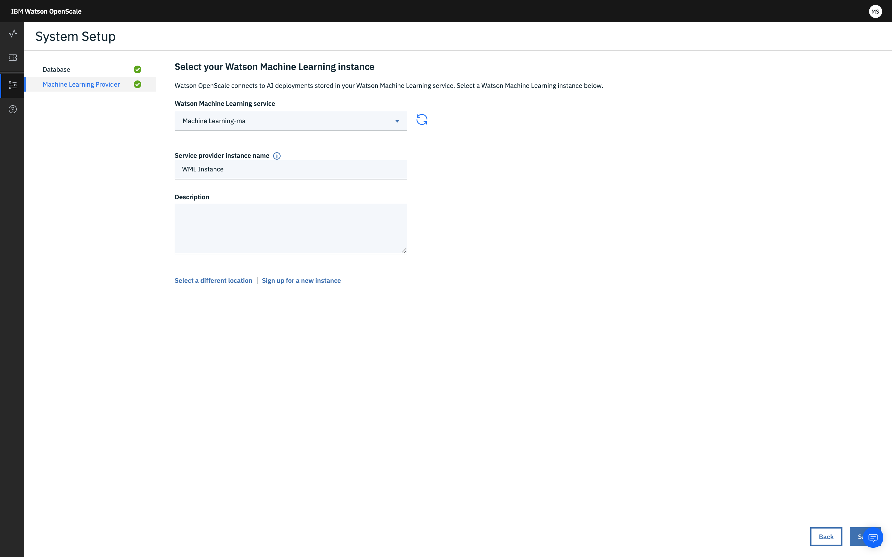

---

copyright:
  years: 2018, 2019
lastupdated: "2019-06-28"

keywords: supported frameworks, models, model types, limitations, limits

subcollection: ai-openscale

---

{:shortdesc: .shortdesc}
{:external: target="_blank" .external}
{:tip: .tip}
{:important: .important}
{:note: .note}
{:pre: .pre}
{:codeblock: .codeblock}
{:download: .download}
{:screen: .screen}
{:javascript: .ph data-hd-programlang='javascript'}
{:java: .ph data-hd-programlang='java'}
{:python: .ph data-hd-programlang='python'}
{:swift: .ph data-hd-programlang='swift'}
{:faq: data-hd-content-type='faq'}

# {{site.data.keyword.ibmwatson_notm}} {{site.data.keyword.pm_short}}
{: #frmwrks-wml}

Vous pouvez utiliser {{site.data.keyword.pm_full}} pour effectuer une journalisation du contenu utile et des retours,
et pour mesurer l'exactitude de performance, la détection de biais à l'exécution, l'explicabilité et la fonction de débiaisement automatique dans {{site.data.keyword.aios_full}}.

{{site.data.keyword.aios_full}} prend intégralement en charge les infrastructures {{site.data.keyword.pm_full}} suivantes : 
{: shortdesc}

Tableau 1. Détails des infrastructures prises en charge

| Infrastructure | Type de problème | Type de données |
|:---|:---:|:---:|
| Apache Spark MLlib | Classification | Structuré |
| Apache Spark MLLib | Régression | Structuré |
| Keras avec TensorFlow1&2 | Classification | Non structuré (image, texte) |
| Keras avec TensorFlow1&2 | Régression | Non structuré (image, texte) |
| Fonction Python | Classification | Structuré |
| Fonction Python | Régression | Structuré |
| scikit-learn | Classification | Structuré |
| scikit-learn | Régression | Structuré |
| XGBoost | Classification | Structuré |
| XGBoost | Régression | Structuré |
{: caption="Détails des infrastructures prises en charge" caption-side="top"}

1La prise en charge de l'équité n'est pas incluse dans le support Keras.
{: note}

2 L'explicabilité est prise en charge si votre modèle / infrastructure produit des probabilités des prévisions.{: note}

## Spécification d'une instance de service {{site.data.keyword.ibmwatson_notm}} {{site.data.keyword.pm_short}}
{: #wml-connect}

Votre première étape dans l'outil {{site.data.keyword.aios_short}} consiste à spécifier une instance d'{{site.data.keyword.pm_full}}. Votre instance de {{site.data.keyword.pm_short}} est l'endroit où vous stockez vos modèles et déploiements d'IA.
{: shortdesc}

### Conditions requises
{: #wml-prereq}

Vous devez avoir mis à disposition une instance d'{{site.data.keyword.pm_full}} dans le compte {{site.data.keyword.Bluemix_notm}}
où se trouve l'instance de service {{site.data.keyword.aios_short}}. Si vous avez mis à disposition une instance de {{site.data.keyword.pm_full}} dans un autre compte,
vous ne pourrez pas la configurer avec la journalisation automatique du contenu utile avec {{site.data.keyword.aios_short}}.

### Connecter votre instance de service {{site.data.keyword.pm_short}}
{: #wml-config}

{{site.data.keyword.aios_short}} se connecte aux modèles et déploiements d'IA dans une instance d'{{site.data.keyword.pm_full}}.

1.  Dans l'onglet **Configurer**, cliquez sur **Fournisseurs d'apprentissage automatique** dans le volet de navigation.

    

2.  Cliquez sur le bouton **Ajouter un fournisseur d'apprentissage automatique** puis sur le carreau {{site.data.keyword.pm_full}}.{{site.data.keyword.aios_short}} regarde dans votre compte {{site.data.keyword.Bluemix_notm}} s'il y a déjà des instances de {{site.data.keyword.pm_full}}. 
3. Sélectionner une instance dans le menu déroulant **Service Watson Machine Learning**.

    

4.  (Optionnel) Vous pouvez aussi **Sélectionner un autre emplacement**
et indiquer un emplacement d'apprentissage automatique en dehors de votre compte {{site.data.keyword.Bluemix_notm}}. Fournissez les identifiants de votre emplacement en JSON valide :

    

    Cliquez sur **Enregistrer**.

1.  {{site.data.keyword.aios_short}} affiche vos modèles déployés ; sélectionnez ceux que vous voulez surveiller et cliquez sur **Configurer**.

## Etapes suivantes
{: #wml-next}

{{site.data.keyword.aios_short}} est maintenant prêt
à ce que vous [configuriez les moniteurs](/docs/services/ai-openscale?topic=ai-openscale-mo-config).
