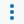
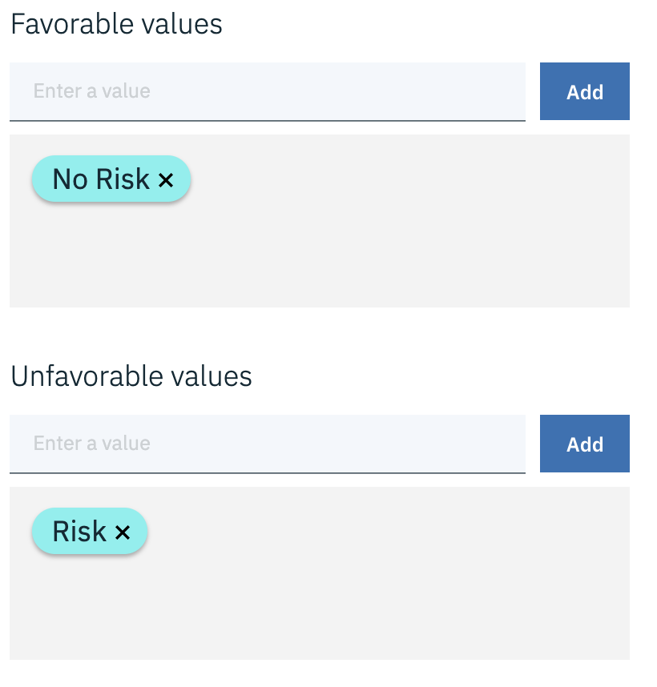
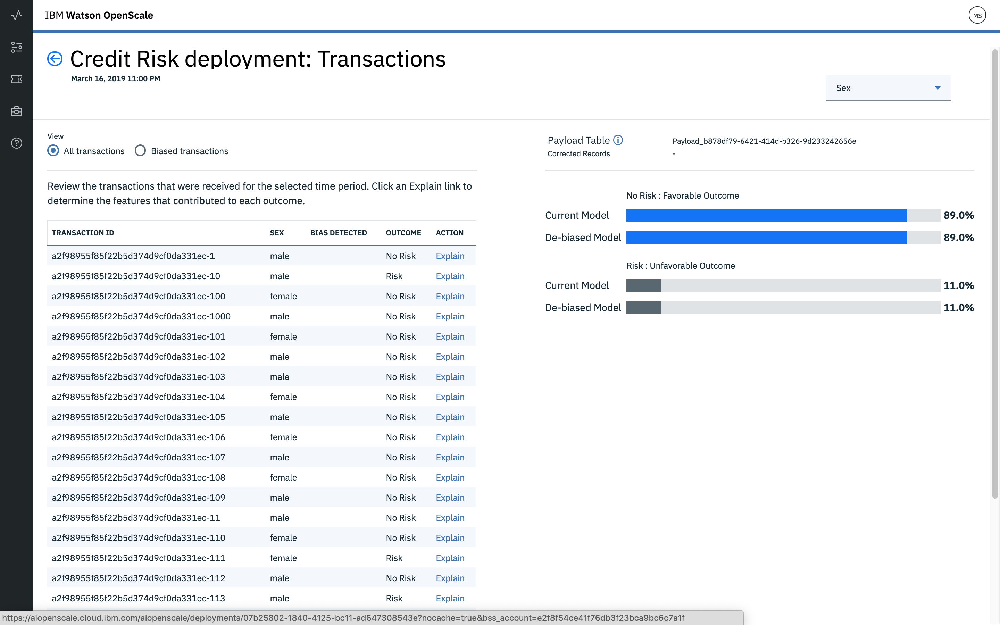

---

title: Trust and transparency for your machine learning models with {{site.data.keyword.aios_short}}
description: Monitor your machine learning deployments for bias, accuracy, and explainability
duration: 120
intro: In this tutorial, you will provision IBM Cloud machine learning and data services, create and deploy machine learning models in Watson studio, and configure the new IBM {{site.data.keyword.aios_full}} product to monitor your models for trust and transparency.
takeaways:
- See how {{site.data.keyword.aios_short}} provides trust and transparency for AI models
- Understand how IBM Cloud services and Watson Studio technologies can provide a seamless, AI-driven customer experience

copyright:
  years: 2018, 2019
lastupdated: "2019-05-06"

keywords: ai, getting started, tutorial, understanding, video

subcollection: ai-openscale

---

{:shortdesc: .shortdesc}
{:new_window: target="_blank"}
{:hide-dashboard: .hide-dashboard}
{:tip: .tip}
{:important: .important}
{:note: .note}
{:pre: .pre}
{:codeblock: .codeblock}
{:screen: .screen}
{:javascript: .ph data-hd-programlang='javascript'}
{:java: .ph data-hd-programlang='java'}
{:python: .ph data-hd-programlang='python'}
{:swift: .ph data-hd-programlang='swift'}

# Introduzione - supporto didattico (di base)
{: #gettingstarted}

{{site.data.keyword.aios_full}} consente alle aziende di automatizzare e rendere operativo il ciclo di vita AI nelle applicazioni di business, garantendo che i modelli di AI siano privi di distorsione, che siano facilmente illustrati e compresi dagli utenti aziendali e che siano verificabili nelle transazioni aziendali. {{site.data.keyword.aios_short}} supporta modelli di AI creati ed eseguiti negli strumenti e nei framework di servizi modello selezionati.
{: shortdesc}

## Panoramica
{: #gs-view-demo}

Questo video fornisce una panoramica rapida di {{site.data.keyword.aios_short}}.

  

    <iframe class="embed-responsive-item" id="youtubeplayer" title="Attendibilità e trasparenza nell'AI" type="text/html" width="640" height="390" src="https://www.youtube.com/embed/6Ei8rPVtCf8" frameborder="0" webkitallowfullscreen mozallowfullscreen allowfullscreen> </iframe>
  

## Caso di utilizzo di {{site.data.keyword.aios_short}}
{: #gs-use}

I finanziatori tradizionali sono sottoposti a forti pressioni per espandere il proprio portafoglio digitale di servizi finanziari per un pubblico più ampio e diversificato, il che richiede un nuovo approccio alla creazione di modelli di rischio di credito. Al momento, i loro team di data science fanno affidamento sulle tecniche di creazione di modelli standard, quali ad esempio gli alberi decisionali e la regressione logistica, che sono adeguati per i dataset di dimensioni contenute e producono suggerimenti facilmente spiegabili. Ciò soddisfa i requisiti normativi, secondo i quali le decisioni relative ai prestiti debbano essere trasparenti e facilmente spiegabili.

Per fornire l'accesso al credito a una popolazione più ampia e maggiormente soggetta a rischi è necessario espandere le informazioni storiche sul credito dei richiedenti oltre il credito tradizionale, come i mutui e i finanziamenti per le automobili, per includere fonti di credito alternative quali gli storici dei pagamenti per le utenze e i piani tariffari telefonici, in aggiunta ai titoli di studio e lavorativi. Queste nuove fonti di dati sono promettenti, ma introducono nuovi rischi aumentando la probabilità di correlazioni impreviste, che introducono una distorsione basata sull'età, il genere o altre caratteristiche personali del richiedente.

Le tecniche di data science più idonee a questi dataset così diversificati, quali le strutture ad albero con potenziamento dei gradienti e le reti neurali, possono generare modelli di rischio altamente accurati ma costosi. Modelli "scatola nera" di questo tipo generano previsioni poco chiare, che in qualche modo devono essere rese trasparenti per garantire la conformità a normative quali l'Articolo 22 del GDPR (General Data Protection Regulation), o al FCRA (Fair Credit Reporting Act) federale gestito dal Consumer Financial Protection Bureau.

Il modello rischio di credito fornito in questo supporto didattico utilizza un dataset di training che contiene 20 attributi relativi a ciascuno dei richiedenti di un prestito. È possibile verificare la distorsione per due di questi attributi, l'età e il sesso. Per questo supporto didattico, l'attenzione sarà rivolta alla distorsione rispetto a età e sesso.

{{site.data.keyword.aios_short}} monitorerà la propensione del modello distribuito per un risultato favorevole ("Nessun rischio") per un gruppo (il gruppo di riferimento) rispetto a un altro (il gruppo monitorato). In questo supporto didattico, il gruppo monitorato per il sesso è `femminile`, mentre il gruppo monitorato per l'età è `da 19 a 25`.

## Alternate setup option
{: #gs-module}

Instead of completing the following tutorial to explore {{site.data.keyword.aios_short}}, technical users can install a Python module that automates the provisioning and configuration of prerequisite services. This module requires that Python 3 is installed, which includes the pip package management system. For instructions, see, [Installing a Python module to set up {{site.data.keyword.aios_short}}](/docs/services/ai-openscale?topic=ai-openscale-as-module).

Additional tutorial links may be found in the [Additional resources](/docs/services/ai-openscale?topic=ai-openscale-arsc-ov) topic.

## Tutorial objectives
{: #gs-obj}

In this tutorial, you will:

- Provision {{site.data.keyword.Bluemix_notm}} machine learning and storage services
- Set up a Watson Studio project, and create, train and deploy a machine learning model
- Configure and explore trust, transparency and explainability for your model

## Provision prerequisite {{site.data.keyword.Bluemix_notm}} services
{: #gs-prps}

In addition to {{site.data.keyword.aios_short}}, to complete this tutorial, you need the following accounts and services.

**Importante**: per ottenere le migliori prestazioni, è consigliato creare i servizi prerequisiti nella stessa regione in cui si trova {{site.data.keyword.aios_short}}. Per visualizzare le ubicazioni disponibili per {{site.data.keyword.aios_short}}, consultare [Disponibilità del servizio](/docs/resources?topic=resources-services_region).

1.  Accedere all'account [{{site.data.keyword.Bluemix_notm}} ](https://{DomainName}){: new_window} con l'{{site.data.keyword.ibmid}}.
1.  Per ciascuno dei seguenti servizi che non sono già associati all'account, creare un'istanza facendo clic sul link, fornendo un nome per il servizio, selezionando il piano **Lite** (gratuito) e facendo clic sul pulsante **Crea**:

    - [Watson Studio ](https://{DomainName}/catalog/services/watson-studio){: new_window}

      

    - [Watson Machine Learning ](https://{DomainName}/catalog/services/machine-learning){: new_window}

      

    - [Object Storage ](https://{DomainName}/catalog/services/cloud-object-storage){: new_window}

      

## Configurare un progetto Watson Studio
{: #gs-setup}

1.  Accedere all'[account Watson Studio](https://dataplatform.ibm.com/){: new_window} e iniziare con la creazione di un nuovo progetto. Selezionare **Crea un progetto**.

    

1.  Selezionare il riquadro **Standard**.

    

1.  Fornire un nome e una descrizione al progetto, accertarsi che il servizio Object Storage creato nel passo precedente sia selezionato nel menu **Storage** e fare clic su **Crea**.

### Associare i servizi {{site.data.keyword.Bluemix_notm}} al progetto Watson
{: #gs-assoc}

1.  Aprire il progetto Watson Studio e selezionare la scheda **Impostazioni**. Scorrere in basso fino alla sezione **Servizi associati**, fare clic sul menu **Aggiungi servizio** e selezionare **Watson**.

    

1.  Fare clic sul link **Aggiungi** nel riquadro **Machine Learning** e selezionare la scheda **Esistente**. Selezionare il servizio creato nella sezione precedente dal menu **Istanza di servizio esistente** e fare clic su **Seleziona**.

### Aggiungere il modello di `Rischio di credito`
{: #gs-addmod}

1.  In Watson Studio, selezionare la scheda **Asset** del progetto, scorrere in basso fino alla sezione **Modelli di Watson Machine Learning** e fare clic sul pulsante **Nuovo modello di Watson Machine Learning**.

1.  Dalla sezione **Seleziona tipo di modello**, selezionare **Da campione** e il modello `Rischio di credito`, quindi fare clic su **Crea**.

    

### Distribuire il modello `Rischio di credito`
{: #gs-depmod}

1.  Nel progetto Watson Studio, fare clic sulla scheda **Asset**, scorrere in basso fino alla sezione **Modelli di Watson Machine Learning** e fare clic sul modello rischio di credito appena creato.
2.  Nella colonna **AZIONI**, fare clic sul menu **Azioni** , quindi fare clic su **Distribuisci**.
3. Dalla scheda **Asset** del progetto Watson Studio, scorrere in basso fino alla sezione **Modelli di Watson Machine Learning** e fare clic sul modello `rischio di credito` appena creato.
1.  Fare clic sulla scheda **Distribuzioni**, quindi fare clic su **Aggiungi distribuzione**.
1.  Immettere `credit-risk-deploy` come nome della distribuzione e selezionare il tipo di distribuzione **Servizio web**.
1.  Fare clic su **Salva**.

## Configurare {{site.data.keyword.aios_short}}
{: #gs-confaios}

### Eseguire il provisioning di {{site.data.keyword.aios_short}}
{: hide-dashboard}
{: #gs-provaios}

1.  [Eseguire il provisioning di una nuova istanza del servizio {{site.data.keyword.aios_short}} ](https://{DomainName}/catalog/services/watson-openscale){: new_window}

2.  Fornire un nome al servizio, selezionare il piano Lite e fare clic su **Crea**.

### Connettere {{site.data.keyword.aios_short}} al modello di machine learning
{: #gs-ctmod}

Una volta distribuito il modello di machine learning, è possibile configurare {{site.data.keyword.aios_short}} per garantire affidabilità e trasparenza per i modelli.

1.  Selezionare la scheda **Gestisci** dell'istanza {{site.data.keyword.aios_short}} e fare clic sul pulsante **Avvia applicazione**. Viene aperta la pagina Introduzione di {{site.data.keyword.aios_full}}. Fare clic su **Inizia**.

1.  Fare clic sul riquadro **Watson Machine Learning**.

1.  Per questo supporto didattico, selezionare l'istanza di Watson Machine Learning dal menu e fare clic su **Avanti**.

    È anche possibile selezionare un'ubicazione di Machine Learning differente. Per ulteriori informazioni, consultare [Specifica di un'istanza del servizio di Watson Machine Learning](/docs/services/ai-openscale?topic=ai-openscale-wml-connect).
    {: note}

    

1.  Ora è possibile selezionare i modelli distribuiti che verranno monitorati da {{site.data.keyword.aios_short}}. Selezionare il modello creato e fare clic su **Avanti**.

    

1.  Successivamente, è necessario selezionare un database. Esistono due opzioni: il database del piano Lite gratuito o un database esistente o nuovo. Per questo supporto didattico, selezionare il riquadro **Utilizza il database gratuito del piano Lite**.

    È possibile visualizzare ulteriori dettagli su ciascuna di queste opzioni nell'argomento [Specifica di un database](/docs/services/ai-openscale?topic=ai-openscale-connect-db). Il database esistente può essere un database PostgreSQL o Db2.
    {: tip}

    

1.  Esaminare il riepilogo e fare clic su **Salva**. Confermare e, quando richiesto, fare clic sul pulsante **Continua con la configurazione**.

    Viene elencato anche un ID Data Mart, che è identico a un ID istanza di {{site.data.keyword.aios_short}}.
    {: tip}

    

1.  La schermata visualizzata potrebbe essere simile alla seguente. Poiché verrà utilizzato un metodo GUI per assegnare un punteggio ai dati, è sufficiente selezionare il pulsante **Configura monitor** per completare questa configurazione. 

    

### Fornire una serie di dati campione al modello
{: #gs-samp}

Prima di poter configurare i monitor, è necessario generare almeno una richiesta di punteggio al modello per generare la registrazione del payload che i monitor possono utilizzare. In questa sezione, l'utente fornirà i dati di esempio nel formato di un file JSON per generare una richiesta di punteggio.

1.  Scaricare il file [credit_payload_data.json ](https://raw.githubusercontent.com/watson-developer-cloud/doc-tutorial-downloads/master/ai-openscale/credit_payload_data.json).

1.  Dalla scheda **Distribuzioni** del progetto Watson Studio, fare clic sul link **credit-risk-deploy**, fare clic sulla scheda **Verifica** e selezionare l'icona di input JSON.

    

1.  Ora, aprire il file `credit_payload_data.json` scaricato e copiare il contenuto nel campo JSON nella scheda **Verifica**. Fare clic sul pulsante **Previsione** per inviare e assegnare un punteggio ai payload di training al modello.

    

### Preparazione al monitoraggio
{: #gs-prepmon}

1.  Ora, nell'istanza {{site.data.keyword.aios_short}}, selezionare la distribuzione e fare clic su **Inizia**.

    

1.  Selezionare il riquadro **Preparazione per il monitoraggio**, quindi fare clic su **Inizia**.

    

1.  Di seguito, l'utente fornirà le informazioni sul modello e sui dati di training. Fare clic su **Avanti**. 

    

1.  Dal menu **Tipo di dati**, selezionare **Numerico/di categoria** come il tipo di dati analizzato dalla distribuzione e fare clic su **Avanti**.

    

1.  Per i dati numerici o di categoria, è necessario fornire le informazioni sui dati di training per il modello per poter configurare i monitor. Selezionare **Configura manualmente i monitor** per fornire le informazioni di connessione ai dati di training.

    

1.  Il tipo di algoritmo è importante per il monitoraggio delle metriche del modello, ad esempio l'Accuratezza. Poiché la previsione che il modello è in grado di produrre è "Rischio" o "Nessun rischio", selezionare il [tipo di algoritmo](/docs/services/ai-openscale?topic=ai-openscale-acc-monitor#acc-understand) **Classificazione binaria** e fare clic su **Avanti**.

    

1.  Le informazioni sull'ubicazione per i dati di esempio vengono prepopolate nella seguente schermata. Selezionare **Avanti** per continuare.

    

1.  Anche lo schema e la tabella sono prepopolati. Fare clic su **Avanti** per proseguire.

    

1.  Ora, è necessario specificare la funzione che contiene le risposte che il modello prevederà (ovvero, nel database dell'utente, quale colonna della tabella contiene i valori delle previsioni (etichette)). In questo caso, il modello prevederà il rischio di credito, pertanto selezionare la colonna **Rischio** e fare clic su **Avanti**.

    Il database di training ha i valori forniti per il training del modello.
    {: note}

    

1.  Selezionare le colonne utilizzate per il training del modello. Si tratta dei dati che la distribuzione del modello necessita in una richiesta. Tutte le colonne di dati, eccetto `_training`, sono input per il modello. Selezionare tutti gli altri input e fare clic su **Avanti**.

    

1.  Per i dati di categoria, è necessario identificare le colonne che ora contengono numeri interi, ma che in origine contenevano valori di testo. Selezionare i valori come mostrato di seguito.

    

1.  Esaminare il riepilogo delle selezioni, fare clic su **Salva**, quindi fare clic su **OK**.

### Configurare il monitoraggio della correttezza
{: #gs-cfgfair}

1.  Fare clic su **Correttezza**.

1.  Leggere le informazioni sulla correttezza e fare clic su **Avanti**. Per ulteriori informazioni, consultare [Correttezza](/docs/services/ai-openscale?topic=ai-openscale-mf-monitor).

1.  Ora è possibile selezionare quali funzioni monitorare per la correttezza. Per ciascuna funzione selezionata, {{site.data.keyword.aios_short}} monitorerà la propensione del modello distribuito per un risultato favorevole per un gruppo rispetto all'altro. In questo esempio, verranno monitorate le funzioni **Sesso** ed **Età** .

    Le funzioni vengono monitorate individualmente, ma qualsiasi annullamento di distorsione correggerà gli errori per tutte le funzioni complessivamente. Fare clic sui riquadri **Sesso** ed **Età** e fare clic su **Avanti**.

1.  {{site.data.keyword.aios_short}} esegue il rilevamento della distorsione rispetto a un gruppo monitorato, confrontandolo con un gruppo di riferimento. Per la funzione **Sesso**, aggiungere il valore `maschile` al **Gruppo di riferimento** e il valore `femminile` al **Gruppo monitorato** quindi fare clic su **Avanti**.

    Il modello verrà contrassegnato come con distorsione per il **Sesso** se i rapporti di previsione del rischio per il gruppo monitorato differiscono dai rapporti per il gruppo di riferimento. Pertanto, se il modello prevede Rischio per i clienti di sesso maschile il 60% delle volte e per i clienti di sesso femminile il 20% delle volte, è presente una distorsione.

    

1.  Ora è possibile assegnare una soglia di correttezza per il **Sesso**. Nel dashboard delle operazioni verrà visualizzato un avviso se la classificazione della correttezza scende al di sotto di questa soglia. Impostare la soglia al 90%, quindi fare clic su **Avanti**.

1.  Per la funzione **Età**, aggiungere i valori `26-74` al **Gruppo di riferimento** e i valori `19-25` al **Gruppo monitorato**, quindi fare clic su **Avanti**.

    Come con il **Sesso**, il modello verrò contrassegnato come con distorsione per l'**Età** se i rapporti di previsione del rischio per il gruppo monitorato differiscono dai rapporti per il gruppo di riferimento. Pertanto, se i clienti con età comprese tra 26 e 74 anni ricevono una previsione di rischio con un rapporto differente rispetto ai clienti con età comprese tra 19 e 25 anni, il modello presenta una distorsione.

    

1.  Impostare la soglia per l'**Età** al 90%, quindi fare clic su **Avanti**.

1.  Trascinare e rilasciare i valori dal campo **Valori dai dati di training** nei campi **Valori favorevoli** e **Valori sfavorevoli**. Per questo supporto didattico, il valore favorevole è **Nessun rischio** e il valore sfavorevole è **Rischio**. Fare clic su **Avanti**.

    {{site.data.keyword.aios_short}} rileva automaticamente quale colonna nel database di registrazione del payload contiene i valori di previsione e li presenta nel campo **Valori dai dati di training**. Tenere presente che, mentre il database di training contiene i valori forniti per il training del modello, il database di registrazione del payload contiene i dati di feedback raccolti durante il runtime del modello, che è facoltativamente possibile utilizzare per eseguire nuovamente il training e la distribuzione del modello.
    {: note}

    

1.  Utilizzare il dispositivo di scorrimento per modificare la dimensione minima del campione su 100, quindi fare clic su **Avanti**.

    

    Per questo supporto didattico, la dimensione minima del campione è impostata su 100. Di norma, è consigliata una dimensione del campione maggiore per evitare che i risultati vengano alterati da una dimensione del campione troppo piccola.
    {: note}

1.  Esaminare le selezioni effettuate, fare clic su **Salva**, quindi fare clic su **OK**.

    

    Viene visualizzata la seguente finestra, che fornisce un endpoint di calcolo del punteggio con distorsione annullata. Poiché questo supporto didattico utilizza il metodo GUI e non la CLI per assegnare i punteggi ai dati, fare clic su **OK** per proseguire.

    

### Configurare il monitoraggio dell'accuratezza
{: #gs-cfgac}

1.  Fare clic su **Accuratezza**.

1.  Leggere le informazioni sull'accuratezza e fare clic su **Avanti**. Per ulteriori informazioni, consultare [Accuratezza](/docs/services/ai-openscale?topic=ai-openscale-acc-monitor).

1.  Impostare la soglia di avviso dell'accuratezza al 90% e fare clic su **Avanti**.

1.  Nella schermata successiva, utilizzare il dispositivo di scorrimento per modificare la dimensione minima del campione su 10, quindi fare clic su **Avanti**.

    Per questo supporto didattico, la dimensione minima del campione è stata impostata su 10. Di norma, è consigliata una dimensione del campione maggiore per evitare che i risultati vengano alterati da una dimensione del campione troppo piccola.
    {: note}

1.  Per la dimensione massima del campione, utilizzare 10000. Fare clic su **Avanti**.

1.  Esaminare le selezioni effettuate, fare clic su **Salva**, quindi fare clic su **OK**.

1.  Infine, viene presentata l'opzione di aggiungere i dati di feedback, che verranno illustrati nella sezione successiva. Per ora, chiudere la finestra facendo clic su **OK**, senza fare clic sul pulsante **Aggiungi dati di feedback**.

    Per ulteriori dettagli, consultare [Configurazione del monitor Accuratezza](/docs/services/ai-openscale?topic=ai-openscale-acc-monitor#acc-config).

## Fornire una serie di dati di feedback di esempio al modello
{: #gs-smpfeed}

Per abilitare il monitoraggio dell'accuratezza, è necessario fornire al modello i dati di feedback. I dati sull'accuratezza non verranno visualizzati nel dashboard fino a quando non viene completata questa operazione. È possibile generare tutte le richieste simultaneamente aggiungendo dati di feedback di esempio al modello per l'assegnazione del punteggio. Per questa attività, verrà scaricato un file CSV che contiene i dati di feedback di esempio.

1.  Scaricare il file [credit_feedback_data.csv ](https://raw.githubusercontent.com/watson-developer-cloud/doc-tutorial-downloads/master/ai-openscale/credit_feedback_data.csv).

1.  In {{site.data.keyword.aios_short}}, fare clic sulla scheda **Insight**.

    

1.  Fare clic sul riquadro per il modello distribuito.

    

1.  Quindi, fare clic sull'icona di modifica per modificare la configurazione di distribuzione.

    

1.  Nel pannello laterale Riepilogo, fare clic sul pulsante **Aggiungi dati di feedback** e selezionare il file `credit_feedback_data.csv` scaricato. Selezionare il delimitatore **Virgola (,)**, quindi fare clic su **OK**.

    Attualmente, le dimensioni dei file sono limitate a 8 MB.
    {: note}

    

    L'aggiunta del file CSV fornisce i dati di feedback al modello.

    

## Visualizzazione dei risultati
{: #gs-viewres}

Dopo aver configurato il monitoraggio dell'accuratezza, la verifica dell'accuratezza viene eseguita dopo un'ora. In un sistema di produzione, ciò consente al dashboard di accumulare i dati di feedback. Ai fini di questo supporto didattico, è consigliabile attivare manualmente la verifica dell'accuratezza dopo aver aggiunto i dati di feedback, per consentire la visualizzazione dei risultati nel dashboard **Insight**.

Per verificare immediatamente i risultati, dalla pagina **Insight**, selezionare una distribuzione e fare clic sui pulsanti **Controlla correttezza ora** o **Controlla accuratezza ora**.

### Visualizzare gli insight per la distribuzione
{: #gs-viewin}

1. Dal dashboard di [{{site.data.keyword.aios_short}} ](https://aiopenscale.cloud.ibm.com/aiopenscale/){: new_window}, fare clic sulla scheda **Insight**.

  

1. Esaminare la pagina Insight per visualizzare una panoramica delle metriche per i modelli distribuiti. È possibile visualizzare facilmente gli avvisi per le metriche Correttezza o Accuratezza che sono scese al di sotto della soglia del 90% .

  La visualizzazione delle metriche Correttezza e Accuratezza può impiegare fino a un massimo di un'ora.
  {: tip}

  

### Visualizzare i dati di monitoraggio per la distribuzione
{: #gs-viewmon}

1.  Selezionare una distribuzione facendo clic sul riquadro nella pagina Insight. Vengono mostrati i dati di monitoraggio per tale distribuzione. Nota: una volta caricato il file .csv di feedback, è possibile che i dati relativi alla Correttezza o all'Accuratezza non siano aggiornati. Per verificare immediatamente i risultati, fare clic sui pulsanti **Controlla correttezza ora** o **Controlla accuratezza ora**.
1.  Scorrere il puntatore nel grafico per selezionare i dati per l'intervallo di tempo durante il quale sono stati eseguiti i dati di esempio e i dati di feedback di esempio. Quindi, fare clic su **Visualizza dettagli**.

    

1.  Successivamente, esaminare i grafici per i dati monitorati. Per questo esempio, utilizzare il menu **Funzione** per selezionare l'`Età` o il `Sesso` per visualizzare i dettagli sui dati monitorati.

    Consultare [Visualizzazione dei dati per un'ora specifica](/docs/services/ai-openscale?topic=ai-openscale-it-ov#it-vdet) per ulteriori informazioni su come interpretare questi grafici.
    {: tip}

    

### Visualizzare l'esplicabilità per una transazione del modello
{: #gs-viewextx}

1.  Fare clic sul pulsante **Visualizza transazioni** dai grafici per i dati monitorati.

    

1.  Viene visualizzato un elenco delle transazioni che hanno contribuito alla distorsione per l'ora precedente. Per visualizzare una spiegazione più dettagliata di una particolare transazione, dalla colonna **AZIONI**, fare clic su **Spiega**.

    

1.  Viene visualizzata una spiegazione del modo in cui il modello è giunto alle relative conclusioni. Questa spiegazione include il livello di confidenza del modello, i fattori che hanno contribuito al livello di confidenza e le colonne utilizzate dal modello.

    

## Passi successivi
{: #gs-next}

- Ulteriori informazioni sulla [visualizzazione e interpretazione dei dati](/docs/services/ai-openscale?topic=ai-openscale-it-ov) e sul [monitoraggio dell'esplicabilità](/docs/services/ai-openscale?topic=ai-openscale-ie-ov).
