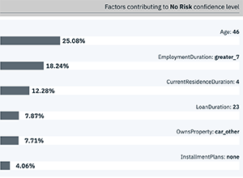

---

title: Attendibilità e trasparenza per i modelli di machine learning con {{site.data.keyword.aios_short}}
description: Monitor your machine learning deployments for bias, accuracy, and explainability
duration: 120
intro: In this tutorial, you will provision {{site.data.keyword.Bluemix}} machine learning and data services, create and deploy machine learning models in Watson studio, and configure the new IBM {{site.data.keyword.aios_full}} product to monitor your models for trust and transparency.
takeaways:
- See how {{site.data.keyword.aios_short}} provides trust and transparency for AI models
- Understand how {{site.data.keyword.Bluemix}} services and Watson Studio technologies can provide a seamless, AI-driven customer experience

copyright:
  years: 2018, 2019
lastupdated: "2019-06-28"

keywords: ai, getting started, tutorial, understanding, video

subcollection: ai-openscale

---

{:shortdesc: .shortdesc}
{:external: target="_blank" .external}
{:hide-dashboard: .hide-dashboard}
{:tip: .tip}
{:important: .important}
{:note: .note}
{:pre: .pre}
{:codeblock: .codeblock}
{:screen: .screen}
{:javascript: .ph data-hd-programlang='javascript'}
{:java: .ph data-hd-programlang='java'}
{:python: .ph data-hd-programlang='python'}
{:swift: .ph data-hd-programlang='swift'}

# Introduzione - supporto didattico (configurazione automatizzata)
{: #gettingstarted}

{{site.data.keyword.aios_full}} consente alle aziende di automatizzare e rendere operativo il ciclo di vita AI nelle applicazioni di business, garantendo che i modelli di AI siano privi di distorsione, che siano facilmente illustrati e compresi dagli utenti aziendali e che siano verificabili nelle transazioni aziendali. {{site.data.keyword.aios_short}} supporta modelli di AI creati ed eseguiti negli strumenti e nei framework di servizi modello selezionati.
{: shortdesc}

## Panoramica
{: #gs-view-demo}

Questo video fornisce una panoramica rapida di {{site.data.keyword.aios_short}}.

  

    <iframe class="embed-responsive-item" id="youtubeplayer" title="Attendibilità e trasparenza nell'AI" type="text/html" width="640" height="390" src="https://www.youtube.com/embed/6Ei8rPVtCf8" frameborder="0" webkitallowfullscreen mozallowfullscreen allowfullscreen> </iframe>
  

## Caso di utilizzo di {{site.data.keyword.aios_short}}
{: #gs-use}

I finanziatori tradizionali sono sottoposti a forti pressioni per espandere il proprio portafoglio digitale di servizi finanziari per un pubblico più ampio e diversificato, il che richiede un nuovo approccio alla creazione di modelli di rischio di credito. Al momento, i loro team di data science fanno affidamento sulle tecniche di creazione di modelli standard, quali ad esempio gli alberi decisionali e la regressione logistica, che sono adeguati per i dataset di dimensioni contenute e producono suggerimenti facilmente spiegabili. Ciò soddisfa i requisiti normativi, secondo i quali le decisioni relative ai prestiti debbano essere trasparenti e facilmente spiegabili.

Per fornire l'accesso al credito a una popolazione più ampia e maggiormente soggetta a rischi è necessario espandere le informazioni storiche sul credito dei richiedenti oltre il credito tradizionale, come i mutui e i finanziamenti per le automobili, per includere fonti di credito alternative quali gli storici dei pagamenti per le utenze e i piani tariffari telefonici, in aggiunta ai titoli di studio e lavorativi. Queste nuove fonti di dati sono promettenti, ma introducono nuovi rischi aumentando la probabilità di correlazioni impreviste, che introducono una distorsione basata sull'età, il genere o altre caratteristiche personali del richiedente.

Le tecniche di data science più idonee a questi dataset così diversificati, quali le strutture ad albero con potenziamento dei gradienti e le reti neurali, possono generare modelli di rischio altamente accurati ma costosi. Modelli "scatola nera" di questo tipo generano previsioni poco chiare, che in qualche modo devono essere rese trasparenti per garantire la conformità a normative quali l'Articolo 22 del GDPR (General Data Protection Regulation), o al FCRA (Fair Credit Reporting Act) federale gestito dal Consumer Financial Protection Bureau.

Il modello rischio di credito fornito in questo supporto didattico utilizza un dataset di training che contiene 20 attributi relativi a ciascuno dei richiedenti di un prestito. È possibile verificare la distorsione per due di questi attributi, l'età e il sesso. Per questo supporto didattico, l'attenzione sarà rivolta alla distorsione rispetto a età e sesso. Per ulteriori informazioni sui dati di training, consultare [Perché {{site.data.keyword.aios_short}} ha bisogno di accedere ai miei dati di training?](/docs/services/ai-openscale?topic=ai-openscale-trainingdata#trainingdata)

{{site.data.keyword.aios_short}} monitorerà la propensione del modello distribuito per un risultato favorevole ("Nessun rischio") per un gruppo (il gruppo di riferimento) rispetto a un altro (il gruppo monitorato). In questo supporto didattico, il gruppo monitorato per il sesso è `femminile`, mentre il gruppo monitorato per l'età è `da 19 a 25`.

## Opzioni di configurazione
{: #gs-module}

Ci sono diverse opzioni di configurazione, a seconda delle preferenze e del livello di competenza.

- [La seguente configurazione automatizzata](/docs/services/ai-openscale?topic=ai-openscale-wos-fast-start) guida attraverso il processo svolgendo le attività al posto dell'utente in background.

   L'utilizzo di un tour permette di guardare e scegliere di passare alla parte successiva del tour.
   
- [La configurazione interattiva](/docs/services/ai-openscale?topic=ai-openscale-gs-obj#gs-obj) consente di assumere il controllo con uno script facile da seguire.

   Utilizzare l'interfaccia per eseguire attività comuni con un modello di esempio e dati inseriti.
   
- [Il supporto didattico avanzato](/docs/services/ai-openscale?topic=ai-openscale-crt-ov) consente agli utenti più tecnici di installare un modulo Python che automatizza il provisioning e la configurazione dei servizi prerequisiti. Questo supporto didattico avanzato è per gli analisti di dati o per gli utenti che conoscono la codifica, Python e i notebook. È un esempio di come è possibile utilizzare il client {{site.data.keyword.aios_short}} per eseguire funzioni programmaticamente. Il notebook che viene utilizzato in questo supporto didattico si trova nello stesso posto della [configurazione automatizzata](/docs/services/ai-openscale?topic=ai-openscale-wos-fast-start).

   Questo modulo richiede che sia installato Python 3, che include il sistema di gestione del pacchetto pip. Per istruzioni, consultare [Installazione di un modulo Python per configurare {{site.data.keyword.aios_short}}](/docs/services/ai-openscale?topic=ai-openscale-as-module).

Per ulteriori link a supporti didattici, consultare [Risorse aggiuntive](/docs/services/ai-openscale?topic=ai-openscale-arsc-ov).

## Configurazione automatizzata
{: #wos-fast-start}

Per vedere rapidamente come {{site.data.keyword.aios_short}} monitora un modello, eseguire l'opzione di scenario demo fornita quando si accede per la prima volta all'interfaccia utente {{site.data.keyword.aios_short}}.  Consultare [Utilizzo della demo IU](#wos-work-demo).
{: shortdesc}

## Prima di iniziare
{: #wos-prereqs}

Prima di iniziare il tour, è necessario disporre delle seguenti risorse configurate:

- [{{site.data.keyword.ibmid}}](/docs/account?topic=account-signup)
- [{{site.data.keyword.aios_full}}](/docs/services/ai-openscale?topic=ai-openscale-gettingstarted#crt-wos-faststart)

Il tour di configurazione automatizzato è progettato per funzionare con una minima interazione dell'utente. Prende automaticamente le seguenti decisioni per l'utente:

- Se si dispone di più istanze {{site.data.keyword.pm_full}} configurate, il processo di installazione esegue una chiamata API per elencare le istanze e sceglie l'istanza {{site.data.keyword.pm_short}} che appare per prima nell'elenco risultante. 
- Per creare una nuova versione {{site.data.keyword.pm_full}} lite, il programma di installazione di {{site.data.keyword.aios_short}} utilizza il gruppo di risorse predefinito per l'account {{site.data.keyword.Bluemix}}.

### Eseguire il provisioning di un servizio {{site.data.keyword.aios_full}}
{: #crt-wos-faststart}

Assicurarsi di aver eseguito il provisioning di {{site.data.keyword.aios_full}}. 

- [Eseguire il provisioning di un'istanza {{site.data.keyword.aios_short}}](https://{DomainName}/catalog/services/watson-openscale){: external} se non si dispone già di un servizio associato all'account:

  Riquadro 

1. Fare clic su **Catalogo** > **AI** > **{{site.data.keyword.aios_short}}**.
2. Fornire un nome al servizio, selezionare un piano e fare clic sul pulsante **Crea**.
3. Per avviare {{site.data.keyword.aios_short}}, fare clic sul pulsante **Introduzione**.

## Configurazione automatica
{: #wos-work-demo}

1.  Accedere all'istanza {{site.data.keyword.aios_short}} su {{site.data.keyword.Bluemix}}.
1.  Per configurare automaticamente l'istanza {{site.data.keyword.aios_short}} utilizzando i dati campione, fare clic su **Configurazione automatica**.

   

   Mentre viene eseguito il provisioning dei servizi {{site.data.keyword.aios_short}}, è possibile riesaminare lo scenario demo:

   

Quando il provisioning è completo, fare clic sul pulsante **Andiamo** per eseguire il tour del dashboard  {{site.data.keyword.aios_short}}, quindi procedere con [Visualizzazione dei risultati in {{site.data.keyword.aios_short}}](#wos-open).

   

## Visualizzazione dei risultati in
{{site.data.keyword.aios_short}}
{: #wos-open}

Per visualizzare le informazioni sulla correttezza e l'accuratezza del modello, i dettagli dei dati monitorati e l'analisi di una singola transazione, aprire il dashboard {{site.data.keyword.aios_short}}. Ogni distribuzione viene mostrata come un riquadro. Il tour ha configurato una distribuzione denominata `GermanCreditRiskModel`, come mostrato nella seguente figura:

   

### Visualizzazione delle informazioni
{: #wos-insights}

La pagina Insight mostra in un'unica vista tutti i problemi di correttezza e accuratezza, come determinato dalle soglie configurate.

   

### Visualizzazione dei dati di monitoraggio
{: #wos-monitoring}

1.  Dalla pagina Insight, fare clic sul riquadro `GermanCreditRiskModelICP` per visualizzare i dettagli relativi ai dati monitorati.
1.  Fare clic e trascinare il puntatore nel grafico per visualizzare un periodo di giorni e ore che mostrano dati e fare clic sul link **Visualizza dettagli**. In alternativa, è possibile  fare clic su un periodo di tempo differente nel grafico per modificare i dati visualizzati.

     - Ad esempio, la figura che segue mostra i dati per una data e ora specifica. Le date e le ore variano, a seconda di quando si esegue il modulo.

     - Per informazioni sull'interpretazione del grafico delle serie temporali, consultare [Monitoraggio della correttezza, Richieste medie al minuto e Accuratezza](/docs/services/ai-openscale-icp?topic=ai-openscale-icp-itc-timechart).

   

1.  Per visualizzare i dettagli relativi al monitoraggio dei dati `Sesso`, assicurarsi che `Sesso` sia selezionato dal menu a discesa.

    - Notare che nella seguente immagine, la distorsione esiste.
    
   

    - Per informazioni sull'interpretazione del grafico dei punti di dati a un'ora specifica, consultare [Visualizzazione dei dati](/docs/services/ai-openscale-icp?topic=ai-openscale-icp-itc-timechart#itc-data-visual).

### Visualizzazione spiegazione
{: #wos-explain}

Per comprendere i fattori che contribuiscono quando una distorsione è presente per un dato periodo di tempo, dal pannello di visualizzazione nella sezione precedente, fare clic sul pulsante di opzione **Transazioni con distorsione**.

   

Vengono elencati gli ID transazione per l'ultima ora per le transazioni che hanno distorsione. Per il modello utilizzato in questo modulo, esistono distorsioni per le richieste disponibili.

   

Per informazioni relative alla ricerca e alla spiegazione delle transazioni, consultare [Monitoraggio esplicabilità](/docs/services/ai-openscale-icp?topic=ai-openscale-icp-ie-ov).

   

## Completamento del tour
{: #wos-done-demo}

1. Fare clic sul pulsante **Eseguito**.

   

2. Fare clic sul pulsante **Andiamo** per iniziare a lavorare con {{site.data.keyword.aios_short}}.

   

## Passi successivi
{: #gs-next}

- Ulteriori informazioni sulla [visualizzazione e interpretazione dei dati](/docs/services/ai-openscale?topic=ai-openscale-it-ov) e sul [monitoraggio dell'esplicabilità](/docs/services/ai-openscale?topic=ai-openscale-ie-ov).
