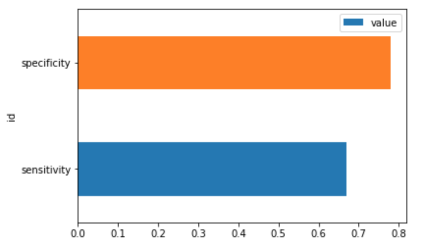

---

copyright:
  years: 2018, 2019
lastupdated: "2019-06-11"

keywords: metrics, monitoring, custom metrics, thresholds

subcollection: ai-openscale

---

{:shortdesc: .shortdesc}
{:new_window: target="_blank"}
{:tip: .tip}
{:important: .important}
{:note: .note}
{:pre: .pre}
{:codeblock: .codeblock}
{:screen: .screen}

# Creazione di monitor personalizzati e metriche 
{: #cst_mtrcs}

I monitor personalizzati consolidano una serie di metriche personalizzate che consentono di tracciare, in modo quantitativo, qualsiasi aspetto della distribuzione del modello e dell'applicazione aziendale. È possibile definire le metriche personalizzate e utilizzarle insieme alle metriche standard, ad esempio le metriche di qualità, prestazioni o correttezza del modello monitorate in {{site.data.keyword.aios_full}}.
{: shortdesc}

Per gestire i monitor personalizzati e le metriche è necessario utilizzare l'interfaccia programmatica che fa parte dell'SDK Python. In modo simile, è possibile memorizzare le metriche personalizzate nel data mart {{site.data.keyword.aios_short}} per accedervi quando necessario. Le metriche personalizzate sono anche visualizzate sul dashboard {{site.data.keyword.aios_short}}.

## Gestione delle metriche personalizzate
{: #cst_mtrc_mgmt}

Per gestire le metriche personalizzate è necessario eseguire le seguenti attività:

1. Registrare il monitor personalizzato con la definizione di metrica.
2. Abilitare il monitor personalizzato.
3. Memorizzare i valori di metrica.

I seguenti supporti didattici avanzati mostrano come eseguire queste operazioni:

- [Utilizzo di Watson Machine Learning](https://github.com/pmservice/ai-openscale-tutorials/blob/master/notebooks/Watson%20OpenScale%20and%20Watson%20ML%20Engine.ipynb)
- [Utilizzo del motore di Machine Learning personalizzato](https://github.com/pmservice/ai-openscale-tutorials/blob/master/notebooks/AI%20OpenScale%20and%20Custom%20ML%20Engine.ipynb)

È possibile disabilitare e abilitare di nuovo il monitoraggio personalizzato in qualsiasi momento. È possibile rimuovere il monitor personalizzato se non è più necessario.

Per ulteriori informazioni, consultare la [documentazione dell'SDK Python](http://ai-openscale-python-client.mybluemix.net/).

## Accesso e visualizzazione di metriche personalizzate
{: #cst_mtrcs_viz}

Per accedere e visualizzare le metriche personalizzate è possibile utilizzare l'interfaccia programmatica. I seguenti supporti didattici avanzati mostrano come eseguire queste operazioni:

- [Utilizzo di Watson Machine Learning](https://github.com/pmservice/ai-openscale-tutorials/blob/master/notebooks/Watson%20OpenScale%20and%20Watson%20ML%20Engine.ipynb)
- [Utilizzo del motore di Machine Learning personalizzato](https://github.com/pmservice/ai-openscale-tutorials/blob/master/notebooks/AI%20OpenScale%20and%20Custom%20ML%20Engine.ipynb)

   Per ulteriori informazioni, consultare la [documentazione dell'SDK Python](http://ai-openscale-python-client.mybluemix.net/).

La visualizzazione delle metriche personalizzate compare sul dashboard {{site.data.keyword.aios_short}}.

<!---

--->
