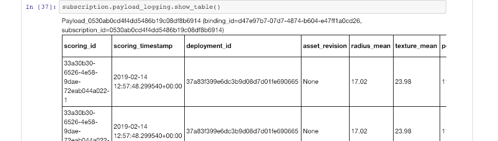

---

copyright:
  years: 2018, 2019
lastupdated: "2019-06-11"

keywords: databases, connections, scoring, requests, schema, REST API, API

subcollection: ai-openscale

---

{:shortdesc: .shortdesc}
{:external: target="_blank" .external}
{:tip: .tip}
{:important: .important}
{:note: .note}
{:pre: .pre}
{:codeblock: .codeblock}
{:download: .download}
{:screen: .screen}
{:javascript: .ph data-hd-programlang='javascript'}
{:java: .ph data-hd-programlang='java'}
{:python: .ph data-hd-programlang='python'}
{:swift: .ph data-hd-programlang='swift'}
{:faq: data-hd-content-type='faq'}

# Registrazione payload e feedback in {{site.data.keyword.aios_short}}
{: #cdb-payload}

Per {{site.data.keyword.aios_short}}, tutte le transazioni che vanno ai modelli distribuiti devono essere registrate come record di payload nel data mart di {{site.data.keyword.aios_short}}. I payload di input e output (richieste e risposte) devono essere nel formato richiesto da {{site.data.keyword.aios_short}} come descritto nelle specifiche.
{: shortdesc}

{{site.data.keyword.aios_short}} supporta la registrazione di payload e feedback attraverso i seguenti metodi:

- [Utilizzo del client Python](/docs/services/ai-openscale?topic=ai-openscale-cdb-payload#cdb-payload-log-pythonsdk)
- [Utilizzo dell'API REST ](/docs/services/ai-openscale?topic=ai-openscale-cdb-payload#cdb-payload-log-rest-api)
- [Automaticamente per i provider di machine learning supportati](/docs/services/ai-openscale?topic=ai-openscale-fmrk-workaround-pyld-lg)

## Registrazione del payload con l'SDK Python
{: #cdb-payload-log-pythonsdk}

Per un esempio di codice completamente funzionante, consultare il notebook di esempio [AI Openscale and Custom ML Engine](https://github.com/pmservice/ai-openscale-tutorials/blob/master/notebooks/AI%20OpenScale%20and%20Custom%20ML%20Engine.ipynb).

Il seguente esempio di codice mostra come registrare il payload utilizzando l'SDK Python:

```
records_list = [
   PayloadRecord(request=request_data, 
                 response=response_data,
                 response_time=response_time), 
   PayloadRecord(request=request_data,
                 response=response_data,
                 response_time=response_time)]
subscription.payload_logging.store(records=records_list)
```

### Anteprima della tabella di registrazione del payload

È possibile visualizzare in anteprima il contenuto della tabella di registrazione payload connettendosi direttamente al database o utilizzando l'SDK Python, come mostrato nel seguente output di esempio. 




## Registrazione del payload con l'API REST
{: #cdb-payload-log-rest-api}

Il seguente esempio di codice mostra come registrare il payload utilizzando l'API REST:

```
PAYLOAD_STORING_HREF_PATTERN ='{}/v1/data_marts/{}/scoring_payloads'
endpoint = PAYLOAD_STORING_HREF_PATTERN.format(
                                AIOS_CREDENTIALS['url'], 
                                AIOS_CREDENTIALS['data_mart_id'])
deployment_uid = subscription.get_details()['entity']['deployments'][0]['deployment_id']
payload = [{'binding_id': binding_uid, 
            'deployment_id': deployment_uid,
            'subscription_id': subscription.uid,
            'scoring_id': scoring_uid,
            'response': response_data,
            'request': request_data}]
headers = {'Authorization': 'Bearer '+ token}
req_response = requests.post(endpoint, 
                             json=payload,
                             headers = headers)
```


## Passi successivi
{: #cdb-payload-nxt-stps}

Per ulteriori informazioni, consultare [Registrazione payload](http://aiopenscale-api.mybluemix.net/#/Payload%20Logging%20(Public%20API)/publishScoringPayload){: external}


