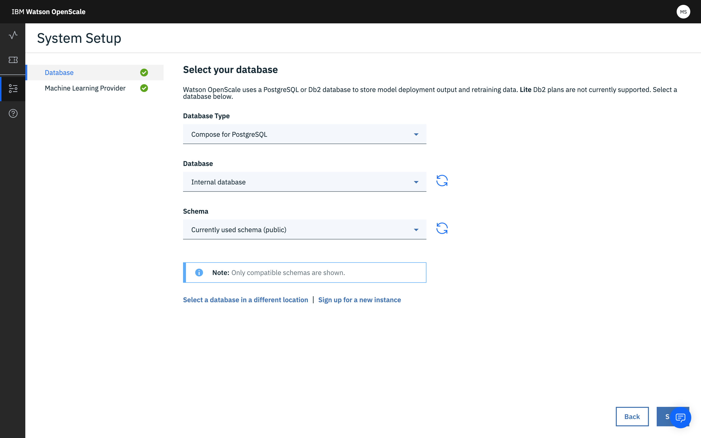

---

copyright:
  years: 2018, 2019
lastupdated: "2019-06-28"

keywords: databases, connections, scoring, requests

subcollection: ai-openscale

---

{:shortdesc: .shortdesc}
{:external: target="_blank" .external}
{:tip: .tip}
{:important: .important}
{:note: .note}
{:pre: .pre}
{:codeblock: .codeblock}
{:download: .download}
{:screen: .screen}
{:javascript: .ph data-hd-programlang='javascript'}
{:java: .ph data-hd-programlang='java'}
{:python: .ph data-hd-programlang='python'}
{:swift: .ph data-hd-programlang='swift'}
{:faq: data-hd-content-type='faq'}

# Specifica di un database
{: #connect-db}

Specificare un database per l'utilizzo da parte dell'istanza {{site.data.keyword.aios_short}}.
{: shortdesc}

## Connessione al database
{: #cdb-connect}

{{site.data.keyword.aios_short}} utilizza un database per memorizzare il payload, il feedback e i dati di misurazione. Oltre a selezionare un database, è possibile selezionare anche uno schema per il database - uno schema è una determinata raccolta di tabelle nel database.

1.  Scegliere un database. Esistono due opzioni: il database gratuito o un database esistente o nuovo.

    

    Se si dispone di un account {{site.data.keyword.cloud_notm}} a pagamento, è possibile fornire un servizio `Databases for PostgreSQL` o `Db2 Warehouse` per sfruttare tutti i vantaggi dell'integrazione con Watson Studio e i servizi di continuous learning. Se si sceglie di non fornire un servizio a pagamento, è possibile utilizzare lo storage interno PostgreSQL gratuito con {{site.data.keyword.aios_short}}, ma non sarà possibile configurare il continuous learning per il modello.
    {: note}

### Database del piano Lite gratuito
{: #cdb-lite}

**NOTA**: il database gratuito ha alcune limitazioni importanti:

- Il database gratuito è ospitato e non è accessibile direttamente.
- {{site.data.keyword.aios_full}} avrà accesso completo al database e quindi avrà accesso completo ai dati.
- Il database gratuito non è conforme con il GDPR. Se il proprio modello elabora informazioni personali identificabili (o PII-personally-identifiable information), non è possibile utilizzare il database gratuito. È necessario acquistare un nuovo database, o utilizzare un database esistente che sia conforme alle regole del GDPR. Consultare [Sicurezza delle informazioni](/docs/services/ai-openscale?topic=ai-openscale-is-ov) per acquisire ulteriori informazioni.

Per procedere con l'utilizzo del database gratuito, fare clic sul riquadro **Utilizza il database del piano Lite gratuito** e fare clic su **Salva**.

  
  
È possibile eseguire l'aggiornamento ad un altro database dal database gratuito, tuttavia non è possibile riconfigurare un'istanza Compose for Postgres, Database for Postgres o Db2 sul database gratuito. Dopo l'aggiornamento non è possibile tornare ad utilizzare il database gratuito. Tutti i dati correnti, come la configurazione, i risultati del calcolo del punteggio e le spiegazioni non possono essere riutilizzati. Selezionando un altro schema o database, l'ambiente {{site.data.keyword.aios_short}} viene completamente reimpostato.

### Database esistente o nuovo
{: #cdb-exn}

1.  Dopo aver selezionato l'opzione **Utilizza il database esistente o acquistane uno nuovo**, {{site.data.keyword.aios_short}} controlla l'account {{site.data.keyword.Bluemix_notm}} per individuare eventuali database esistenti.

1.  Selezionare il proprio tipo di database esistente (Compose per Postgres, Database per Postgres o Db2), quindi un database dal menu a discesa **Database** e quindi uno **Schema**:

    {{site.data.keyword.aios_short}} utilizza un database PostgreSQL o Db2 per memorizzare i dati relativi al modello (dati di feedback, payload di calcolo del punteggio) e le metriche calcolate. I piani DB2 Lite non sono attualmente supportati. Per ulteriori informazioni sui dati di training, consultare [Perché {{site.data.keyword.aios_short}} ha bisogno di accedere ai miei dati di training?](/docs/services/ai-openscale?topic=ai-openscale-trainingdata#trainingdata)
    {: note}

    

1.  È anche possibile fare clic su **Seleziona un percorso differente** per specificare una ubicazione database al di fuori del proprio account {{site.data.keyword.Bluemix_notm}}.

    {{site.data.keyword.aios_short}} utilizza un database PostgreSQL o Db2 per memorizzare i dati relativi al modello (dati di feedback, payload di calcolo del punteggio) e le metriche calcolate. I piani DB2 Lite non sono attualmente supportati.
    {: note}

    - Selezionare il **Tipo di database** (`Compose per PostgreSQL`, `Database per PostgreSQL` o `Db2`), quindi fornire le informazioni di connessione:

        - Per un database `Compose per PostgreSQL`, indicare le seguenti informazioni:

            - Nome host o indirizzo IP
            - Porta
            - Database (nome)
            - Nome utente
            - Password

        - Per un database `Database per PostgreSQL`, indicare le seguenti informazioni:

            - Nome host o indirizzo IP
            - Porta SSL
            - Certificato con codifica Base-64
            - Database (nome)
            - Nome utente
            - Password

        - Per un database `Db2`, indicare le seguenti informazioni:

            - Nome host o indirizzo IP
            - Porta SSL
            - Database (nome)
            - Nome utente
            - Password

    - Dopo aver eseguito correttamente la connessione, è possibile selezionare uno schema e salvare il lavoro.

      Il nome schema deve essere fornito esplicitamente se si fornisce un'istanza Db2 con accesso limitato, cosa che non consente che il nome schema sia generato automaticamente. Questo si applica al piano Entry Db2 Warehouse.
      {: important}

## Passi successivi
{: #cdb-next}

{{site.data.keyword.aios_short}} ora è pronto per poter [inviare un payload di calcolo del punteggio](/docs/services/ai-openscale?topic=ai-openscale-cdb-score) e [configurare i monitor per le distribuzioni](/docs/services/ai-openscale?topic=ai-openscale-mo-config).
