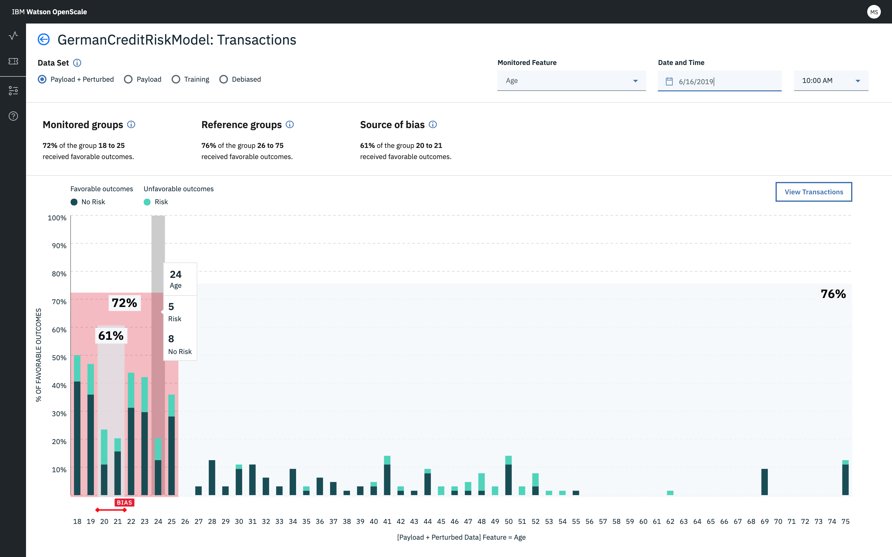
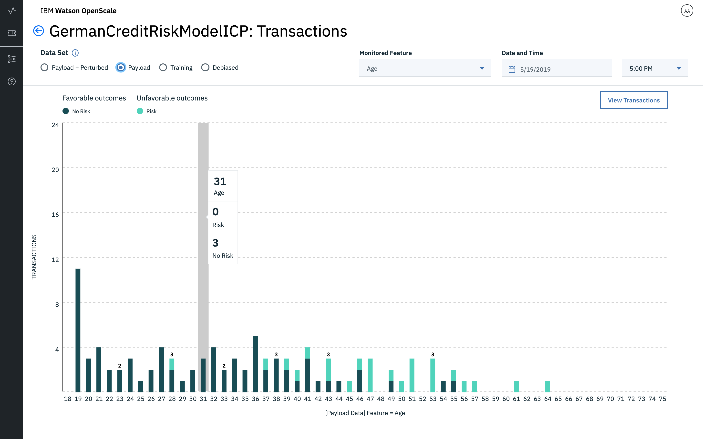
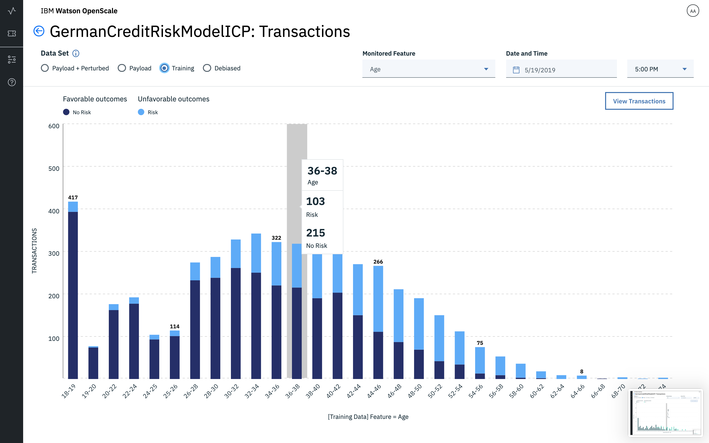

---

copyright:
  years: 2018, 2019
lastupdated: "2019-06-28"

keywords: metrics, monitoring, custom metrics, thresholds

subcollection: ai-openscale

---

{:shortdesc: .shortdesc}
{:external: target="_blank" .external}
{:tip: .tip}
{:important: .important}
{:note: .note}
{:pre: .pre}
{:codeblock: .codeblock}
{:download: .download}
{:screen: .screen}
{:javascript: .ph data-hd-programlang='javascript'}
{:java: .ph data-hd-programlang='java'}
{:python: .ph data-hd-programlang='python'}
{:swift: .ph data-hd-programlang='swift'}
{:faq: data-hd-content-type='faq'}

# Panoramica sulle metriche di correttezza
{: #anlz_metrics_fairness}

Utilizzare il monitoraggio della correttezza di {{site.data.keyword.aios_full}} per determinare se i risultati prodotti dal modello sono corretti o meno per il gruppo monitorato. Quando il monitoraggio della correttezza è abilitato, genera una serie di metriche ogni ora per impostazione predefinita. È possibile generare queste metriche on-demand facendo clic sul pulsante **Controlla qualità ora** o utilizzando il client Python.
{: shortdesc}

{{site.data.keyword.aios_short}} identifica automaticamente se sono presenti attributi protetti noti in un modello. Quando {{site.data.keyword.aios_short}} rileva tali attributi, raccomanda automaticamente di configurare i monitor della distorsione per ogni attributo presente, per garantire che venga tracciata in produzione la distorsione su tali attributi potenzialmente sensibili. 

Attualmente, {{site.data.keyword.aios_short}} rileva e raccomanda i monitoraggi per i seguenti attributi protetti: 

- sex
- ethnicity
- marital status
- age
- zip code

Oltre a rilevare gli attributi protetti, {{site.data.keyword.aios_short}} consiglia quali valori all'interno di ciascun attributo devono essere impostati come valori monitorati e di riferimento. Così, ad esempio, {{site.data.keyword.aios_short}} raccomanda che all'interno dell'attributo "Sex", il monitor di distorsione sia configurato in modo tale che "Woman" e "Non-Binary" siano i valori monitorati e "Male" sia il valore di riferimento. Se si desidera modificare una delle raccomandazioni, è possibile farlo tramite il pannello di configurazione della distorsione. 

I monitor di distorsione consigliati aiutano a velocizza la configurazione e assicurano che nei modelli AI venga controllata la correttezza rispetto agli attributi sensibili. Poiché i regolatori iniziano ad essere più attenti rispetto alla distorsione algoritmica, è ancora più importante per le organizzazioni capire come funzionano i modelli e se producono risultati scorretti per determinati gruppi.

## Informazioni sulla correttezza
{: #mf-understand}

{{site.data.keyword.aios_short}} controlla il modello distribuito alla ricerca di distorsioni in fase di runtime. Per rilevare la distorsione per un modello distribuito, è necessario definire gli attributi di correttezza, come età o genere, come dettagliato nella seguente sezione [Configurazione del monitor Correttezza](#mf-config).

È obbligatorio specificare lo schema di output per un modello o funzione in {{site.data.keyword.pm_short}}, affinché il controllo della distorsione sia abilitato in {{site.data.keyword.aios_short}}. Lo schema di output può essere specificato utilizzando la proprietà `client.repository.ModelMetaNames.OUTPUT_DATA_SCHEMA` nella parte dei metadati dell'API `store_model`. Per ulteriori informazioni, consultare la [Documentazione per il client {{site.data.keyword.pm_full}}](http://wml-api-pyclient-dev.mybluemix.net/#repository){: external}.

### Funzionamento
{: #mf-works}

Prima di configurare il monitor Correttezza, è importante conoscere alcuni concetti chiave:

- Gli attributi di correttezza sono gli attributi del modello per i quali è probabile che il modello esibisce distorsione. Come esempio, per l'attributo di correttezza **`Gender`**, il modello potrebbe essere distorto rispetto ai valori di genere specifici (`Female`, `Transgender`, ecc.) Un altro esempio di attributo di correttezza è **`Age`**, dove il modello potrebbe esibire distorsione rispetto alle persone in un gruppo di età, come `18-25`.

- Valori di riferimento e monitorati: i valori degli attributi di correttezza sono divisi in due categorie distinte: riferimento e monitorato. I valori monitorati sono quelli rispetto ai quali probabilmente avverrà la discriminazione. Nel caso di un attributo di correttezza come **`Gender`**, i valori monitorati potrebbero essere `Female` e `Transgender`. Per un attributo di correttezza numerico, come ad esempio **`Age`**, i valori monitorati potrebbero essere `[18-25]`. Tutti gli altri valori per un determinato attributo di correttezza quindi considerati come valori di riferimento, ad esempio `Gender=Male` o `Age=[26,100]`.

- Risultati favorevoli e non favorevoli: l'output del modello è categorizzato come Favorevole o Non favorevole. Come esempio, se un modello deve prevedere se una persona può ottenere un prestito o meno, il risultato favorevole può essere `Loan Granted` o `Loan Partially Granted`, mentre il risultato non favorevole può essere `Loan Denied`. Così, il risultato favorevole viene considerato un risultato positivo, mentre il risultato sfavorevole è considerato negativo.

L'algoritmo {{site.data.keyword.aios_short}} calcola la distorsione su base oraria, utilizzando gli ultimi `N` record presenti nella tabella di registrazione del payload; il valore di `N` viene specificato durante la configurazione della correttezza. L'algoritmo perturba questi ultimi `N` record per generare dati aggiuntivi.

La perturbazione viene effettuata modificando il valore dell'attributo di correttezza da Riferimento a Monitorato, o viceversa. I dati perturbati vengono poi inviati al modello per valutarne il comportamento. L'algoritmo considera gli ultimi `N` record nella tabella del payload, e il comportamento del modello sui dati perturbati, per decidere se il modello agisce in modo distorto.

Un modello è considerato distorto se, in questo dataset combinato, la percentuale di risultati favorevoli per la classe monitorata è inferiore alla percentuale di risultati favorevoli per la classe di riferimento, per qualche valore di soglia. Questo valore di soglia deve essere specificato quando si configura la correttezza.

I valori di correttezza possono essere più del 100%. Ciò significa che il gruppo monitorato ha ricevuto più risultati favorevoli rispetto al gruppo di riferimento. Inoltre, se non vengono inviate nuove richieste di punteggio, il valore di correttezza rimarrà costante.
{: note}

### Calcolo matematico
{: #mf-bias-math}

La metrica di correttezza utilizzata in {{site.data.keyword.aios_short}} ha impatto eterogeneo, cioé una misurazione di come la frequenza con cui un gruppo non privilegiato riceve un certo risultato o il risultato viene confrontato con la frequenza con cui un gruppo privilegiato riceve quello stesso risultato.

La seguente formula matematica viene utilizzata per il calcolo dell'impatto eterogeneo:

```
                     (num_positives(privileged=False) / num_instances(privileged=False))
Impatto eterogeneo =   ______________________________________________________________________

                     (num_positives(privileged=True) / num_instances(privileged=True))
```

dove `num_positives` è il numero di individui nel gruppo (privileged=False, cioé non privilegiati o privileged=True, cioé privilegiati) che hanno ricevuto un risultato positivo e num_instances è il numero totale di individui nel gruppo.

Il numero risultante sarà una percentuale, cioé la percentuale della frequenza con cui il gruppo non privilegiato riceve il risultato positivo rispetto alla frequenza con cui il gruppo privilegiato riceve il risultato positivo. Ad esempio, se un modello di rischio di credito assegna la previsione “nessun rischio” all'80% di richiedenti non privilegiati e al 100% di richiedenti privilegiati, il modello avrà un impatto eterogeneo (presentato come punteggio di correttezza in {{site.data.keyword.aios_short}}) dell'80%.

In {{site.data.keyword.aios_short}}, i risultati positivi sono designati come risultati favorevoli e i risultati negativi come risultati non favorevoli. Il gruppo privilegiato è designato come gruppo di riferimento e il gruppo non privilegiato come gruppo monitorato.


### Visualizzazione distorsione 
{: #mf-monitor-bias-viz}

Quando viene rilevata una potenziale distorsione, {{site.data.keyword.aios_short}} esegue diverse funzioni per confermare se la distorsione è reale. {{site.data.keyword.aios_short}} perturba i dati invertendo il valore monitorato con quello di riferimento ed eseguendo questo nuovo record nel modello. Successivamente, visualizza l'output risultante come output senza distorsione. {{site.data.keyword.aios_short}} inoltre addestra un modello shadow senza distorsione che viene poi utilizzato per rilevare quando un modello sta per effettuare una previsione distorta. 

Vengono utilizzati due diversi dataset per il calcolo della correttezza e dell'accuratezza. La correttezza è calcolata utilizzando i dati del payload + i dati perturbati. L'accuratezza è calcolata utilizzando i dati di feedback. Per calcolare l'accuratezza, {{site.data.keyword.aios_short}} necessita di dati etichettati manualmente, che sono presenti solo nella tabella di feedback.

I risultati di tali determinazioni sono disponibili nella visualizzazione della distorsione, che include le seguenti viste. Si vedono solo le viste se ci sono dati da supportare

- **Payload + Perturbati**: include la richiesta di calcolo del punteggio ricevuta per l'ora selezionata più record aggiuntivi da ore precedenti se non è stato soddisfatto il numero minimo di record richiesti per la valutazione. Include altri record perturbati/sintetizzati utilizzati per testare la risposta del modello quando il valore della funzione monitorata cambia.

   Prendere nota dei seguenti dettagli su payload e perturbati:

   - Numero di record letti in questa ora dalla tabella di payload
   - Record aggiuntivi letti nelle ore precedenti (ad esempio, se il valore `min_records` nella configurazione di correttezza è impostato su 1000, e tra le 2pm e le 3pm  vengono aggiunti solo 10 record, per soddisfare il requisito minimo, il sistema leggerà ulteriori 990 record dalle ore precedenti.)
   - Record perturbati per attributo di correttezza
   - Data/ora record più vecchio nel frame di dati per cui deve essere calcolata la distorsione
   - Data/ora record più recente nel frame di dati per cui deve essere calcolata la distorsione

  


- **Payload**: le richieste di calcolo del punteggio effettive ricevute dal modello per l'ora selezionata.

   Prendere nota dei seguenti dettagli sul payload:
   
   - Numero di record letti sui quali viene eseguita l'operazione di annullamento distorsione dalla tabella di payload
   - Data/ora record più vecchio nel frame di dati per cui deve essere calcolata la distorsione
   - Data/ora record più recente nel frame di dati per cui deve essere calcolata la distorsione


  

- **Training**: i record dei dati di training utilizzati per addestrare il modello.

   Prendere nota dei seguenti dettagli sul training:
   
   - Numero di record di dati di training. I dati di training sono letti una sola volta e la distribuzione è memorizzata nella variabile `sottoscrizione/configurazione_correttezza`. Durante l'elaborazione della distribuzione è anche possibile trovare il numero di record di dati di training e conservarlo nella stessa distribuzione. Inoltre, quando i dati di training vengono modificati, cioè se il comando `POST /distribuzione_dati` viene rieseguito, questo valore viene aggiornato nella variabile `configurazione_correttezza/distribuzione_dati_training`. Quando si invia la metrica, è opportuno inviare anche questo valore.
   - L'ora in cui i dati di training sono stati elaborati l'ultima volta (prima volta e successivi aggiornamenti)

  
   

   
- **Distorsione annullata**: l'output dell'algoritmo di annullamento distorsione dopo l'elaborazione dei dati di runtime e perturbati. Selezionando il pulsante di scelta **Modello con distorsione annullata** vengono mostrati i cambiamenti nel modello con distorsione annullata, rispetto al modello in produzione. Il grafico riflette lo stato migliorato del risultato per i gruppi.


   Prendere nota dei seguenti dettagli sulla distorsione annullata:
   
   - Numero di record letti sui quali viene eseguita l'operazione di annullamento distorsione dalla tabella di payload
   - Record aggiuntivi letti per eseguire la distorsione, e quindi annullarla. Stesso numero nella selezione `Payload + Perturbati`
   - Record perturbati per attributo di correttezza
   - Data/ora record più vecchio nel frame di dati per cui deve essere calcolata la distorsione
   - Data/ora record più recente nel frame di dati per cui deve essere calcolata la distorsione
   - I valori di correttezza prima e dopo sono visualizzati nella porzione di intestazione della vista Distorsione annullata. 
      - Il valore di accuratezza **dopo** è calcolato prendendo i dati di feedback e inviandoli all'API di annullamento distorsione attiva. Questa API restituisce la previsione senza distorsione. I dati di feedback contengono anche l'etichetta manuale. L'etichetta manuale è confrontata con la previsione senza distorsione per calcolare l'accuratezza. Questa API restituisce la previsione senza distorsione. La tabella di feedback contiene anche l'etichetta manuale. L'etichetta manuale è confrontata con la previsione senza distorsione per calcolare l'accuratezza. 
      - Il valore di accuratezza **prima** è calcolata utilizzando gli stessi dati di feedback. Per il calcolo dell'accuratezza prima, i dati di feedback sono inviati al modello per ottenerne la previsione e il valore previsto è confrontato con l'etichetta manuale per ottenere l'accuratezza.

  
  
### Esempio:
{: #mf-ex1}

Considerare un punto di dati in cui, per `Gender=Male` (valore di riferimento), il modello prevede un risultato favorevole, ma quando il record è perturbato dalla modifica di `Gender` in `Female` (valore monitorato), pur mantenendo tutti gli altri valori funzione, il modello prevede un risultato non favorevole. Un modello complessivo è considerato distorto se ci sono sufficienti punti di dati (negli ultimi `N` record nella tabella del payload, più i dati perturbati) in cui il modello agiva in modo distorto.

### Modelli supportati
{: #mf-supmo}

 {{site.data.keyword.aios_short}} supporta il rilevamento della distorsione solo per i modelli e le funzioni Python che prevedono tipi di dati strutturati nel vettore funzione.

Le metriche di correttezza sono calcolate in base alle seguenti informazioni:

- calcolo del punteggio dei dati del payload.

Al fine di un corretto monitoraggio, ogni richiesta di calcolo del punteggio dovrebbe essere registrata anche in {{site.data.keyword.aios_short}}. La registrazione dei dati di payload è automatizzata per i motori {{site.data.keyword.pm_full}}.

Per altri motori di machine learning, i dati del payload possono essere forniti utilizzando il client Python o l'API REST.

Per i motori di machine learning diversi da {{site.data.keyword.pm_full}}, il monitoraggio della correttezza crea ulteriori richieste di calcolo del punteggio sulla distribuzione monitorata.
{: note}

È possibile esaminare tutti i valori di metrica nel tempo sul dashboard {{site.data.keyword.aios_short}}:


È possibile esaminare i dettagli correlati, ad esempio risultati favorevoli e sfavorevoli:


È possibile visualizzare transazioni dettagliate:


È possibile visualizzare l'endpoint di calcolo del punteggio senza distorsione consigliato:


### Metriche di correttezza supportate
{: #anlz_metrics_supfairmets}

Le seguenti metriche di correttezza sono supportate da {{site.data.keyword.aios_short}}:

- [Correttezza per un gruppo](https://test.cloud.ibm.com/docs/services/ai-openscale?topic=ai-openscale-quality_group)

I seguenti attributi protetti sono supportati da {{site.data.keyword.aios_short}}: 

- [sex](/docs/services/ai-openscale?topic=ai-openscale-quality_group#quality_group-sex)
- [ethnicity](/docs/services/ai-openscale?topic=ai-openscale-quality_group#quality_group-ethnicity)
- [marital status](/docs/services/ai-openscale?topic=ai-openscale-quality_group#quality_group-marital)
- [age](/docs/services/ai-openscale?topic=ai-openscale-quality_group#quality_group-age)
- [zip code](/docs/services/ai-openscale?topic=ai-openscale-quality_group#quality_group-zip)


### Dettagli di correttezza supportati
{: #anlz_metrics_supfairdets}

I seguenti dettagli delle metriche di correttezza sono supportati da {{site.data.keyword.aios_short}}:

- Le percentuali di risultati favorevoli per ciascuno dei gruppi
- Le medie di correttezza per tutti i gruppi di correttezza

```
                          (% di risultati favorevoli nel gruppo monitorato)
Rapporto impatto eterogeneo =  ____________________________________________
                          (% di risultati favorevoli nel gruppo di riferimento)
```

- Distribuzione dei dati per ciascuno dei gruppi monitorati
- Distribuzione dei dati del payload
