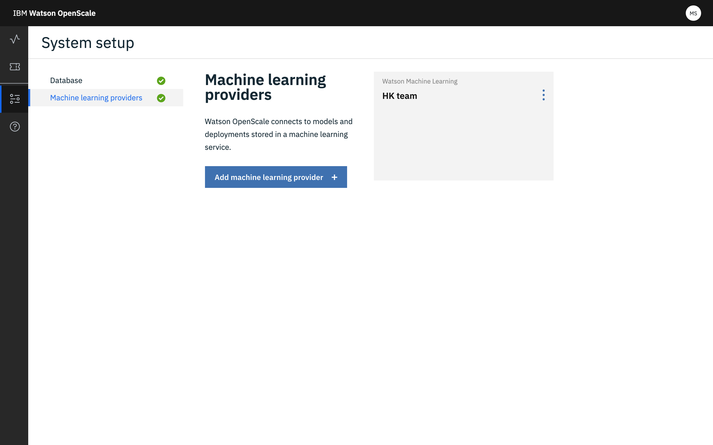

---

copyright:
  years: 2018, 2019
lastupdated: "2019-06-28"

keywords: multiple engines, non-Watson, machine learning, frameworks, provision

subcollection: ai-openscale

---

{:shortdesc: .shortdesc}
{:external: target="_blank" .external}
{:tip: .tip}
{:important: .important}
{:note: .note}
{:pre: .pre}
{:codeblock: .codeblock}
{:download: .download}
{:screen: .screen}
{:javascript: .ph data-hd-programlang='javascript'}
{:java: .ph data-hd-programlang='java'}
{:python: .ph data-hd-programlang='python'}
{:swift: .ph data-hd-programlang='swift'}
{:faq: data-hd-content-type='faq'}

# Supporto per più motori di machine learning
{: #fmrk-workaround-multmleng}

{{site.data.keyword.aios_short}} supporta più motori di machine learning all'interno di una singola istanza. È possibile eseguirne il provisioning attraverso la configurazione del dashboard {{site.data.keyword.aios_short}} o dell'[SDK Python](http://ai-openscale-python-client.mybluemix.net/?cm_mc_uid=70732728440115575086192&cm_mc_sid_50200000=62539451560175957820).
{: shortdesc}

Quando si configura per la prima volta {{site.data.keyword.aios_short}}, è possibile utilizzare l'interfaccia utente o l'opzione di configurazione automatizzata per eseguire il provisioning del primo motore di machine learning. L'aggiunta di motori di machine learning richiede l'utilizzo della scheda di configurazione sul dashboard {{site.data.keyword.aios_short}} o l'SDK Python.

## Utilizzo del dashboard per aggiungere i provider
{: #fmrk-workaround-multmleng-dashboard}

1. Dopo aver aperto {{site.data.keyword.aios_short}}, dalla scheda **Configura**, fare clic sui pulsanti **Aggiungi provider di machine learning**.

   

2. Fare clic sul riquadro del provider che si desidera aggiungere e fare clic su **Avanti**.

   

3. Immettere le informazioni richieste, come le credenziali, e fare clic su **Salva**.

Dopo aver salvato la configurazione, si ha l'opzione di andare al dashboard, scegliere le distribuzioni o configurare i monitor.

## Aggiunta di provider di machine learning utilizzando il metodo di bind dell'SDK Python
{: #fmrk-workaround-multmleng-binding}

È possibile collegare più di un motore di machine learning a {{site.data.keyword.aios_short}} utilizzando il metodo `client.data_mart.bindings.add` dell'API Python. 

### {{site.data.keyword.pm_full}}
{: #fmrk-workaround-multmleng-binding-wml}

- Per collegare il motore di machine learning {{site.data.keyword.pm_full}}, eseguire il seguente comando:

   `binding_uid = client.data_mart.bindings.add('WML instance', WatsonMachineLearningInstance(WML_CREDENTIALS))`

### Microsoft Azure ML Studio
{: #fmrk-workaround-multmleng-binding-azurestudio}

- Per collegare il motore di machine learning Azure ML Studio, eseguire il seguente comando:

  `binding_uid_2 = client.data_mart.bindings.add('My Azure ML Studio engine', AzureMachineLearningInstance(AZURE_ENGINE_CREDENTIALS))`

### Amazon Sagemaker
{: #fmrk-workaround-multmleng-binding-aws}

- Per collegare il motore di machine learning AWS Sagemaker, eseguire il seguente comando:

  `binding_uid_3 = client.data_mart.bindings.add('My AWS SageMaker engine', SageMakerMachineLearningInstance(SAGEMAKER_ENGINE_CREDENTIALS)) `

### Microsoft Azure ML Service
{: #fmrk-workaround-multmleng-binding-azureservice}

- Per collegare il motore di machine learning Azure ML Service, eseguire il seguente comando:

  `binding_uid_4 = client.data_mart.bindings.add('My Azure ML Service engine', AzureServiceMachineLearningInstance(AZURE_SRVR_ENGINE_CREDENTIALS))`

### Produzione di un elenco di provider di machine learning
{: #fmrk-workaround-multmleng-binding-list}

Per visualizzare un elenco di tutti i collegamenti, eseguire il metodo `list`:

`    client.data_mart.bindings.list()
    `

| uid | nome | tipo_servizio | creato |
|:---|:---:|:---:|:---:
| e88ms###-####-####-############ | motore Azure ML Service | azure_machine_learning | 2019-04-04T09:50:33.189Z |
| e88sl###-####-####-############ | motore Azure ML Studio | azure_machine_learning | 2019-04-04T09:50:33.186Z |
| e00sjl###-####-####-############ | istanza WML | watson_machine_learning | 2019-03-04T09:50:33.338Z |
| e43kl###-####-####-############ | motore AWS SageMaker | sagemaker_machine_learning | 2019-04-04T09:50:33.186Z |
{: caption="Tabella 1. Collegamenti servizio" caption-side="top"}

Per informazioni su specifici motori di machine learning, consultare i seguenti argomenti:

- [Collegare il motore di machine learning personalizzato](/docs/services/ai-openscale?topic=ai-openscale-cml-cusbind#cml-cusbind).
- [Collegare il motore Microsoft Azure Machine Learning Studio](/docs/services/ai-openscale?topic=ai-openscale-cml-azbind#cml-azbind)
- [Collegare il motore Microsoft Azure Machine Learning Service](/docs/services/ai-openscale?topic=ai-openscale-cml-azsrvconfig#cml-azsrvbind)
- [Collegare il motore di machine learning Amazon SageMaker](/docs/services/ai-openscale?topic=ai-openscale-cml-smbind#cml-smbind)

Per un esempio funzionante di un notebook reale, consultare [i notebook di esempio di {{site.data.keyword.aios_short}}](https://github.com/pmservice/ai-openscale-tutorials/tree/master/notebooks).

