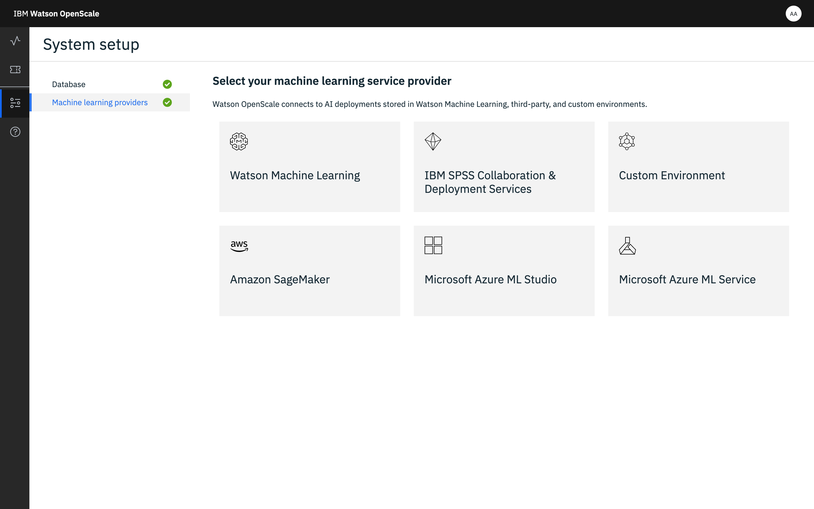

---

copyright:
  years: 2018, 2019
lastupdated: "2019-06-28"

keywords: supported frameworks, models, model types, limitations, limits, custom machine learning engine, custom

subcollection: ai-openscale

---

{:shortdesc: .shortdesc}
{:external: target="_blank" .external}
{:tip: .tip}
{:important: .important}
{:note: .note}
{:pre: .pre}
{:codeblock: .codeblock}
{:download: .download}
{:screen: .screen}
{:javascript: .ph data-hd-programlang='javascript'}
{:java: .ph data-hd-programlang='java'}
{:python: .ph data-hd-programlang='python'}
{:swift: .ph data-hd-programlang='swift'}
{:faq: data-hd-content-type='faq'}

# Framework ML personalizzati
{: #frmwrks-custom}

È possibile utilizzare un framework di machine learning personalizzato per eseguire la registrazione del payload, del feedback e per misurare l'accuratezza delle prestazioni, il rilevamento della distorsione al run-time, l'esplicabilità e la funzione di annullamento della distorsione automatico in {{site.data.keyword.aios_full}}. Il framework di machine learning personalizzato deve essere equivalente a {{site.data.keywor.pm_full}}.

{{site.data.keyword.aios_full}} supporta completamente i seguenti framework machine learning personalizzati:
{: shortdesc}

Tabella 1. Dettagli supporto framework

| Framework | Tipo di problema | Tipo di dati |
|:---|:---:|:---:|
| Equivalente a {{site.data.keyword.pm_full}} | Classificazione | Strutturato |
{: caption="Dettagli supporto framework" caption-side="top"}

## Aggiunta di un motore di machine learning personalizzato a {{site.data.keyword.aios_short}}
{: #frmwrks-custom-add}

È possibile configurare {{site.data.keyword.aios_short}} per lavorare con un provider di machine learning personalizzato utilizzando uno dei seguenti metodi:

- Se è la prima volta che si aggiunge un provider di machine learning personalizzato a {{site.data.keyword.aios_short}}, è possibile utilizzare l'interfaccia di configurazione. Per ulteriori informazioni, consultare [Specifica di un'istanza di machine learning personalizzata](/docs/services/ai-openscale?topic=ai-openscale-co-connect).
- È anche possibile aggiungere il provider di machine learning utilizzando l'SDK Python. È necessario utilizzare questo metodo se si desidera avere più di un provider. Per ulteriori informazioni sull'esecuzione programmatica di questa azione, consultare [Collegare il motore di machine learning personalizzato](/docs/services/ai-openscale?topic=ai-openscale-cml-connect#cml-cusbind).


## Notebook di esempio
{: #frmwrks-custom-smpl-ntbks}

- [Creazione del motore di machine learning utilizzando il cluster Kubernetes](https://github.com/pmservice/ai-openscale-tutorials/tree/master/applications/custom-ml-engine-bluemix){: external}
- [Creazione data mart, monitoraggio distribuzione modello e analisi dati](https://github.com/pmservice/ai-openscale-tutorials/blob/master/notebooks/AI%20OpenScale%20and%20Custom%20ML%20Engine.ipynb){: external}

## Scopri di più
{: #frmwrks-custom-mediumblogs}

[Monitorare il motore di machine learning personalizzato con Watson OpenScale](https://developer.ibm.com/patterns/monitor-custom-machine-learning-engine-with-ai-openscale/){: external}

## Motore di machine learning personalizzato
{: #fmrk-workaround-customengine}

Un motore di machine learning personalizzato fornisce l'infrastruttura e le capacità di hosting per i modelli di machine learning e le applicazioni web. I motori di machine learning personalizzati supportati da {{site.data.keyword.aios_short}} devono essere conformi ai seguenti requisiti:

- Esporre due tipi di endpoint API REST:

   * endpoint di rilevamento (fornisce l'elenco di distribuzioni e i dettagli)
   * endpoint di calcolo del punteggio (calcolo del punteggio online e in tempo reale)

- Per essere supportati, tutti gli endpoint devono essere compatibili con la specifica swagger.

- Il payload di input e l'output da o verso la distribuzione devono essere compatibili con il formato file JSON descritto nella specifica.

In questa fase sono supportati solo i formati `BasicAuth` o `none`.
{: Note}

Il seguente esempio mostra la specifica degli endpoint API REST:


Il seguente esempio mostra il formato per un payload di input:


## Quando un motore di machine learning personalizzato rappresenta la scelta migliore?
{: #fmrk-workaround-enging-choice}

Un motore di machine learning personalizzato rappresenta la scelta migliore quando le seguenti situazioni sono vere:

- Non si utilizza alcun prodotto pronto all'uso disponibile per servire i modelli di machine learning. È stato appena sviluppato il proprio sistema per farlo. Non c'è e non ci sarà alcun supporto diretto in {{site.data.keyword.aios_short}} per questo.
- Il motore di servizio che si sta utilizzando da un fornitore di terze parti non è ancora supportato da {{site.data.keyword.aios_short}}. In questo caso, considerare di sviluppare un motore di machine learning personalizzato come un wrapper per le distribuzioni originali o native.

## Specifica di un'istanza del servizio ML personalizzata
{: #co-connect}

Il primo passo nello strumento {{site.data.keyword.aios_short}} è quello di specificare un'istanza del servizio. L'istanza del servizio è il luogo dove si memorizzano i modelli AI e le distribuzioni.
{: shortdesc}

## Connessione dell'istanza del servizio personalizzata
{: #co-config}

{{site.data.keyword.aios_short}} si collega ai modelli e alle distribuzioni AI in un'istanza del servizio. È possibile collegare un servizio personalizzato

1.  Dalla scheda **Configura**, nel riquadro di navigazione, fare clic su **Provider di machine learning**.

   

2. Fare clic sul pulsante **Aggiungi provider di machine learning** e fare clic sul riquadro **Ambiente personalizzato**.

   

3. Immettere un nome e una descrizione per il provider di machine learning personalizzato e fare clic su **Avanti**. 

4. Scegliere se connettersi alle distribuzioni [richiedendo un elenco](/docs/services/ai-openscale?topic=ai-openscale-co-connect#co-config-request-list) o [immettendo singoli endpoint di calcolo del punteggio](/docs/services/ai-openscale?topic=ai-openscale-co-connect#co-config-scoring-endpoints).

   
    
5. Fare clic su **Avanti**.

### Richiesta dell'elenco di distribuzioni
{: #co-config-request-list}

1. Se si seleziona il riquadro **Richiedi l'elenco di distribuzioni**, immettere le credenziali e l'endpoint API, quindi fare clic su **Salva**.

   

2. Dopo aver salvato l'impostazione del machine learning, tornare al **Dashboard**, fare clic sulla scheda **Insight**, quindi fare clic sul pulsante **Aggiungi al dashboard**.

3. Selezionare una distribuzione dall'elenco e fare clic su **Configura**.

Ora si è pronti a configurare i monitor.

### Fornitura di singoli endpoint di calcolo del punteggio
{: #co-config-scoring-endpoints}

1. Se si seleziona il riquadro **Immetti gli endpoint del punteggio individuali**, immettere le credenziali per l'endpoint API, quindi fare clic su **Salva**.

2. Dopo aver salvato l'impostazione del machine learning, tornare al **Dashboard**, fare clic sulla scheda **Insight**, quindi fare clic sul pulsante **Aggiungi al dashboard**.

3. Fare clic sul pulsante **Aggiungi endpoint**.

4. Dal menu a discesa, selezionare l'ambiente personalizzato, immettere il nome della distribuzione e l'endpoint API, quindi fare clic su **Salva**.

Ora si è pronti a configurare i monitor.

### Funzionamento
{: #co-works}

La seguente immagine mostra il supporto dell'ambiente personalizzato:


È anche possibile fare riferimento ai seguenti link:

[API di registrazione payload {{site.data.keyword.aios_short}}](https://{DomainName}/apidocs/ai-openscale#publish-scoring-payload){: external}

[Custom deployment API](https://aiopenscale-custom-deployement-spec.mybluemix.net/){: external}

[Python client binding SDK](http://ai-openscale-python-client.mybluemix.net/#bindings){: external}

[Utilizzo del motore di machine learning personalizzato](https://github.com/pmservice/ai-openscale-tutorials/blob/master/notebooks/AI%20OpenScale%20and%20Custom%20ML%20Engine.ipynb){: external}

[Python SDK for IBM Watson OpenScale](https://pypi.org/project/ibm-ai-openscale/){: external}

- **Criteri di input perché il modello supporti i monitor**

  Il modello deve assumere come input un vettore di funzione, che è essenzialmente una raccolta di campi indicati e i loro valori (i campi monitorati per la distorsione devono essere tra questi):

  ```bash
  {
    "fields": [
        "name",
        "age",
        "position"
    ],
    "values": [
        [
            "john",
            33,
            "engineer"
        ],
        [
            "mike",
            23,
            "student"
        ]
    ]
  }
  ```

  In questo esempio, `“age”` potrebbe essere un campo che qualcuno sta valutando per la correttezza.

  Se l'input è un tensore o una matrice, trasformati dallo spazio della funzione di input (come spesso accade nel deep learning da testo o immagini), il modello non può essere gestito dalla piattaforma {{site.data.keyword.aios_short}} nella release corrente. Per estensione, i modelli di deep learning con input di testo o immagine non possono essere gestiti per la rilevazione e la mitigazione della distorsione.

  Inoltre, i dati di training devono essere caricati per supportare l'esplicabilità.

  Per l'esplicabilità sul testo, una delle funzioni deve essere il testo completo. L'esplicabilità sulle immagini per un modello personalizzato non è supportata nella release corrente.
  {: note}

- **Criteri di output perché il modello supporti i monitor**

  Il modello dovrebbe emettere il vettore della funzione di input insieme alle probabilità previsionali di varie classi in quel modello.

  ```bash
  {
    "fields": [
        "name",
        "age",
        "position",
        "prediction",
        "probability"
    ],
    "labels": [
        "personal",
        "camping"
    ],
    "values": [
        [
            "john",
            33,
            "engineer",
            "personal",
            [
                0.6744664422398081,
                0.3255335577601919
            ]
        ],
        [
            "mike",
            23,
            "student"
            "camping",
            [
                0.2794765664946941,
                0.7205234335053059
            ]
        ]
    ]
  }
  ```

  In questo esempio, `"personal”` e `“camping”` sono le possibili classi e i punteggi in ogni output di calcolo del punteggio sono assegnati a entrambe le classi. Se mancano le probabilità previsionali, il rilevamento della distorsione funzionerà, ma non funzionerà l'annullamento automatico della distorsione.

  L'output del calcolo del punteggio sopra riportato deve essere accessibile da un endpoint di calcolo del punteggio attivo che {{site.data.keyword.aios_short}} può richiamare su REST. Per AzureML, SageMaker e {{site.data.keyword.pm_full}}, {{site.data.keyword.aios_short}} connette direttamente agli endpoint di calcolo del punteggio nativi, pertanto non occorre implementare la specifica di punteggio.

## Esempi di motori di machine learning personalizzati
{: #fmrk-workaround-cstmmlsengex}

Utilizzare i seguenti esempi per configurare il proprio motore di machine learning personalizzato.
{: shortdesc}

### Python e flask
{: #fmrk-workaround-pandflask}

L'[esempio di motore ML personalizzato pubblicato su git](https://github.com/pmservice/ai-openscale-tutorials/tree/master/applications/custom-ml-engine-bluemix){: external} utilizza pitone e flask per servire il modello scikit-learn.

Il [file README](https://github.com/pmservice/ai-openscale-tutorials/tree/master/applications/custom-ml-engine-bluemix){: external} descrive come l'app può essere distribuita localmente per scopi di test così come per la configurazione dell'applicazione su IBM Cloud. L'implementazione degli endpoint API REST può essere trovata nel [file app.py](https://github.com/pmservice/ai-openscale-tutorials/blob/master/applications/custom-ml-engine-bluemix/app.py){: external}.

### Node.js
{: #fmrk-workaround-nodejs}

È anche possibile trovare l'esempio del motore di machine learning personalizzato scritto in [Node.js qui](https://github.com/pmservice/ai-openscale-tutorials/tree/master/applications/custom-ml-engine-nodejs){: external}.

### Modello di codice end2end
{: #fmrk-workaround-e2ecode}

[Modello di codice](https://developer.ibm.com/patterns/monitor-custom-machine-learning-engine-with-ai-openscale){: external} che mostra l'esempio end2end della distribuzione del motore personalizzato e l'integrazione con {{site.data.keyword.aios_short}}.

## Registrazione del payload con il motore di machine learning personalizzato
{: #cml-cusconfig}

### Collegare il motore di machine learning personalizzato
{: #cml-cusbind}

- Un motore non {{site.data.keyword.pm_full}} viene collegato come Personalizzato, che indica che contiene solo metadati; non esiste un'integrazione diretta con il servizio non {{site.data.keyword.pm_full}}. È possibile collegare più di un motore di machine learning a {{site.data.keyword.aios_short}} utilizzando il metodo `client.data_mart.bindings.add`.

    ```python
    custom_engine_credentials = {
    "url": "***",
    "username": "***",
    "password": "***"
    }

    binding_uid = client.data_mart.bindings.add('My custom engine', CustomMachineLearningInstance(custom_engine_credentials))

    bindings_details = client.data_mart.bindings.get_details()
    ```
  È possibile visualizzare il bind del servizio con il seguente comando:

    ```python
    client.data_mart.bindings.list()
    ```

    

### Aggiungere la sottoscrizione personalizzata
{: #cml-cussub}

- Aggiungere la sottoscrizione

    ```python
    client.data_mart.subscriptions.add(CustomMachineLearningAsset(source_uid='action', binding_uid=binding_uid, prediction_column='predictedActionLabel'))
    ```

- Richiamare l'elenco di sottoscrizioni

    ```python
    subscriptions = client.data_mart.subscriptions.get_details()

    subscriptions_uids = client.data_mart.subscriptions.get_uids()
    print(subscriptions_uids)
    ```

### Abilitare la registrazione del payload
{: #cml-cusenlog}

- Abilitare la registrazione del payload nella sottoscrizione

    ```python
    subscription.payload_logging.enable()
    ```

- Richiamare i dettagli della registrazione

    ```python
    subscription.payload_logging.get_details()
    ```

Per ulteriori informazioni, consultare [Registrazione payload](/docs/services/ai-openscale?topic=ai-openscale-cml-connect).

### Calcolare il punteggio e registrare il payload
{: #cml-cusscore}

- Calcolare il punteggio del modello. Per un esempio completo, consultare il notebook [IBM {{site.data.keyword.aios_full}} & Custom ML Engine](https://github.com/pmservice/ai-openscale-tutorials/blob/master/notebooks/AI%20OpenScale%20and%20Custom%20ML%20Engine.ipynb){: external}.

- Memorizzare la richiesta e la risposta nella tabella di registrazione del payload

    ```python
    records_list = [PayloadRecord(request=request_data, response=response_data, response_time=response_time), PayloadRecord(request=request_data, response=response_data, response_time=response_time)]

    subscription.payload_logging.store(records=records_list)
    ```
    **Nota**: per i linguaggi diversi da Python, è possibile anche eseguire direttamente la registrazione del payload, utilizzando un'API REST.

    ```json
    token_endpoint = "https://iam.cloud.ibm.com/identity/token"
    headers = {
            "Content-Type": "application/x-www-form-urlencoded",
            "Accept": "application/json"
    }

    data = {
            "grant_type":"urn:ibm:params:oauth:grant-type:apikey",
            "apikey":aios_credentials["apikey"]
    }

    req = requests.post(token_endpoint, data=data, headers=headers)
    token = req.json()['access_token']
    ```

    ```json
    import requests, uuid

    PAYLOAD_STORING_HREF_PATTERN = '{}/v1/data_marts/{}/scoring_payloads'
    endpoint = PAYLOAD_STORING_HREF_PATTERN.format(aios_credentials['url'], aios_credentials['data_mart_id'])

    payload = [{
      'binding_id': binding_uid,
      'deployment_id': subscription.get_details()['entity']['deployments'][0]['deployment_id'],
      'subscription_id': subscription.uid,
      'scoring_id': str(uuid.uuid4()),
      'response': response_data,
      'request': request_data
    }]

    headers = {"Authorization": "Bearer " + token}
    req_response = requests.post(endpoint, json=payload, headers = headers)
    print("Request OK: " + str(req_response.ok))
    ```


## Passi successivi
{: #fmrk-workaround-nxt-steps-over}

{{site.data.keyword.aios_short}} ora è pronto per poter [configurare i monitor](/docs/services/ai-openscale?topic=ai-openscale-mo-config).

Implementare la propria soluzione utilizzando uno di questi [Esempi di machine learning personalizzato](/docs/services/ai-openscale?topic=ai-openscale-fmrk-workaround-cstmmlsengex).
