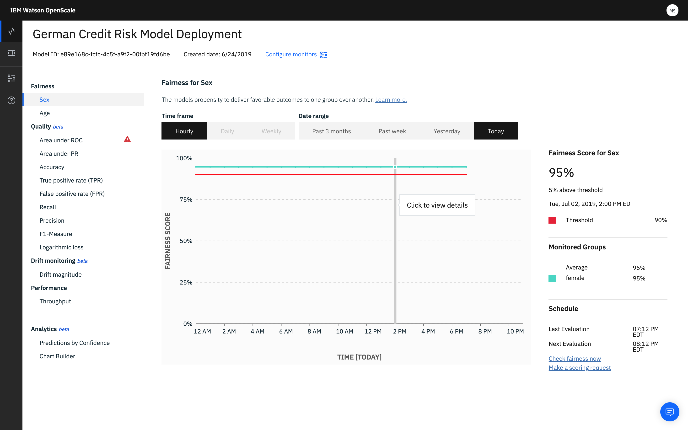

---

copyright:
  years: 2018, 2019
lastupdated: "2019-06-28"

keywords: fairness, monitoring, charts, de-biasing, bias, accuracy

subcollection: ai-openscale

---

{:shortdesc: .shortdesc}
{:external: target="_blank" .external}
{:tip: .tip}
{:important: .important}
{:note: .note}
{:pre: .pre}
{:codeblock: .codeblock}
{:download: .download}
{:screen: .screen}
{:javascript: .ph data-hd-programlang='javascript'}
{:java: .ph data-hd-programlang='java'}
{:python: .ph data-hd-programlang='python'}
{:swift: .ph data-hd-programlang='swift'}
{:faq: data-hd-content-type='faq'}

# Visualizzazione dei dati per una distribuzione
{: #it-vdep}

Selezionare una distribuzione dal dashboard per visualizzare i dati di monitoraggio per tale distribuzione. L'intestazione visualizza le informazioni sul modello distribuito, ad esempio i campi **ID modello** e **Data di creazione**.
{: shortdesc}

Poiché i controlli degli algoritmi vengono eseguiti solo ogni ora, sono presenti anche link per controllare correttezza e accuratezza su richiesta. Dal pannello **Pianifica**, è possibile fare clic sui seguenti link per fare un controllo immediato dei propri dati:

Successivamente, fare clic sul grafico e spostare il puntatore nel grafico per vedere le statistiche per una singola ora:

- ***Correttezza***: due funzioni di correttezza, Sex e Age, rispettano le soglie impostate per l'approvazione.
- ***Qualità***: la metrica **Area sotto la curva ROC** visualizza un avviso perché non è rimasto sotto la soglia configurata.
- ***Media richieste al minuto***: fare clic sulla metrica **Velocità di trasmissione** per vedere il numero di record elaborati al minuto. La velocità di trasmissione viene calcolata ogni minuto, e il suo valore medio durante il corso dell'ora è riportato nel grafico.

## Visualizza transazioni
{: #it-tra}

Questa opzione consente di visualizzare le singole transazioni che hanno contribuito alla distorsione quando si fa clic sul pulsante **Visualizza transazioni** .

Viene visualizzato un elenco delle transazioni in cui la distribuzione ha contribuito alla distorsione. Fare clic sul link **Spiega** per qualsiasi ID di transazione per ottenere i dettagli su quella transazione nella scheda Esplicabilità. Per ulteriori informazioni, consultare [Monitoraggio esplicabilità](/docs/services/ai-openscale?topic=ai-openscale-ie-ov).

Selezionare la vista **Tutte le transazioni** per visualizzare tutte le transazioni dalla funzione selezionata (in questo esempio "Età") e nel periodo selezionato (in questo esempio "15 settembre 2018 1:00 PM"):

Selezionare la vista **Transazioni con distorsione** per visualizzare solo il sottoinsieme di transazioni che hanno ricevuto risultati distorti. Ogni transazione distorta è confrontata con una transazione simile ma leggermente alterata (perturbata) che mostra come la modifica del valore della funzione monitorata (Età) provocherà un esito favorevole per la transazione distorta:

