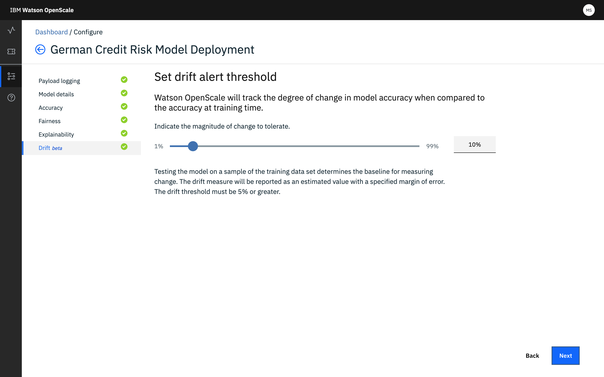

---

copyright:
  years: 2018, 2019
lastupdated: "2019-06-28"

keywords: accuracy, 

subcollection: ai-openscale

---

{:shortdesc: .shortdesc}
{:external: target="_blank" .external}
{:tip: .tip}
{:important: .important}
{:note: .note}
{:pre: .pre}
{:codeblock: .codeblock}
{:download: .download}
{:screen: .screen}
{:javascript: .ph data-hd-programlang='javascript'}
{:java: .ph data-hd-programlang='java'}
{:python: .ph data-hd-programlang='python'}
{:swift: .ph data-hd-programlang='swift'}
{:faq: data-hd-content-type='faq'}

# Configurazione del monitor di rilevamento deviazione
{: #behavior-drift-config}

È necessario configurare il monitor di deviazione {{site.data.keyword.aios_full}} prima che possa iniziare ad analizzare il modello. Ci sono due opzioni, addestrare il modello online o utilizzare un notebook.
{: shortdesc}

È possibile addestrare il modello online utilizzando {{site.data.keyword.aios_short}} se si utilizza {{site.data.keyword.pm_full}} e i dati non superano i 500 MB. Altrimenti, è necessario utilizzare un notebook per addestrare il modello.

## Passi per configurare la deviazione in {{site.data.keyword.aios_short}}
{: #behavior-drift-config-steps-wos}

Se si utilizza {{site.data.keyword.pm_full}}, è possibile utilizzare l'interfaccia utente di {{site.data.keyword.aios_short}} per configurare il rilevamento della deviazione.

1. Dalla scheda **Deviazione**, sulla pagina **Cos'è il monitor Deviazione?** fare clic su **Inizia** per avviare il processo di configurazione.

   

2. Fare clic sul riquadro **Training in Watson OpenScale**.

   

3. Impostare la soglia di avviso.

   

3. Impostare la dimensione del campione.

   
   
3. Fare clic su **Salva**.

## Passi per configurare la deviazione utilizzando un notebook
{: #behavior-drift-config-steps-ntbk}

Se si utilizza un provider di machine learning diverso da {{site.data.keyword.pm_full}}, come Microsoft Azure, Amazon SageMaker o un motore di machine learning personalizzato, è necessario utilizzare un notebook per configurare il rilevamento deviazione. È possibile configurare la deviazione anche per {{site.data.keyword.pm_full}} utilizzando questo metodo. 

Questa opzione è utile se i dati di training non sono memorizzati in Db2 o {{site.data.keyword.cos_full}}. Utilizzando un notebook, è necessario leggere i dati di training in un frame di dati. Il notebook specializzato che è possibile scaricare da {{site.data.keyword.aios_short}}, crea un output specializzato che è possibile caricare su {{site.data.keyword.aios_short}}.

1. Creare un notebook per generare il modello di rilevamento deviazione. Utilizzare [il notebook di esempio](https://github.com/IBM-Watson/aios-data-distribution/blob/master/training_statistics_notebook.ipynb) che è disponibile dall'interfaccia utente di {{site.data.keyword.aios_short}} .
2. Utilizzare il software di compressione per comprimere il modello di rilevamento deviazione in un file .tar.gz.

1. Dalla scheda **Deviazione**, sulla pagina **Cos'è il monitor Deviazione?** fare clic su **Inizia** per avviare il processo di configurazione.

   

2. Fare clic sul riquadro **Training in un notebook**.

   

3. Trascinare il file del modello compresso nella zona di destinazione oppure sfogliare per selezionarla e fare clic su **Avanti**.

   
   
3. Caricare il modello di rilevamento della deviazione e fare clic su **Avanti**.

   
   
3. Impostare la soglia di avviso.

   

3. Impostare la dimensione del campione.

   
   
3. Fare clic su **Salva**.

## Passi successivi
{: #behavior-drift-config-next-steps}

- Aumentare l'IQ di deviazione leggendo [Comprensione della deviazione modello con IBM Watson OpenScale](https://medium.com/@manish.bhide/4c5401aa8da4)
