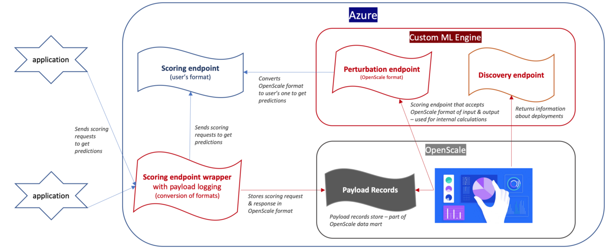

---

copyright:
  years: 2018, 2019
lastupdated: "2019-06-28"

keywords: machine learning engines, frameworks, Microsoft Azure, Amazone SageMaker, custom ML engine 

subcollection: ai-openscale

---

{:shortdesc: .shortdesc}
{:external: target="_blank" .external}
{:tip: .tip}
{:important: .important}
{:note: .note}
{:pre: .pre}
{:codeblock: .codeblock}
{:download: .download}
{:screen: .screen}
{:javascript: .ph data-hd-programlang='javascript'}
{:java: .ph data-hd-programlang='java'}
{:python: .ph data-hd-programlang='python'}
{:swift: .ph data-hd-programlang='swift'}
{:faq: data-hd-content-type='faq'}

# Automazione della registrazione del payload
{: #fmrk-workaround-pyld-lg}

La registrazione automatica del payload esiste tra {{site.data.keyword.aios_full}} e {{site.data.keyword.pm_full}} quando ne viene eseguito il provisioning nello stesso account {{site.data.keyword.Bluemix_notm}}. È possibile automatizzare la registrazione del payload anche per altri provider di machine learning o per un'istanza {{site.data.keyword.pm_full}} non presente nello stesso account, utilizzando uno dei seguenti casi e opzioni:
{: shortdesc}

### Caso 1: Mantenere il formato originale dell'input e dell'output di calcolo del punteggio (diverso da quello richiesto da {{site.data.keyword.aios_short}})
{: #fmrk-workaround-case1}

Se le applicazioni utilizzano un formato di payload originale che non può essere modificato, scegliere una delle seguenti opzioni:

- Opzione 1: L'endpoint di calcolo del punteggio del motore di machine learning personalizzato deve accettare entrambi i formati payload. 

   A seconda del formato payload: {{site.data.keyword.aios_short}} (come {{site.data.keyword.pm_full}}) o quello dell'utente restituiscono l'output in formato corrispondente. Se il formato è quello dell'utente, convertirlo in quello {{site.data.keyword.aios_short}} e memorizzarlo come record di payload nella tabella di registrazione payload. Se il formato di input di calcolo del punteggio è quello di {{site.data.keyword.aios_short}}, non memorizzare il payload (questo payload proviene da {{site.data.keyword.aios_short}} non dall'utente).

   Per ulteriori informazioni, consultare [Utilizzo di due formati di payload](#fmrk-workaround-notsuppt).

- Opzione 2: Se, per qualche motivo, incorporare tale logica in un unico endpoint API REST non è possibile, è possibile definire due endpoint. 

   Uno viene utilizzato dalla propria applicazione, tuttavia, è necessario aggiungere la registrazione del payload e convertirla nel formato previsto. Il secondo endpoint è utilizzato da {{site.data.keyword.aios_short}} per effettuare i calcoli richiesti, come la distorsione e l'esplicabilità. Non è richiesta alcuna registrazione payload per questo enpoint. Durante la configurazione di {{site.data.keyword.aios_short}}, il secondo endpoint deve essere indirizzato a quello con formati compatibili.

   Per ulteriori informazioni, consultare [Utilizzo di due endpoint](#fmrk-workaround-opt2-cs1).

- Opzione 3: Spostare il modulo di registrazione del payload nell'endpoint originale o nell'applicazione di downstream. 

   Se l'applicazione supporta questa opzione, è necessario sviluppare un solo endpoint sul motore di machine learning personalizzato: quello per {{site.data.keyword.aios_short}}.

### Caso 2: Gestire il formato di payload richiesto da {{site.data.keyword.aios_short}}
{: #fmrk-workaround-case2}

In questo caso non è necessario effettuare alcuna conversione dal formato dell'utente (calcolo del punteggio input/output) a quello richiesto da {{site.data.keyword.aios_short}}.

Poiché non vogliamo avere le richieste di calcolo del punteggio interne registrate come payload utente (calcoli effettuati da {{site.data.keyword.aios_short}}), è necessario sviluppare due endpoint o si deve codificare una logica supplementare per un singolo endpoint.

- Opzione 1: Due endpoint. È quasi equivalente all'opzione 2 nel caso 1. L'unica differenza è che non c'è bisogno di convertire formati, dato che sono già allineati.

- Opzione 2: Endpoint singolo. È necessario rilevare se la richiesta di calcolo del punteggio proviene dall'applicazione dell'utente. È possibile effettuare ciò inviando alcune informazioni extra nel payload di calcolo del punteggio (alias metadati). Se tali metadati vengono rilevati, il payload è registrato.

## Utilizzo di due formati payload
{: #fmrk-workaround-notsuppt}

Si utilizza, ad esempio, l'offerta XYZ per servire i modelli. XYZ non è supportato da {{site.data.keyword.aios_short}} al momento.

Si dispone di molte applicazioni di downstream che consumano le distribuzioni su XYZ e non è possibile cambiare il formato del payload di calcolo del punteggio. Tuttavia, è possibile modificare la logica dell'endpoint di calcolo del punteggio.

### Passi

1. Sviluppare un motore di machine learning personalizzato che elabori la distribuzione XYZ.
2. Implementare l'endpoint di calcolo del punteggio sul motore di machine learning personalizzato per supportare i formati di payload sia per XYZ che per {{site.data.keyword.aios_short}}.
3. Aggiungere la logica nell'endpoint di calcolo del punteggio sul proprio motore di machine learning personalizzato per rilevare il formato del payload.
4. Se il payload proviene da app di downstream, convertirlo nel formato {{site.data.keyword.aios_short}} e registrarlo come record payload in {{site.data.keyword.aios_short}}.
5. Scambiare gli endpoint di calcolo del punteggio delle app di downstream con quello appena creato.

Se l'URL dell'endpoint di calcolo del punteggio deve rimanere lo stesso, utilizzare il reindirizzamento URL, anche noto come proxy.

## Utilizzo di due endpoint
{: #fmrk-workaround-opt2-cs1}

Se il formato del payload non può essere modificato, ad esempio perché influirebbe sulle applicazioni di downstream, è necessario utilizzare endpoint separati. Questo approccio implica i seguenti componenti:

- endpoint di calcolo del punteggio (nel formato dell'utente) con l'endpoint di calcolo del punteggio originale utilizzando il formato definito dall'utente per l'input e l'output
- motore ml personalizzato con endpoint di perturbazione (formato {{site.data.keyword.aios_short}}) e endpoint di rilevamento. L'endpoint di perturbazione elabora l'endpoint di calcolo del punteggio originale ed effettua le conversioni dal f ormato {{site.data.keyword.aios_short}} a quello dell'utente e dall'output dell'utente a quello {{site.data.keyword.aios_short}}. Questo è necessario affinché {{site.data.keyword.aios_short}} effettui la richiesta di calcolo del punteggio corretta e comprenda l'output.
- wrapper dell'endpoint di calcolo del punteggio con la funzione di registrazione payload. Questo wrapper viene utilizzato dall'applicazione di downstream invece che dell'endpoint di calcolo del punteggio originale. La sua logica è stata estesa con la funzione di registrazione del payload. Ogni volta che la richiesta di calcolo del punteggio viene eseguita, l'input e l'output vengono convertiti in formato {{site.data.keyword.aios_short}} e registrati.

Il seguente diagramma di flusso mostra la soluzione motore di machine learning personalizzato in cui il motore di machine learning personalizzato gestisce gli endpoint di perturbazione e rilevamento e li converte nel proprio formato:

### Passi
{: #fmrk-workaround-smple-cd}

1. Utilizzare un notebook per creare un endpoint di calcolo del punteggio per la distribuzione del modello di rischio di credito (scikit-learn) su Microsoft Azure Machine Learning Service. Per ulteriori informazioni, consultare [questo notebook di esempio](https://github.com/pmservice/ai-openscale-tutorials/blob/master/notebooks/azure/Credit%20model%20with%20Azure%20ML%20Service%20and%20scikit-learn.ipynb).
2. Creare un motore di machine learning personalizzato e distribuirlo su Cloud Microsoft Azure Cloud come applicazione Flask. Creare gli endpoint di perturbazione e rilevamento. Per ulteriori informazioni, consultare [queste istruzioni di distribuzione](https://github.com/pmservice/ai-openscale-tutorials/tree/master/applications/custom-ml-engine-azure).
3. Configurare {{site.data.keyword.aios_short}} per lavorare con il motore di machine learning personalizzato. Per ulteriori informazioni, consultare [questo notebook di esempio](https://github.com/pmservice/ai-openscale-tutorials/blob/master/notebooks/azure/OpenScale%20and%20Custom%20ML%20Engine%20configuration.ipynb).
4. Creare un wrapper endpoint di calcolo del punteggio che automatizzi la registrazione del payload su Microsoft Azure Machine Learning Service. Per ulteriori informazioni, consultare [questo notebook di esempio](https://github.com/pmservice/ai-openscale-tutorials/blob/master/notebooks/azure/Credit%20scoring%20endpoint%20wrapper%20with%20payload%20logging.ipynb).

Prestare particolare attenzione ai seguenti elementi:

- Credenziali: per facilitare il supporto didattico, le credenziali {{site.data.keyword.aios_short}} sono codificate all'interno del codice (wrapper endpoint di calcolo del punteggio). È necessario aggiornare questi valori con le credenziali effettive.
- SDK Python rispetto a API REST: il supporto didattico utilizza l'SDK Python per registrare il payload. È anche possibile utilizzare l'API REST per effettuare questa operazione, tuttavia è necessario generare o aggiornare il token personalmente. 
- {{site.data.keyword.cloud_notm}} rispetto a Cloud Pak for Data: se si utilizza {{site.data.keyword.wos4d_notm}}, le credenziali sono in un formato diverso, [ecco il notebook di esempio](https://github.com/pmservice/ai-openscale-tutorials/blob/master/notebooks/Watson%20OpenScale%20and%20Watson%20ML%20Engine%20-%20ICP.ipynb). Anche la classe client {{site.data.keyword.aios_short}} è diversa. Utilizza la classe client `APIClient4ICP`.
- Registrazione payload come endpoint/pacchetto separato - estrazione della registrazione payload  & metodi di conversione per separare il pacchetto o l'endpoint. In tal modo può essere riutilizzato se si desidera inserire batch di payload all'esterno del wrapper endpoint di calcolo del punteggio.

