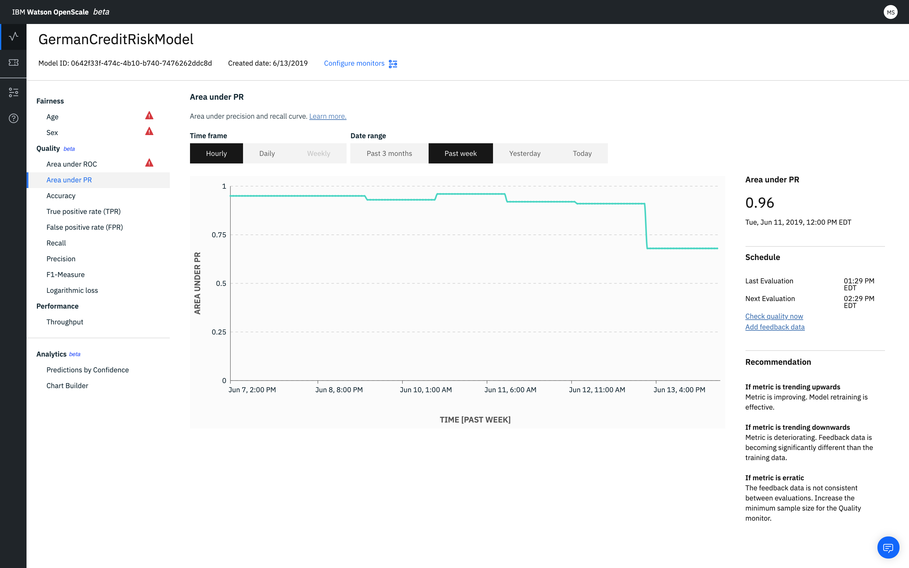
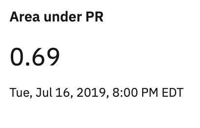
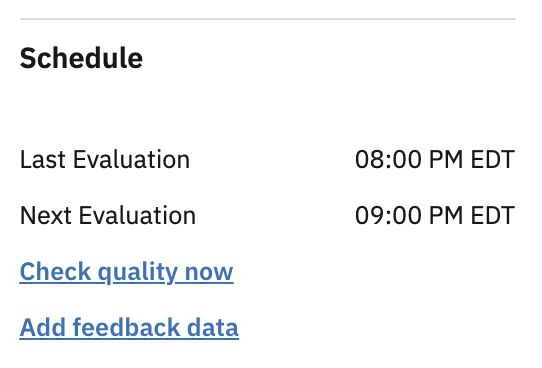

---

copyright:
  years: 2018, 2019
lastupdated: "2019-06-28"

keywords: metrics, monitoring, custom metrics, thresholds, Area under PR

subcollection: ai-openscale

---

{:shortdesc: .shortdesc}
{:external: target="_blank" .external}
{:tip: .tip}
{:important: .important}
{:note: .note}
{:pre: .pre}
{:codeblock: .codeblock}
{:download: .download}
{:screen: .screen}
{:javascript: .ph data-hd-programlang='javascript'}
{:java: .ph data-hd-programlang='java'}
{:python: .ph data-hd-programlang='python'}
{:swift: .ph data-hd-programlang='swift'}
{:faq: data-hd-content-type='faq'}

# Area sotto la curva PR
{: #quality-area-pr}

L'area sotto la curva PR (Precision Recall) dà l'area sotto la curva di precisione e richiamo, che può essere utile quando le classi sono particolarmente sbilanciate.
{: shortdesc}

## Area sotto la curva PR a colpo d'occhio
{: #quality-area-pr-glance}

- **Descrizione**: l'area sotto la curva di precisione e richiamo
- **Soglie predefinite**: limite inferiore = 80%
- **Raccomandazione predefinita**:
   - **Andamento crescente**: un andamento crescente indica che la metrica sta migliorando. Ciò significa che il nuovo training del modello è efficace.
   - **Andamento decrescente**: un andamento decrescente indica che la metrica sta peggiorando. I dati di feedback stanno riportando differenze significative rispetto ai dati di training.
   - **Variazione anomala o irregolare**: una variazione anomala o irregolare indica che i dati di feedback non sono congruenti tra le valutazioni. Incrementare la dimensione minima del campione per il monitor Qualità.
- **Tipo di problema**: classificazione binaria
- **Valori del grafico**: ultimo valore nel periodo di tempo
- **Dettagli di metriche disponibili**: matrice di confusione

## Interpretazione del pannello
{: #quality-area-pr-display}



### Punteggio di correttezza
{: #quality-area-pr-display-fairness-score}

Per la metrica Area sotto la curva PR, viene visualizzato il seguente punteggio di correttezza. 



### Pianifica
{: #quality-area-pr-display-schedule}

Il riquadro **Pianifica** mostra i tempi per **Ultima valutazione** e **Valutazione successiva**. Le metriche di qualità vengono valutate ogni ora. È possibile forzare la valutazione facendo clic su **Controlla qualità ora**. È anche possibile aggiungere il feedback facendo clic su **Aggiungi dati di feedback**.




### Suggerimento
{: #quality-area-pr-display-recommendations}

Per facilitare l'interpretazione del grafico, viene visualizzato il riquadro **Suggerimento**, le cui tendenze indicano il miglioramento o il peggioramento dell'efficacia del modello.


## Calcolo matematico
{: #quality-area-pr-math}

L'area sotto la curva PR dà il totale per entrambi gli elementi `Precisione + Richiamo`.

La precisione (P) è definita come il numero di veri positivi (Tp) sul numero di veri positivi più il numero di falsi positivi (Fp).

```
               numero di veri positivi
Precisione =  ______________________________________________________

              (numero di veri positivi + numero di falsi positivi)
```

Il richiamo (R) è definito come il numero di veri positivi (Tp) sul numero di veri positivi più il numero di falsi negativi (Fn).

```
            numero di veri positivi
Richiamo =   ______________________________________________________

           (numero di veri positivi + numero di falsi negativi)
```
