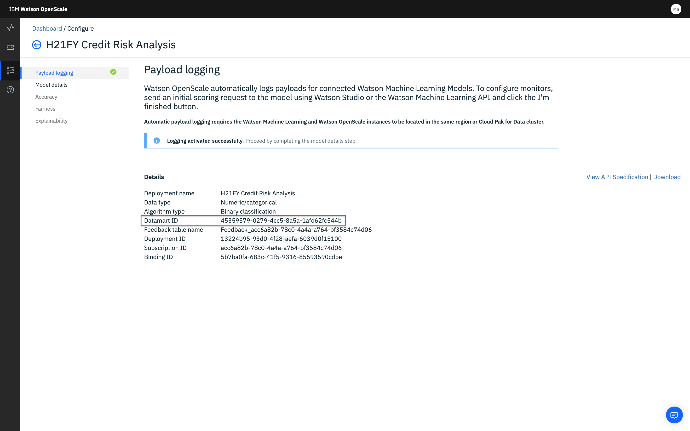

---

copyright:
  years: 2018, 2019
lastupdated: "2019-06-11"

keywords: credentials, REST API

subcollection: ai-openscale

---

{:shortdesc: .shortdesc}
{:new_window: target="_blank"}
{:tip: .tip}
{:pre: .pre}
{:codeblock: .codeblock}
{:screen: .screen}
{:javascript: .ph data-hd-programlang='javascript'}
{:java: .ph data-hd-programlang='java'}
{:python: .ph data-hd-programlang='python'}
{:swift: .ph data-hd-programlang='swift'}

# 資格情報の作成
{: #cred-create}

{{site.data.keyword.aios_short}} REST API にアクセスするには、プラットフォーム API キーとデータマート (サービス・インスタンス) ID が必要です。 プラットフォーム API キーによって、各ユーザーは {{site.data.keyword.cloud_notm}} 内のリソースにアクセスできるようになります。

エンタープライズ・アカウントの場合、管理者がデータマートを作成し、他のユーザーをそのアカウントに招待し、それらのユーザーに特定の {{site.data.keyword.aios_short}} データマートへのアクセス権を付与できます。 その後、ユーザーは自身のプラットフォーム API キーを作成し、同じ {{site.data.keyword.aios_short}} データマートにアクセスできます。そのため、競合やセキュリティー・リスクは生じません。

プラットフォーム API キーを作成するには、以下の手順を実行します。

- [{{site.data.keyword.cloud_notm}} ](https://{DomainName}){: new_window} にログインします。

- **「管理」**-->**「セキュリティー」**-->**「プラットフォーム API キー」**の順に選択します

    

- プラットフォーム API キーを作成して保存します。

データマート (またはサービス・インスタンス) ID を検出するには、次のようにします。

- {{site.data.keyword.aios_short}} の**「構成」-->「サマリー」**ページの最初の項目がデータマート (サービス・インスタンス) ID です。

    
