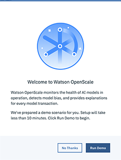
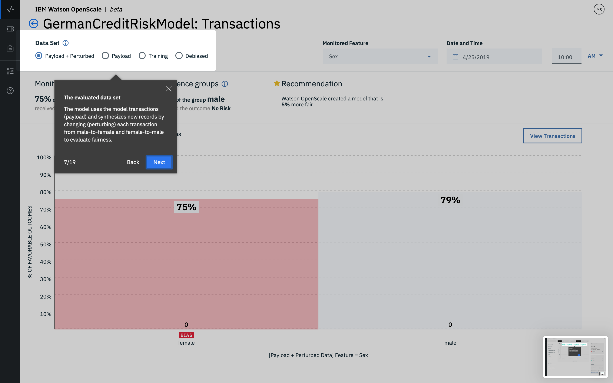

---

copyright:
  years: 2018, 2019
lastupdated: "2019-05-29"

keywords: ai, getting started, tutorial, understanding, fast start

subcollection: ai-openscale

---

{:shortdesc: .shortdesc}
{:new_window: target="_blank"}
{:hide-dashboard: .hide-dashboard}
{:tip: .tip}
{:important: .important}
{:note: .note}
{:pre: .pre}
{:codeblock: .codeblock}
{:screen: .screen}
{:javascript: .ph data-hd-programlang='javascript'}
{:java: .ph data-hd-programlang='java'}
{:python: .ph data-hd-programlang='python'}
{:swift: .ph data-hd-programlang='swift'}

# 自動セットアップ
{: #wos-fast-start}

{{site.data.keyword.aios_short}} でモデルがどのようにモニターされるかを簡単に確認するには、最初に {{site.data.keyword.aios_short}} UI にログインした際に提供されたデモ・シナリオ・オプションを実行します。  [UI デモの利用](#wos-work-demo)を参照してください。
{: shortdesc}

## 始めに
{: #wos-prereqs}

ツアーを始める前に、以下のリソースが既にセットアップされている必要があります。

- {{site.data.keyword.ibmid}}
- {{site.data.keyword.aios_full}}

## UI デモの利用
{: #wos-work-demo}

1.  {{site.data.keyword.bluemix_full}} 上の {{site.data.keyword.aios_short}} インスタンスにサインインします。
1.  デモ・シナリオを処理するには、**「デモを実行」**をクリックします。

   

   {{site.data.keyword.aios_short}} サービスがプロビジョンされる過程で、以下のように、デモ・シナリオを確認できます。

   

プロビジョニングが完了したら、**「始めましょう」**ボタンをクリックして、{{site.data.keyword.aios_short}} ダッシュボードのツアーを実行し、[{{site.data.keyword.aios_short}} における結果の表示](#wos-open)に進みます。

   

## {{site.data.keyword.aios_short}} における結果の表示
{: #wos-open}

モデルの公平性と正解率、モニター対象データの詳細、個々のトランザクションの説明可能性に対するインサイトを表示するには、{{site.data.keyword.aios_short}} ダッシュボードを開きます。 各デプロイメントはタイルとして表示されます。 以下の画面キャプチャーに示すように、このツアーでは `GermanCreditRiskModel` というデプロイメントが構成されました。

   

### インサイトの表示
{: #wos-insights}

「インサイト」ページには、公平性と正解率に関する問題が一目で分かるように表示されます。問題の判定には、構成されたしきい値が使用されます。

   

### モニタリング・データの表示
{: #wos-monitoring}

1.  「インサイト」ページで、`GermanCreditRiskModelICP` タイルをクリックして、モニター対象データに関する詳細を表示します。
1.  グラフでマーカーをクリックしてドラッグし、データが表示される日時の期間を表示して、**「詳細の表示」**リンクをクリックします。 あるいは、グラフで別の期間をクリックして、表示するデータを変更することもできます。

     - 例えば、以下の画面には、特定の日時のデータが表示されています。 モジュールの実行タイミングによって日時は異なります。

     - 時系列グラフの解釈について詳しくは、[公平性、毎分平均リクエスト数、正解率のモニター](/docs/services/ai-openscale-icp?topic=ai-openscale-icp-itc-timechart)を参照してください。

   

1.  `SEX` データのモニタリングに関する詳細を確認するには、ドロップダウン・メニューで `SEX` が選択されていることを確認します。

    - 以下の画面キャプチャーでは、バイアスが存在することに注目してください。
    
   

    - 特定時間のデータ・ポイントのグラフの解釈については、[データの視覚化](/docs/services/ai-openscale-icp?topic=ai-openscale-icp-itc-timechart#itc-data-visual)を参照してください。

### 説明性の表示
{: #wos-explain}

特定の期間にバイアスが存在する要因について理解するには、前のセクションの可視化画面から、**「バイアスのあるトランザクション」**ラジオ・ボタンをクリックします。

   

過去の時刻においてバイアスが存在するトランザクションのトランザクション ID がリストされます。 このモジュールで使用されるモデルの場合、選択可能なリクエストにおいてはバイアスが存在します。

   

トランザクションの検索と説明については、[説明性のモニター](/docs/services/ai-openscale-icp?topic=ai-openscale-icp-ie-ov)を参照してください。

   

## ツアーの終了
{: #wos-done-demo}

1. **「終了」**ボタンをクリックします。

   

2. **「始めましょう」**ボタンをクリックして、{{site.data.keyword.aios_short}} の処理を開始します。

   

## 関連情報
{: #wos-info}

- バイアスについては、[公平性](/docs/services/ai-openscale-icp?topic=ai-openscale-icp-mf-monitor)を参照してください。
- モデルの予測結果の精度については、[正解率](/docs/services/ai-openscale-icp?topic=ai-openscale-icp-acc-monitor)を参照してください。
- グラフ、データ、およびトランザクションの解釈については、[公平性、分当たりの平均リクエスト数、および正解率のモニター](/docs/services/ai-openscale-icp?topic=ai-openscale-icp-itc-timechart)を参照してください。
