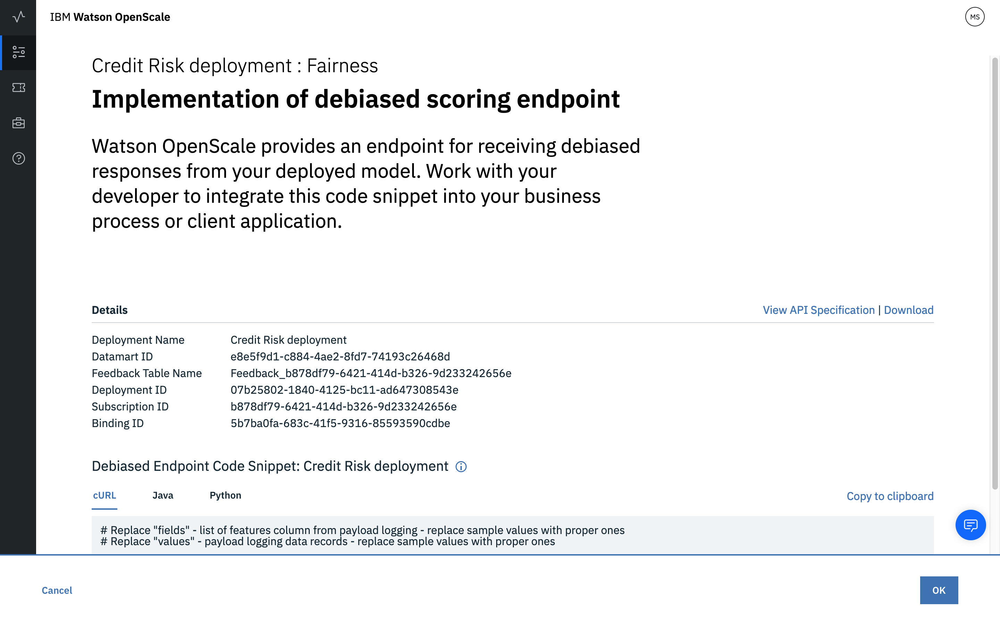

---

title: Trust and transparency for your machine learning models with {{site.data.keyword.aios_short}}
description: Monitor your machine learning deployments for bias, accuracy, and explainability
duration: 120
intro: In this tutorial, you will provision IBM Cloud machine learning and data services, create and deploy machine learning models in Watson studio, and configure the new IBM {{site.data.keyword.aios_full}} product to monitor your models for trust and transparency.
takeaways:
- See how {{site.data.keyword.aios_short}} provides trust and transparency for AI models
- Understand how IBM Cloud services and Watson Studio technologies can provide a seamless, AI-driven customer experience

copyright:
  years: 2018, 2019
lastupdated: "2019-06-11"

keywords: ai, getting started, tutorial, understanding, video

subcollection: ai-openscale

---

{:shortdesc: .shortdesc}
{:new_window: target="_blank"}
{:hide-dashboard: .hide-dashboard}
{:tip: .tip}
{:important: .important}
{:note: .note}
{:pre: .pre}
{:codeblock: .codeblock}
{:screen: .screen}
{:javascript: .ph data-hd-programlang='javascript'}
{:java: .ph data-hd-programlang='java'}
{:python: .ph data-hd-programlang='python'}
{:swift: .ph data-hd-programlang='swift'}

# 入門チュートリアル (基礎編)
{: #gettingstarted}

{{site.data.keyword.aios_full}} を使用すると、企業はビジネス・アプリケーションの AI ライフサイクルを自動化して実際の運用に適したものにすることができます。そのため、AI モデルのバイアスがなくなり、ビジネス・ユーザーにわかりやすく説明して理解してもらうことが可能になり、商取引の監査にも対応できるようになります。 {{site.data.keyword.aios_short}} は、AI モデルを任意のツールやモデル処理フレームワークに組み込んで実行する機能をサポートします。
{: shortdesc}

## 概要
{: #gs-view-demo}

{{site.data.keyword.aios_short}} の概要は、以下の動画を見て確認してください。

  

    <iframe class="embed-responsive-item" id="youtubeplayer" title="Trust and Transparency in AI" type="text/html" width="640" height="390" src="https://www.youtube.com/embed/6Ei8rPVtCf8" frameborder="0" webkitallowfullscreen mozallowfullscreen allowfullscreen> </iframe>
  

## {{site.data.keyword.aios_short}} のユースケース
{: #gs-use}

従来型の融資機関は、さらに多くの多様な顧客に金融サービスのデジタル・ポートフォリオを展開する必要に迫られています。これには、信用リスク・モデリングに対する新たな取り組みが必要です。 そうした企業のデータ・サイエンス・チームが現在利用している標準的なモデリング手法 (決定木やロジスティック回帰など) は、標準的なデータ・セットでは適切に機能し、容易に説明可能な推奨事項を提案します。 これは、信用融資に関する決定は透明かつ説明可能でなければならないという規制要件を満たしています。

対象範囲を広げてリスクの高い申請者が貸付を利用できるようにするため、申請者の信用履歴の確認範囲を、従来の貸付で利用していた情報 (住宅ローンや自動車ローンなど) から広げて、光熱費や携帯電話料金プランの支払い履歴、さらには学歴や職責などの代替信用情報も確認する必要があります。 このような新しいデータ・ソースは融資の裏付けとして役立ちますが、申請者の年齢、性別、その他の個人の特徴に基づく予期しない相関関係が設定されてバイアスが発生する可能性が高くなる、というリスクも生まれます。

このような多様なデータ・セットに最も適したデータ・サイエンス手法 (こう配ブースティング木、ニューラル・ネットワークなど) では、精度の高いリスク・モデルを生成できますが、コストがかかります。 このような「ブラック・ボックス」モデルで生成される予測は決定過程が不透明であるため、一般データ保護規則 (GDPR) の第 22 項や、アメリカ合衆国消費者金融保護局が管理する連邦公正信用報告法 (FCRA) などの規制に基づく承認を受けるためには、なんらかの方法で透明性を確保する必要があります。

このチュートリアルで使用する信用リスク・モデルでは、それぞれの融資申請者に関する 20 個の属性を設定した訓練データ・セットが使用されます。 これらの属性のうち、年齢と性別という 2 つの属性がバイアス検証に使用されます。 このチュートリアルでは、性別と年齢に対するバイアスに重点を置いています。 訓練データの詳細については、[{{site.data.keyword.aios_short}} が訓練データにアクセスする必要があるのはなぜですか?](/docs/services/ai-openscale?topic=ai-openscale-trainingdata#trainingdata) を参照してください。

{{site.data.keyword.aios_short}} は、デプロイ済みモデルが一方のグループ (参照グループ) に対して他方のグループ (モニター対象グループ) より好ましい結果 (「No Risk」) を出す傾向をモニターします。 このチュートリアルでは、性別のモニター対象グループは `female` であり、年齢のモニター対象グループは `19 to 25` です。

<!---
### How {{site.data.keyword.aios_short}} can help
{: #gs-how}

- *Identify run-time bias in the model*: The company has established evidence that shows the key factors that should influence which drug is predicted are BP, CHOLESTEROL, K and NA. AGE and SEX do play a role, but they're not as significant when compared to the other indicators. The company suspects that the data coming from patient trials might have suffered from biases of the practitioners for prescribing medications based on SEX and BP. The company wants to constantly monitor for such biases being learned from the data, and flag a suspected bias.

- *Constantly validate the accuracy of the model*: The company routinely evaluates the model prediction by having experts provide their own drug recommendations based on the patient data. The goal is to integrate these manual evaluations as feedback, to tell the model in real time where it might be wrong, and improve it over time.

- *Make the model more trustworthy*: To achieve a successful adoption of its AI assistant, the company received feedback from its customer base of medical practitioners and doctors who said they would not trust the AI model recommendations without understanding the logic behind them.

Each of these issues will be addressed in this tutorial, through the use of {{site.data.keyword.aios_short}}:

- The Fairness monitor will flag SEX and BP biases the model may have
- The Accuracy monitor uses feedback generated by your experts to test the performance of the deployed model, to detect model drift
--->

## Setup options
{: #gs-module}

There are several setup options, depending on your preference and level of expertise.

- [The automated setup](/docs/services/ai-openscale?topic=ai-openscale-wos-fast-start) guides you through the process by performing tasks for you in the background.

   Use of a tour means that you can watch and click through to the next part of the tour.
   
- [The following getting started tutorial](/docs/services/ai-openscale?topic=ai-openscale-gs-obj#gs-obj) lets you take control with an easy-to-follow script.

   Use the interface to perform common tasks with a sample model and injected data.
   
- [The advanced tutorial](/docs/services/ai-openscale?topic=ai-openscale-crt-ov) enables more technical users to install a Python module that automates the provisioning and configuration of prerequisite services. This advanced tutorial is for data scientists or users who are comfortable with coding, Python and Notebooks. It's an example of how the {{site.data.keyword.aios_short}} client can be used to perform functionality programatically. The notebook that is used in this tutorial results in the same place as following the [automated setup](/docs/services/ai-openscale?topic=ai-openscale-wos-fast-start).

   This module requires that Python 3 is installed, which includes the pip package management system. For instructions, see, [Installing a Python module to set up {{site.data.keyword.aios_short}}](/docs/services/ai-openscale?topic=ai-openscale-as-module).

追加のチュートリアルのリンクについては、[追加リソース](/docs/services/ai-openscale?topic=ai-openscale-arsc-ov)のトピックを参照してください。

## チュートリアルの達成目標
{: #gs-obj}

このチュートリアルでは以下の作業を行います。

- {{site.data.keyword.Bluemix_notm}} の機械学習サービスとストレージ・サービスをプロビジョンします
- Watson Studio プロジェクトをセットアップし、機械学習モデルの作成、トレーニング、およびデプロイを行います
- モデルの信頼性、透明性、および説明性を構成して検討します

## 前提条件 {{site.data.keyword.Bluemix_notm}} サービスのプロビジョン
{: #gs-prps}

このチュートリアルを完了するには、{{site.data.keyword.aios_short}} に加えて、以下のアカウントとサービスが必要です。

<!---

For the {{site.data.keyword.composeForPostgreSQL}} service, a **paid** Standard plan is needed. A $200 {{site.data.keyword.Bluemix_notm}} credit can be obtained by converting to a paid account with a credit card. If you already have a paid account, you will receive a one-time $16 refund of the cost for your first GB of storage, for one month.
{: tip}

--->

**重要**: 最高のパフォーマンスを得るためには、前提条件の各サービスを {{site.data.keyword.aios_short}} と同じリージョンに作成することをお勧めします。{{site.data.keyword.aios_short}} で使用可能なロケーションを表示するには、[サービス可用性](/docs/resources?topic=resources-services_region)を参照してください。

1.  {{site.data.keyword.ibmid}} を使用して [{{site.data.keyword.Bluemix_notm}} アカウント ](https://{DomainName}){: new_window} にログインします。
1.  以下のサービスでまだご使用のアカウントと関連付けられていない各サービスについては、そのリンクをクリックし、サービスに名前を付け、**「Lite」**(無料) プランを選択し、**「作成」**ボタンをクリックしてインスタンスを作成します。

    - [Watson Studio ](https://{DomainName}/catalog/services/watson-studio){: new_window}

      

    - [Watson Machine Learning ](https://{DomainName}/catalog/services/machine-learning){: new_window}

      

    - [Object Storage ](https://{DomainName}/catalog/services/cloud-object-storage){: new_window}

      

<!---

### Db2 Warehouse サービスのプロビジョン
{: #gs-provdb2}

- [Db2 Warehouse サービスをプロビジョンします ](https://{DomainName}/catalog/services/db2-warehouse){: new_window} (アカウントに関連付けられているものがまだない場合)。

  

- サービスに名前を付け、Entry プランを選択し、「作成」ボタンをクリックします。

### 訓練データを Db2 Warehouse にアップロードする
{: #gs-traindb2}

- Download the [drug_train_data_updated.csv ](https://raw.githubusercontent.com/watson-developer-cloud/doc-tutorial-downloads/master/ai-openscale/drug_train_data_updated.csv) file. Be sure to save the file download as a .CSV file.

- Open your existing (or newly-created) Db2 Warehouse from the [IBM Cloud console ](https://{DomainName}){: new_window}, click **Manage** from the left side panel, and then click the **Open** button.

- If necessary, use your Db2 credentials `username` and `password` to log in to Db2 Warehouse.

- Once Db2 Warehouse has opened, click the **Menu** button and select **Load** from the menu:

  

- 訓練データ・ファイルを参照するか、そのファイルをフォームの適切な領域にドラッグ・アンド・ドロップします。 「次へ」をクリックします。 ロード・ターゲットのリストから「スキーマ」を選択します。これは通常、`DASH12345` のような形式になります。 次に右側の「New Table」をクリックします。

  

- 表に HEART\_DRUG\_TRAINING という名前を付けてから「Create」ボタンをクリックします。

  

-「Next」をクリックしてデータをプレビューします。 プレビュー画面で「Separator」フィールドをセミコロン (;) に設定し、「Header in first row」オプションにチェック・マークが付いていることを確認します。

  

- これで、訓練データが各列に正しく表示されるようになったはずです。 「Next」をクリックして先に進み、「Begin Load」をクリックしてデータをロードします。

--->

## Watson Studio プロジェクトのセットアップ
{: #gs-setup}

1.  [Watson Studio アカウント ](https://dataplatform.ibm.com/){: new_window} にログインし、新しいプロジェクトの作成を開始します。 **「Create a project」**を選択します。

    

1.  **「Standard」**タイルを選択します。

    

1.  プロジェクトに名前と説明を入力します。**「Storage」**メニューで、前のステップで作成した Object Storage サービスが選択されていることを確認し、**「Create」**をクリックします。

### {{site.data.keyword.Bluemix_notm}} サービスを Watson プロジェクトに関連付ける
{: #gs-assoc}

1.  Watson Studio プロジェクトを開き、**「Settings」**タブを選択します。 **「Associated Services」**セクションまでスクロールダウンし、**「Add service」**メニューをクリックして**「Watson」**を選択します。

    

1.  **「Machine Learning」**タイルの**「Add」**リンクをクリックし、**「Existing」**タブを選択します。 前のセクションで作成したサービスを**「Existing Service Instance」**メニューから選択し、**「Select」**をクリックします。

<!---

- プロジェクト設定タブから再度「Add service」を選択し、メニューから「Spark」を選択します。 「Existing」タブから、作成した Spark サービスを選択し、「Select」をクリックします。

--->

### `Credit Risk` モデルの追加
{: #gs-addmod}

1.  Watson Studio で、プロジェクトの**「Assets」**タブを選択し、**「Watson Machine Learning Models」**セクションまでスクロールダウンして、**「New Watson Machine Learning model」**ボタンをクリックします。

1.  **「Select model type」**セクションで**「From sample」**と `Credit Risk` モデルを選択し、**「Create」**をクリックします。

    

### `Credit Risk` モデルのデプロイ
{: #gs-depmod}

1.  Watson Studio プロジェクトで**「Assets」**タブをクリックし、**「Watson Machine Learning models」**セクションまでスクロールして、先ほど作成した信用リスク・モデルをクリックします。
2.  **「ACTIONS」**列で**「Actions」** メニューをクリックしてから**「Deploy」**をクリックします。
3. Watson Studio プロジェクトの**「Assets」**タブから、**「Watson Machine Learning models」**セクションまでスクロールして、先ほど作成した `Credit Risk` モデルをクリックします。
1.  **「Deployments」**タブをクリックしてから、**「Add Deployment」**をクリックします。
1.  デプロイメントの名前として `credit-risk-deploy` と入力し、**「Web service」**デプロイメント・タイプを選択します。
1.  **「Save」**をクリックします。

## {{site.data.keyword.aios_short}} の構成
{: #gs-confaios}

### {{site.data.keyword.aios_short}} のプロビジョン
{: hide-dashboard}
{: #gs-provaios}

1.  [新規の {{site.data.keyword.aios_short}} サービス・インスタンスをプロビジョンします ](https://{DomainName}/catalog/services/watson-openscale){: new_window}

<!---
    
--->

2.  サービスに名前を付け、「Lite」プランを選択し、**「作成」**をクリックします。

### {{site.data.keyword.aios_short}} を機械学習モデルに接続する
{: #gs-ctmod}

機械学習モデルがデプロイされたので、モデルの信頼性と透過性を確保するために {{site.data.keyword.aios_short}} を構成できます。

1.  {{site.data.keyword.aios_short}} インスタンスの**「管理」**タブを選択し、**「アプリケーションの起動 (Launch application)」**ボタンをクリックします。 「{{site.data.keyword.aios_full}} 入門」ページが開きます。 **「開始」**をクリックします。

1.  **「Watson Machine Learning」**タイルをクリックします。

1.  このチュートリアルでは、メニューから Watson Machine Learning インスタンスを選択し、**「次へ」**をクリックします。

    別の機械学習のロケーションを選択することもできます。 追加情報については、[Watson Machine Learning サービス・インスタンスの指定](/docs/services/ai-openscale?topic=ai-openscale-wml-connect)を参照してください。
    {: note}

    

1.  これで、{{site.data.keyword.aios_short}} によってモニターされるデプロイ済みモデルを選択できるようになりました。 作成したデプロイ済みモデルを選択し、**「次へ」**をクリックします。

    

1.  次に、データベースを選択する必要があります。 無料のデータベースと、既存または新規のデータベースという 2 つのオプションがあります。 このチュートリアルでは、**「{{site.data.keyword.aios_short}} によってホストされている無料のデータベースを使用する (Use the free database hosted by Watson OpenScale)」**タイルを選択します。

    無料のデータベースには、いくつかの重要な制限事項があります。 これはホストされたデータベースであり、ユーザーにこのデータベースへ別途直接アクセスする権限は与えられていません。 データベースとデータへのアクセス権は、{{site.data.keyword.aios_short}} に対して付与されます。 このデータベースは GDPR に準拠していません。 これらの各オプションについて詳しくは、[データベースの指定](/docs/services/ai-openscale?topic=ai-openscale-connect-db)のトピックを参照してください。 既存のデータベースとしては、PostgreSQL データベースや Db2 データベースを選択できます。 
    {: tip}

    

1.  要約データを確認し、**「保存」**をクリックします。 それを確定し、プロンプトが表示されたら**「構成を続行する (Continue with Configuration)」**ボタンをクリックします。

    データマート ID もリストされていますが、これは {{site.data.keyword.aios_short}} インスタンス ID と同じです。
    {: tip}

    

1.  以下の画面キャプチャーに似た画面が表示されるはずです。 データの評価に GUI 方式を使用するため、**「モニターの構成」**ボタンを選択するだけでこのセットアップは完了します。

    

### モデルに一連のサンプル・データを入力する
{: #gs-samp}

モニターを構成するには、その前にモデルに対する予測リクエストを少なくとも 1 つ生成して、モニターで取り込むことができるペイロード・ロギングを生成する必要があります。 このセクションでは、JSON ファイル形式でサンプル・データを提供し、予測リクエストを生成します。

1.  [credit_payload_data.json ](https://raw.githubusercontent.com/watson-developer-cloud/doc-tutorial-downloads/master/ai-openscale/credit_payload_data.json) ファイルをダウンロードします。

1.  Watson Studio プロジェクトの**「デプロイメント」**タブから **credit-risk-deploy** リンクをクリックし、**「テスト」**タブをクリックしてから JSON 入力アイコンを選択します。

    

1.  今度は、ダウンロードした `credit_payload_data.json` ファイルを開き、その内容を**「Test」**タブの JSON フィールドにコピーします。 **「Predict」**ボタンをクリックして、訓練ペイロードをモデルに送信し、評価を実行します。

    

### モニタリングのための準備
{: #gs-prepmon}

1.  ここで、{{site.data.keyword.aios_short}} インスタンスでデプロイメントを選択し、**「開始」**をクリックします。

    

1.  モデルが予測する答えが含まれる特徴量を指定します (データベースで表のどの列に予測値またはラベルが含まれるか)。 この場合、モデルは信用リスクを予測するので、**「Risk」**列を選択し、**「次へ」**をクリックします。

    

1.  次に、モデルと訓練データに関する情報を入力します。 **「次へ」**をクリックします。

    

1.  **「データ・タイプ」**メニューでデプロイメントで分析するデータのタイプとして**「数値/カテゴリカル」**を選択し、**「次へ」**をクリックします。

    

1.  数値データまたはカテゴリカル・データの場合、モニターを構成するためにはモデルの訓練データに関する情報を入力する必要があります。 **「モニターの手動構成」**を選択して、訓練データの接続情報を入力します。

    

1.  「正解率」など、モデルの指標をモニターするアルゴリズム・タイプは重要です。 このモデルで行える予測は「Risk」または「No Risk」なので、[「アルゴリズムのタイプ」](/docs/services/ai-openscale?topic=ai-openscale-acc-monitor#acc-understand)には**「二項分類」**を選択し、**「次へ」**をクリックします。

    

1.  サンプル・データのロケーション情報は、以下の画面で事前に入力されています。 **「次へ」**を選択して先に進みます。

    

1.  スキーマと表も事前に入力されています。 **「次へ」**をクリックして先に進みます。

    

1.  今度は、モデルが予測する答えが含まれる特徴量 (つまり、データベースで表のどの列に予測値 (ラベル) が含まれるか) を指定する必要があります。 この場合、モデルは信用リスクを予測するので、**「Risk」**列を選択し、**「次へ」**をクリックします。

    訓練データベースには、モデルを訓練するためにユーザーが入力した値があります。
    {: note}

    

1.  モデルのトレーニングに使用する列を選択します。 これは、リクエストでモデル・デプロイメントが予期するデータです。 `_training` を除くすべてのデータ列は、モデルに対する入力データです。 他のすべての入力を選択し、**「次へ」**をクリックします。

    

1.  カテゴリカル・データでは、元の値はテキスト値で今は整数になっている列を指定する必要があります。 以下に示すように、値を選択します。

    

1.  選択内容の要約を確認し、**「保存」**をクリックしてから**「OK」**をクリックします。

### 公平性モニタリングの構成
{: #gs-cfgfair}

1.  **「公平性」**をクリックします。

1.  公平性についての説明を読み、**「次へ」**をクリックします。 詳しくは、[公平性](/docs/services/ai-openscale?topic=ai-openscale-mf-monitor)を参照してください。

1.  どの特徴量で公平性をモニターするかを選択できるようになりました。 選択した特徴量ごとに、{{site.data.keyword.aios_short}} は、デプロイ済みモデルが一方のグループに対して他方のグループより好ましい結果を出す傾向をモニターします。 この例では**「Sex」**特徴量と**「Age」**特徴量をモニターします。

    特徴量は個々にモニターされますが、バイアス緩和では、すべての特徴量の問題が一緒に訂正されます。 **「Sex」**と**「Age」**タイルをクリックし、**「次へ」**をクリックします。

1.  {{site.data.keyword.aios_short}} は、参照グループと比較したモニター対象グループのバイアスを検出します。 **「Sex」**特徴量については、**「参照グループ」**に値 `male` を追加し、**「モニター対象グループ」**に値 `female` を追加してから、**「次へ」**をクリックします。

    モニター対象グループに対する「Risk」予測値比率が参照グループの比率と異なっている場合、モデルには、**「Sex」**に関してバイアスがあることを示すフラグが立てられます。 つまり、リスクありと予測する確率が男性顧客では 60% 、女性顧客では 20% であるモデルには、バイアスがあります。

    

1.  今度は、**「Sex」**に対する公平性のしきい値を割り当てることができます。 公平性の評価がこのしきい値を下回ると、運用ダッシュボードに警告が表示されます。 しきい値を 90% に設定し、**「次へ」**をクリックします。

1.  **「Age」**特徴量については、**「参照グループ」**に値 `26-74` を追加し、**「モニター対象グループ」**に値 `19-25` を追加してから、**「次へ」**をクリックします。

    **「Sex」**同様、モニター対象グループに対する「Risk」予測値比率が参照グループの比率と異なっている場合、モデルには、**「Age」**に関してバイアスがあることを示すフラグが立てられます。 つまり、26 歳から 74 歳の顧客に対する「Risk」予測値比率が、19 歳から 25 歳の顧客の比率と異なっている場合、そのモデルにはバイアスがあります。

    

1.  **「Age」**のしきい値を 90% に設定し、**「次へ」**をクリックします。

1.  **「訓練データの値」**フィールドから**「好ましい値」**フィールドと**「好ましくない値」**フィールドに、値をドラッグ・アンド・ドロップします。 このチュートリアルでは、好ましい値は**「No Risk」**で、好ましくない値は**「Risk」**です。 **「次へ」**をクリックします。

    {{site.data.keyword.aios_short}} は、ペイロード・ロギング・データベースのどの列に予測値が入っているかを自動的に検出し、それを**「訓練データの値」**フィールドに表示します。 モデルの訓練用に提供した値は訓練データベースに入りますが、モデルの実行時に収集されたフィードバック・データはペイロード・ロギング・データベースに入るので、そのデータをオプションで使用してモデルを再度訓練し、再デプロイすることもできます。
    {: note}

    

1.  スライダーを使用して最小サンプル・サイズを 100 に調整し、**「次へ」**をクリックします。

    

    このチュートリアルでは、最小サンプル・サイズは 100 に設定されます。 通常、これより大きなサンプル・サイズを設定してサンプル・サイズが小さくなりすぎないようにすることが推奨されます。サイズが小さいと、結果にゆがみが出やすくなります。
    {: note}

1.  選択を確認し、**「保存」**をクリックしてから**「OK」**をクリックします。

    

    バイアスが排除された予測エンドポイントを示す以下のウィンドウが表示されます。 このチュートリアルではデータの評価に GUI 方式を使用し、CLI は使用しないので、先に進むには**「OK」**をクリックします。

    

### 正解率モニタリングの構成
{: #gs-cfgac}

1.  **「正解率」**をクリックします。

1.  正解率についての説明を読み、**「次へ」**をクリックします。 詳しくは、[正解率](/docs/services/ai-openscale?topic=ai-openscale-acc-monitor)を参照してください。

1.  正解率の警告しきい値を 90% に設定し、**「次へ」**をクリックします。

1.  次の画面で、スライダーを使用して最小サンプル・サイズを 10 に調整し、**「次へ」**をクリックします。

    このチュートリアルでは、最小サンプル・サイズは 10 に設定されています。 通常、これより大きなサンプル・サイズを設定してサンプル・サイズが小さくなりすぎないようにすることが推奨されます。サイズが小さいと、結果にゆがみが出やすくなります。
    {: note}

1.  最大サンプル・サイズには 10000 を使用します。 **「次へ」**をクリックします。

1.  選択を確認し、**「保存」**をクリックしてから**「OK」**をクリックします。

1.  最後に、フィードバック・データを追加するかどうかのオプションが表示されます。フィードバック・データについては次のセクションで取り上げます。 今回は**「フィードバック・データの追加」**ボタンをクリックしないで**「OK」**をクリックし、ウィンドウを閉じます。

    詳しくは、[正解率モニターの構成](/docs/services/ai-openscale?topic=ai-openscale-acc-monitor#acc-config)を参照してください。

## モデルに一連のサンプル・フィードバック・データを入力する
{: #gs-smpfeed}

正解率のモニタリングを有効にするには、モデルにフィードバック・データを入力する必要があります。 それを行わないと、ダッシュボードに正解率データが表示されません。 予測用にモデルにサンプル・フィードバック・データを追加すると、すぐにすべてのリクエストを生成できます。 このタスクのために、サンプル・フィードバック・データが含まれる CSV ファイルをダウンロードします。

1.  [credit_feedback_data.csv ](https://raw.githubusercontent.com/watson-developer-cloud/doc-tutorial-downloads/master/ai-openscale/credit_feedback_data.csv) ファイルをダウンロードします。

1.  {{site.data.keyword.aios_short}} で、**「インサイト」**タブをクリックします。

    

1.  デプロイ済みモデルのタイルをクリックします。

    

1.  次に、「編集」アイコンをクリックしてデプロイメント構成を編集します。

    

1.  「要約」サイド・パネルで、** 「フィードバック・データの追加」 **  ボタンをクリックし、ダウンロードした  `credit_feedback_data.csv`  ファイルを選択します。 **「コンマ (,)」**区切り文字を選択し、**「OK」**をクリックします。

    現在、ファイルのサイズは 8 MB に制限されています。
    {: note}

    

    CSV ファイルを追加することで、モデルにフィードバック・データが追加されます。

    

## 結果の表示
{: #gs-viewres}

正解率モニタリングを構成すると、1 時間後に正解率検査が実行されます。 実動システムでは、その期間にダッシュボードでフィードバック・データを累積できるので、この設定は理にかなっています。 このチュートリアルの場合、フィードバック・データの追加後に手動で正解率検査をトリガーして、**「インサイト」**ダッシュボードで結果を確認することもできます。

結果をすぐに確認するには、**「インサイト」**ページからデプロイメントを選択してから、**「今すぐ公平性を評価」**ボタンまたは**「今すぐ品質を評価」**ボタンをクリックします。

### デプロイメントに関するインサイトの表示
{: #gs-viewin}

1. [{{site.data.keyword.aios_short}} ダッシュボード ](https://aiopenscale.cloud.ibm.com/aiopenscale/){: new_window} から**「インサイト」**タブをクリックします。

  

1. 「インサイト」ページを表示して、デプロイ済みモデルの指標の概要を確認します。 90% のしきい値を下回っている公平性または正解率の指標の警告を簡単に確認できます。

  公平性と正解率の指標は、表示されるまで最大 1 時間かかることがあります。 
  {: tip}

  

### デプロイメントのモニタリング・データの表示
{: #gs-viewmon}

1.  「インサイト」ページのタイルをクリックして、デプロイメントを選択します。 そのデプロイメントのモニタリング・データが表示されます。 注記: フィードバックの .csv ファイルをアップロードした後に、公平性や正解率のデータが更新されていないことに気付くことがあります。 結果をすぐに確認するには、**「今すぐ公平性を評価」**ボタンまたは**「今すぐ品質を評価」**ボタンをクリックします。
1.  グラフの上でマーカーをスライドさせ、サンプル・データとサンプル・フィードバック・データを実行した時間フレームのデータを選択します。 その後、**「詳細を表示します」**をクリックします。

    

1.  次に、モニターしたデータのグラフを確認します。 この例では、モニターしたデータに関する詳細を表示するために、**「特徴量」**メニューを使用して `Age` または `Sex` のいずれかを選択します。

    これらのグラフの読み方について詳しくは、[特定の時間のデータの視覚化](/docs/services/ai-openscale?topic=ai-openscale-it-ov#it-vdet)を参照してください。
    {: tip}

    

### モデル・トランザクションの説明性の表示
{: #gs-viewextx}

1.  モニターしたデータのグラフにある**「トランザクションの表示」**ボタンをクリックします。

    

1.  過去 1 時間にバイアスの原因となったトランザクションのリストが表示されます。 特定のトランザクションの詳細な説明を表示するには、**「アクション」**列で**「説明」**をクリックします。

    

1.  モデルがこの結論に達した理由を示す説明が表示されます。 この説明には、モデルの確信度、確信度レベルに貢献した要因、モデルに取り込まれた列などが含まれます。

    

## 次のステップ
{: #gs-next}

- 詳しくは、[データの表示と解釈](/docs/services/ai-openscale?topic=ai-openscale-it-ov)および[説明性のモニター](/docs/services/ai-openscale?topic=ai-openscale-ie-ov)を参照してください。
