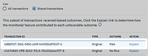

---

title: {{site.data.keyword.aios_short}} を使用した機械学習モデルの信頼性と透明性
description: Monitor your machine learning deployments for bias, accuracy, and explainability
duration: 120
intro: In this tutorial, you will provision {{site.data.keyword.Bluemix}} machine learning and data services, create and deploy machine learning models in Watson studio, and configure the new IBM {{site.data.keyword.aios_full}} product to monitor your models for trust and transparency.
takeaways:
- See how {{site.data.keyword.aios_short}} provides trust and transparency for AI models
- Understand how {{site.data.keyword.Bluemix}} services and Watson Studio technologies can provide a seamless, AI-driven customer experience

copyright:
  years: 2018, 2019
lastupdated: "2019-06-28"

keywords: ai, getting started, tutorial, understanding, video

subcollection: ai-openscale

---

{:shortdesc: .shortdesc}
{:external: target="_blank" .external}
{:hide-dashboard: .hide-dashboard}
{:tip: .tip}
{:important: .important}
{:note: .note}
{:pre: .pre}
{:codeblock: .codeblock}
{:screen: .screen}
{:javascript: .ph data-hd-programlang='javascript'}
{:java: .ph data-hd-programlang='java'}
{:python: .ph data-hd-programlang='python'}
{:swift: .ph data-hd-programlang='swift'}

# 入門チュートリアル (自動セットアップ)
{: #gettingstarted}

{{site.data.keyword.aios_full}} を使用すると、企業はビジネス・アプリケーションの AI ライフサイクルを自動化して実際の運用に適したものにすることができます。そのため、AI モデルのバイアスがなくなり、ビジネス・ユーザーにわかりやすく説明して理解してもらうことが可能になり、商取引の監査にも対応できるようになります。 {{site.data.keyword.aios_short}} は、AI モデルを任意のツールやモデル処理フレームワークに組み込んで実行する機能をサポートします。
{: shortdesc}

## 概要
{: #gs-view-demo}

{{site.data.keyword.aios_short}} の概要は、以下の動画を見て確認してください。

  

    <iframe class="embed-responsive-item" id="youtubeplayer" title="Trust and Transparency in AI" type="text/html" width="640" height="390" src="https://www.youtube.com/embed/6Ei8rPVtCf8" frameborder="0" webkitallowfullscreen mozallowfullscreen allowfullscreen> </iframe>
  

## {{site.data.keyword.aios_short}} のユースケース
{: #gs-use}

従来型の融資機関は、さらに多くの多様な顧客に金融サービスのデジタル・ポートフォリオを展開する必要に迫られています。これには、信用リスク・モデリングに対する新たな取り組みが必要です。 そうした企業のデータ・サイエンス・チームが現在利用している標準的なモデリング手法 (決定木やロジスティック回帰など) は、標準的なデータ・セットでは適切に機能し、容易に説明可能な推奨事項を提案します。 これは、信用融資に関する決定は透明かつ説明可能でなければならないという規制要件を満たしています。

対象範囲を広げてリスクの高い申請者が貸付を利用できるようにするため、申請者の信用履歴の確認範囲を、従来の貸付で利用していた情報 (住宅ローンや自動車ローンなど) から広げて、光熱費や携帯電話料金プランの支払い履歴、さらには学歴や職責などの代替信用情報も確認する必要があります。 このような新しいデータ・ソースは融資の裏付けとして役立ちますが、申請者の年齢、性別、その他の個人の特徴に基づく予期しない相関関係が設定されてバイアスが発生する可能性が高くなる、というリスクも生まれます。

このような多様なデータ・セットに最も適したデータ・サイエンス手法 (こう配ブースティング木、ニューラル・ネットワークなど) では、精度の高いリスク・モデルを生成できますが、コストがかかります。 このような「ブラック・ボックス」モデルで生成される予測は決定過程が不透明であるため、一般データ保護規則 (GDPR) の第 22 項や、アメリカ合衆国消費者金融保護局が管理する連邦公正信用報告法 (FCRA) などの規制に基づく承認を受けるためには、なんらかの方法で透明性を確保する必要があります。

このチュートリアルで使用する信用リスク・モデルでは、それぞれの融資申請者に関する 20 個の属性を設定した訓練データ・セットが使用されます。 これらの属性のうち、年齢と性別という 2 つの属性がバイアス検証に使用されます。 このチュートリアルでは、性別と年齢に対するバイアスに重点を置いています。 訓練データの詳細については、[{{site.data.keyword.aios_short}} が訓練データにアクセスする必要があるのはなぜですか?](/docs/services/ai-openscale?topic=ai-openscale-trainingdata#trainingdata) を参照してください。

{{site.data.keyword.aios_short}} は、デプロイ済みモデルが一方のグループ (参照グループ) に対して他方のグループ (モニター対象グループ) より好ましい結果 (「No Risk」) を出す傾向をモニターします。 このチュートリアルでは、性別のモニター対象グループは `female` であり、年齢のモニター対象グループは `19 to 25` です。

## セットアップ・オプション
{: #gs-module}

設定と専門知識のレベルに応じて、いくつかのセットアップ・オプションがあります。

- [以下の自動セットアップ](/docs/services/ai-openscale?topic=ai-openscale-wos-fast-start#wos-fast-start)では、バックグラウンドでタスクを実行することによって、プロセスをガイドします。

   ツアーの使用は、そのツアーの次の部分まで見て、クリックして移動できることを意味します。
   
- [対話式セットアップ](/docs/services/ai-openscale?topic=ai-openscale-gs-obj#gs-obj)により、分かりやすいスクリプトを使用して制御を行うことができます。

   インターフェースを使用して、サンプル・モデルと注入されたデータで共通のタスクを実行します。
   
- [アドバンスト・チュートリアル](/docs/services/ai-openscale?topic=ai-openscale-crt-ov)により、より多くのテクニカル・ユーザーが、前提条件のサービスのプロビジョニングおよび構成を自動化する Python モジュールをインストールできます。 このアドバンスト・チュートリアルは、コーディング、Python、およびノートブックを理解しているデータ・サイエンティストまたはユーザーを対象としています。 これは、{{site.data.keyword.aios_short}} クライアントを使用して機能をプログラムで実行する方法の例です。 このチュートリアルで使用されるノートブックは、[自動セットアップ](/docs/services/ai-openscale?topic=ai-openscale-wos-fast-start#wos-fast-start)を行った場合と同じ場所になります。

   このモジュールでは、Python 3 がインストールされている必要があります。これには、pip パッケージ管理システムが含まれています。 手順に関しては、[{{site.data.keyword.aios_short}} をセットアップするための Python モジュールのインストール](/docs/services/ai-openscale?topic=ai-openscale-as-module)を参照してください。

追加のチュートリアル・リンクについては、[追加リソース](/docs/services/ai-openscale?topic=ai-openscale-arsc-ov)を参照してください。

## 自動セットアップ
{: #wos-fast-start}

{{site.data.keyword.aios_short}} でモデルがどのようにモニターされるかを簡単に確認するには、最初に {{site.data.keyword.aios_short}} UI にログインした際に提供されたデモ・シナリオ・オプションを実行します。  [UI デモの利用](#wos-work-demo)を参照してください。
{: shortdesc}

## 始めに
{: #wos-prereqs}

ツアーを始める前に、以下のリソースをセットアップしておく必要があります。

- [{{site.data.keyword.ibmid}}](/docs/account?topic=account-signup){: external}
- [{{site.data.keyword.aios_full}}](/docs/services/ai-openscale?topic=ai-openscale-gettingstarted#crt-wos-faststart)

自動セットアップ・ツアーは、ユーザーとの対話が最小限になるように設計されています。 このツアーは、ユーザーの代わりに以下を自動で決定します。

- {{site.data.keyword.pm_full}} インスタンスが複数セットアップされている場合、インストール・プロセスは、インスタンスをリストする API 呼び出しを実行し、その結果、表示されたリストの一番先頭に現れた {{site.data.keyword.pm_short}} インスタンスを選択します。 
- {{site.data.keyword.pm_full}} のライト・バージョンを新しく作成するために、{{site.data.keyword.aios_short}} インストーラーは、{{site.data.keyword.Bluemix}} アカウントのデフォルトのリソース・グループを使用します。

### {{site.data.keyword.aios_short}} サービスのプロビジョン
{: #crt-wos-faststart}

まだ {{site.data.keyword.aios_full}} をプロビジョンしていない場合は、確実にプロビジョンしてください。 

- [{{site.data.keyword.aios_short}} インスタンスをプロビジョンします](https://{DomainName}/catalog/services/watson-openscale){: external} (アカウントに関連付けられているものがまだない場合)。

  

1. **「カタログ」**>**「AI」**>**「{{site.data.keyword.aios_short}}」**をクリックします。
2. サービスに名前を付け、プランを選択し、**「作成」**ボタンをクリックします。
3. {{site.data.keyword.aios_short}} を開始するには、**「アプリケーションの起動 (Launch Application)」**ボタンをクリックします。

## 自動セットアップ
{: #wos-work-demo}

1.  {{site.data.keyword.Bluemix}} 上の {{site.data.keyword.aios_short}} インスタンスにサインインします。
1.  サンプル・データを使用して {{site.data.keyword.aios_short}} インスタンスを自動的にセットアップするには、**「自動セットアップ (Auto setup)」**をクリックします。

   

   {{site.data.keyword.aios_short}} サービスがプロビジョンされる過程で、デモ・シナリオを確認できます。プロビジョニングが完了したら、**「ツアーの開始」**ボタンをクリックして {{site.data.keyword.aios_short}} ダッシュボードのツアーを実行し、[{{site.data.keyword.aios_short}} における結果の表示](#wos-open)に進みます。

## {{site.data.keyword.aios_short}} における結果の表示
{: #wos-open}

モデルの公平性と正解率、モニター対象データの詳細、個々のトランザクションの説明可能性に対するインサイトを表示するには、{{site.data.keyword.aios_short}} ダッシュボードを開きます。 各デプロイメントはタイルとして表示されます。 以下の画面キャプチャーに示すように、このツアーでは `GermanCreditRiskModel` というデプロイメントが構成されました。

   

### インサイトの表示
{: #wos-insights}

「インサイト」ページには、公平性と正解率に関する問題が一目で分かるように表示されます。問題の判定には、構成されたしきい値が使用されます。

   

### モニタリング・データの表示
{: #wos-monitoring}

1.  「インサイト」ページで、`GermanCreditRiskModelICP` タイルをクリックして、モニター対象データに関する詳細を表示します。
1.  グラフでマーカーをクリックしてドラッグし、データが表示される日時の期間を表示して、**「詳細の表示」**リンクをクリックします。 あるいは、グラフで別の期間をクリックして、表示するデータを変更することもできます。 

時系列グラフの解釈について詳しくは、[インサイトの取得](/docs/services/ai-openscale?topic=ai-openscale-it-ov)を参照してください。

### 説明性の表示
{: #wos-explain}

特定の期間にバイアスが存在する要因について理解するには、前のセクションの可視化画面から、**「バイアスのあるトランザクション」**ラジオ・ボタンをクリックします。

   

過去の時刻においてバイアスが存在するトランザクションのトランザクション ID がリストされます。 このモジュールで使用されるモデルの場合、選択可能なリクエストにおいてはバイアスが存在します。

   

トランザクションの検索と説明については、[説明性のモニター](/docs/services/ai-openscale?topic=ai-openscale-ie-ov)を参照してください。

   

## ツアーの終了
{: #wos-done-demo}

ツアーが完了したら、各自のモデル・デプロイメントをダッシュボードに追加するか、またはチュートリアル・デプロイメントを続行できます。 

- 各自のモデルをダッシュボードに追加するには、**「ダッシュボードに追加」**ボタンをクリックします。
- 引き続きチュートリアル・モデルを試すには、「German Credit Risk」タイルをクリックします。

## 次のステップ
{: #gs-next}

- 詳しくは、[データの表示と解釈](/docs/services/ai-openscale?topic=ai-openscale-it-ov)および[説明性のモニター](/docs/services/ai-openscale?topic=ai-openscale-ie-ov)を参照してください。
